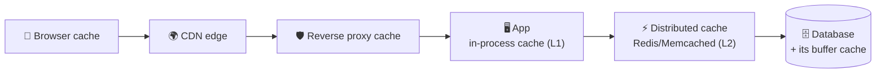

# 027 · Caching Basics & Where Caches Live

> ⏱ 8 min · 📈 27% · 🅰️ Part A (core) · Phase 04: Caching
>
> `█████░░░░░░░░░░░░░░░` 27% of the whole guide

---

## 📖 Story

Every visitor loads the same "Top dishes near you" page, and every time, the database recomputes it from scratch. The database is gasping at 95% CPU, for an answer that barely changes all day. Maya wonders: why walk to the library for a book you could keep on your desk?

## 🎯 One-sentence idea

**A cache is a small, fast copy of data you'd otherwise fetch from somewhere slow. Caches exist at every layer, from your browser to the database, and the trick is caching the right things for the right amount of time.**

## 🧸 Analogy

Your **desk vs the library**:

- The **library** (the database) has everything, but walking there takes 20 minutes.
- Your **desk** (the cache) holds the 10 books you're using this week. Grabbing one takes 2 seconds.
- The desk is **small**, so you keep only what you use most (eviction).
- If the library gets a **new edition**, the copy on your desk is **stale** (invalidation).

## 🖼️ Visual



Each layer closer to the user is **faster** but holds **less** and is **harder to invalidate**.

## 🔬 How it works

- **Cache hit:** the data is in the cache → fast. **Cache miss:** go to the source → slower, then (usually) store it.
- **Hit ratio** = hits ÷ (hits + misses). **It's the metric that matters.** 90% hits means the DB sees only 10% of reads.
- **Why caching works:** access is **skewed**. A small % of items gets most of the traffic (the 80/20 rule, the power law).
- **Where caches live:**
  - **Client/browser:** HTTP caching headers. Zero server cost.
  - **CDN:** static and public content near users (lesson 023).
  - **Reverse proxy** (Nginx/Varnish): whole HTTP responses.
  - **Application in-process (L1):** a HashMap/LRU inside each server. ~100 ns, but each server has its own copy.
  - **Distributed cache (L2):** Redis/Memcached shared by all servers. ~0.5–1 ms.
  - **Database internal cache:** the buffer pool keeps hot pages in RAM automatically.
- **What to cache:** things that are **read often, change rarely, and are expensive to compute or fetch**: user profiles, product pages, session data, rendered fragments, computed feeds, and the results of expensive queries.
- **What NOT to cache (or be careful with):** rapidly changing data where staleness hurts (account balances, inventory at checkout), and data with huge key spaces that are rarely reused.

## 🧩 Worked example

**Impact on a product page service:**

```
Load: 20,000 reads/s
DB: indexed read ≈ 5 ms, handles ~5,000 reads/s comfortably
Redis: GET ≈ 0.5 ms

Without cache: 20k/s on a DB that handles 5k/s → 💥
With 95% hit ratio: DB sees 1,000/s ✅
Average latency = 0.95 × 0.5 ms + 0.05 × (0.5 + 5) ms ≈ 0.75 ms (vs 5 ms)
```

**Sizing the cache (80/20 rule):**

```
1M products × 5 KB = 5 GB total
Hot 20% = 1 GB → easily fits in one Redis node (with room to spare)
```

## ⚖️ Trade-offs

| You gain | You pay | Use it when |
|---|---|---|
| 10–100× lower latency | **Staleness** (the copy may be old) | Read-heavy, change-tolerant data |
| Massive DB offload | Memory cost, another system to run | DB is the bottleneck |
| In-process L1 cache (fastest) | Each server holds a different copy, so invalidation is harder | Tiny, hot, rarely changing data (config, feature flags) |
| Distributed L2 cache | Network hop, cluster ops | Shared data across many servers |

## 🌍 Real world

- **Facebook** runs one of the world's largest Memcached deployments, serving billions of requests per second.
- **Twitter/X timelines** are precomputed and cached in Redis.
- **Every database** has an internal cache (Postgres `shared_buffers`, MySQL InnoDB buffer pool).

## 📌 Cheat card

> - Cache = **fast copy of slow data**. **Hit ratio** is the scorecard.
> - Layers: **browser → CDN → proxy → app L1 → Redis L2 → DB buffer**.
> - Cache what's **read often, changes rarely, and is expensive to get**.
> - **Size = hot set** (~20% of data). Redis GET ≈ **0.5 ms**, and a DB query ≈ **1–10 ms+**.
> - Every cache brings a **staleness** question. Decide how stale is OK.

## 🧪 Feynman check

Explain the desk-vs-library analogy, including what happens when the library gets a new edition of a book on your desk.

⚠️ **Common confusion:** "Adding a cache always helps." Low hit ratios (unique keys, rapidly changing data) add latency (an extra hop on every miss) and complexity for little gain. **Measure the hit ratio.**

## ⚡ Quick recall

1. What is the cache hit ratio?
<details><summary>Answer</summary>

Hits ÷ total lookups: the fraction of requests served from the cache.
</details>

2. Why does caching work so well for most apps?
<details><summary>Answer</summary>

Access is skewed. A small portion of the data gets most of the requests.
</details>

3. What's the downside of an in-process (L1) cache in a fleet of 50 servers?
<details><summary>Answer</summary>

Each server has its own copy, so data is duplicated and invalidation must reach all 50 (they can disagree for a while).
</details>

## 🎤 Interview practice

**Q1. "Where would you add caching to a typical e-commerce site?"**
<details><summary>Model answer</summary>

- **Browser + CDN:** images, JS/CSS (versioned, long TTL), and public product page HTML (short TTL).
- **Redis:** product details, category listings, session data, cart, and precomputed recommendations.
- **In-process L1:** feature flags, config, and the category tree (tiny, rarely changing).
- **Don't cache (or use very short TTLs):** inventory counts and prices *at checkout*. Always read the source of truth when correctness matters.
- **Likely follow-up:** "How do you keep product data fresh?" → invalidate on update (events) + TTL as a safety net (lesson 031).
</details>

**Q2. "The DB is at 90% CPU from reads. You add Redis, but the DB load barely drops. Why?"**
<details><summary>Model answer</summary>

- **Low hit ratio:** keys are too unique (e.g., cache keys include timestamps or user-specific params), TTLs are too short, or the cache is too small (constant evictions).
- **Wrong things cached:** the expensive queries aren't the ones being cached.
- **Cache not populated on miss**, or the code path bypasses the cache.
- Measure hits and misses per key pattern, find the top DB queries, and cache those with normalized keys.
- **Likely follow-up:** "What if the hot queries are all different (search)?" → cache the building blocks, use a search index, or precompute.
</details>

> 📖 *Next time: Maya adds a cache, and now she must decide exactly how data flows into it.*

---

⬅️ [026 · Monolith vs Microservices](../03-scaling-basics/026-monolith-vs-microservices.md) · 🗺️ [Phase map](README.md) · ➡️ [028 · Cache-Aside & Read-Through](028-cache-aside-and-read-through.md)

✅ **Safe stopping point.** Tick lesson 027 in [PROGRESS.md](../../PROGRESS.md).
