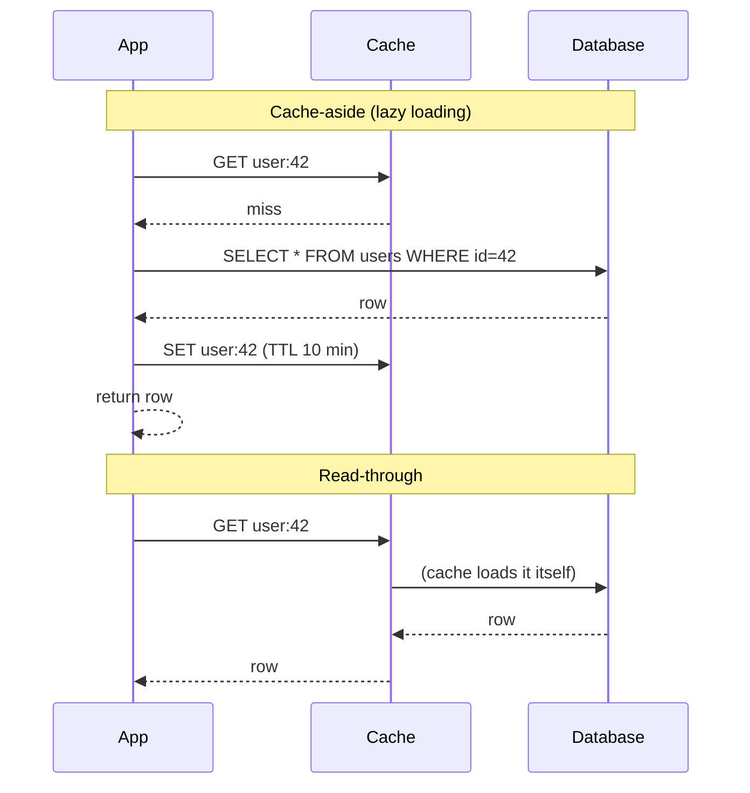

# 028 · Cache-Aside & Read-Through

> ⏱ 8 min · 📈 28% · 🅰️ Part A (core) · Phase 04: Caching
>
> `█████░░░░░░░░░░░░░░░` 28% of the whole guide

---

## 📖 Story

Maya put a cache in front of the database, and page loads dropped from 50 milliseconds to 1. She messaged me: "It's like magic!" I told her the magic comes with questions. Who puts data into the cache? What happens when something isn't there? And what if the cache itself crashes? Let's answer them together.

## 🎯 One-sentence idea

**Cache-aside: the app checks the cache, and on a miss it reads the DB and puts the result in the cache itself. Read-through: the app only talks to the cache, and the cache loads from the DB on a miss. Same idea, different owner of the loading logic.**

## 🧸 Analogy

Getting a recipe:

- 🧑‍🍳 **Cache-aside:** you check your **fridge-door notes** first. Not there? **You** go to the cookbook shelf, read it, and **stick a note on the fridge** for next time.
- 🤵 **Read-through:** you ask your **butler**. The butler checks their notes, and if it's missing, *the butler* fetches the cookbook and remembers it. You only ever talk to the butler.

## 🖼️ Visual



## 🔬 How it works

- **Cache-aside (lazy loading):** the most common pattern.
  1. Read from the cache.
  2. **Hit** → return it.
  3. **Miss** → read the DB → **write to the cache (with a TTL)** → return it.
  4. On **writes**: update the DB, then **delete (invalidate)** the cache key (lesson 031).
  - ✅ Only requested data gets cached. **If the cache dies, the app still works** (slower).
  - ❌ The first request is always a miss (cold start), there are three steps in app code, and there's a staleness window.
- **Read-through:** the cache library or service has a **loader** function and fetches on a miss.
  - ✅ Simpler app code, and the loading logic is centralized.
  - ❌ Needs cache software/libraries that support it (e.g., Caffeine, Hazelcast, DAX for DynamoDB), and couples the cache to the data source.
- **Cache warming / pre-loading:** fill the cache with known-hot keys before traffic arrives (after a deploy, before a sale) to avoid cold-start misses.
- **Negative caching:** also cache "not found" results (briefly) so repeated lookups for missing items don't hammer the DB (lesson 032).

## 🧩 Worked example

**Cache-aside in Python with Redis:**

```python
import json

def get_user(user_id):
    key = f"user:{user_id}"
    cached = redis.get(key)
    if cached is not None:
        return json.loads(cached)                  # ✅ hit (~0.5 ms)

    user = db.query("SELECT * FROM users WHERE id = %s", user_id)   # miss (~5 ms)
    if user is None:
        redis.setex(key, 60, json.dumps(None))     # negative cache, short TTL
        return None
    redis.setex(key, 600, json.dumps(user))        # cache for 10 min
    return user

def update_user(user_id, fields):
    db.execute("UPDATE users SET ... WHERE id = %s", user_id)
    redis.delete(f"user:{user_id}")                # invalidate → the next read reloads it
```

**Read-through with a loading cache (Java Caffeine):**

```java
LoadingCache<Long, User> users = Caffeine.newBuilder()
    .maximumSize(10_000)
    .expireAfterWrite(Duration.ofMinutes(10))
    .build(id -> userRepository.findById(id));     // the loader runs on a miss

User u = users.get(42L);                           // the app never touches the DB directly
```

## ⚖️ Trade-offs

| | Cache-aside | Read-through |
|---|---|---|
| Who loads on a miss | App code | Cache / library |
| App complexity | More | Less |
| Cache failure | App falls back to the DB | Depends on the setup |
| Flexibility | High (any data source, custom logic) | Tied to the cache's loader |
| Most common in | Redis/Memcached setups | In-process caches, DAX, Hazelcast |

## 🌍 Real world

- **Cache-aside with Redis** is *the* default pattern in most web backends.
- **Facebook's Memcached** architecture is look-aside (cache-aside), with a "lease" mechanism to prevent stale sets and stampedes.
- **AWS DAX** is a read-through/write-through cache for DynamoDB.

## 📌 Cheat card

> - **Cache-aside:** get → miss → DB → set (with TTL) → return. On write: **update DB, delete key**.
> - **Read-through:** the cache loads on a miss for you.
> - **Always set a TTL** as a safety net.
> - **Warm** caches for known spikes. **Negative-cache** "not found".
> - A cache failure should mean **slower**, not **down**.

## 🧪 Feynman check

Explain the fridge-note vs butler analogy, and why "delete the note" is safer than "rewrite the note" when a recipe changes. (Hint: two people rewriting at once.)

⚠️ **Common confusion:** Updating the cache with the new value on every write ("set on write") instead of deleting. Two concurrent writers can leave the cache holding the **older** value permanently. **Delete + lazy reload** is safer (lesson 031).

## ⚡ Quick recall

1. What happens on a cache-aside miss?
<details><summary>Answer</summary>

The app reads from the DB, writes the result to the cache (with a TTL), and returns it.
</details>

2. What's the difference between cache-aside and read-through?
<details><summary>Answer</summary>

Who loads the data on a miss: the app (cache-aside) or the cache itself via a loader (read-through).
</details>

3. What's negative caching?
<details><summary>Answer</summary>

Caching "not found" results for a short time, so repeated lookups for missing data don't hit the DB.
</details>

## 🎤 Interview practice

**Q1. "Implement caching for a user-profile service. Walk me through reads and writes."**
<details><summary>Model answer</summary>

- **Reads:** cache-aside with Redis. The key is `user:{id}`, the value is serialized JSON, and the TTL is 10–60 min.
- **Writes:** update the DB, then **delete** the key. The next read reloads fresh data. Optionally publish an event so other caches (L1, search) update too.
- **Edge cases:** negative caching for missing users, jitter on TTLs to avoid mass expiry, and a fallback to the DB if Redis is down (with a circuit breaker so a dead Redis doesn't add timeouts to every request).
- **Likely follow-up:** "What's the consistency window?" → between the DB write and the cache delete. There's a tiny race where an old value can be re-cached, and the TTL bounds it (lesson 031).
</details>

**Q2. "After every deploy, response times spike for 5 minutes. Why?"**
<details><summary>Model answer</summary>

- **Cold in-process caches:** new instances start empty, so every request misses and hits the DB.
- Fixes: **warm caches on startup** (preload the hot keys), **rolling deploys** so only a fraction of servers is cold at once, rely more on a **shared L2 cache** (Redis survives deploys), and ramp traffic slowly to new instances (slow start in the LB).
- **Likely follow-up:** "How do you know which keys are hot?" → track access frequency, and load the top N from a snapshot.
</details>

> 📖 *Reading is solved. Next, I'll show you what happens when a cook updates a menu.*

---

⬅️ [027 · Caching Basics](027-caching-basics.md) · 🗺️ [Phase map](README.md) · ➡️ [029 · Cache Write Strategies](029-cache-write-strategies.md)

✅ **Safe stopping point.** Tick lesson 028 in [PROGRESS.md](../../PROGRESS.md).
