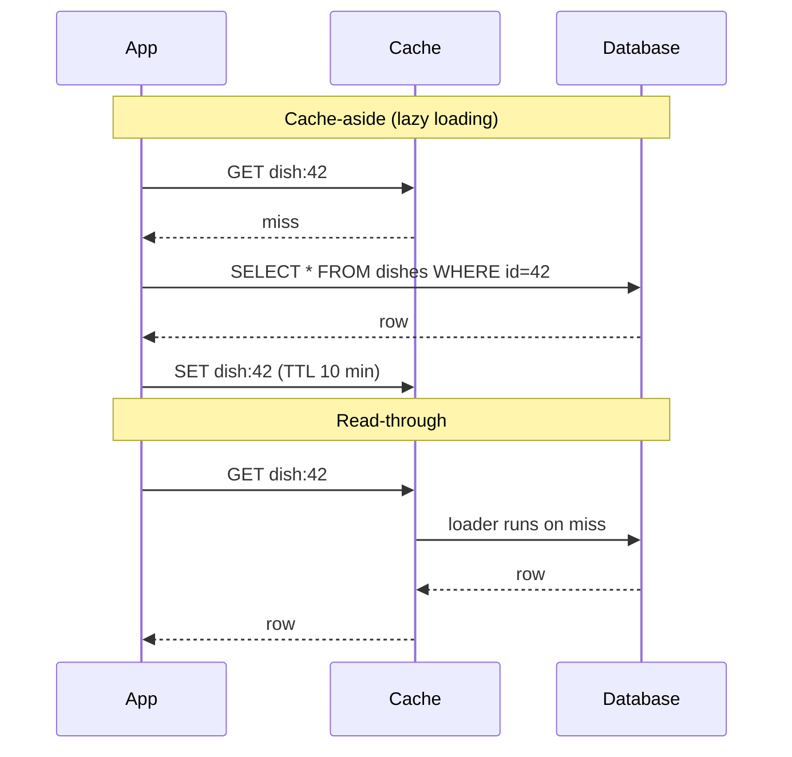

# 028 · Cache-Aside & Read-Through

> ⏱ 8 min · 📈 28% · 🅰️ Part A (core) · Phase 04: Caching
>
> `█████░░░░░░░░░░░░░░░` 28% of the whole guide

---

## 📖 Story

Maya slides Redis in front of the database, and the dish page drops from **50 ms to 1 ms**. She refreshes it twenty times just to watch the number. It's like discovering a secret passage in a house she's lived in for years.

Then she deploys a new version, and for **five minutes** every page crawls. The cache is empty after the restart. A cook edits her lasagna's price, and customers keep seeing the **old price** for ten minutes. At 2 a.m. Redis restarts for maintenance, and Maya holds her breath: **does Pantry go down with it?**

Three questions she skipped in the excitement:

*Who puts data into the cache? What happens on a miss? And what if the cache itself dies?*

I told her the magic comes with questions. Let's answer them together.

## 🎯 One-sentence idea

**In cache-aside, the app checks the cache and on a miss loads from the database and fills the cache itself, while in read-through the app only talks to the cache, which loads from the database on a miss, so the difference is who owns the loading logic.**

## 🧸 Analogy

Getting a recipe:

- 🧑‍🍳 **Cache-aside:** check the **notes on your fridge**. Not there? **You** fetch the cookbook, read it, and **stick a note on the fridge** for next time.
- 🤵 **Read-through:** ask your **butler**. If the butler doesn't know, *the butler* fetches the cookbook. You only ever talk to the butler.

## 🖼️ Visual

*Diagram brief:* two lanes. In the cache-aside lane, the app makes three hops (cache miss → DB → set cache). In the read-through lane, the app makes one call to the cache, which reaches into the DB itself.



## 🔬 How it works

- **Cache-aside (lazy loading), the default:** GET → hit? return. Miss? read the DB → **SET with a TTL** → return. On **write**: update the DB, then **DELETE** the key (lesson 031). Only requested data gets cached, and **if the cache dies, the app falls back to the DB**: slower, but alive.
- **Read-through:** the cache (library or service) owns a **loader** function and fills itself on a miss. App code is simpler and loading is centralized, but it needs a cache that supports it (Caffeine, Hazelcast, AWS DAX) and couples the cache to the data source.
- **Cold starts are real:** a fresh process or flushed cache misses on everything. **Warm** known-hot keys on boot or before events, and lean on a shared L2 that survives deploys.
- **Negative caching:** store "not found" briefly (30–60 s) so lookups for missing IDs don't hit the DB every time (lesson 032).
- **Degrade gracefully:** wrap cache calls in **tight timeouts (~50 ms) plus a circuit breaker**, so a sick Redis doesn't add a timeout to every request.

## 🧩 Worked example

**Cache-aside, Python + Redis:**

```python
def get_dish(dish_id):
    key = f"dish:{dish_id}"
    if (cached := redis.get(key)) is not None:
        return json.loads(cached)                              # ✅ hit (~0.5 ms)

    dish = db.query("SELECT * FROM dishes WHERE id = %s", dish_id)   # miss (~5 ms)
    ttl = 600 + random.randint(0, 60)                          # jitter avoids mass expiry
    redis.setex(key, 60 if dish is None else ttl, json.dumps(dish))  # negative cache if missing
    return dish

def update_dish(dish_id, fields):
    db.execute("UPDATE dishes SET … WHERE id = %s", dish_id)
    redis.delete(f"dish:{dish_id}")                            # invalidate → the next read reloads
```

**Read-through, Java Caffeine:**

```java
LoadingCache<Long, Dish> dishes = Caffeine.newBuilder()
    .maximumSize(10_000)
    .expireAfterWrite(Duration.ofMinutes(10))
    .build(id -> dishRepository.findById(id));       // the loader runs on a miss

Dish d = dishes.get(42L);                            // the app never touches the DB here
```

**Maya's deploy spike, quantified:** 20 fresh pods × empty L1 → 100% misses → **20× DB load** for ~5 min. Warming the top 5,000 keys on boot + a **slow-start ramp** in the LB → the spike disappears.

## ⚖️ Trade-offs

| | Cache-aside | Read-through |
|---|---|---|
| Who loads on a miss | App code | Cache/library |
| App complexity | Higher | Lower |
| Cache failure | App falls back to the DB | Depends on the setup |
| Flexibility | Any source, custom logic | Tied to the loader |
| Typical home | Redis/Memcached | In-process caches, DAX, Hazelcast |

## 🌍 Real world

- **Cache-aside with Redis** is the default pattern in most web backends.
- **Meta's Memcached** is "look-aside", with **leases** to prevent stale sets and stampedes.
- **AWS DAX** is a read-through/write-through cache for DynamoDB.

## 📌 Cheat card

> - **Cache-aside:** get → miss → DB → set (TTL + jitter) → return. **Write: update the DB, delete the key.**
> - **Read-through:** the cache loads on a miss for you.
> - **Always set a TTL.** **Warm** before spikes. **Negative-cache** misses.
> - A cache failure must mean **slower, not down**: timeouts + a circuit breaker.

## 🧪 Feynman check

Explain the fridge note and the butler, and why *tearing the note off* is safer than *rewriting it* when a recipe changes. (Hint: two cooks rewriting at once.)

⚠️ **Common confusion:** "set on write" (writing the new value into the cache on every update) instead of deleting. Two concurrent writers can finish in the wrong order and leave the cache holding the **older** value until its TTL expires. **Delete + lazy reload** is safer (lesson 031).

## ⚡ Quick recall

1. What happens on a cache-aside miss?
<details><summary>Reveal Answer</summary>

The app reads the DB, writes the result to the cache with a TTL, and returns it.
</details>

2. What's the difference between cache-aside and read-through?
<details><summary>Reveal Answer</summary>

Who loads the data on a miss: the app (cache-aside) or the cache itself via a loader (read-through).
</details>

3. What is negative caching?
<details><summary>Reveal Answer</summary>

Caching "not found" results briefly, so repeated lookups for missing data don't hit the DB.
</details>

## 🎤 Interview practice

**Q. "Design caching for a user-profile service. Cover reads, writes, Redis outages, and the 5-minute latency spike after every deploy."**
<details><summary>Model answer</summary>

- **Reads:** cache-aside on Redis. The key is `user:{id}` (versioned, e.g. `v2:user:{id}`, so a schema change doesn't deserialize old blobs), the value is compact JSON or Protobuf, with a **10–60 min TTL + jitter**.
- **Writes:** update the DB → **delete** the key. Optionally emit a `UserUpdated` event so L1 caches and the search index refresh too.
- **Missing users:** negative-cache for 60 s.
- **Redis outage:** 50 ms timeouts + a **circuit breaker**. While it's open, read the DB directly with **concurrency limits**, so a cache outage doesn't become a DB outage. Run Redis replicated with automatic failover.
- **Post-deploy spike:** caused by **cold in-process L1 caches**.
  - **Preload the top-N hot keys** on startup (from a periodically saved snapshot of access counts).
  - **Rolling deploys** so only a fraction of pods is cold at once.
  - Lean on the shared **L2**, which survives deploys.
  - LB **slow start** to ramp traffic into new pods.
- **Consistency window:** there's a small race between the DB write and the cache delete in which a stale value can be re-cached. The TTL bounds it, and lesson 031 shows how to tighten it.
- **Likely follow-up:** "Read-through instead?" → it's fine for an in-process cache with a loader, but cache-aside keeps Redis optional and the logic explicit.
</details>

## 📖 Teaser

> 📖 *Reading is solved, but the moment a cook edits a menu, Maya has to decide whether the write hits the cache first, the database first, or skips the cache entirely.*

---

⬅️ [027 · Caching Basics](027-caching-basics.md) · 🗺️ [Phase map](README.md) · ➡️ [029 · Cache Write Strategies](029-cache-write-strategies.md)

✅ **Safe stopping point.** Tick lesson 028 in [PROGRESS.md](../../PROGRESS.md).
