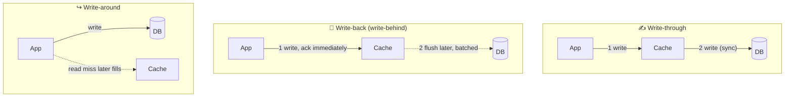

# 029 · Write-Through, Write-Back, Write-Around

> ⏱ 9 min · 📈 29% · 🅰️ Part A (core) · Phase 04: Caching
>
> `█████░░░░░░░░░░░░░░░` 29% of the whole guide

---

## 📖 Story

A cook changes a dish's price, and some customers see the old price for ten minutes. Meanwhile, the "likes" counter is hammering the database with thousands of writes a second. Maya realizes that *writes* need a cache strategy too, and that different data deserves different strategies.

## 🎯 One-sentence idea

**When data is written, you can write to the cache and DB together (write-through: consistent), write to the cache now and the DB later (write-back: fast, but risky), or write only to the DB and skip the cache (write-around: avoids caching things nobody reads).**

## 🧸 Analogy

Updating your address:

- ✍️ **Write-through:** you update your **phone contacts AND the official registry** at the same time. Both are always correct, but it takes longer.
- 📝 **Write-back:** you jot it on a **sticky note** now, and file the official paperwork **later** in a batch. Super quick, but if you lose the sticky note before filing, the change is **gone**.
- ↪️ **Write-around:** you update **only the official registry**. Your contacts get updated the next time you actually look it up.

## 🖼️ Visual



## 🔬 How it works

- **Write-through:**
  - Every write goes to the **cache and the DB synchronously** (often, the cache writes to the DB).
  - ✅ The cache is always fresh, and reads right after writes hit.
  - ❌ Higher write latency (two writes), and it caches data that may never be read.
  - Often paired with **read-through**.
- **Write-back (write-behind):**
  - Write to the cache and **acknowledge immediately**. The cache **flushes to the DB asynchronously**, often batched.
  - ✅ Very fast writes, it absorbs write bursts, and it merges repeated updates (a counter updated 1,000× gets flushed once).
  - ❌ **Data loss risk** if the cache dies before flushing, and the DB is temporarily behind (other readers of the DB see old data). More complex.
- **Write-around:**
  - Write **only to the DB**. The cache gets filled lazily on the next read miss (cache-aside), usually paired with **deleting** the old cache entry.
  - ✅ Doesn't pollute the cache with write-once data (logs, bulk imports).
  - ❌ The first read after a write is a miss.
- **The most common real combo:** **cache-aside reads + write-around with invalidation** (update DB → delete key).

## 🧩 Worked example

**Choosing per data type in a social app:**

| Data | Strategy | Why |
|---|---|---|
| User profile | Write-around + delete key | Rarely updated, and must be correct after an edit |
| Like / view counters | **Write-back** | Thousands of increments/s. Batch-flushing `+1000` is much cheaper than 1,000 DB writes, and losing a few likes on a crash is OK |
| Shopping cart | Write-through (Redis as the primary store + async persistence) | Read immediately after every change |
| Audit logs | Write-around | Written once, rarely read |

**Write-back counter sketch:**

```python
def like(post_id):
    redis.incr(f"likes:{post_id}")               # instant ack, no DB write
    redis.sadd("dirty_posts", post_id)

def flush_every_5_seconds():
    for post_id in redis.spop("dirty_posts", 1000):
        count = int(redis.get(f"likes:{post_id}"))
        db.execute("UPDATE posts SET likes=%s WHERE id=%s", count, post_id)
```

Crash between flushes → **up to 5 s of likes lost**. Acceptable for likes. **Never** acceptable for payments.

## ⚖️ Trade-offs

| Strategy | Write speed | Read-after-write | Data-loss risk | Best for |
|---|---|---|---|---|
| Write-through | 🐢 Slower | ✅ Hit, fresh | 🟢 None | Read-after-write heavy data |
| Write-back | 🚀 Fastest | ✅ Hit | 🔴 Yes, until flushed | Counters, metrics, bursty writes |
| Write-around | Normal (DB only) | ❌ Miss | 🟢 None | Write-once or rarely read data |

## 🌍 Real world

- **CPU caches and OS page caches** use write-back: your OS acknowledges a file write before it hits disk (which is why `fsync` exists).
- **Databases' write-ahead logs** make write-back safe by logging first (lesson 081).
- **View counters** on YouTube and like counts are classic write-back / batch-aggregation cases.

## 📌 Cheat card

> - **Through = together** (safe, slower). **Back = later** (fast, may lose data). **Around = skip** (don't pollute).
> - Default: **cache-aside reads + write DB → delete key**.
> - **Write-back only for loss-tolerant data**, or make it durable (a replicated cache plus a log).
> - Write-back **coalesces** many updates into one DB write.

## 🧪 Feynman check

Explain the sticky-note analogy, and why write-back is great for "likes" but terrible for "bank transfers".

⚠️ **Common confusion:** Thinking write-through means "the cache replaces the DB." The DB is still the source of truth. Write-through just keeps the cache synchronously in step with it.

## ⚡ Quick recall

1. Which strategy risks data loss and why?
<details><summary>Answer</summary>

Write-back: writes are acknowledged from the cache before reaching the DB, so a cache crash before the flush loses them.
</details>

2. Which strategy avoids filling the cache with data nobody reads?
<details><summary>Answer</summary>

Write-around.
</details>

3. Why is write-back efficient for counters?
<details><summary>Answer</summary>

Many increments are combined (coalesced) in the cache and flushed as one DB write.
</details>

## 🎤 Interview practice

**Q1. "Design view counting for videos getting 1M views/s at peak."**
<details><summary>Model answer</summary>

- Don't write to the DB per view. **Aggregate in memory / Redis** (INCR per video, or sharded counters for hot videos), and **flush periodically** (write-back) to the DB.
- For higher durability: send view events to **Kafka**, and have stream processors aggregate per window and upsert totals (lesson 091).
- Accept approximate counts in real time, and reconcile exact counts offline.
- Hot videos → split the counter across N keys (`views:v1:0..N`) and sum on read.
- **Likely follow-up:** "How do you dedupe views from the same user?" → a Bloom filter or HyperLogLog per video window (lesson 090).
</details>

**Q2. "When would you use write-through instead of cache-aside with invalidation?"**
<details><summary>Model answer</summary>

- When **reads immediately follow writes** and must hit fresh data (e.g., a cart, or session state), and you want to avoid the miss after every write.
- When a read-through/write-through cache product fronts the DB anyway (e.g., DAX).
- Downsides: higher write latency, and caching data that may not be read. Usually add a TTL to evict unused entries.
- **Likely follow-up:** "What if the DB write succeeds but the cache write fails?" → retry, or delete the key so the next read reloads. The DB is the source of truth.
</details>

> 📖 *Next time: The cache is full, and Maya must decide what to throw out.*

---

⬅️ [028 · Cache-Aside & Read-Through](028-cache-aside-and-read-through.md) · 🗺️ [Phase map](README.md) · ➡️ [030 · Cache Eviction](030-cache-eviction.md)

✅ **Safe stopping point.** Tick lesson 029 in [PROGRESS.md](../../PROGRESS.md).
