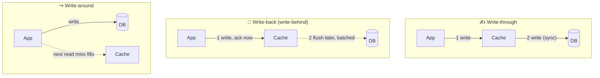

# 029 · Write-Through, Write-Back, Write-Around

> ⏱ 9 min · 📈 29% · 🅰️ Part A (core) · Phase 04: Caching
>
> `█████░░░░░░░░░░░░░░░` 29% of the whole guide

---

## 📖 Story

Pantry adds a ❤️ button to every dish. Within a week it's the most-tapped thing in the app.

Every heart is an `UPDATE dishes SET likes = likes + 1`. At dinner time that's **4,000 writes per second**, all fighting over the same few hot rows. Row locks pile up like cars at a broken traffic light. The checkout query, which needs those same tables, starts waiting in the queue behind a flood of hearts. **Checkout p99: 3 seconds.**

Meanwhile, the shopping cart has the opposite problem. A customer adds a dish, the page reloads, and the cart reads from a cache that doesn't know about the new item yet. *"I added it! Where did it go?"*

Same cache, two kinds of writes, and two completely different needs.

Here's the lesson that took me far too long to learn: **different data deserves different write strategies.**

## 🎯 One-sentence idea

**When data is written you can update cache and database together (write-through: consistent), update the cache now and the database later (write-back: fast but risky), or update only the database and skip the cache (write-around: no pollution from data nobody reads).**

## 🧸 Analogy

Updating your address:

- ✍️ **Write-through:** update your **phone contacts AND the official registry** together. Both are always right, but it's slower.
- 📝 **Write-back:** jot it on a **sticky note** now and file the paperwork **later** in a batch. Instant, but if you lose the note first, the change is **gone**.
- ↪️ **Write-around:** update **only the registry**. Your contacts catch up the next time you look it up.

## 🖼️ Visual

*Diagram brief:* three lanes. Write-through shows the cache and DB written in one synchronous chain. Write-back shows an immediate ACK from the cache and a dotted, delayed, batched arrow to the DB. Write-around shows the write going straight to the DB and the cache filling later on a read miss.



## 🔬 How it works

- **Write-through:** every write updates the **cache and the DB synchronously**. Reads right after a write hit fresh data. You pay ~2× write latency and cache entries that may never be read. Often paired with read-through.
- **Write-back (write-behind):** write to the cache, **ACK immediately**, and **flush to the DB asynchronously in batches**. Writes are lightning-fast and bursts are absorbed, and **coalescing** turns 1,000 `+1`s into one `+1000`. You risk **losing un-flushed writes** if the cache dies, and the DB lags behind.
- **Write-around:** write **only to the DB** (usually followed by **deleting** the cache key). The cache fills lazily on the next miss. There's no pollution from write-once data, and the first read after a write misses.
- **The everyday default:** **cache-aside reads + write-around with invalidation** (update the DB → delete the key).
- **Making write-back safer:** a replicated cache + an **append-only log** (Redis AOF, or Kafka as the durable buffer) shrinks the loss window from "since the last flush" to roughly zero.

## 🧩 Worked example

**Maya's per-data choices:**

| Pantry data | Strategy | Why |
|---|---|---|
| Dish ❤️ counts | **Write-back** | 4,000 incr/s coalesced into ~200 DB writes/s. Losing a few hearts in a crash is fine |
| Shopping cart | **Write-through** (Redis as the primary, persisted async) | Read right after every change |
| Dish details | **Write-around + delete key** | Rare edits, and must be correct after one |
| Audit log | **Write-around** | Written once, rarely read |

```python
def like(dish_id):
    redis.incr(f"likes:{dish_id}")          # instant ack, zero DB writes
    redis.sadd("dirty_dishes", dish_id)

def flush_every_5_seconds():                # one background worker
    for dish_id in redis.spop("dirty_dishes", 1000):
        count = int(redis.get(f"likes:{dish_id}"))
        db.execute("UPDATE dishes SET likes=%s WHERE id=%s", count, dish_id)
```

**The result:** 4,000 row-locking writes/s → at most **~200 batched writes/s** (only dishes liked in the last 5 s), checkout p99 back to **120 ms**, and the worst case is **≤ 5 s of hearts lost** on a crash. **Never** acceptable for payments.

## ⚖️ Trade-offs

| Strategy | Write speed | Read after write | Data-loss risk | Best for |
|---|---|---|---|---|
| Write-through | 🐢 Slower | ✅ Fresh hit | 🟢 None | Read-after-write data (carts) |
| Write-back | 🚀 Fastest | ✅ Hit | 🔴 Until flushed | Counters, metrics, bursty writes |
| Write-around | Normal | ❌ Miss | 🟢 None | Write-once or rarely read data |

## 🌍 Real world

- **CPU caches and OS page caches** are write-back, which is why `fsync` exists.
- **Databases** make write-back safe with a **write-ahead log** (lesson 081).
- **YouTube view counts** and like counters are classic write-back aggregation.

## 📌 Cheat card

> - **Through = together** (safe, slower). **Back = later** (fast, may lose). **Around = skip** (no pollution).
> - Default: **cache-aside reads + update DB → delete key**.
> - **Write-back only for loss-tolerant data**, or back it with a durable log.
> - Write-back **coalesces** N updates into one DB write.

## 🧪 Feynman check

Explain the sticky note, and why write-back is perfect for ❤️ counts and catastrophic for bank transfers.

⚠️ **Common confusion:** "Write-through means the cache replaces the database." The **DB is still the source of truth**. Write-through just keeps the cache synchronously in step with it.

## ⚡ Quick recall

1. Which strategy risks data loss, and why?
<details><summary>Reveal Answer</summary>

Write-back. Writes are acknowledged from the cache before reaching the DB, so a cache crash before the flush loses them.
</details>

2. Which strategy avoids filling the cache with data nobody reads?
<details><summary>Reveal Answer</summary>

Write-around.
</details>

3. Why is write-back efficient for counters?
<details><summary>Reveal Answer</summary>

Many increments coalesce in the cache and flush as a single DB write.
</details>

## 🎤 Interview practice

**Q. "Design view counting for a video platform peaking at 1M views/s. Counts must be durable, roughly real-time, and exact by the next day."**
<details><summary>Model answer</summary>

- **Never write to the DB per view.** 1M row updates/s on hot rows is lock contention and IOPS suicide.
- **Durable ingest:** each view → an event on **Kafka** (partitioned by `video_id`, replicated, `acks=all`). The log is the write-back buffer, so nothing is lost if a worker dies.
- **Real-time aggregation:** stream processors (Flink/Kafka Streams) sum per video per **10 s window** and **upsert** `+N` into the counter store. 1M events/s becomes ~tens of thousands of upserts/s.
- **Hot videos:** a viral video can exceed one partition's or key's throughput, so **shard the counter** (`views:v42:0..15`), sum on read, and cache the total for ~1–5 s.
- **Display path:** read the cached total from Redis. Approximate within seconds is fine.
- **Exact by tomorrow:** a nightly **batch job** recomputes from the raw event log (dedupe by event ID) and corrects drift. That's lambda-style reconciliation (lesson 091).
- **Dedupe and fraud:** per-user-per-video windows with a **Bloom filter or HyperLogLog** (lesson 090) to avoid counting refresh spam.
- **Likely follow-up:** "When would you use write-through instead?" → when reads must see a write immediately (carts, session state). The DB is still the source of truth: if the cache write fails after the DB write, **delete the key** so the next read reloads.
</details>

## 📖 Teaser

> 📖 *Writes are tamed, but Redis has hit its memory ceiling and is silently throwing things out, including Pantry's most popular menus.*

---

⬅️ [028 · Cache-Aside & Read-Through](028-cache-aside-and-read-through.md) · 🗺️ [Phase map](README.md) · ➡️ [030 · Cache Eviction](030-cache-eviction.md)

✅ **Safe stopping point.** Tick lesson 029 in [PROGRESS.md](../../PROGRESS.md).
