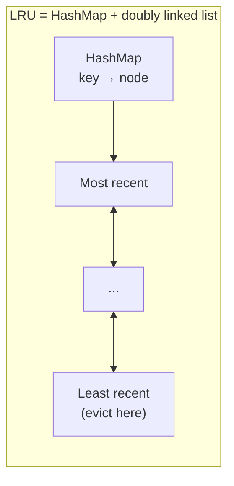

# 030 · Cache Eviction: LRU, LFU, TTL

> ⏱ 8 min · 📈 30% · 🅰️ Part A (core) · Phase 04: Caching
>
> `██████░░░░░░░░░░░░░░` 30% of the whole guide

---

## 📖 Story

Monday, 9:00 a.m. Maya's finance report runs: a job that reads **every order from the last year**, one by one, through the cache.

By 9:04, the cache hit ratio, normally a proud **96%**, has collapsed to **41%**.

She digs in and finds a massacre. The report's two million one-off keys poured into Redis like floodwater into a basement, and on the way in they **evicted everything else**: the "Top dishes" pages, the hot menus, the session data. The database, suddenly unshielded, gasps at 90% CPU as real customers miss, miss, miss.

Redis had a full closet and a rule for what to throw out: *"whatever I touched least recently."* The report touched everything once. The real treasures looked old by comparison.

Maya needs a smarter rule. I'll show you the rules, and a little data structure I still love to code by hand.

## 🎯 One-sentence idea

**Caches are small, so when they fill something must go: LRU evicts the least recently used item, LFU evicts the least frequently used, and TTL expires items after a set time whether or not the cache is full.**

## 🧸 Analogy

A **closet** with room for 10 outfits:

- 🕰️ **LRU:** toss whatever you **haven't worn for the longest time**.
- 📊 **LFU:** toss whatever you've **worn the fewest times overall**.
- ⏳ **TTL:** milk has an **expiry date**. It goes when it expires, even with room to spare.
- 🎲 **Random:** close your eyes and pick one. Surprisingly OK.

## 🖼️ Visual

*Diagram brief:* a row of boxes in recency order, with an arrow showing an accessed item jumping to the front and the tail item falling off the end. Below it, the hash-map-plus-linked-list structure that makes this O(1).

```
LRU, capacity 3 (most recent on the left)
Access A → [A]
Access B → [B, A]
Access C → [C, B, A]
Access A → [A, C, B]          ← A jumps to the front
Access D → [D, A, C]  evict B ← the tail falls off
```



## 🔬 How it works

- **LRU** uses a **hash map + doubly linked list** for O(1) get and put: move a node to the head on access, evict from the tail. It's great for recency-skewed traffic, and **vulnerable to scan pollution** (exactly Maya's Monday).
- **LFU** evicts the lowest access count. It protects long-term favourites, but needs **count decay** so last month's hits don't squat forever.
- **TTL** is about **freshness**, not space. Combine it with LRU/LFU, and **jitter** it (600 s ± 10%) so keys don't expire in synchronized waves.
- **Modern hybrids:** **W-TinyLFU** (Caffeine) and **ARC** blend recency and frequency and **resist scans**. A new key must "earn" its way in against a frequency sketch.
- **Redis `maxmemory-policy`:** `allkeys-lru`, `allkeys-lfu`, `volatile-lru`, `volatile-ttl`, or `noeviction` (writes fail when full: right for Redis as a **primary store**, wrong for a cache). Redis uses **sampled, approximate** LRU/LFU to save memory.

## 🧩 Worked example

```python
from collections import OrderedDict

class LRUCache:
    def __init__(self, capacity):
        self.cap, self.data = capacity, OrderedDict()

    def get(self, key):
        if key not in self.data:
            return None
        self.data.move_to_end(key)           # now most recently used
        return self.data[key]

    def put(self, key, value):
        self.data[key] = value
        self.data.move_to_end(key)
        if len(self.data) > self.cap:
            self.data.popitem(last=False)    # evict least recently used
```

**Maya's fix:** switch to `allkeys-lfu` (the report's keys have a count of 1, the hot menus have thousands), **and** point the report at a **separate cache** (or none). Monday's hit ratio holds at **95%**.

| Workload | Best policy |
|---|---|
| News site (today is hot) | LRU + TTL |
| Catalogue with long-lived bestsellers | LFU with decay |
| Session store | TTL, `volatile-ttl` |
| Mixed traffic + periodic big scans | W-TinyLFU / ARC, or isolate the scans |
| Redis as the *primary* store | `noeviction` |

## ⚖️ Trade-offs

| Policy | What Maya gains | What she pays |
|---|---|---|
| LRU | Simple, great for recency | Scan pollution |
| LFU | Keeps long-term favourites | Decay tuning, more bookkeeping |
| TTL | Bounded staleness | Hot items expire, synchronized expiry storms |
| Random | Zero bookkeeping | Can evict hot items |
| W-TinyLFU / ARC | Best real-world hit ratios | Complexity (use a library) |

## 🌍 Real world

- **Redis** and **Memcached** default to LRU-like eviction. Redis added LFU in 4.0.
- **Caffeine** (Java) uses W-TinyLFU and reaches near-optimal hit ratios.
- **CDNs** run LRU variants with TTLs taken from `Cache-Control`.

## 📌 Cheat card

> - **LRU = oldest use goes. LFU = least popular goes. TTL = expires by time.**
> - LRU = **HashMap + doubly linked list**, O(1).
> - **TTL = freshness. Eviction = space.** Use both.
> - **Jitter TTLs.** **Isolate batch scans.**
> - Redis as a cache → `allkeys-lru/lfu`. Redis as a DB → `noeviction`.

## 🧪 Feynman check

Explain the closet, and why LFU keeps your favourite jacket through a one-time costume party while LRU throws it out.

⚠️ **Common confusion:** "TTL and eviction are the same thing." TTL removes items because they're **old** (freshness). Eviction removes them because there's **no room** (capacity). A key can be evicted long before its TTL, which is why a cache can never be your only copy of data.

## ⚡ Quick recall

1. What data structures give an O(1) LRU cache?
<details><summary>Reveal Answer</summary>

A hash map (key → node) plus a doubly linked list in recency order.
</details>

2. What's "scan pollution" in LRU?
<details><summary>Reveal Answer</summary>

A one-time read of many items fills the cache and evicts the genuinely hot items.
</details>

3. Why add random jitter to TTLs?
<details><summary>Reveal Answer</summary>

To stop many keys expiring at the same instant and sending a burst of load to the DB.
</details>

## 🎤 Interview practice

**Q. "Implement an O(1) LRU cache. Then: after a feature launch, Redis's hit ratio fell from 95% to 60%. What happened?"**
<details><summary>Model answer</summary>

- **The LRU implementation:**
  - A hash map `key → node` plus a doubly linked list with **sentinel head and tail** nodes.
  - `get`: find the node, unlink it, insert it at the head, and return the value (or a miss).
  - `put`: update and move to the head if it exists, otherwise insert at the head. If over capacity, unlink the **tail.prev** and delete its map entry.
  - Every operation is O(1). For concurrency, use a lock or lock-striped segments.
- **LFU variant:** `key → (value, freq)` plus `freq → doubly linked list`, and track `minFreq` for O(1) eviction.
- **Why the hit ratio fell:**
  - The **working set outgrew memory** → eviction churn. Check `evicted_keys/s` and `used_memory`.
  - **Scan pollution** from a new batch or report path.
  - **Key cardinality exploded:** new keys embed unique params (timestamps, session IDs).
  - **TTLs too short**, or a bug mass-deleting keys.
- **Fixes:**
  - More memory or shards.
  - `allkeys-lfu` (or W-TinyLFU in-process).
  - **Isolate batch workloads** in their own cache.
  - Normalize keys and retune TTLs.
- **Detect it early:** alerts on hit ratio, evictions/s, and memory fragmentation.
</details>

## 📖 Teaser

> 📖 *A cook adds "contains peanuts" to her dish, and the cached page keeps showing the old version to hundreds of hungry customers.*

---

⬅️ [029 · Cache Write Strategies](029-cache-write-strategies.md) · 🗺️ [Phase map](README.md) · ➡️ [✅ Checkpoint 30%](checkpoint-30.md)

✅ **Safe stopping point.** Tick lesson 030 in [PROGRESS.md](../../PROGRESS.md), then do the checkpoint!
