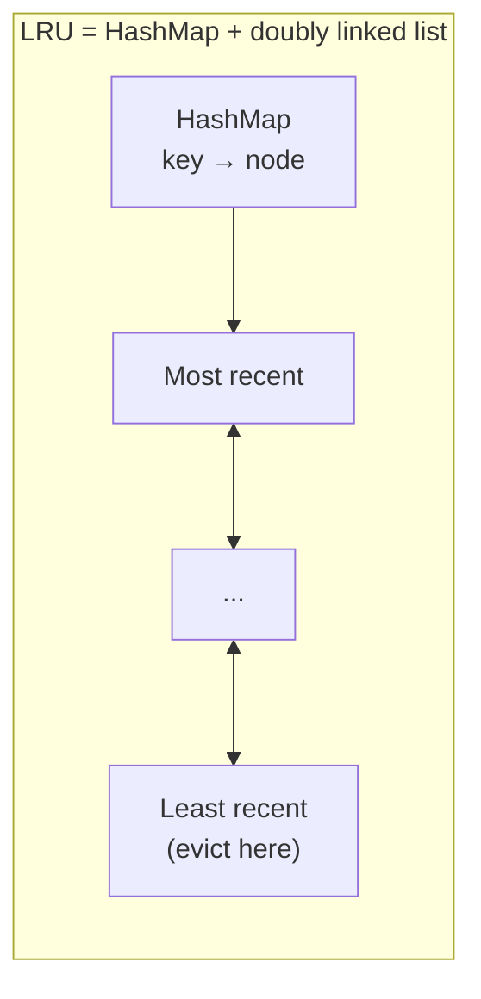

# 030 · Cache Eviction: LRU, LFU, TTL

> ⏱ 8 min · 📈 30% · 🅰️ Part A (core) · Phase 04: Caching
>
> `██████░░░░░░░░░░░░░░` 30% of the whole guide

---

## 📖 Story

The cache server runs out of memory, and suddenly random items vanish, including the most popular menus. Maya needs a rule for what gets kicked out when space runs short, and for when old data should expire on its own.

## 🎯 One-sentence idea

**Caches are small, so when they fill up something must be kicked out. LRU evicts the least recently used item, LFU evicts the least frequently used, and TTL expires items after a set time, whether or not the cache is full.**

## 🧸 Analogy

Your **closet** has room for 10 outfits:

- 🕰️ **LRU (least recently used):** throw out whatever you **haven't worn for the longest time**.
- 📊 **LFU (least frequently used):** throw out whatever you've **worn the fewest times overall**. Your once-a-year tuxedo goes, even if you wore it last week.
- ⏳ **TTL (time to live):** milk has an **expiry date**. It goes when it expires, even if the fridge isn't full.
- 🎲 **Random:** close your eyes and pick one. Surprisingly OK.

## 🖼️ Visual

**LRU with capacity 3.** The most recent is on the left.

```
Access A  → [A]
Access B  → [B, A]
Access C  → [C, B, A]
Access A  → [A, C, B]          (A moves to front)
Access D  → [D, A, C]  evict B (least recently used)
```



## 🔬 How it works

- **LRU:** track recency. On access, move the item to the "front". Evict from the "back".
  - Implementation: **hash map + doubly linked list** → O(1) get and put. (A classic coding interview question!)
  - ✅ Great for **recency-skewed** access (recent items get reused). ❌ A **one-time scan** of many items can flush out the genuinely hot ones.
- **LFU:** track access counts, and evict the lowest.
  - ✅ Keeps **long-term popular** items. ❌ Old popular items can hog space ("they were hot last month"), so real implementations **decay** counts over time.
- **TTL:** each entry expires after N seconds. It controls **freshness**, not just space. Often combined with LRU/LFU.
- **FIFO / random:** simple, and sometimes good enough.
- **Modern hybrids:** **W-TinyLFU** (Caffeine) and **ARC** balance recency and frequency, and resist scans.
- **Redis `maxmemory-policy`:** `allkeys-lru`, `allkeys-lfu`, `volatile-lru` (only keys with a TTL), `volatile-ttl`, `noeviction` (writes error when full, which is OK for a primary datastore and bad for a cache). Redis uses **approximate LRU/LFU** by sampling keys, which is cheaper than exact.
- **Add jitter to TTLs** (e.g., 600 s ± 10%) so lots of keys don't expire at the same instant (lesson 032).

## 🧩 Worked example

**LRU cache in Python (O(1)):**

```python
from collections import OrderedDict

class LRUCache:
    def __init__(self, capacity):
        self.cap, self.data = capacity, OrderedDict()

    def get(self, key):
        if key not in self.data:
            return None
        self.data.move_to_end(key)          # mark as most recently used
        return self.data[key]

    def put(self, key, value):
        self.data[key] = value
        self.data.move_to_end(key)
        if len(self.data) > self.cap:
            self.data.popitem(last=False)   # evict least recently used
```

**Choosing a policy:**

| Workload | Best policy |
|---|---|
| News site (today's stories are hot) | LRU + TTL |
| Product catalog (bestsellers stay hot for months) | LFU (with decay) |
| Session store | TTL (sessions expire), `volatile-ttl` |
| Mix + occasional big scans (reports) | W-TinyLFU / ARC |
| Redis as the *primary* store | `noeviction` (never silently drop data!) |

## ⚖️ Trade-offs

| Policy | Gain | Cost |
|---|---|---|
| LRU | Simple, great for recency | Scan pollution |
| LFU | Keeps long-term favourites | Needs decay, more bookkeeping |
| TTL | Bounded staleness | Premature expiry of hot items, synchronized expiry storms |
| Random | Zero bookkeeping | Can evict hot items |
| W-TinyLFU / ARC | Best hit ratio in practice | More complex (use a library) |

## 🌍 Real world

- **Redis** and **Memcached** default to LRU-like eviction. Redis added LFU in version 4.0.
- **Caffeine** (Java) uses W-TinyLFU and gets near-optimal hit ratios.
- **CDNs** use variants of LRU with TTLs from `Cache-Control`.

## 📌 Cheat card

> - **LRU = oldest use goes. LFU = least popular goes. TTL = expires by time.**
> - LRU = **HashMap + doubly linked list**, O(1).
> - **TTL controls freshness. Eviction controls space.** Use both.
> - **Jitter your TTLs.**
> - Redis as a cache → `allkeys-lru`/`allkeys-lfu`. Redis as a DB → `noeviction`.

## 🧪 Feynman check

Explain the closet analogy, and why LFU might keep your tuxedo while LRU throws it out.

⚠️ **Common confusion:** "TTL and eviction are the same thing." TTL removes items because they're **old** (freshness). Eviction removes items because there's **no room** (capacity). An item can be evicted long before its TTL expires.

## ⚡ Quick recall

1. What data structures give an O(1) LRU cache?
<details><summary>Answer</summary>

A hash map (key → node) plus a doubly linked list (recency order).
</details>

2. What's "scan pollution" in LRU?
<details><summary>Answer</summary>

A one-time read of many items (e.g., a batch report) fills the cache and evicts the genuinely hot items.
</details>

3. Why add random jitter to TTLs?
<details><summary>Answer</summary>

To prevent many keys from expiring at the same moment and causing a burst of DB load.
</details>

## 🎤 Interview practice

**Q1. "Implement an LRU cache with O(1) get and put."** *(a classic coding question)*
<details><summary>Model answer</summary>

- A hash map from key → node in a **doubly linked list** ordered by recency.
- `get`: look up the node, move it to the head, return the value (−1/None if missing).
- `put`: if it exists, update and move to the head. Otherwise insert at the head. If over capacity, remove the tail node and its map entry.
- Use sentinel head/tail nodes to simplify the edge cases. For thread safety, add a lock or use striped segments.
- **Likely follow-up:** "Make it LFU." → map key → (value, freq), plus freq → doubly linked list, and track minFreq for O(1) eviction.
</details>

**Q2. "Your Redis cache's hit ratio dropped from 95% to 60% after a feature launch. What happened?"**
<details><summary>Model answer</summary>

- The **working set grew** beyond memory → constant evictions (check `evicted_keys` and memory usage).
- **Scan pollution:** a new batch job or feature reads many one-off keys.
- **Key cardinality exploded:** new keys include unique params (timestamps, session IDs).
- **TTLs are too short**, or a bug is deleting keys.
- Fixes: add memory or shards, switch to LFU, isolate batch workloads in a separate cache, normalize keys, tune TTLs.
- **Likely follow-up:** "How would you detect this early?" → alerts on hit ratio, evictions/s, and memory fragmentation.
</details>

> 📖 *Next time: A cook adds an allergy warning to a dish, but customers keep seeing the old page.*

---

⬅️ [029 · Cache Write Strategies](029-cache-write-strategies.md) · 🗺️ [Phase map](README.md) · ➡️ [✅ Checkpoint 30%](checkpoint-30.md)

✅ **Safe stopping point.** Tick lesson 030 in [PROGRESS.md](../../PROGRESS.md), then do the checkpoint!
