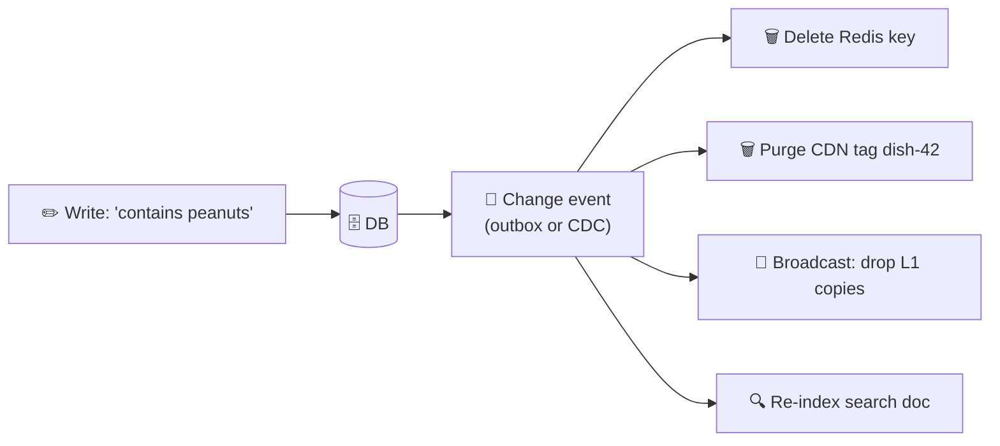

# 031 · Cache Invalidation

> ⏱ 9 min · 📈 31% · 🅰️ Part A (core) · Phase 04: Caching
>
> `██████░░░░░░░░░░░░░░` 31% of the whole guide

---

## 📖 Story

4:12 p.m. A cook edits her satay dish and adds three words in bold: **"Contains peanuts."**

She hits save. The database updates. Everything looks fine.

But the dish page was cached. In Redis, at the CDN edge, in the in-process memory of 30 app servers. And for the next **ten minutes**, every one of those copies keeps serving the old page, **without the warning**, to hundreds of people deciding what to eat for dinner.

Maya finds out when a support ticket arrives with a single line that makes her stomach drop:

*"My son has a peanut allergy. Your site didn't say."*

I want you to feel how serious that is. It isn't just stale data. It's **dangerous** data. Maya has run into one of the famously hard problems in computing: keeping copies honest. Let me show you how.

## 🎯 One-sentence idea

**Invalidation keeps cached copies from lying after the real data changes, by letting copies expire (TTL), deleting them when data changes (explicit or event-driven invalidation), or versioning them so old copies are never asked for again.**

> "There are only two hard things in Computer Science: cache invalidation and naming things." (Phil Karlton)

## 🧸 Analogy

A **printed menu on every table** (the caches):

- ⏳ **TTL:** reprint all menus **every Monday**. Simple, but wrong for up to a week.
- 📣 **Explicit invalidation:** when the chef changes a dish, a waiter **collects the old menus immediately**. Accurate, if you know where every menu is.
- 🏷️ **Versioning:** new menus get a **new edition number**, and customers always ask for the latest.

## 🖼️ Visual

*Diagram brief:* a single write drops into the database, and a change-event "shockwave" ripples out to every copy: Redis, CDN, each server's L1, and the search index. Each one turns red, then gets deleted.



## 🔬 How it works

- **TTL is the safety net everywhere:** staleness is bounded by the TTL, and you choose it by asking "how wrong, for how long, is acceptable?" Seconds for allergens and prices, hours for avatars.
- **Delete on write:** after the DB commit, **delete** the entity key *and every derived key* (lists, pages, aggregates). **Tracking those dependencies is the real difficulty.**
- **Event-driven / CDC:** the app emits an event (transactional outbox, lesson 062), or **CDC** (Debezium) tails the DB's WAL and publishes every committed change. Subscribers invalidate Redis, L1 caches (via pub/sub), the CDN (surrogate keys), and search.
- **Versioned keys:** `dish:42:v17`, or hashed asset URLs. Writes bump the version, readers ask for the current one, and old entries simply age out. No race on the key itself.
- **The two classic traps:** the **stale-set race** (a slow reader re-caches an old value after the delete) and **replica-lag re-caching** (the post-delete miss reads a lagging replica). Fix them with **leases** (Meta's Memcache), **version-checked sets**, **delayed double delete**, or **reading from the primary** right after a write.

## 🧩 Worked example

**The stale-set race:**

```
t0  Cache: (empty)              DB: allergens=""
t1  Reader A: miss → reads DB → gets ""          (slow request…)
t2  Writer:  UPDATE allergens="peanuts" → DELETE dish:42
t3  Reader A: SET dish:42 = ""     ← stale, and dangerous, until the TTL
```

**Fixes:**

```python
def update_dish(dish_id, fields):
    db.execute("UPDATE dishes SET … WHERE id=%s", dish_id)
    redis.delete(f"dish:{dish_id}")
    schedule_in(seconds=1, fn=lambda: redis.delete(f"dish:{dish_id}"))   # delayed double delete
    cdn.purge(tag=f"dish-{dish_id}")
    pubsub.publish("invalidate", f"dish:{dish_id}")                      # L1 caches on all 30 servers
```

```
Version-checked set: value = {version: 17, data: …}
Lua script: SET only if incoming.version > stored.version
```

**Derived keys for dish 42:** `dish:42`, `cook:7:menu`, `top:london:19h`, CDN `/dishes/42` (surrogate key `dish-42`), and search results (short TTL + re-index).

**Maya's policy:** **safety-critical fields (allergens, price) → TTL ≤ 30 s + event invalidation + CDN tag purge**. Cosmetic fields → TTL 10 min.

## ⚖️ Trade-offs

| Approach | What Maya gains | What she pays |
|---|---|---|
| TTL only | Dead simple | Stale for up to the TTL |
| Delete on write | Fresh within milliseconds | Must know every affected key, races |
| Event / CDC-driven | Covers every cache, decoupled | Infrastructure, ms–s of lag |
| Versioned keys | No races on the key, easy rollback | An extra lookup or indirection |
| No cache | Always correct | Load and latency |

## 🌍 Real world

- **Meta's "Scaling Memcache at Facebook":** invalidations flow from the MySQL replication stream (the `mcsqueal` daemons), with **leases** preventing stale sets and herds.
- **Debezium + Kafka** is the standard CDC pipeline for keeping caches and search in sync.
- **Fastly and Cloudflare surrogate keys** purge every page tagged `dish-42` in one call.

## 📌 Cheat card

> - Three tools: **TTL (time) · delete on write (events) · versioning (new names)**.
> - **Always keep a TTL** as the safety net.
> - **Delete, don't set**, on write.
> - Beware **stale-set races** and **replica-lag re-caching** → leases, versioned sets, delayed double delete.
> - **Derived data** (lists, pages, search) is where invalidation bugs hide.

## 🧪 Feynman check

Explain the three menu strategies, and walk through the race in which a slow reader puts the old, peanut-free page back into the cache.

⚠️ **Common confusion:** "We invalidate on write, so the cache is always consistent." Caches are **eventually consistent** with the DB: there are always small windows from races, lag, and failed deletes. Design for **bounded** staleness, and read the **source of truth** where being wrong can hurt someone.

## ⚡ Quick recall

1. Why keep a TTL even when you invalidate on every write?
<details><summary>Reveal Answer</summary>

It's a safety net. Missed invalidations (bugs, races, failed deletes) heal themselves when the entry expires.
</details>

2. What is CDC in the context of caching?
<details><summary>Reveal Answer</summary>

Change Data Capture: tailing the DB's change log to emit events that trigger cache invalidation or updates, without touching app code.
</details>

3. How can a lagging read replica break invalidation?
<details><summary>Reveal Answer</summary>

After the delete, the next miss reads a replica that doesn't have the write yet, and re-caches the old value.
</details>

## 🎤 Interview practice

**Q. "Keep a Redis cache, 30 in-process L1 caches, an Elasticsearch index, and a CDN in sync with a Postgres source of truth, with stale allergen info visible for no more than 5 seconds."**
<details><summary>Model answer</summary>

- **Capture every change reliably:** **CDC** (Debezium reading the Postgres WAL) → Kafka, one topic per table. It catches *every* committed change, including admin scripts and migrations, and it's replayable. (A **transactional outbox** is the app-level alternative.)
- **Fan-out consumers, all idempotent:**
  1. **Redis invalidator:** DEL entity and derived keys.
  2. **L1 invalidation:** publish on Redis pub/sub so all 30 servers drop their local copies. **L1 TTL ≤ 5 s** as a backstop in case a message is missed.
  3. **CDN purger:** purge by surrogate key `dish-{id}`. Purges propagate globally in about a second.
  4. **Search indexer:** upsert the document.
- **Close the races:**
  - **Version-checked sets** (only cache a value whose `updated_at`/version is newer than the stored one) to kill stale-set races.
  - **Read the primary** for re-population right after a change, to avoid replica-lag re-caching.
- **Meet the 5 s bound:**
  - CDC lag is typically < 1 s. Monitor consumer lag and alert at 2 s.
  - Safety-critical fields get **short TTLs** on every layer anyway.
  - For the checkout and allergy confirmation step, **read the source of truth**, never the cache.
- **Likely follow-up:** "Users change their photo and still see the old one?" → give each upload a **new versioned URL**, so the browser and CDN fetch it naturally with no purge, and serve the uploader's own profile from the primary (**read-your-writes**, lesson 047).
</details>

## 📖 Teaser

> 📖 *Next, at 8 p.m. sharp, the most popular cache entry in Pantry expires, and ten thousand requests stampede into the database at once.*

---

⬅️ [✅ Checkpoint 30%](checkpoint-30.md) · 🗺️ [Phase map](README.md) · ➡️ [032 · Stampede, Hot Keys & Penetration](032-cache-stampede-and-hot-keys.md)

✅ **Safe stopping point.** Tick lesson 031 in [PROGRESS.md](../../PROGRESS.md).
