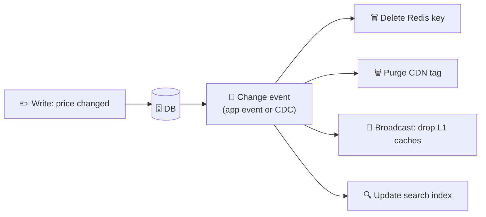

# 031 · Cache Invalidation

> ⏱ 9 min · 📈 31% · 🅰️ Part A (core) · Phase 04: Caching
>
> `██████░░░░░░░░░░░░░░` 31% of the whole guide

---

## 🎯 One-sentence idea

**Invalidation is making sure cached copies don't lie after the real data changes. You can let copies expire (TTL), delete them when data changes (explicit invalidation), or version them so old copies are simply never asked for again.**

> "There are only two hard things in Computer Science: cache invalidation and naming things." (Phil Karlton)

## 🧸 Analogy

A **restaurant menu** printed and placed on every table (the caches):

- ⏳ **TTL:** reprint all menus **every Monday**, whether or not prices changed. Simple, but prices can be wrong for up to a week.
- 📣 **Explicit invalidation:** whenever the chef changes a price, a waiter **collects the old menus** right away. Accurate, but you need to know where every menu is.
- 🏷️ **Versioning:** new menus get a **new edition number** ("Menu v8"). Customers always ask for the latest edition, and old ones are simply ignored.

## 🖼️ Visual



## 🔬 How it works

- **TTL-based expiry:** the simplest, and a **safety net everywhere**. Staleness is bounded by the TTL. Pick it by asking "how stale is acceptable?" (seconds for prices, hours for profile pictures).
- **Explicit invalidation (delete on write):** after updating the DB, **delete** the affected cache keys. Also delete *derived* keys (lists, aggregates, pages that contain the item). **Tracking the dependencies is the hard part.**
- **Event-driven invalidation:** publish a change event (or use **CDC, change data capture**, which reads the DB's log, e.g., Debezium). Subscribers invalidate every cache: Redis, local L1, CDN, search.
- **Versioned keys:** `product:42:v17`. Writes bump the version, and readers look up the current version first (or embed it in URLs, like hashed asset names). Old entries just age out.
- **Race conditions to know:**
  - **Stale set:** Reader A misses → reads the old value from the DB → (meanwhile, writer B updates the DB and deletes the key) → A writes the **old** value into the cache. That value is now stale until the TTL expires.
  - Mitigations: **short TTLs**, **delayed double delete** (delete again ~1 s after the write), **leases/tokens** (Facebook's Memcache: only the holder of a valid lease may set), or **versioned values** (only set if newer).
- **Replication lag trap:** you invalidate, the next read goes to a **lagging DB replica**, and it re-caches old data. Read from the primary right after a write, or delay the re-population.

## 🧩 Worked example

**The stale-set race, step by step:**

```
t0  Cache: (empty)          DB: price=10
t1  Reader A: cache miss → reads DB → gets 10
t2  Writer B: UPDATE price=12 → DELETE cache key
t3  Reader A: SET cache price=10          ← stale! cached until TTL
```

**Fix with a delayed double delete:**

```python
def update_price(pid, price):
    db.execute("UPDATE products SET price=%s WHERE id=%s", price, pid)
    redis.delete(f"product:{pid}")
    schedule_in(seconds=1, fn=lambda: redis.delete(f"product:{pid}"))  # catches t3-style races
```

**Fix with version-checked sets (a Lua script / compare-and-set):**

```
Value stored as {version: 17, data: ...}
Only SET if the incoming version > the stored version
```

**Invalidating derived data:** updating product 42 must also invalidate:
- `product:42`
- `category:kitchen:page:1` (the list shows its price)
- `search results containing 42` (usually handled by a short TTL, since tracking them all is impractical)
- CDN page `/products/42` (purge by the surrogate key `product-42`)

## ⚖️ Trade-offs

| Approach | Gain | Cost | Use when |
|---|---|---|---|
| TTL only | Dead simple | Stale for up to the TTL | Staleness is tolerable |
| Delete on write | Fresh quickly | Must know all affected keys, races | Entities with clear keys |
| Event/CDC-driven | Decoupled, covers many caches | Infrastructure, eventual (ms–s delay) | Many services and caches |
| Versioned keys | No races on the key itself, and easy rollback | Extra lookup or indirection | Assets, config, immutable data |
| No cache | Always correct | Load and latency | Correctness-critical reads (balances, checkout) |

## 🌍 Real world

- **Facebook's "Scaling Memcache"** paper: invalidations flow from the MySQL replication stream (the `mcsqueal` daemons), with leases to avoid stale sets and thundering herds.
- **Debezium + Kafka** is a popular CDC pipeline for keeping caches and search indexes in sync.
- **Fastly/Cloudflare surrogate keys** let you purge every page tagged `product-42` in one call.

## 📌 Cheat card

> - Three tools: **TTL (time), delete on write (events), versioning (new names)**.
> - **Always have a TTL** as the safety net, even with explicit invalidation.
> - **Delete, don't set**, on write.
> - Watch for **stale-set races** and **replica-lag re-caching**. Fix them with leases, versioned sets, or delayed double delete.
> - **Derived data** (lists, pages, search) is where invalidation bugs hide.

## 🧪 Feynman check

Explain the three menu strategies, and describe the race where a slow reader puts an old price back into the cache.

⚠️ **Common confusion:** "We invalidate on write, so the cache is always consistent." Caches are **eventually consistent** with the DB. There are always small windows (races, lag, failed deletes). Design for bounded staleness, and read from the source of truth where it truly matters.

## ⚡ Quick recall

1. Why keep a TTL even if you invalidate on writes?
<details><summary>Answer</summary>

A safety net: missed invalidations (bugs, races, failed deletes) will eventually self-heal when the entry expires.
</details>

2. What is CDC in the context of caching?
<details><summary>Answer</summary>

Change Data Capture: reading the DB's change log to emit events that trigger cache invalidation or updates, without changing app code.
</details>

3. How can a lagging read replica break invalidation?
<details><summary>Answer</summary>

After deleting the key, the next miss reads the replica, which doesn't have the write yet, so the old value is re-cached.
</details>

## 🎤 Interview practice

**Q1. "Users update their profile photo, but still see the old one for minutes. Walk me through the causes and fixes."**
<details><summary>Model answer</summary>

- **Layers:** browser cache, CDN (long TTL on the image URL), Redis profile cache, and maybe replica lag.
- **Fixes:** give each new photo a **new URL** (versioned/hashed file name), so the browser and CDN naturally fetch the new one without purges. **Delete** the profile cache key on update. Read your own profile from the primary (**read-your-writes**, lesson 047).
- **Likely follow-up:** "Other users still see the old photo?" → acceptable eventual consistency within the TTL, or push an event to invalidate their feeds' cached author info.
</details>

**Q2. "How do you keep a Redis cache, an Elasticsearch index, and a CDN in sync with a Postgres source of truth?"**
<details><summary>Model answer</summary>

- **CDC** (Debezium reading the Postgres WAL) → **Kafka** topic per table → consumers: a cache invalidator (delete keys), a search indexer (upsert docs), and a CDN purger (surrogate keys).
- It's reliable (it captures every committed change, even from scripts), decoupled, and replayable.
- Add TTLs everywhere as a safety net, and make consumers **idempotent**.
- Alternative: the **transactional outbox** pattern from app code (lesson 062).
- **Likely follow-up:** "What's the lag?" → typically ms to seconds, so it's eventual consistency. Critical reads go to the source.
</details>

---

⬅️ [✅ Checkpoint 30%](checkpoint-30.md) · 🗺️ [Phase map](README.md) · ➡️ [032 · Stampede, Hot Keys & Penetration](032-cache-stampede-and-hot-keys.md)

✅ **Safe stopping point.** Tick lesson 031 in [PROGRESS.md](../../PROGRESS.md).
