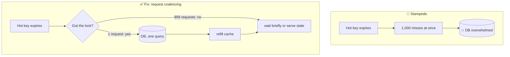

# 032 · Cache Stampede, Hot Keys & Cache Penetration

> ⏱ 10 min · 📈 32% · 🅰️ Part A (core) · Phase 04: Caching
>
> `██████░░░░░░░░░░░░░░` 32% of the whole guide

---

## 📖 Story

A famous chef shares a Pantry dish with two million followers. At exactly 8:00:00, the cached page for that dish expires, and ten thousand requests hit the database at once. Meanwhile, a bot keeps asking for dishes that don't exist. Caches, it turns out, have failure modes of their own.

## 🎯 One-sentence idea

**Caches fail in three classic ways under pressure: a popular key expires and thousands of requests hit the DB at once (stampede), one key gets so much traffic it overwhelms a single cache node (hot key), or requests for things that don't exist bypass the cache every time (penetration). Each has a well-known fix.**

## 🧸 Analogy

A **bakery's display case**:

- 🐃 **Stampede:** the last croissant is sold, and 500 customers all run into the **kitchen** at once asking for one. The kitchen collapses. Fix: **one baker bakes a batch** while everyone else waits a moment.
- 🔥 **Hot key:** everyone wants the **same famous cake**, and it's only in **one display case**. Fix: put copies in **several cases**.
- 👻 **Penetration:** people keep asking for "unicorn bread" that **doesn't exist**. Every time, staff check the kitchen. Fix: put up a sign, "**No unicorn bread**" (cache the "not found").

## 🖼️ Visual



## 🔬 How it works

**1. Cache stampede (thundering herd / dogpile)**
- A **hot key** expires (or the cache restarts), and many concurrent misses all recompute or query the same thing.
- Fixes:
  - **Request coalescing / single-flight:** only one request per key fetches, and the others wait for its result (a lock like `SET key:lock NX EX 5`, or an in-process single-flight).
  - **Serve stale while revalidating:** keep serving the old value while one worker refreshes it in the background.
  - **Probabilistic early refresh:** refresh *before* expiry, with a probability that rises as expiry approaches (the "XFetch" algorithm).
  - **TTL jitter:** spread expirations out (lesson 030).
  - **Never expire super-hot keys.** Refresh them proactively with a background job.

**2. Hot keys**
- One key (a celebrity's profile, a viral post, a flash-sale item) receives so much traffic that the **single cache shard** holding it saturates (CPU or network).
- Fixes:
  - **Local L1 cache** in each app server for hot keys (even 1–5 s of TTL absorbs most of it).
  - **Key replication / splitting:** store copies as `post:42#1..#N` and read a random copy.
  - **Read replicas** of the cache shard.
  - **Detect** hot keys (Redis `--hotkeys`, client-side sampling) and handle them adaptively.

**3. Cache penetration**
- Requests for **non-existent** keys always miss, and always hit the DB. Often malicious (random IDs), sometimes a bug.
- Fixes:
  - **Negative caching:** cache "NOT_FOUND" with a short TTL.
  - **Bloom filter** in front: "does this ID possibly exist?" A "definitely not" answer skips both cache and DB (lesson 090).
  - **Input validation + rate limiting.**

**Related: cache avalanche.** *Many* keys expire together, or the whole cache goes down → DB flooded. Fixes: TTL jitter, HA cache clusters, circuit breakers, and DB rate limiting.

## 🧩 Worked example

**Single-flight with a Redis lock + stale fallback:**

```python
def get_with_protection(key, loader, ttl=300):
    val = redis.get(key)
    if val is not None:
        return val
    # Try to become the one request that rebuilds
    if redis.set(f"{key}:lock", "1", nx=True, ex=10):
        try:
            val = loader()                                      # only ONE DB query
            redis.setex(key, ttl + random.randint(0, 60), val)  # jittered TTL
            redis.setex(f"{key}:stale", ttl * 10, val)          # long-lived backup copy
            return val
        finally:
            redis.delete(f"{key}:lock")
    # Everyone else: serve the stale copy, or wait briefly and retry
    stale = redis.get(f"{key}:stale")
    if stale is not None:
        return stale
    time.sleep(0.05)
    return get_with_protection(key, loader, ttl)
```

**Hot-key splitting:**

```python
N = 10
def get_hot(key):
    return redis.get(f"{key}#{random.randrange(N)}")   # spreads load over 10 keys, likely on different shards
def set_hot(key, val):
    for i in range(N):
        redis.setex(f"{key}#{i}", 60, val)
```

## ⚖️ Trade-offs

| Fix | Gain | Cost |
|---|---|---|
| Locking / single-flight | One DB query per key | Waiting requests add latency, lock-holder failure handling |
| Serve stale | No waiting | Briefly stale data |
| Early probabilistic refresh | No expiry cliff | Slightly more refresh work |
| Local L1 for hot keys | Absorbs huge load | Short inconsistency across servers |
| Key splitting | Spreads a hot key across shards | N× writes and memory |
| Negative caching | Stops repeated misses | Newly created items may look missing briefly |
| Bloom filter | Blocks non-existent keys cheaply | False positives, must be kept updated |

## 🌍 Real world

- **Facebook Memcache leases** solve both stale sets and thundering herds: only one client gets the lease to refill, and the others wait or retry.
- **Twitter/X** handles celebrity tweets as hot keys, with extra replication and local caching.
- **Nginx `proxy_cache_lock`** and **Varnish grace mode** implement coalescing and serve-stale at the HTTP layer.

## 📌 Cheat card

> - **Stampede → coalesce (one fetches), serve stale, refresh early, jitter TTLs.**
> - **Hot key → local L1 cache, split the key into N copies, replicas.**
> - **Penetration → negative cache + Bloom filter + validation.**
> - **Avalanche → jitter + HA cache + protect the DB.**
> - A cache failure must degrade to **slower, never down**.

## 🧪 Feynman check

Explain the bakery's three problems (the croissant rush, the famous cake, unicorn bread) and one fix for each.

⚠️ **Common confusion:** "More cache nodes fix hot keys." A single key lives on **one** shard no matter how many nodes you add. You need replication, splitting, or local caching for that key.

## ⚡ Quick recall

1. What is a cache stampede?
<details><summary>Answer</summary>

When a popular key expires (or the cache empties) and many concurrent requests all miss and hit the DB at the same time.
</details>

2. How does negative caching prevent penetration?
<details><summary>Answer</summary>

It caches "not found" results briefly, so repeated requests for non-existent keys are answered by the cache instead of the DB.
</details>

3. Why doesn't adding cache shards fix a hot key?
<details><summary>Answer</summary>

One key maps to one shard. You need copies (split keys, replicas, local caches) to spread its load.
</details>

## 🎤 Interview practice

**Q1. "A celebrity with 100M followers posts. The post's cache key gets 2M reads/s. What do you do?"**
<details><summary>Model answer</summary>

- A single Redis shard handles about 100k–1M simple ops/s, so it's overloaded.
- **Local in-process caches** on each app server (1–5 s TTL) absorb most reads. With 500 servers, the shard sees at most 500 fetches per TTL window.
- **Split the key** into N copies across shards, and/or add **read replicas** for that shard.
- Push the post content to the **CDN/edge** if it's public.
- **Detect** hot keys automatically and promote them to the "hot path."
- **Likely follow-up:** "What about the like counter on that post?" → sharded counters + write-back aggregation (lesson 029).
</details>

**Q2. "Attackers request random product IDs, bypass the cache, and overload the DB. Defend it."**
<details><summary>Model answer</summary>

- **Validate** the ID format first (reject garbage).
- A **Bloom filter** of all valid IDs: a "definitely not present" answer gets rejected with no cache or DB work.
- **Negative caching** for misses (short TTL).
- **Rate limit** per IP/client, and WAF bot detection.
- **Protect the DB** with a circuit breaker and concurrency limits on the lookup path.
- **Likely follow-up:** "How do you keep the Bloom filter updated as products are added?" → add on create. Deletions need a rebuild or a counting Bloom filter.
</details>

> 📖 *Next time: One cache server isn't enough anymore. Maya needs a whole cluster of them.*

---

⬅️ [031 · Cache Invalidation](031-cache-invalidation.md) · 🗺️ [Phase map](README.md) · ➡️ [033 · Redis, Memcached & Distributed Caches](033-distributed-caches.md)

✅ **Safe stopping point.** Tick lesson 032 in [PROGRESS.md](../../PROGRESS.md).
