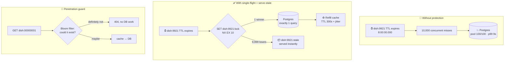

# 032 · Cache Stampede, Hot Keys & Cache Penetration

> ⏱ 10 min · 📈 32% · 🅰️ Part A (core) · Phase 04: Caching
>
> `██████░░░░░░░░░░░░░░` 32% of the whole guide

---

## 📖 Story

It's 7:59:58 p.m. Maya is watching the Grafana dashboard. Every line on it is green.

A Pantry dish page has gone viral. Four hundred thousand people are refreshing it, waiting for the 8 p.m. ordering window. Every one of those reads lands in Redis, and Redis shrugs them off in under a millisecond.

Then the clock hits **8:00:00**, and the cache key `dish:9921` reaches the end of its TTL. It's gone.

Imagine a stadium gate with forty thousand fans pressed against it, and the gate swings open. In one second, **10,000 requests** miss the cache together. All of them rush past the empty shelf and hit Postgres. The connection pool, 100 slots wide, is full in four milliseconds. Every other request waits in line behind it. p99 latency goes from **35 ms to 9 seconds**. Clients time out and retry, so the crowd doubles.

While that's happening, a scraper bot is quietly asking for `dish:00000001`, `dish:00000002`, and so on: dishes that have never existed. None of them are in the cache, so every single request goes straight through to the database.

I've been paged for every one of these. Tonight, Maya learns that a cache doesn't just fail by being empty. It fails in very specific ways.

## 🎯 One-sentence idea

**A cache under pressure breaks in three ways: a hot key expires and the herd hits the database (stampede), one key outgrows the single node that holds it (hot key), or requests for missing data skip the cache every time (penetration). Each one has an infrastructure fix.**

## 🧸 Analogy

Picture a **bakery with one glass display case** and a kitchen out back.

- 🐃 **Stampede:** The last croissant sells. Five hundred customers rush into the kitchen at once, each demanding a fresh batch. The ovens jam. **Fix:** one baker bakes a single batch, and the line waits at the counter, or takes yesterday's croissant for now.
- 🔥 **Hot key:** Everyone wants the same famous cake, and it sits in one case with one clerk. That clerk becomes the bottleneck. **Fix:** put copies of the cake in ten cases, with ten clerks.
- 👻 **Penetration:** People keep asking for "unicorn bread." Each time, a clerk walks to the kitchen to check, and comes back empty-handed. **Fix:** a sign on the glass that says **"No unicorn bread."**

## 🖼️ Visual

*Diagram brief:* the left half shows the stampede, with a single expired key and 10,000 arrows crashing into the database. The right half shows the same 10,000 arrows hitting a **lock gate**. One arrow gets through to the database, and the other 9,999 bend back to a "stale copy" shelf.



## 🔬 How it works

- **Stampede (thundering herd / dogpile):** a hot key expires or a cache node restarts, so N concurrent misses each run the same expensive load. **Single-flight** fixes it: an atomic `SET key:lock NX EX 10` lets one request rebuild the value while the others wait briefly or get a stale copy.
- **Don't let expiry be a cliff:** add **TTL jitter** (±10–20%) so keys don't expire together, and use **probabilistic early refresh (XFetch)**, which re-computes the value early when `now − Δ·β·ln(rand()) ≥ expiry`. Expensive keys (large Δ) refresh earliest.
- **Hot key:** a single key always hashes to a **single shard**, so adding nodes does nothing for it. Spread its load with an **in-process L1 cache** (1–5 s TTL), by **splitting the key** into `key#0..#N-1` copies across shards, or with **read replicas** of that shard.
- **Penetration:** keys that don't exist always miss. Stop them with **negative caching** (store `NOT_FOUND` for 30–60 s) plus a **Bloom filter** of valid IDs, which answers "definitely not here" in O(k) bit lookups with **zero false negatives**.
- **Avalanche (the big brother):** *many* keys expire at once, or the whole cache cluster fails. The defences are jitter, a highly available cache cluster, and a **circuit breaker plus concurrency limit** in front of the database, so the system **slows down instead of going dark**.

## 🧩 Worked example

**The math of Maya's 8 p.m. crash:**

| Quantity | Value |
|---|---|
| Misses in the first second | 10,000 |
| Dish-page query cost | 40 ms |
| Postgres pool | 100 connections → max **2,500 queries/s** |
| Time to drain the queue | 10,000 ÷ 2,500 = **4 s** (before retries make it worse) |
| With single-flight | **1 query**, 40 ms; 9,999 requests served from the stale copy |

**Hot key on the same night:** 400,000 reads/s × 8 KB = **3.2 GB/s ≈ 25.6 Gbps**. A single Redis shard on a 10 Gbps NIC is **2.5× over capacity**, however many other shards exist. Split the key 8 ways (≈3.2 Gbps each) or put a 2-second L1 cache on 200 app servers, which caps the shard at **≈100 fetches/s** (200 servers ÷ 2 s).

**Single-flight + serve-stale + jitter, in pseudocode:**

```python
def get_dish(key, load_from_db, ttl=300):
    if (val := redis.get(key)) is not None:
        return val                                        # 🟢 hot path: ~0.5 ms

    if redis.set(f"{key}:lock", "1", nx=True, ex=10):     # 🔒 only ONE winner
        try:
            val = load_from_db()                          # exactly 1 DB query
            redis.setex(key, ttl + random.randint(0, 60), val)   # jittered TTL
            redis.setex(f"{key}:stale", ttl * 10, val)           # long-lived fallback
            return val
        finally:
            redis.delete(f"{key}:lock")

    if (stale := redis.get(f"{key}:stale")) is not None:
        return stale                                      # 🟡 the herd eats yesterday's croissant
    time.sleep(0.05)                                      # brief back-off, then retry
    return get_dish(key, load_from_db, ttl)
```

## ⚖️ Trade-offs

| Maya's choice | What she gains | What she pays |
|---|---|---|
| Single-flight lock | 1 DB query per key per expiry | Waiters add latency; if the lock holder crashes, the lock blocks rebuilds until its 10 s `EX` runs out |
| Serve stale | Zero waiting, flat p99 | Users see data up to one TTL old |
| XFetch early refresh | No expiry cliff at all | A few extra refreshes for keys that don't need them |
| L1 in-process cache | Absorbs millions of reads/s | Up to 1–5 s of disagreement between servers |
| Key splitting (×N) | Hot key spread across N shards | N× memory and N× writes per update |
| Negative caching | Repeated misses stop at the cache | A newly created dish can look missing until the TTL expires |
| Bloom filter | Rejects fake IDs for a few bits per key | ~1% false positives; deletions need a rebuild or a counting filter |

## 🌍 Real world

- **Facebook Memcache leases** (NSDI 2013): on a miss, memcached hands out a lease token so only one client per key refills it, and it rate-limits how often leases are issued. Facebook used this to cut peak database query rates sharply.
- **Nginx `proxy_cache_lock` + `proxy_cache_use_stale updating`** and **Varnish grace mode** do request coalescing and serve-stale at the HTTP layer, in front of the app.
- **Twitter/X** treats celebrity tweets as hot keys, with extra replication and in-process caching in the timeline service.
- **Go's `singleflight` package** is the standard in-process version of coalescing, and is used across many large Go codebases.
- **Cassandra and HBase** keep a Bloom filter per SSTable to skip disk reads for keys that aren't there. That's the same anti-penetration trick, inside a database.

## 📌 Cheat card

> - 🐃 **Stampede → single-flight lock, serve stale, XFetch, TTL jitter.**
> - 🔥 **Hot key → L1 cache (1–5 s), split into N keys, shard replicas.** Adding more shards **never** helps a single key.
> - 👻 **Penetration → validate input, negative cache (30–60 s), Bloom filter, rate limit.**
> - 🌊 **Avalanche → jitter + HA cluster + circuit breaker on the DB.**
> - Lock TTL should be **> worst-case rebuild time** and **≪ the data TTL** (e.g. 10 s vs 300 s).
> - Rough Redis capacity per shard: **~100k–1M simple ops/s**, limited by one core and one NIC.
> - Golden rule: **a cache failure should make the system slower, never down.**

## 🧪 Feynman check

Close this page. Explain to a friend, using only the bakery, **why 10,000 people asking for the same croissant is worse than 10,000 people asking for 10,000 different croissants**, and what the one baker does about it.

⚠️ **Common confusion:** People often think stampede and hot key are the same problem. They aren't. A **stampede is a timing problem**: the danger is the instant the key *disappears*, and the database takes the hit. A **hot key is a placement problem**: the key is *present* and healthy, but the single cache shard holding it is saturated. Single-flight fixes the first and does nothing for the second. Key splitting fixes the second and does nothing for the first.

## ⚡ Quick recall

1. Why doesn't adding more Redis shards fix a hot key?
<details><summary>Reveal Answer</summary>

Consistent hashing maps one key to exactly one shard. Extra shards take load off *other* keys. To spread one key's load, you need copies: L1 caches, split keys, or replicas.
</details>

2. What does `SET key:lock 1 NX EX 10` guarantee, and why does it need the `EX`?
<details><summary>Reveal Answer</summary>

`NX` means only one client can create the lock, so exactly one request rebuilds the value. `EX 10` makes the lock expire automatically, so if the winner crashes mid-rebuild, the lock doesn't block rebuilds forever.
</details>

3. Can a Bloom filter wrongly reject a dish that really exists?
<details><summary>Reveal Answer</summary>

No. Bloom filters have **no false negatives**. They can have false positives ("maybe exists" for a fake ID), which just fall through to the cache and DB, where negative caching handles them.
</details>

## 🎤 Interview practice

**Q. "Your product page cache key gets 2M reads/s during a flash sale. At T+0 the key expires and the database falls over. Then, after you fix that, the cache shard holding the key pins at 100% CPU. Walk me through both fixes and the order you'd do them in."**
<details><summary>Model answer</summary>

- **Name the two failures precisely.** The first is a **stampede** (a timing problem at expiry). The second is a **hot key** (a placement problem: one key, one shard). They need different fixes.
- **Stop the bleeding first, at the database.** Put a **circuit breaker and concurrency limit** on the product-load path so the DB can never receive more than, say, 50 concurrent rebuild queries. Shed load and return a degraded page rather than going down.
- **Fix the stampede:**
  - **Single-flight** per key (`SET lock NX EX` with a lock TTL longer than the worst rebuild time), so 2M misses become **1 query**.
  - **Serve stale** to everyone who loses the lock race, which keeps p99 flat.
  - **XFetch or a background refresher** for known-hot keys, so the key effectively **never expires** during the sale. Add **TTL jitter** for everything else.
- **Fix the hot key.** 2M reads/s against one shard (~100k–1M ops/s) is over capacity no matter how big the cluster is.
  - An **in-process L1 cache** (2 s TTL) on each app server. With 500 servers, the shard sees at most 500 ÷ 2 = **250 reads/s**.
  - **Split the key** into `product:42#0..#15` across shards for anything L1 doesn't absorb, and accept 16× write fan-out on update.
  - If the page is public, push it to the **CDN edge** with `stale-while-revalidate` so most traffic never reaches the origin.
- **Make it automatic.** Detect hot keys (client-side sampling, `redis-cli --hotkeys` with an LFU eviction policy) and promote them to the L1/split path on the fly.
- **State the cost.** Reads can be up to ~2 s stale across servers. That's fine for a product description, but **stock count** must come from an authoritative source (a reservation on the inventory service, lesson 098), not the cache.
- **Likely follow-up:** "How do you invalidate the 16 split copies and 500 L1 caches when the price changes?" → write all N split keys, keep the L1 TTL short enough to bound staleness, and optionally broadcast an invalidation over pub/sub (lessons 031, 058).
</details>

## 📖 Teaser

> 📖 *The herd is tamed, but one Redis box can't hold all of Pantry's hot data anymore, and Maya has to turn a single cache into a cluster of them.*

---

⬅️ [031 · Cache Invalidation](031-cache-invalidation.md) · 🗺️ [Phase map](README.md) · ➡️ [033 · Redis, Memcached & Distributed Caches](033-distributed-caches.md)

✅ **Safe stopping point.** Tick lesson 032 in [PROGRESS.md](../../PROGRESS.md).
