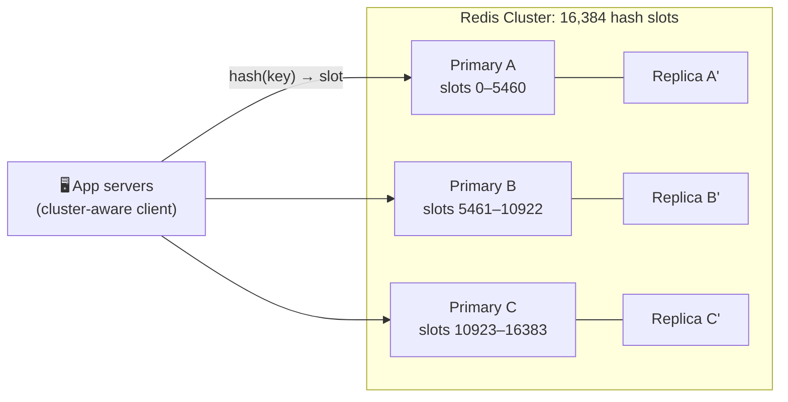

# 033 · Redis, Memcached & Distributed Caches

> ⏱ 9 min · 📈 33% · 🅰️ Part A (core) · Phase 04: Caching
>
> `██████░░░░░░░░░░░░░░` 33% of the whole guide

---

## 📖 Story

Pantry's cache now held 300 GB, far too much for one machine. When that machine rebooted last week, the database nearly collapsed under the flood of misses. Maya needed a cache that spreads across many machines, survives failures, and can do more than store simple strings. I'll show you the two tools I'd reach for.

## 🎯 One-sentence idea

**A distributed cache spreads cached data across many machines so it can grow beyond one server's RAM and survive failures. Redis (rich data structures, persistence, replication) and Memcached (simple, multi-threaded key-value) are the two classic choices.**

## 🧸 Analogy

A **chain of lockers** at a train station:

- One locker bank fills up quickly, so you install **many banks** (nodes).
- A **rule** tells everyone which bank holds which locker number (hashing / consistent hashing).
- Important lockers have a **duplicate key in a second bank** (replicas), so a broken bank doesn't lose them.
- **Memcached lockers** only hold boxes. **Redis lockers** can hold boxes, lists, sorted leaderboards, counters, and even keep a logbook so they can be restored after a power cut.

## 🖼️ Visual



## 🔬 How it works

- **Partitioning (sharding):** each key maps to one node. **Redis Cluster**: `CRC16(key) mod 16384` → a hash slot → a node. **Memcached**: the client uses **consistent hashing** (lesson 051).
- **Replication:** each primary has replicas. On failure, a replica is **promoted** (Redis Sentinel / Cluster failover). Replication is **asynchronous**, so the last few writes can be lost on failover.
- **Redis highlights:**
  - **Data structures:** strings, hashes, lists, sets, **sorted sets** (leaderboards), streams, bitmaps, HyperLogLog, geo indexes.
  - **Atomic ops:** `INCR`, `SETNX`, Lua scripts, transactions (`MULTI`).
  - **Persistence:** **RDB** (periodic snapshots) and/or **AOF** (an append-only log of writes). This lets Redis act as a durable-ish **data store**, not just a cache.
  - **Pub/sub and streams** for messaging.
  - Mostly **single-threaded** command execution (with I/O threads), so there are no locks, and it's very fast (100k+ ops/s per core). But **one slow command (`KEYS *`) blocks everything**.
- **Memcached highlights:** a pure key-value store with **multi-threading** (it scales across cores), a simple slab memory allocator, no persistence, and no replication built in. Great for plain, huge, volatile caches.
- **Hash tags** in Redis Cluster: `{user42}:cart` and `{user42}:profile` land in the **same slot**, so multi-key ops on them work.
- **Client patterns:** connection pooling, pipelining (batch many commands per round trip), and timeouts + circuit breakers (the cache must never take down the app).

## 🧩 Worked example

**Sorted set leaderboard (Redis's superpower):**

```bash
ZADD game:leaderboard 3200 "alice" 2950 "bob" 4100 "carol"
ZREVRANGE game:leaderboard 0 2 WITHSCORES    # top 3 → carol 4100, alice 3200, bob 2950
ZINCRBY game:leaderboard 500 "bob"           # bob scores 500 more
ZREVRANK game:leaderboard "bob"              # bob's rank (0-based)
```

**Sizing a cluster:**

```
Hot data: 300 GB, target ≤ 70% memory use per node
Node RAM: 64 GB → usable ~45 GB → 300 / 45 ≈ 7 primaries → round to 8
+ 1 replica each → 16 nodes
Throughput: 8 primaries × ~100k+ ops/s ≈ 800k+ ops/s
```

**Pipelining (cutting round trips):**

```python
pipe = redis.pipeline()
for pid in product_ids:           # 100 lookups
    pipe.get(f"product:{pid}")
results = pipe.execute()          # 1 network round trip instead of 100
```

## ⚖️ Trade-offs

| | Redis | Memcached |
|---|---|---|
| Data model | Rich structures | Strings (blobs) only |
| Threads | Mostly single-threaded execution | Multi-threaded |
| Persistence | RDB/AOF | ❌ None |
| Replication / failover | ✅ Built in | ❌ (client-side or external) |
| Clustering | Redis Cluster (hash slots) | Client-side consistent hashing |
| Extras | Pub/sub, streams, Lua, geo, HLL | — |
| Best for | Most use cases, leaderboards, rate limiting, sessions, queues | Huge, simple, volatile object caches |

## 🌍 Real world

- **Redis** powers caching, sessions, rate limiting, and leaderboards at GitHub, Twitter/X, Snapchat, and Stack Overflow, among many others.
- **Facebook** runs Memcached at enormous scale (with its own routing layer, `mcrouter`).
- **Managed options:** AWS ElastiCache/MemoryDB, GCP Memorystore, Azure Cache for Redis, and Redis Cloud. **Valkey** is the open-source Redis fork.

## 📌 Cheat card

> - **Redis = Swiss-army cache** (structures, persistence, replication). **Memcached = simple, fast, multi-threaded KV.**
> - Redis Cluster: **16,384 hash slots**, and a **primary + replica** per shard.
> - **Async replication → possible loss of recent writes on failover.**
> - **Never run `KEYS *` in production.** Use `SCAN`.
> - Use **pipelining**, **pooling**, **timeouts**, and a **circuit breaker** around the cache.
> - Redis sorted sets = **leaderboards**. `INCR` = **counters/rate limits**. `SETNX` = **simple locks**.

## 🧪 Feynman check

Explain the locker-bank analogy, including what happens when one bank breaks and why a "duplicate key" in another bank helps.

⚠️ **Common confusion:** "Redis is persistent, so it's my database." It *can* be (with AOF `fsync` and careful setup), but async replication and memory limits make it riskier than a real database for critical data. Treat it as a cache unless you've designed deliberately for durability.

## ⚡ Quick recall

1. How does Redis Cluster decide which node holds a key?
<details><summary>Answer</summary>

`CRC16(key) mod 16384` gives a hash slot, and each node owns a range of slots.
</details>

2. Why can a Redis failover lose data?
<details><summary>Answer</summary>

Replication is asynchronous, so writes acknowledged by the old primary may not have reached the replica that gets promoted.
</details>

3. Name one thing Redis can do that Memcached can't.
<details><summary>Answer</summary>

Any of: data structures (sorted sets, lists, hashes), persistence, built-in replication/failover, pub/sub, Lua scripting.
</details>

## 🎤 Interview practice

**Q1. "Design a real-time leaderboard for a game with 50M players."**
<details><summary>Model answer</summary>

- A **Redis sorted set**: `ZADD` on score updates, `ZREVRANGE` for the top N, `ZREVRANK` for a player's rank. All are O(log N).
- 50M members × ~100 bytes ≈ 5 GB → fits on a single primary (+ replica). Shard by region/season if needed. A global top-N can merge per-shard top-Ns.
- Persist scores in a durable DB (source of truth). Redis is rebuilt from it if lost.
- For "rank among friends": fetch the friends' scores with `ZMSCORE` and sort, or keep per-user friend leaderboards.
- **Likely follow-up:** "Updates are 500k/s?" → batch or pipeline updates, shard by game mode, and accept that an approximate rank for players outside the top N is fine.
</details>

**Q2. "Our Redis latency spikes to 200 ms every few minutes. What could it be?"**
<details><summary>Model answer</summary>

- **Slow commands** blocking the single thread: `KEYS *`, big `SMEMBERS`/`HGETALL`, huge `DEL` of big keys (use `UNLINK`), long Lua scripts. Check `SLOWLOG`.
- **Persistence:** RDB `fork` on a large dataset, or AOF `fsync` on slow disks.
- **Memory pressure:** swapping or eviction storms. **Network saturation** from big values.
- **Hot keys** overloading one shard.
- Fixes: ban dangerous commands, split big keys, tune persistence (or offload it to replicas), shard hot keys, and monitor latency (`LATENCY DOCTOR`).
- **Likely follow-up:** "How do you delete a 10M-member set safely?" → `UNLINK` (async delete) or delete incrementally with `SSCAN` + `SREM`.
</details>

> 📖 *Chapter 5 is next. Pantry's data has outgrown its very first database design.*

---

⬅️ [032 · Stampede, Hot Keys & Penetration](032-cache-stampede-and-hot-keys.md) · 🗺️ [Phase map](README.md) · ➡️ [034 · SQL vs NoSQL](../05-databases/034-sql-vs-nosql.md)

✅ **Safe stopping point.** Tick lesson 033 in [PROGRESS.md](../../PROGRESS.md). 🎉 **Phase 04 complete!** Review the [cheatsheet](CHEATSHEET.md) and [interview bank](INTERVIEW-QUESTIONS.md).
