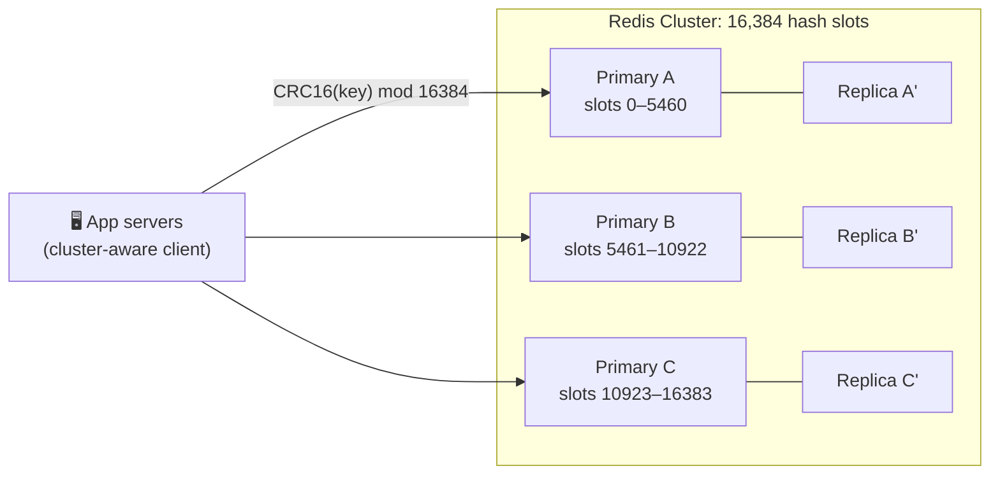

# 033 · Redis, Memcached & Distributed Caches

> ⏱ 9 min · 📈 33% · 🅰️ Part A (core) · Phase 04: Caching
>
> `██████░░░░░░░░░░░░░░` 33% of the whole guide

---

## 📖 Story

Pantry's hot data has grown to **300 GB**. Maya's single Redis box has 64.

Last Thursday that box rebooted for a kernel patch. For eleven minutes the cache was **empty**, and every one of 40,000 requests per second fell straight through to Postgres, like the floor of a warehouse giving way under its shelves. The database's CPU hit 100% in eight seconds. Checkout timed out. The on-call phone screamed.

One machine can't hold it all, and one machine can't be allowed to take Pantry down when it blinks.

Maya needs a cache that **spreads across many machines**, **survives a node dying**, and can do more than store plain strings: leaderboards, counters, rate limits.

I'll show you the two tools I'd reach for.

## 🎯 One-sentence idea

**A distributed cache spreads data across many machines so it can grow beyond one server's RAM and survive failures, and Redis (rich data structures, persistence, replication) and Memcached (simple, multi-threaded key-value) are the two classic choices.**

## 🧸 Analogy

A **chain of locker banks** at a train station:

- One bank fills up, so you install **many banks** (nodes).
- A **rule** says which bank holds which locker number (hashing).
- Important lockers have a **duplicate in a second bank** (replicas).
- **Memcached lockers** only hold boxes. **Redis lockers** hold boxes, lists, sorted leaderboards, and counters, and keep a **logbook** so they can be restored after a power cut.

## 🖼️ Visual

*Diagram brief:* app servers with a cluster-aware client hash each key to a slot. Three primaries each own a third of the 16,384 slots, each with a shadow replica ready to take over.



## 🔬 How it works

- **Partitioning:** Redis Cluster maps `CRC16(key) mod 16384` → a **hash slot** → a node, and resharding moves slots live. Memcached relies on **client-side consistent hashing** (lesson 051). **Hash tags** (`{user42}:cart`, `{user42}:profile`) force related keys into one slot, so multi-key ops work.
- **Replication + failover:** each primary has replicas, and on failure a replica is **promoted** (Cluster or Sentinel, in seconds). Replication is **asynchronous**, so acknowledged writes **can be lost** in a failover.
- **Redis is a Swiss-army knife:** strings, hashes, lists, sets, **sorted sets** (O(log N) leaderboards), streams, bitmaps, HyperLogLog, geo. Atomic `INCR`/`SETNX`/Lua, plus **RDB snapshots** and an **AOF** log for persistence. Command execution is mostly single-threaded (100k+ ops/s per core), so **one slow command (`KEYS *`) freezes the whole shard**.
- **Memcached is a scalpel:** a pure key-value blob store, **multi-threaded** across cores, a slab allocator, no persistence, no built-in replication. Ideal for huge, simple, volatile object caches.
- **Client discipline:** connection pools, **pipelining** (N commands per round trip), tight timeouts, and a **circuit breaker**. The cache must never take the app down with it.

## 🧩 Worked example

**Sizing Maya's cluster:**

```
Hot data 300 GB; keep ≤ 70% memory per node (fork + fragmentation headroom)
64 GB node → ~45 GB usable → 300 ÷ 45 ≈ 6.7 → 8 primaries
+ 1 replica each → 16 nodes
Throughput ≈ 8 × 100k+ ops/s ≈ 800k+ ops/s
A node dies → its replica is promoted in ~5–15 s; only 1/8 of keys are briefly affected
```

**Sorted-set leaderboard ("top cooks this week"):**

```bash
ZADD cooks:week:40 320 "cook:7" 295 "cook:12" 410 "cook:3"
ZREVRANGE cooks:week:40 0 2 WITHSCORES     # top 3
ZINCRBY  cooks:week:40 5 "cook:12"         # +5 orders
ZREVRANK cooks:week:40 "cook:12"           # her rank
```

**Pipelining:** 100 `GET`s × 0.5 ms RTT = **50 ms**. Pipelined, it's **one round trip, ~1 ms**.

## ⚖️ Trade-offs

| | Redis | Memcached |
|---|---|---|
| Data model | Rich structures | Blobs only |
| Threads | Mostly single-threaded execution | Multi-threaded |
| Persistence | RDB / AOF | ❌ |
| Replication / failover | ✅ Built in | ❌ External / client |
| Clustering | Hash slots | Client consistent hashing |
| Best for | Most cases: leaderboards, limits, sessions, queues | Giant, simple, volatile caches |

## 🌍 Real world

- **Redis** powers caching, sessions, rate limiting, and leaderboards at GitHub, X, Snapchat, and Stack Overflow.
- **Meta** runs Memcached at enormous scale behind its **mcrouter** routing layer.
- **Managed options:** ElastiCache/MemoryDB, Memorystore, Azure Cache. **Valkey** is the open-source Redis fork.

## 📌 Cheat card

> - **Redis = Swiss-army cache. Memcached = simple, fast, multi-threaded KV.**
> - Redis Cluster = **16,384 slots**, **primary + replica per shard**.
> - **Async replication → recent writes can vanish on failover.**
> - **Never `KEYS *`.** Use `SCAN`, and `UNLINK` for big deletes.
> - **Pipeline, pool, time out, circuit-break.**
> - Sorted sets = leaderboards · `INCR` = counters/limits · `SET NX EX` = simple locks.

## 🧪 Feynman check

Explain the locker banks, what happens when one bank breaks, and why a duplicate key in another bank saves the day.

⚠️ **Common confusion:** "Redis persists, so it's my database." It *can* be, with AOF `fsync always`, careful failover, and memory planning, but async replication can drop acknowledged writes and RAM caps the dataset. **Default to "cache"** unless you've deliberately designed for durability.

## ⚡ Quick recall

1. How does Redis Cluster decide which node holds a key?
<details><summary>Reveal Answer</summary>

`CRC16(key) mod 16384` gives a hash slot, and each node owns a range of slots.
</details>

2. Why can a Redis failover lose data?
<details><summary>Reveal Answer</summary>

Replication is asynchronous, so writes acknowledged by the old primary may not have reached the replica that gets promoted.
</details>

3. Name one thing Redis can do that Memcached can't.
<details><summary>Reveal Answer</summary>

Any of: rich data structures, persistence, built-in replication and failover, pub/sub and streams, Lua scripting.
</details>

## 🎤 Interview practice

**Q. "Design a real-time leaderboard for 50M players with 500k score updates per second. Then: Redis p99 spikes to 200 ms every few minutes. Why?"**
<details><summary>Model answer</summary>

- **Leaderboard:**
  - A **Redis sorted set**. `ZINCRBY` on update, `ZREVRANGE 0 99` for the top 100, `ZREVRANK` for a player. All are **O(log N)**.
  - 50M members × ~100 B ≈ **5 GB**, so one primary + replica holds it.
  - **500k updates/s** exceeds one shard's comfortable write rate, so **batch and pipeline** updates. Optionally pre-aggregate per player for 1 s, or **shard by game mode or region** and merge per-shard top-N lists for the global view.
  - **Durability:** scores live in a durable DB or event log (the source of truth). Redis is rebuilt from it on loss.
  - **Friends' ranks:** `ZMSCORE` on the friend list and sort client-side.
- **The 200 ms spikes, usual suspects:**
  - **Blocking commands:** `KEYS *`, a giant `HGETALL`/`SMEMBERS`, a synchronous `DEL` of a huge key, long Lua scripts. Check `SLOWLOG GET`.
  - **Persistence:** an RDB `fork()` of a large heap (copy-on-write stalls), or AOF `fsync` on slow disks. Move persistence to the replicas.
  - **Memory pressure:** swapping or eviction storms.
  - **Hot keys** saturating one shard. **Big values** saturating the NIC.
- **Fixes:** rename or disable dangerous commands, split big keys, `UNLINK` instead of `DEL`, tune or offload persistence, shard or replicate hot keys, and track `LATENCY DOCTOR`.
- **Likely follow-up:** "How do you delete a 10M-member set safely?" → `UNLINK` (async free), or incremental `SSCAN` + `SREM` batches.
</details>

## 📖 Teaser

> 📖 *Chapter 5 is next. The cache is a fortress now, but behind it Pantry's very first database schema is cracking under shapes of data it was never designed to hold.*

---

⬅️ [032 · Stampede, Hot Keys & Penetration](032-cache-stampede-and-hot-keys.md) · 🗺️ [Phase map](README.md) · ➡️ [034 · SQL vs NoSQL](../05-databases/034-sql-vs-nosql.md)

✅ **Safe stopping point.** Tick lesson 033 in [PROGRESS.md](../../PROGRESS.md). 🎉 **Phase 04 complete!** Review the [cheatsheet](CHEATSHEET.md) and [interview bank](INTERVIEW-QUESTIONS.md).
