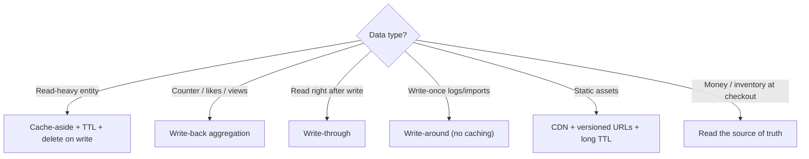

# 📌 Phase 04 Cheatsheet: Caching

## 🧠 Core ideas

| # | Idea in one line |
|---|---|
| 027 | Cache = **fast copy of slow data**. **Hit ratio** is the scorecard. Layers from browser to DB. |
| 028 | **Cache-aside:** get → miss → DB → set (TTL). Write: **update DB → delete key**. |
| 029 | **Through = together · Back = later (risky) · Around = skip.** |
| 030 | **LRU** (recency) · **LFU** (popularity) · **TTL** (freshness). Jitter TTLs. |
| 031 | Invalidation: **TTL + delete-on-write + versioning**. Beware stale-set races and replica lag. |
| 032 | **Stampede → coalesce/serve stale · hot key → L1 + split · penetration → negative cache + Bloom.** |
| 033 | **Redis** (structures, persistence, replicas, 16,384 slots) vs **Memcached** (simple, multi-threaded). |

## 🔢 Numbers

```
In-process cache ~100 ns · Redis GET ~0.5–1 ms · indexed DB read ~1–10 ms
Redis ~100k+ ops/s per core · Memcached scales across cores
Hit ratio 90% → DB sees 10% · 99% → DB sees 1%
Cache size ≈ hot set (~20% of data) × 1.5–2 overhead
```

## 🧮 Formula

```
avg latency = hit% × cache_latency + miss% × (cache_latency + db_latency)
DB load     = total reads × (1 − hit ratio)
```

## 🪄 Tricks

- **Delete, don't set, on writes.**
- **Always set a TTL**, even with explicit invalidation.
- **Versioned URLs** for static assets, so you never purge.
- **Write-back** for counters and likes (with loss accepted). **Never** for money.
- **A cache failure = slower, not down.** Timeouts + circuit breaker around the cache.
- **`SCAN`, not `KEYS *`.** **`UNLINK`**, not `DEL`, for big keys.

## 🗺️ Cache pattern chooser



## ⚠️ Top mistakes

- No TTL anywhere, so bugs leave stale data forever.
- Caching per-user data in a shared cache under a non-user key.
- Letting a cache outage cascade into a DB outage.
- Ignoring hot keys ("we'll just add nodes").
- Using Redis as the only store for critical data without durability planning.

---

🗺️ [Phase map](README.md) · 🎤 [Interview questions](INTERVIEW-QUESTIONS.md)
