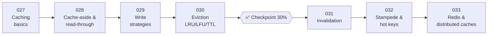

# ⚡ Phase 04: Caching

> **Lessons 027–033 · 27% → 33% · 🅰️ Part A (core)**
> By the end of this phase you'll make systems **10–100× faster** with caches, without serving stale nonsense or melting your database when the cache hiccups.

## 📖 Chapter 4: The Menu Page That Melted

The same popular pages are requested millions of times a day, and the database is drowning in repeated work. In this chapter, Maya discovers caching, the art of keeping copies close, and learns the hard way that copies can go stale, overflow, stampede, and need a cluster of their own.

## 🗺️ Phase map

| # | Lesson | ⏱ | One-line idea |
|---|---|---|---|
| 027 | [Caching basics & where caches live](027-caching-basics.md) | 8 min | Keep a copy of hot data somewhere faster and closer |
| 028 | [Cache-aside & read-through](028-cache-aside-and-read-through.md) | 8 min | Check the cache, and on a miss load from the DB and fill the cache |
| 029 | [Write-through, write-back, write-around](029-cache-write-strategies.md) | 9 min | Three ways to handle writes: together, later, or skip |
| 030 | [Eviction: LRU, LFU, TTL](030-cache-eviction.md) | 8 min | When the cache is full, who gets kicked out? |
| ✅ | [Checkpoint 30%](checkpoint-30.md) | 15 min | 🎉 Level-up! |
| 031 | [Cache invalidation](031-cache-invalidation.md) | 9 min | One of the "two hard things": keeping copies honest |
| 032 | [Stampede, hot keys & penetration](032-cache-stampede-and-hot-keys.md) | 10 min | The ways caches fail under pressure, and the fixes |
| 033 | [Redis, Memcached & distributed caches](033-distributed-caches.md) | 9 min | Real tools, clustering, and persistence |

📌 [Phase cheatsheet](CHEATSHEET.md) · 🎤 [Phase interview questions](INTERVIEW-QUESTIONS.md)

⬅️ Previous phase: [03 Scaling basics](../03-scaling-basics/README.md) · ➡️ Next phase: [05 Databases](../05-databases/README.md)
