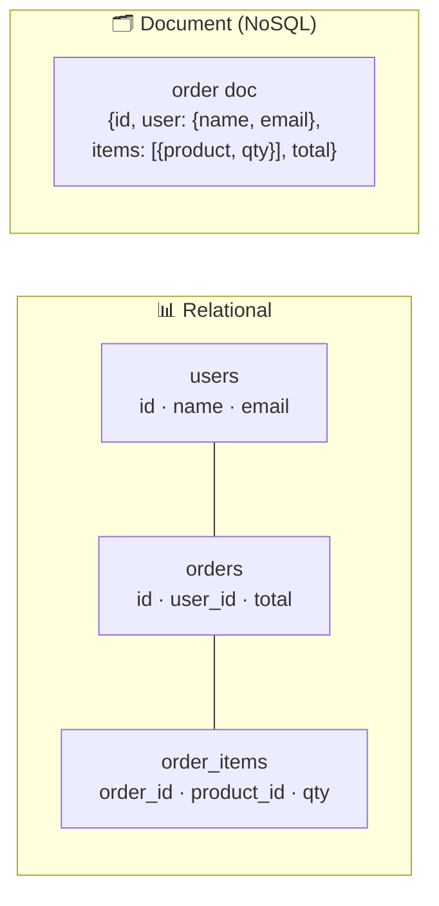

# 034 · SQL vs NoSQL

> ⏱ 9 min · 📈 34% · 🅰️ Part A (core) · Phase 05: Databases
>
> `██████░░░░░░░░░░░░░░` 34% of the whole guide

---

## 🎯 One-sentence idea

**SQL (relational) databases store data in tables with fixed schemas, joins, and strong transactions. NoSQL databases trade some of that for flexible data shapes and easier horizontal scaling. Pick based on your data's relationships, consistency needs, and access patterns.**

## 🧸 Analogy

- 📊 **SQL = a spreadsheet workbook with strict rules.** Every sheet has fixed columns, and sheets reference each other by IDs ("customer #7"). You can ask **any question** by combining sheets (joins). The rules keep everything tidy.
- 🗂️ **NoSQL = a filing cabinet of folders.** Each folder (document) holds **everything about one thing**, in whatever shape it needs. Grabbing one folder is super fast. But asking "which folders mention X?" across the cabinet is harder unless you planned for it.

## 🖼️ Visual



## 🔬 How it works

- **Relational (SQL):** PostgreSQL, MySQL, SQL Server, Oracle.
  - **Schema** defined up front (columns, types, constraints).
  - **Joins** combine tables at query time, so you can ask ad-hoc questions.
  - **ACID transactions** (lesson 035) and **constraints** (foreign keys, unique) protect integrity.
  - Scales **reads** with replicas easily. Scaling **writes** horizontally needs sharding (harder).
- **NoSQL ("not only SQL")**: a family of types (lesson 038):
  - **Key-value** (Redis, DynamoDB), **document** (MongoDB), **wide-column** (Cassandra), **graph** (Neo4j).
  - **Flexible schema** (schema-on-read). Records can differ.
  - Often built for **horizontal scale** from day one (auto-sharding, replication).
  - Often **BASE**: Basically Available, Soft state, Eventually consistent. Many now also offer transactions.
  - **You model around queries**, and denormalize so each query hits one partition.
- **The real question is not "SQL or NoSQL?" but:**
  1. Are relationships and ad-hoc queries central? → SQL.
  2. Do we need multi-row transactions and strict integrity? → SQL (or NewSQL).
  3. Is the access pattern simple (by key) at a massive scale? → NoSQL.
  4. Is the data shape highly variable? → document.
- **NewSQL** (Spanner, CockroachDB, YugabyteDB): SQL + ACID + horizontal scaling, at the cost of latency and complexity.

## 🧩 Worked example

**Same question, two models: "Show order #9 with the user's name and items."**

SQL (normalized, one join query):

```sql
SELECT o.id, u.name, p.title, oi.qty
FROM orders o
JOIN users u        ON u.id = o.user_id
JOIN order_items oi ON oi.order_id = o.id
JOIN products p     ON p.id = oi.product_id
WHERE o.id = 9;
```

Document (denormalized, a single read):

```javascript
db.orders.findOne({ _id: 9 })
// → { _id: 9, user: { id: 7, name: "Ada" },
//     items: [{ product_id: 3, title: "Mug", qty: 2 }], total: 24 }
```

**But:** if Ada changes her name, the document model must update **every order** where her name is copied (or accept old names on old orders, which is sometimes correct: invoices *should* keep historical data!).

**Decision examples:**

| System | Choice | Why |
|---|---|---|
| Banking ledger | SQL | Transactions, integrity, audits |
| User sessions | Key-value (Redis/DynamoDB) | Lookup by ID, TTL, massive scale |
| Product catalog with varied attributes | Document (or Postgres JSONB!) | Flexible shape |
| Chat messages, billions/day | Wide-column (Cassandra) | Write-heavy, query by conversation+time |
| Social graph "friends of friends" | Graph | Deep relationship traversal |

## ⚖️ Trade-offs

| | SQL | NoSQL (typical) |
|---|---|---|
| Schema | Fixed, enforced | Flexible |
| Queries | Ad-hoc, joins | Designed per access pattern |
| Transactions | Strong, multi-row | Often limited to one item or partition |
| Consistency | Strong by default | Often tunable or eventual |
| Horizontal write scaling | Harder (sharding) | Built in |
| Maturity/tooling | Decades | Varies |

## 🌍 Real world

- **Most companies run Postgres/MySQL as their core database**, including very large ones (Shopify, GitHub, Instagram's early years).
- **Discord** stores trillions of messages in ScyllaDB (a Cassandra-compatible wide-column database).
- **Amazon DynamoDB** powers huge key-value workloads (like shopping carts) behind Amazon's retail site.
- **Postgres JSONB** blurs the lines: relational + document in one database.

## 📌 Cheat card

> - **Default to SQL.** Choose NoSQL for a **specific reason** (scale, shape, access pattern).
> - SQL = **schema + joins + ACID**. NoSQL = **flexible + horizontal + model-by-query**.
> - **NoSQL modelling starts with the queries**, not the entities.
> - **Polyglot persistence** (several DBs, each for its job) is normal.
> - Want both? **NewSQL** (Spanner, CockroachDB) or **Postgres + JSONB**.
> - Chooser: [DATABASE-CHOOSER.md](../../cheatsheets/DATABASE-CHOOSER.md)

## 🧪 Feynman check

Explain the spreadsheet-vs-filing-cabinet analogy, and why the filing cabinet makes "get everything about order 9" fast but "change Ada's name everywhere" slow.

⚠️ **Common confusion:** "NoSQL is faster." A well-indexed SQL query by primary key is very fast too. NoSQL's advantage is **predictable performance at massive scale** for **known access patterns**, not raw speed per query.

## ⚡ Quick recall

1. Name two strengths of relational databases.
<details><summary>Answer</summary>

ACID transactions, joins/ad-hoc queries, enforced schema and constraints (any two).
</details>

2. What does "model around queries" mean in NoSQL?
<details><summary>Answer</summary>

Design tables/documents so each important query can be answered from one partition or document, even if that means duplicating data.
</details>

3. What is NewSQL?
<details><summary>Answer</summary>

Databases offering SQL and ACID transactions with automatic horizontal scaling (e.g., Spanner, CockroachDB).
</details>

## 🎤 Interview practice

**Q1. "Which database would you use for a Twitter-like app, and why?"**
<details><summary>Model answer</summary>

- **Users, follows, auth:** relational (Postgres/MySQL), sharded by user_id at scale. Integrity matters.
- **Tweets:** a wide-column or sharded SQL store, keyed by tweet ID (Snowflake, time-sortable).
- **Timelines/feeds:** precomputed lists in **Redis** (cache) or a wide-column store.
- **Media:** object storage + CDN. **Search:** Elasticsearch. **Analytics:** a data warehouse.
- Justify each with its access pattern, and note that polyglot means more ops work.
- **Likely follow-up:** "Why not put everything in Cassandra?" → follows and auth need uniqueness and transactional integrity. Ad-hoc queries are hard in Cassandra.
</details>

**Q2. "A teammate wants to switch from Postgres to MongoDB 'to scale.' How do you respond?"**
<details><summary>Model answer</summary>

- Ask **what's actually failing**: CPU? write throughput? storage? schema changes? Often it's missing indexes, N+1 queries, or no caching or replicas.
- Postgres scales far: vertical scaling, read replicas, partitioning, JSONB for flexible fields, Citus for sharding.
- Switch only if the access patterns fit a document model *and* the scale need is real. Migrations are costly and risky.
- **Likely follow-up:** "When *would* you switch?" → a massive write volume with simple key-based access, or a genuinely schema-less, document-centric domain.
</details>

---

⬅️ [033 · Redis & Distributed Caches](../04-caching/033-distributed-caches.md) · 🗺️ [Phase map](README.md) · ➡️ [035 · ACID](035-acid.md)

✅ **Safe stopping point.** Tick lesson 034 in [PROGRESS.md](../../PROGRESS.md).
