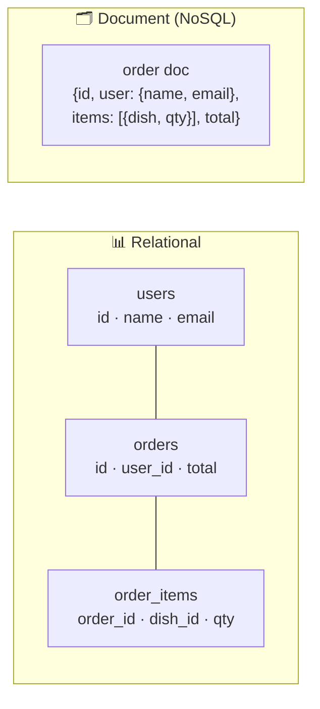

# 034 · SQL vs NoSQL

> ⏱ 9 min · 📈 34% · 🅰️ Part A (core) · Phase 05: Databases
>
> `██████░░░░░░░░░░░░░░` 34% of the whole guide

---

## 📖 Story

Maya opens Pantry's database schema and winces. It has become a **junk drawer**.

Orders sit next to recipes. Reviews are tangled with chat messages. There's a table called `misc_data` with a column called `stuff` holding JSON blobs of every possible shape. A chat table with **900 million rows** shares a single Postgres instance with the payments ledger, and every dinner rush the chat writes slow down checkout.

On a forum, Maya reads the same advice over and over: *"Just switch to NoSQL. It scales!"*

It's tempting. It's also the kind of decision that, made carelessly, haunts a company for five years.

I told her what I'll tell you: before you choose anything, understand what each *kind* of database is actually **good at**.

## 🎯 One-sentence idea

**SQL (relational) databases store data in tables with fixed schemas, joins, and strong transactions, while NoSQL databases trade some of that for flexible shapes and easier horizontal scaling, so you pick based on your data's relationships, consistency needs, and access patterns.**

## 🧸 Analogy

- 📊 **SQL = a spreadsheet workbook with strict rules.** Fixed columns per sheet, and sheets reference each other by ID. You can ask **any question** by combining sheets (joins).
- 🗂️ **NoSQL = a filing cabinet of folders.** Each folder (document) holds **everything about one thing**, in whatever shape it needs. Grabbing one folder is instant, but "which folders mention X?" is hard unless you planned for it.

## 🖼️ Visual

*Diagram brief:* on the left, three connected tables linked by ID lines. On the right, one fat document holding the same order with its user and items nested inside.



## 🔬 How it works

- **Relational (Postgres, MySQL, SQL Server):** a schema enforced up front, **joins** for ad-hoc questions, **ACID transactions** (lesson 035), and constraints (FK, UNIQUE, CHECK). Reads scale out easily with replicas. **Writes scale out only with sharding**, which is hard.
- **NoSQL is a family** (lesson 038): key-value (Redis, DynamoDB), document (MongoDB), wide-column (Cassandra), graph (Neo4j). It's usually **schema-on-read**, **built to shard** from day one, and often **tunably or eventually consistent**, though many now offer transactions.
- **NoSQL is modelled around queries, not entities:** list the access patterns first, then **denormalize** so each hot query hits **one partition**.
- **The real questions:**
  1. Are relationships and ad-hoc queries central? → SQL.
  2. Do you need multi-row invariants? → SQL/NewSQL.
  3. Is it simple by-key access at massive scale? → NoSQL.
  4. Is the shape highly variable? → document, or Postgres **JSONB**.
- **NewSQL** (Spanner, CockroachDB, YugabyteDB) offers SQL + ACID + auto-sharding, paying in cross-region latency and operational complexity.

## 🧩 Worked example

**"Show order #9 with the customer's name and dishes."**

```sql
SELECT o.id, u.name, d.title, oi.qty
FROM orders o
JOIN users u        ON u.id = o.user_id
JOIN order_items oi ON oi.order_id = o.id
JOIN dishes d       ON d.id = oi.dish_id
WHERE o.id = 9;                                   -- 3 joins, ~1–3 ms with indexes
```

```javascript
db.orders.findOne({ _id: 9 })                    // one read, ~1 ms
// { _id: 9, user: { id: 7, name: "Maya" }, items: [{ dish_id: 3, title: "Lasagna", qty: 2 }], total: 24 }
```

The catch: if the user renames herself, the document model must rewrite **every order** that copies her name, unless historical names are *correct* (invoices should freeze history!).

**Maya's split:**

| Pantry data | Choice | Why |
|---|---|---|
| Orders, payments, payouts | Postgres | Transactions, integrity, audits |
| Sessions, carts | Key-value (Redis/DynamoDB) | By-ID lookups, TTL, scale |
| Dish attributes (varied shapes) | Postgres JSONB | Flexible fields without a new database |
| Chat messages, 900M+ rows | Wide-column (Cassandra/Scylla) | Write-heavy, query by conversation + time |

## ⚖️ Trade-offs

| | SQL | NoSQL (typical) |
|---|---|---|
| Schema | Fixed, enforced | Flexible |
| Queries | Ad-hoc, joins | Designed per access pattern |
| Transactions | Strong, multi-row | Often single item or partition |
| Consistency | Strong by default | Tunable or eventual |
| Horizontal writes | Hard (sharding) | Built in |

## 🌍 Real world

- **Postgres and MySQL run the core** of Shopify, GitHub, and early Instagram.
- **Discord** stores trillions of messages in **ScyllaDB** (Cassandra-compatible).
- **Amazon DynamoDB** grew out of the Dynamo work behind Amazon's shopping cart.

## 📌 Cheat card

> - **Default to SQL.** Choose NoSQL for a **specific reason** (scale, shape, access pattern).
> - SQL = **schema + joins + ACID**. NoSQL = **flexible + horizontal + model-by-query**.
> - **Polyglot persistence** is normal.
> - Want both? **NewSQL** or **Postgres + JSONB**.
> - Chooser: [DATABASE-CHOOSER.md](../../cheatsheets/DATABASE-CHOOSER.md)

## 🧪 Feynman check

Explain the spreadsheet vs the filing cabinet, and why the cabinet makes "get everything about order 9" fast but "rename a customer everywhere" slow.

⚠️ **Common confusion:** "NoSQL is faster." A primary-key lookup in Postgres is ~1 ms too. NoSQL's real edge is **predictable performance at massive scale** for **known access patterns**, not raw per-query speed.

## ⚡ Quick recall

1. Name two strengths of relational databases.
<details><summary>Reveal Answer</summary>

Any two of: ACID transactions, joins/ad-hoc queries, enforced schemas and constraints.
</details>

2. What does "model around queries" mean in NoSQL?
<details><summary>Reveal Answer</summary>

Design tables or documents so each important query is answered from one partition or document, even if that means duplicating data.
</details>

3. What is NewSQL?
<details><summary>Reveal Answer</summary>

Databases offering SQL and ACID transactions with automatic horizontal scaling (e.g. Spanner, CockroachDB).
</details>

## 🎤 Interview practice

**Q. "A teammate wants to migrate from Postgres to MongoDB 'to scale.' How do you respond, and which databases would you use for a Twitter-like app?"**
<details><summary>Model answer</summary>

- **Diagnose before migrating:**
  - What exactly is failing: CPU, write throughput, storage, or the pain of schema changes?
  - Usually it's **missing indexes, N+1 queries, no cache, or no replicas**. Check `pg_stat_statements` first.
- **Postgres goes far:** vertical scaling, **read replicas**, native **partitioning**, **JSONB + GIN indexes** for flexible fields, and **Citus** for sharding.
- **Migrations are expensive and risky:** dual writes, backfills, and new failure modes. Switch only when the **access pattern fits** a document model **and** the scale need is real (massive by-key writes, a truly document-centric domain).
- **A Twitter-like app (polyglot):**
  - **Users, follows, auth** → relational, sharded by `user_id`. Uniqueness and integrity matter.
  - **Tweets** → a sharded store keyed by a time-sortable **Snowflake ID** (lesson 072).
  - **Home timelines** → precomputed lists in **Redis** or a wide-column store.
  - **Media** → object storage + CDN. **Search** → Elasticsearch. **Analytics** → a warehouse.
- **Name the cost:** every extra database is more ops, more on-call, and more consistency plumbing (CDC/outbox).
- **Likely follow-up:** "Why not everything in Cassandra?" → no joins and no multi-row transactions, and enforcing uniqueness (usernames) or ad-hoc admin queries becomes painful.
</details>

## 📖 Teaser

> 📖 *Postgres stays, but mid-checkout the server crashes, and a customer is charged for a lasagna that the database never heard about.*

---

⬅️ [033 · Redis & Distributed Caches](../04-caching/033-distributed-caches.md) · 🗺️ [Phase map](README.md) · ➡️ [035 · ACID](035-acid.md)

✅ **Safe stopping point.** Tick lesson 034 in [PROGRESS.md](../../PROGRESS.md).
