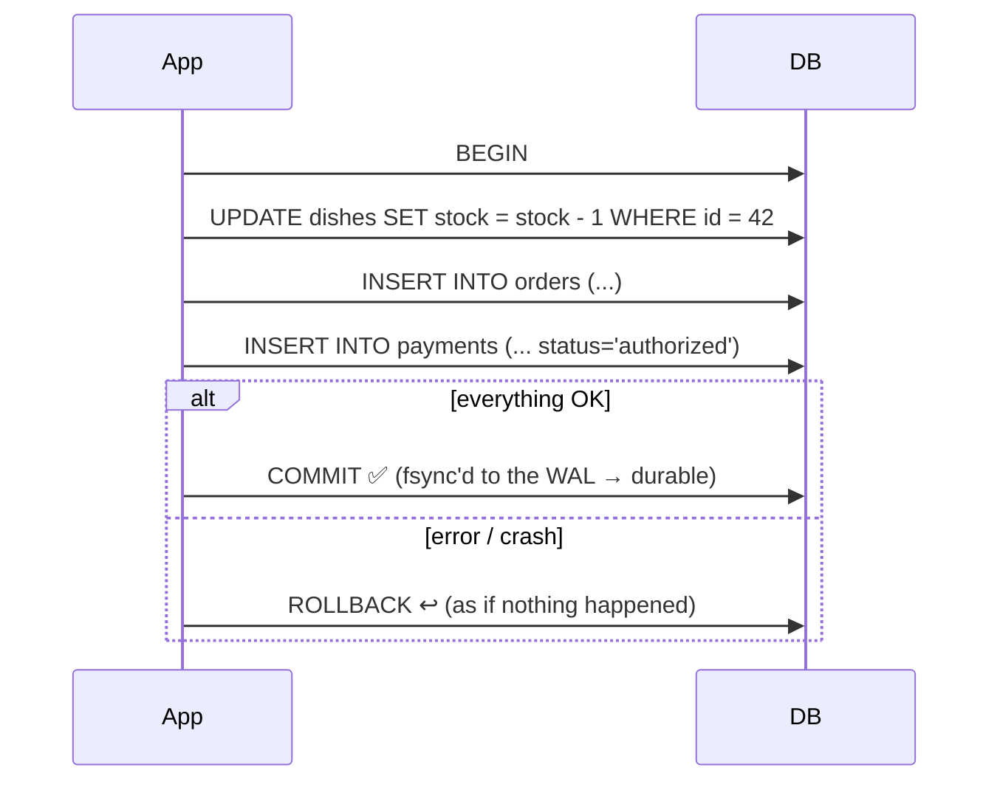

# 035 · ACID Transactions

> ⏱ 8 min · 📈 35% · 🅰️ Part A (core) · Phase 05: Databases
>
> `███████░░░░░░░░░░░░░` 35% of the whole guide

---

## 📖 Story

7:41 p.m. The checkout code runs its steps, one after another:

```
1. charge card ✅
2. reduce dish stock ✅
3. 💥 — the server's process is OOM-killed
4. insert order …   (never runs)
```

The customer's bank shows **£24 gone**. Pantry's database shows **no order**. The cook never hears about it. No lasagna is ever cooked.

At 9 p.m. Maya's inbox lights up with the angriest email she has ever received, and the customer is completely right. The money vanished into a crack between two lines of code.

I've been on the receiving end of that email, and I never want you to be.

Some groups of steps must happen **all together, or not at all**. Databases have had a weapon against exactly this for fifty years.

## 🎯 One-sentence idea

**A transaction groups operations into one unit that is Atomic (all or nothing), Consistent (the rules always hold), Isolated (concurrent transactions don't see each other's half-done work), and Durable (once committed, it survives crashes).**

## 🧸 Analogy

**Moving £100 from one account to another:**

- ⚛️ **Atomic:** both "−100" and "+100" happen, or neither does.
- ✅ **Consistent:** "balance ≥ 0" and "money is conserved" never break.
- 🚪 **Isolated:** nobody sees the money gone from one account but not yet in the other.
- 💾 **Durable:** once the teller says "done", a power cut can't undo it.

## 🖼️ Visual

*Diagram brief:* a BEGIN door, a corridor of steps, then a fork. One branch is COMMIT (sealed in the log, survives crashes), the other is ROLLBACK (everything rewinds as if it never happened).



## 🔬 How it works

- **Atomicity + durability come from the write-ahead log (WAL):** every change is appended to a log and **`fsync`ed before COMMIT returns**. After a crash, the DB **replays** committed work and **discards** uncommitted work.
- **Consistency** is the database enforcing **constraints** (PK, FK, UNIQUE, CHECK) plus the business rules you put *inside* the transaction. This "C" is **not** CAP's C.
- **Isolation** comes from **locks** and/or **MVCC** (lesson 082), with several **levels** trading safety for throughput (lesson 036).
- **Keep transactions short:** they hold locks and MVCC snapshots. **Never call an external API (like a card charge) while holding a transaction open.** Use a state machine instead.
- **Across services, ACID stops at the database boundary:** for the card processor plus your DB, use **idempotent states + sagas/outbox** (lessons 055, 062, 088). **BASE** (Basically Available, Soft state, Eventually consistent) is the looser model many NoSQL systems use.

## 🧩 Worked example

**Maya's fixed checkout:** one local transaction, and the external charge outside it.

```sql
BEGIN;
  UPDATE dishes SET stock = stock - 1 WHERE id = 42 AND stock > 0;   -- 0 rows → sold out → ROLLBACK
  INSERT INTO orders(id, user_id, dish_id, status) VALUES (:oid, :uid, 42, 'PENDING_PAYMENT');
COMMIT;

-- outside the transaction, with Idempotency-Key = :oid
charge = card.charge(amount=24, idempotency_key=:oid)

UPDATE orders SET status = 'PAID', charge_id = :cid WHERE id = :oid AND status = 'PENDING_PAYMENT';
```

```sql
ALTER TABLE dishes ADD CONSTRAINT stock_non_negative CHECK (stock >= 0);   -- the backstop
```

A crash at any point now leaves a **recoverable state**: an order stuck in `PENDING_PAYMENT` is retried with the **same idempotency key** (no double charge) or cancelled, and its stock is released. The money can no longer fall into a crack.

## ⚖️ Trade-offs

| Maya's choice | What she gains | What she pays |
|---|---|---|
| ACID transactions | Correctness under crashes and concurrency | Locking and coordination overhead |
| `fsync` on every commit | Zero committed-data loss | ~0.1–2 ms per commit (group commit helps) |
| Async commit (`synchronous_commit=off`) | Faster writes | May lose the last few ms of commits |
| BASE / eventual | Scale and availability | Temporary inconsistency to design around |

## 🌍 Real world

- **Every relational DB** is ACID. **MongoDB** has had multi-document transactions since 4.0. **DynamoDB** offers `TransactWriteItems`.
- **Postgres `synchronous_commit = off`** is a deliberate knob trading a tiny durability window for throughput.
- **Stripe** pairs DB transactions with **idempotency keys** so that retries across the network boundary are safe.

## 📌 Cheat card

> - **A**tomic all-or-nothing · **C**onsistent rules hold · **I**solated no peeking · **D**urable survives crashes.
> - **WAL** → atomicity + durability. **Constraints** → consistency. **Locks/MVCC** → isolation.
> - **Short transactions. No network calls inside them.**
> - Lock rows in a **consistent order** to avoid deadlocks.
> - **ACID's C ≠ CAP's C.**

## 🧪 Feynman check

Explain each ACID letter with the bank transfer, and say exactly what breaks without each one.

⚠️ **Common confusion:** "ACID means my app is correct." ACID gives you tools. You still have to put the right statements **in the same transaction**, choose an adequate **isolation level** (lesson 036), and handle what lives **outside** the database (card processors, emails) with idempotency and state machines.

## ⚡ Quick recall

1. What mechanism usually provides atomicity and durability?
<details><summary>Reveal Answer</summary>

The write-ahead log: changes are logged durably before COMMIT returns, then replayed or discarded after a crash.
</details>

2. What's the difference between ACID's "C" and CAP's "C"?
<details><summary>Reveal Answer</summary>

ACID C means database invariants and constraints hold. CAP C means every read sees the most recent write (linearizability).
</details>

3. Why keep transactions short?
<details><summary>Reveal Answer</summary>

Long transactions hold locks (blocking others), raise deadlock and contention risk, and bloat MVCC version history.
</details>

## 🎤 Interview practice

**Q. "1,000 users click 'buy' on the last item in the same second. Prevent overselling, and tell me whether you could build a wallet on an eventually consistent NoSQL store."**
<details><summary>Model answer</summary>

- **Atomic conditional update:** `UPDATE inventory SET qty = qty - 1 WHERE sku = ? AND qty > 0;` and require **rows affected = 1**. One statement, one row lock, no race.
- **Alternatives:** `SELECT … FOR UPDATE` (pessimistic) or a `version` column with compare-and-set (optimistic). Add a **`CHECK (qty >= 0)`** constraint as the final backstop.
- **Extreme contention (flash sale):**
  - A Redis `DECR` gate in front, or a **queue** that serializes purchase attempts.
  - Reconcile with the DB.
  - Hold the reservation with an **expiry** while payment completes, and release it on failure (a saga compensation, lesson 098).
- **A wallet on eventual consistency:** not with plain eventual reads and blind writes, which give **double spends and lost updates**.
  - Use the store's **strongly consistent reads + conditional writes** (version CAS) or its **transactions** (DynamoDB `TransactWriteItems`, MongoDB multi-doc).
  - Or keep the ledger in a relational/NewSQL DB.
  - Model it as an **append-only ledger** (entries, never overwritten balances), with **idempotency keys** on every movement, and derive balances.
- **Likely follow-up:** "Why an append-only ledger?" → auditability, easy reconciliation, and no lost updates from concurrent overwrites (lesson 096).
</details>

## 📖 Teaser

> 📖 *Each transaction is safe on its own, but two customers grab the very last portion of a cook's lasagna at the same instant, and somehow both of them get it.*

---

⬅️ [034 · SQL vs NoSQL](034-sql-vs-nosql.md) · 🗺️ [Phase map](README.md) · ➡️ [✅ Checkpoint 35%](checkpoint-35.md)

✅ **Safe stopping point.** Tick lesson 035 in [PROGRESS.md](../../PROGRESS.md), then do the checkpoint!
