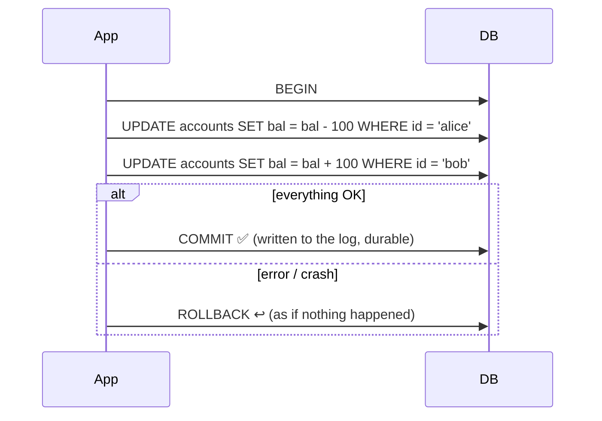

# 035 · ACID Transactions

> ⏱ 8 min · 📈 35% · 🅰️ Part A (core) · Phase 05: Databases
>
> `███████░░░░░░░░░░░░░` 35% of the whole guide

---

## 🎯 One-sentence idea

**A transaction groups several operations into one unit that is Atomic (all or nothing), Consistent (the rules always hold), Isolated (concurrent transactions don't see each other's half-done work), and Durable (once committed, it survives crashes).**

## 🧸 Analogy

**Moving $100 from Alice to Bob** at a bank:

- ⚛️ **Atomic:** either *both* "Alice −100" and "Bob +100" happen, or *neither* does. Money never vanishes halfway.
- ✅ **Consistent:** rules like "balance can't go negative" and "total money stays the same" are never broken.
- 🚪 **Isolated:** while the transfer is happening, nobody else sees Alice's money gone but not yet at Bob's.
- 💾 **Durable:** once the teller says "done," a power cut one second later doesn't undo it.

## 🖼️ Visual



## 🔬 How it works

- **Atomicity:** implemented with a **write-ahead log (WAL)** or undo log. If a failure happens mid-transaction, incomplete changes are rolled back on recovery.
- **Consistency:** the database enforces **constraints** (primary keys, foreign keys, `CHECK`, `UNIQUE`), and your app enforces business rules inside transactions. (Note: this "C" is different from the "C" in CAP.)
- **Isolation:** concurrency control via **locks** and/or **MVCC** (multi-version concurrency control, lesson 082). There are several **isolation levels** trading safety for speed (lesson 036).
- **Durability:** a commit returns only after the change is safely in the **WAL on disk** (`fsync`), often also replicated. After a crash, the DB replays the log.
- **Keep transactions short:** long transactions hold locks, block others, and bloat MVCC history.
- **Distributed transactions** (across databases or services) are much harder: 2PC and sagas (lesson 088).
- **BASE** is the looser alternative many NoSQL systems use: **B**asically **A**vailable, **S**oft state, **E**ventually consistent.

## 🧩 Worked example

**A safe money transfer in SQL:**

```sql
BEGIN;
  -- lock both rows in a consistent order (by id) to avoid deadlocks
  SELECT balance FROM accounts WHERE id IN ('alice','bob') ORDER BY id FOR UPDATE;

  UPDATE accounts SET balance = balance - 100 WHERE id = 'alice' AND balance >= 100;
  -- if 0 rows were updated → insufficient funds → ROLLBACK

  UPDATE accounts SET balance = balance + 100 WHERE id = 'bob';
  INSERT INTO transfers(from_id, to_id, amount) VALUES ('alice','bob',100);
COMMIT;
```

Plus a database-level safety rule (Consistency):

```sql
ALTER TABLE accounts ADD CONSTRAINT non_negative CHECK (balance >= 0);
```

**What goes wrong without a transaction:**

```
UPDATE alice −100   ✅
💥 server crashes
UPDATE bob +100     ❌ never runs
→ $100 has vanished
```

## ⚖️ Trade-offs

| You gain | You pay | Use it when |
|---|---|---|
| Correctness under failures and concurrency | Locking/coordination overhead, lower throughput | Money, inventory, bookings, anything with invariants |
| Strict durability (`fsync` every commit) | Write latency (~ms per commit) | Can't lose committed data |
| Relaxed durability (async commit / batching) | May lose the last few ms of commits on crash | Logs, metrics, high-volume non-critical writes |
| BASE / eventual | Temporary inconsistency | Social feeds, counters, massive scale |

## 🌍 Real world

- **Every relational DB** is ACID. **MongoDB** added multi-document ACID transactions (v4.0+). **DynamoDB** offers `TransactWriteItems`.
- **Postgres `synchronous_commit = off`** trades a small window of durability for speed. It's a deliberate knob.

## 📌 Cheat card

> - **A**tomic = all or nothing · **C**onsistent = rules hold · **I**solated = no peeking · **D**urable = survives crashes.
> - Mnemonic: "**A**ll **C**hanges **I**n **D**atabase" stay safe.
> - Implemented with **WAL (atomicity + durability)**, **constraints (consistency)**, **locks/MVCC (isolation)**.
> - **Keep transactions short.** Lock rows in a **consistent order** to avoid deadlocks.
> - ACID's "C" ≠ CAP's "C".

## 🧪 Feynman check

Explain each ACID letter using the bank-transfer story, and say what would go wrong without each one.

⚠️ **Common confusion:** "ACID means my app is correct." ACID gives you tools. You still must put the right operations **inside** the same transaction and choose an adequate **isolation level** (lesson 036). Many real bugs are "check then act" races across two separate transactions.

## ⚡ Quick recall

1. What mechanism usually provides atomicity and durability?
<details><summary>Answer</summary>

The write-ahead log (WAL): changes are logged durably before being applied, and replayed or rolled back after a crash.
</details>

2. What's the difference between ACID's "C" and CAP's "C"?
<details><summary>Answer</summary>

ACID C = database invariants and constraints hold. CAP C = all nodes return the most recent write (linearizability).
</details>

3. Why keep transactions short?
<details><summary>Answer</summary>

Long transactions hold locks (blocking others), increase deadlock and contention risk, and bloat MVCC version history.
</details>

## 🎤 Interview practice

**Q1. "How do you prevent overselling the last item in stock when 1,000 users click 'buy' at once?"**
<details><summary>Model answer</summary>

- Do an **atomic conditional update** in one statement: `UPDATE inventory SET qty = qty - 1 WHERE sku = ? AND qty > 0;` and check that the affected row count is 1.
- Or `SELECT ... FOR UPDATE` inside a transaction (pessimistic locking), or optimistic locking with a version column.
- Add a `CHECK (qty >= 0)` constraint as a backstop.
- For extreme contention (flash sales): a queue of purchase requests, or a Redis atomic decrement as the gate with DB reconciliation (lesson 098).
- **Likely follow-up:** "What if the payment fails after reserving stock?" → a reservation with expiry, then release (compensation), as in a saga.
</details>

**Q2. "Our NoSQL database is 'eventually consistent.' Can we build a wallet on it?"**
<details><summary>Model answer</summary>

- It's risky with plain eventual consistency: double spends, lost updates.
- Options: use its **strongly consistent** reads + **conditional writes** (compare-and-set on a version) + **transactions** if supported (DynamoDB transactions, MongoDB multi-doc). Or use a relational/NewSQL DB for the ledger.
- Model it as an **append-only ledger** (entries, not balance overwrites) with idempotency keys, and derive balances.
- **Likely follow-up:** "Why an append-only ledger?" → auditability, easier reconciliation, and no lost updates from concurrent overwrites (lesson 096).
</details>

---

⬅️ [034 · SQL vs NoSQL](034-sql-vs-nosql.md) · 🗺️ [Phase map](README.md) · ➡️ [✅ Checkpoint 35%](checkpoint-35.md)

✅ **Safe stopping point.** Tick lesson 035 in [PROGRESS.md](../../PROGRESS.md), then do the checkpoint!
