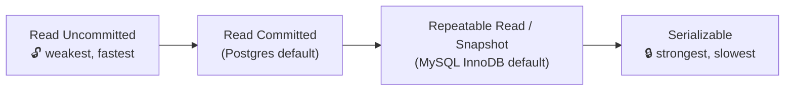

# 036 · Transactions & Isolation Levels

> ⏱ 10 min · 📈 36% · 🅰️ Part A (core) · Phase 05: Databases
>
> `███████░░░░░░░░░░░░░` 36% of the whole guide

---

## 🎯 One-sentence idea

**Isolation levels decide how much concurrent transactions can see of each other. Stronger levels prevent more weird bugs (anomalies) but cost performance, and most databases default to a middle level, not the strongest.**

## 🧸 Analogy

Several people **editing one shared document**:

- 👀 **Read uncommitted:** you see others' typing *live*, including sentences they'll delete in a second (dirty reads).
- 💾 **Read committed:** you only see what others have **saved**. But if you reread a paragraph, it may have changed since your first read.
- 📸 **Repeatable read / snapshot:** you get a **photo of the document** when you start. It stays the same for your whole session, even if others save changes.
- 🔒 **Serializable:** it's **as if everyone took turns**, one at a time. The safest, and the slowest.

## 🖼️ Visual



| Anomaly ↓ / Level → | Read Uncommitted | Read Committed | Repeatable Read / Snapshot | Serializable |
|---|---|---|---|---|
| **Dirty read** | ❌ possible | ✅ prevented | ✅ | ✅ |
| **Non-repeatable read** | ❌ | ❌ possible | ✅ prevented | ✅ |
| **Phantom read** | ❌ | ❌ | ⚠️ depends on DB | ✅ |
| **Lost update** | ❌ | ❌ | ⚠️ depends on DB | ✅ |
| **Write skew** | ❌ | ❌ | ❌ possible | ✅ prevented |

## 🔬 How it works

**The anomalies in plain words:**

- **Dirty read:** reading another transaction's **uncommitted** change (which may be rolled back).
- **Non-repeatable read:** reading the same row twice in one transaction and getting **different values** (someone committed in between).
- **Phantom read:** re-running a query (`WHERE ...`) and getting **new rows** that appeared in between.
- **Lost update:** two transactions read-modify-write the same value, and one overwrites the other's change (both read 10, both write 11, when it should be 12).
- **Write skew:** two transactions read overlapping data, each makes a decision that's valid on its own, and together they break a rule (two doctors both go off-call because each saw the other was on call).

**Tools to fix anomalies without going fully serializable:**

- **Atomic updates:** `UPDATE ... SET x = x + 1` (no read-modify-write in app code).
- **Explicit locks:** `SELECT ... FOR UPDATE` (pessimistic).
- **Optimistic concurrency:** a version column, `UPDATE ... WHERE id=? AND version=?`, retrying if 0 rows change.
- **Constraints:** unique indexes and `CHECK` constraints enforce invariants at the DB level.
- **Serializable isolation** (e.g., Postgres SSI), and be ready to **retry** transactions that abort with serialization failures.

## 🧩 Worked example

**Lost update (at read committed):**

```
T1: SELECT stock FROM items WHERE id=1;   → 10
T2: SELECT stock FROM items WHERE id=1;   → 10
T1: UPDATE items SET stock = 9 WHERE id=1;   (10 − 1)
T2: UPDATE items SET stock = 9 WHERE id=1;   (10 − 1)  ← should be 8!
```

Fix: `UPDATE items SET stock = stock - 1 WHERE id=1 AND stock > 0;`

**Write skew (on-call doctors), which even snapshot isolation allows:**

```
Rule: at least 1 doctor must be on call.  Alice and Bob are both on call.
T1 (Alice): SELECT count(*) FROM doctors WHERE on_call → 2 → OK to leave
T2 (Bob):   SELECT count(*) FROM doctors WHERE on_call → 2 → OK to leave
T1: UPDATE doctors SET on_call=false WHERE name='Alice'
T2: UPDATE doctors SET on_call=false WHERE name='Bob'
→ 0 doctors on call 😱
```

Fixes: `SERIALIZABLE` isolation, or `SELECT ... FOR UPDATE` on the rows you're reasoning about, or a materialized constraint row to lock.

**Optimistic locking in app code:**

```sql
UPDATE documents SET body = :new, version = version + 1
WHERE id = :id AND version = :version_i_read;
-- 0 rows updated → someone else changed it → reload and retry (or show a conflict)
```

## ⚖️ Trade-offs

| Level | Gain | Cost | Use when |
|---|---|---|---|
| Read committed | Good concurrency | Lost updates and write skew possible | Default for most web apps, plus atomic updates and locks where needed |
| Repeatable read / snapshot | Consistent view for reports | Write skew possible, more retries | Long read-only reports, consistent reads |
| Serializable | No anomalies | Lower throughput, aborts need retries | Complex invariants, finance |
| Pessimistic locks | Simple mental model | Blocking, deadlocks | High contention on a few rows |
| Optimistic locks | No blocking | Retries under contention | Low-to-medium contention (editing documents) |

## 🌍 Real world

- **Postgres** defaults to Read Committed. Its Serializable uses **SSI** (serializable snapshot isolation).
- **MySQL InnoDB** defaults to Repeatable Read, with gap locks to reduce phantoms.
- **Oracle's "serializable"** is actually snapshot isolation, which still allows write skew. Names vary across databases!

## 📌 Cheat card

> - Levels (weak → strong): **Read Uncommitted → Read Committed → Repeatable Read/Snapshot → Serializable**.
> - Mnemonic: "**R**eally **R**eally **R**ead **S**afely."
> - Anomalies: **dirty read, non-repeatable read, phantom, lost update, write skew**.
> - Everyday fixes: **atomic `SET x = x + 1`**, **`FOR UPDATE`**, **version column (optimistic)**, **unique constraints**.
> - Serializable → **always be ready to retry**.

## 🧪 Feynman check

Explain the shared-document analogy for each level, then tell the on-call doctors story and why a "snapshot" doesn't prevent it.

⚠️ **Common confusion:** "My DB is ACID, so I have no race conditions." ACID's isolation is often **not** serializable by default. Read-modify-write logic in app code at read committed can lose updates.

## ⚡ Quick recall

1. What's a dirty read?
<details><summary>Answer</summary>

Reading data written by another transaction that hasn't committed yet (and might roll back).
</details>

2. What's the simplest fix for a lost update on a counter?
<details><summary>Answer</summary>

An atomic update in the DB: `UPDATE t SET c = c + 1 WHERE ...` instead of reading and writing from app code.
</details>

3. What is write skew?
<details><summary>Answer</summary>

Two transactions read overlapping data, and each updates different rows based on what it read, together violating an invariant. Snapshot isolation doesn't prevent it.
</details>

## 🎤 Interview practice

**Q1. "Two users edit the same wiki page at the same time. How do you avoid one silently overwriting the other?"**
<details><summary>Model answer</summary>

- **Optimistic concurrency control:** each page has a `version`. The save is `UPDATE ... WHERE id=? AND version=?`. If 0 rows are updated, show a conflict and offer a merge/diff.
- Over HTTP: `ETag` + `If-Match` → `412 Precondition Failed` on a conflict (lesson 014).
- For real-time co-editing: operational transforms or CRDTs (Google Docs-style, lesson 048).
- **Likely follow-up:** "Why not lock the page while someone edits?" → users leave tabs open for hours, so locks would block everyone. Optimistic suits low-contention, long "think time".
</details>

**Q2. "A booking system double-booked a room despite checking availability first. Explain and fix."**
<details><summary>Model answer</summary>

- A classic **check-then-act race** (write skew/phantom): both transactions checked "no booking overlaps," both inserted.
- Fixes: a **DB constraint** (Postgres exclusion constraint on `(room, tstzrange)` with no overlaps), or lock a row that represents the room (`SELECT ... FOR UPDATE` on the room) before checking, or use **SERIALIZABLE** isolation with retries.
- **Likely follow-up:** "What about a distributed system with no single DB?" → a reservation service with a single owner per room (partitioned), or a distributed lock with fencing (lesson 086).
</details>

---

⬅️ [✅ Checkpoint 35%](checkpoint-35.md) · 🗺️ [Phase map](README.md) · ➡️ [037 · Indexes](037-indexes.md)

✅ **Safe stopping point.** Tick lesson 036 in [PROGRESS.md](../../PROGRESS.md).
