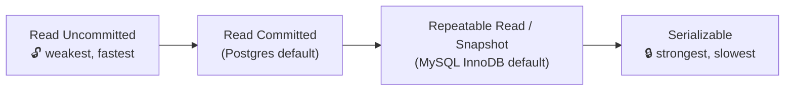

# 036 · Transactions & Isolation Levels

> ⏱ 10 min · 📈 36% · 🅰️ Part A (core) · Phase 05: Databases
>
> `███████░░░░░░░░░░░░░` 36% of the whole guide

---

## 📖 Story

There's **one portion left** of the most famous lasagna on Pantry. The counter on the page reads **1**.

At 6:59:59.412 p.m., two customers on opposite sides of the city tap **"Buy"**. Their requests hit two different app servers **three milliseconds apart**.

Both transactions read `stock = 1`. Both think: *one left, it's mine*. Both write `stock = 0`. Both commit. Both customers get a cheerful green confirmation.

One lasagna. Two delivery drivers. One furious customer who gets a cancellation at 7:40 p.m. with a hungry family at the table.

Maya stares at the code in disbelief. *"But I used transactions!"*

I nodded, because I've made this exact mistake. Here's the twist that catches almost everyone: **"isolation" comes in levels**, and your database's default is probably not the one that protects you.

## 🎯 One-sentence idea

**Isolation levels decide how much concurrent transactions can see of each other: stronger levels prevent more anomalies but cost throughput, and most databases default to a middle level, not the strongest.**

## 🧸 Analogy

Several people **editing one shared document**:

- 👀 **Read uncommitted:** you see others' typing *live*, including sentences they're about to delete.
- 💾 **Read committed:** you see only **saved** text, but a paragraph can change between two reads.
- 📸 **Snapshot / repeatable read:** you get a **photo** of the document when you start, frozen for your whole session.
- 🔒 **Serializable:** **as if everyone took turns**, one at a time.

## 🖼️ Visual

*Diagram brief:* a dial turning from "weak/fast" to "strong/slow", with a grid below showing which anomaly each level stops.



| Anomaly ↓ / Level → | Read Uncommitted | Read Committed | Snapshot / RR | Serializable |
|---|---|---|---|---|
| **Dirty read** | ❌ | ✅ | ✅ | ✅ |
| **Non-repeatable read** | ❌ | ❌ | ✅ | ✅ |
| **Phantom read** | ❌ | ❌ | ⚠️ DB-dependent | ✅ |
| **Lost update** | ❌ | ❌ | ⚠️ DB-dependent | ✅ |
| **Write skew** | ❌ | ❌ | ❌ | ✅ |

## 🔬 How it works

- **The five anomalies:** **dirty read** (seeing uncommitted data), **non-repeatable read** (the same row changes mid-transaction), **phantom** (a re-run `WHERE` returns new rows), **lost update** (two read-modify-writes, so one overwrites the other), and **write skew** (each transaction's decision is valid alone, but together they break an invariant).
- **Most defaults are not serializable:** Postgres uses **Read Committed**, MySQL InnoDB uses **Repeatable Read**, and Oracle's "serializable" is really snapshot isolation, which still allows write skew.
- **Fix it in the query:** use **atomic updates** (`SET stock = stock - 1 WHERE stock > 0`) so there's no read-modify-write in app code, and **constraints** (UNIQUE, CHECK, exclusion) as the final gate.
- **Or lock deliberately:** **pessimistic** `SELECT … FOR UPDATE` for hot, contended rows, or **optimistic** version columns (`WHERE version = :v`, retry on 0 rows) for low contention.
- **Or go serializable** (Postgres **SSI** detects dangerous patterns and aborts one transaction), and then **always retry** on serialization failures (SQLSTATE `40001`).

## 🧩 Worked example

**Maya's lost update, at Read Committed:**

```
T1: SELECT stock FROM dishes WHERE id=42;   → 1
T2: SELECT stock FROM dishes WHERE id=42;   → 1
T1: UPDATE dishes SET stock = 0 WHERE id=42;   (1 − 1)  COMMIT ✅
T2: UPDATE dishes SET stock = 0 WHERE id=42;   (1 − 1)  COMMIT ✅  ← two sales, one lasagna
```

**The fix, one atomic statement:**

```sql
UPDATE dishes SET stock = stock - 1 WHERE id = 42 AND stock > 0;
-- T1: 1 row updated ✅    T2: 0 rows updated → "Sorry, sold out"
```

**Write skew, which even snapshot isolation allows:**

```
Rule: at least 1 cook must be "on duty" for a kitchen.
T1: SELECT count(*) WHERE on_duty → 2 → "I can leave"
T2: SELECT count(*) WHERE on_duty → 2 → "I can leave"
T1: UPDATE … SET on_duty=false WHERE cook=A
T2: UPDATE … SET on_duty=false WHERE cook=B   → 0 on duty 😱
```

Fix it with `SERIALIZABLE`, or by `FOR UPDATE` on the rows the decision depends on.

## ⚖️ Trade-offs

| Maya's choice | What she gains | What she pays |
|---|---|---|
| Read committed + atomic updates | High concurrency, simple | She must spot every read-modify-write |
| Snapshot | Stable view for reports | Write skew still possible |
| Serializable | No anomalies at all | Lower throughput, mandatory retries |
| Pessimistic locks | Easy reasoning | Blocking, deadlocks |
| Optimistic locks | No blocking | Retry storms under heavy contention |

## 🌍 Real world

- **Postgres SSI** (serializable snapshot isolation) gives true serializability with optimistic aborts.
- **MySQL InnoDB** uses gap and next-key locks at Repeatable Read to reduce phantoms.
- **CockroachDB** runs **Serializable by default**, with automatic client retries.

## 📌 Cheat card

> - **Read Uncommitted → Read Committed → Snapshot/RR → Serializable** ("**R**eally **R**eally **R**ead **S**afely").
> - Anomalies: **dirty, non-repeatable, phantom, lost update, write skew**.
> - Everyday fixes: **atomic `SET x = x - 1 WHERE …`**, **`FOR UPDATE`**, **version column**, **constraints**.
> - Serializable → **always retry** on `40001`.

## 🧪 Feynman check

Explain each level with the shared document, then tell the "two cooks both go off duty" story and why a snapshot can't prevent it.

⚠️ **Common confusion:** "My DB is ACID, so there are no races." ACID's **I** is rarely **serializable** by default. Read-check-write logic in app code at Read Committed loses updates, exactly like the double-sold lasagna.

## ⚡ Quick recall

1. What's a dirty read?
<details><summary>Reveal Answer</summary>

Reading data written by another transaction that hasn't committed yet (and might roll back).
</details>

2. What's the simplest fix for a lost update on a counter?
<details><summary>Reveal Answer</summary>

An atomic update in the DB: `UPDATE t SET c = c - 1 WHERE … AND c > 0`, instead of read-then-write in app code.
</details>

3. What is write skew?
<details><summary>Reveal Answer</summary>

Two transactions read overlapping data and each updates different rows based on what it saw, together violating an invariant. Snapshot isolation doesn't prevent it.
</details>

## 🎤 Interview practice

**Q. "A room-booking system double-booked a room even though the code checks availability first. Explain why and fix it for one database, then for a distributed system."**
<details><summary>Model answer</summary>

- **Why:** a **check-then-act race**. Both transactions ran `SELECT … WHERE room=7 AND overlaps(:range)` → 0 rows → both `INSERT`. At Read Committed or Snapshot, neither sees the other's uncommitted insert. It's a phantom/write-skew anomaly.
- **Single-DB fixes, strongest first:**
  - **A DB constraint:** a Postgres **exclusion constraint**, `EXCLUDE USING gist (room_id WITH =, during WITH &&)`. The database itself rejects the overlap, whatever the app does.
  - **Lock the parent row:** `SELECT … FROM rooms WHERE id=7 FOR UPDATE` before checking, which serializes bookings per room.
  - **`SERIALIZABLE`** isolation with a retry loop on `40001`.
- **Distributed fixes:**
  - **A single owner per room:** partition bookings so all writes for room 7 go to one shard or actor, then apply a local constraint.
  - Or a **lease/lock with a fencing token** checked by storage (lesson 086).
  - Or a **reservation with expiry** (hold → confirm → release), plus **idempotency keys** on confirm.
- **For concurrent edits of the same page** (the wiki variant): **optimistic concurrency** with a version or `ETag` + `If-Match` → `412` on conflict, merge in the UI. Use CRDTs or OT for real-time co-editing.
- **Likely follow-up:** "Why not just lock everything?" → throughput collapses and deadlocks appear. Lock only the rows an invariant depends on.
</details>

## 📖 Teaser

> 📖 *The race is fixed, but a loyal customer opens "My orders", and the page takes eight full seconds while the database reads every order ever placed.*

---

⬅️ [✅ Checkpoint 35%](checkpoint-35.md) · 🗺️ [Phase map](README.md) · ➡️ [037 · Indexes](037-indexes.md)

✅ **Safe stopping point.** Tick lesson 036 in [PROGRESS.md](../../PROGRESS.md).
