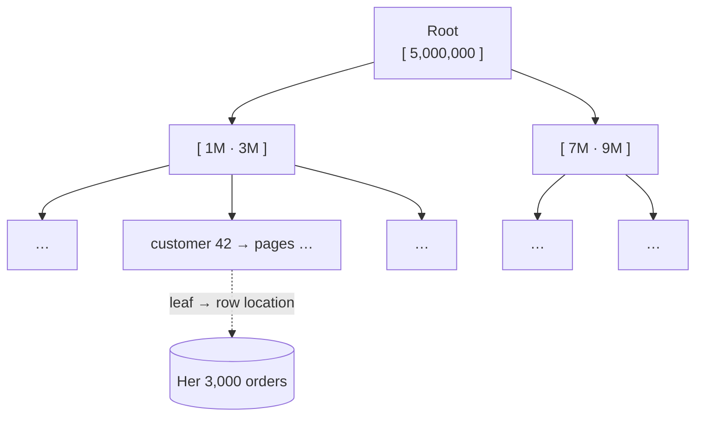

# 037 · Database Indexes

> ⏱ 10 min · 📈 37% · 🅰️ Part A (core) · Phase 05: Databases
>
> `███████░░░░░░░░░░░░░` 37% of the whole guide

---

## 📖 Story

A loyal customer, someone with **3,000 orders** over three years, taps **"My orders."**

The spinner spins. And spins. **Eight seconds.**

Maya runs `EXPLAIN` on the query, and the answer comes back in two cold words: **`Seq Scan`**.

To find this one customer's orders, Postgres is reading **every one of Pantry's 50 million orders**, row by row, page by page, from the first lasagna ever sold, checking each one: *is this hers? No. Is this hers? No.* It's a librarian searching for one book by walking every aisle and reading every spine.

Meanwhile, other queries queue up behind the disk I/O it's hogging. The whole site slows.

I asked Maya to picture the index at the back of her old school textbook. Now I'll ask you to do the same.

## 🎯 One-sentence idea

**An index is a sorted lookup structure (usually a B-tree) that lets the database jump to matching rows without scanning the whole table, making reads dramatically faster at the cost of extra storage and slower writes.**

## 🧸 Analogy

The **index at the back of a textbook**:

- Without it, you **read every page** to find "photosynthesis".
- With it, "P → photosynthesis → pages 42, 97" and you jump straight there.
- Every edit to the book must **update the index too** (slower writes), and the index **takes pages** (storage).
- An index on "page colour" is useless. An index helps only when it **narrows things down** (selectivity).

## 🖼️ Visual

*Diagram brief:* a short, wide tree. The root splits into a few branches, the branches into leaves, and one highlighted path drops three levels straight to a single row.



A B-tree over 50M rows is only **3–4 levels deep**, so a lookup is **3–4 page reads instead of ~1M**.

## 🔬 How it works

- **B-tree (the default):** sorted and balanced with a high fan-out (~hundreds of keys per 8 KB page), giving **O(log n)**. It serves **equality, ranges, prefix `LIKE 'abc%'`, and `ORDER BY`** without a sort. **Hash** indexes do equality only.
- **Composite `(a, b, c)` obeys the leftmost-prefix rule:** it serves `a`, `a+b`, and `a+b+c`, but not `b` alone. Put **equality columns first, then range/sort columns**.
- **Covering indexes** (`INCLUDE (total)`) hold every column the query needs → an **index-only scan**, with no table visit.
- **Specialized types:** **GIN/inverted** (full text, JSONB, arrays), **GiST/R-tree** (geo), **partial** (`WHERE status='active'`), and **expression** (`lower(email)`).
- **The bill:** every INSERT, UPDATE, or DELETE maintains **every** index, which costs write latency, disk, and buffer-pool RAM. Low-selectivity columns (`is_active`) rarely help. **`EXPLAIN ANALYZE`** is the source of truth.

## 🧩 Worked example

```sql
-- 🐢 Before: 50M-row sequential scan, ~8 s
EXPLAIN ANALYZE
SELECT * FROM orders WHERE customer_id = 42 ORDER BY created_at DESC LIMIT 20;
-- Seq Scan on orders … actual time=8123 ms

-- 🚀 The index matches the filter AND the sort
CREATE INDEX CONCURRENTLY idx_orders_cust_created ON orders (customer_id, created_at DESC);
-- Index Scan using idx_orders_cust_created … actual time=0.9 ms
```

**8,123 ms → 0.9 ms: ~9,000× faster.** `CONCURRENTLY` builds it without blocking writes.

| Filter with index `(customer_id, created_at)` | Uses it? |
|---|---|
| `customer_id = 42` | ✅ |
| `customer_id = 42 AND created_at > '2026-01-01'` | ✅ |
| `created_at > '2026-01-01'` | ❌ no leading column |

**Index killers:**

```sql
WHERE lower(email) = 'a@b.com'          -- needs an expression index on lower(email)
WHERE name LIKE '%smith'                -- a leading wildcard → full-text search instead
WHERE created_at::date = '2026-10-01'   -- function on the column → rewrite as a range
```

## ⚖️ Trade-offs

| Maya's choice | What she gains | What she pays |
|---|---|---|
| An index on hot filters | 1,000×+ faster reads | Slower writes, more disk and RAM |
| A covering index | Index-only reads | Even more storage |
| A composite index | Serves filter + sort together | Column order matters |
| Few indexes on a write-heavy table | Fast inserts | Slow ad-hoc reads |

## 🌍 Real world

- **"Add the right index" is the #1 fix** for slow production queries.
- **`pg_stat_statements`** and the MySQL **slow query log** reveal which queries need one.
- **Unused indexes** are a silent write tax. Audit them with `pg_stat_user_indexes`.

## 📌 Cheat card

> - Index = **the book's index**: find rows without reading every page.
> - **B-tree:** equality + range + sort + prefix. **Hash:** equality only.
> - **Leftmost prefix.** Equality columns first, then range/sort.
> - **Covering index** → index-only scans.
> - **Every index taxes writes.** Design from real queries, and verify with **EXPLAIN ANALYZE**.

## 🧪 Feynman check

Explain the textbook index, why an index on "page colour" is useless, and why every edit to the book gets a little slower.

⚠️ **Common confusion:** "Index every column, just in case." Single-column indexes rarely serve multi-column queries well, and each one slows every write and eats buffer-pool memory that hot data needs. **Index the queries you actually run.**

## ⚡ Quick recall

1. Can a B-tree index on `(a, b)` help `WHERE b = 5`?
<details><summary>Reveal Answer</summary>

Generally no. It needs the leading column `a` (some databases can skip-scan, but don't count on it).
</details>

2. What's a covering index?
<details><summary>Reveal Answer</summary>

An index containing every column a query needs, so the database answers from the index alone.
</details>

3. Why do indexes slow down writes?
<details><summary>Reveal Answer</summary>

Every insert, update, or delete must also update each index on the table.
</details>

## 🎤 Interview practice

**Q. "`SELECT * FROM messages WHERE chat_id = ? ORDER BY sent_at DESC LIMIT 50` is slow. Fix it. Then: inserts into an events table have slowed down over months. What do you check?"**
<details><summary>Model answer</summary>

- **The read:**
  - A composite index `(chat_id, sent_at DESC)` matches the filter **and** the sort, so the DB reads exactly 50 index entries, in order.
  - Select only the needed columns. Consider `INCLUDE` for an index-only scan.
  - Page with a **cursor** (`AND sent_at < :last_seen`), never `OFFSET`.
  - Verify with `EXPLAIN ANALYZE`.
  - At 10B+ rows: **partition or shard by `chat_id`**, or move to a wide-column store keyed `(chat_id, sent_at)`.
- **Slow inserts, the checklist:**
  - **Too many indexes:** each insert updates all of them, so drop unused ones.
  - **Random primary keys (UUIDv4):** inserts land all over the B-tree, causing page splits, cache misses, and bloat. Use **time-ordered IDs** (UUIDv7/Snowflake), so inserts append to the right edge.
  - **Bloat and vacuum lag** (Postgres), long-running transactions pinning old row versions, and lock contention.
  - **Growth:** **partition by time** and drop old partitions instead of mass deletes.
- **Likely follow-up:** "Why exactly do random UUIDs hurt?" → the B-tree's working set becomes the whole index rather than its hot right edge, so far more pages must stay in RAM, and every insert is a likely disk read plus a split.
</details>

## 📖 Teaser

> 📖 *"My orders" loads in a millisecond now, but Pantry's chat messages have passed a billion rows, and the relational database starts to groan under a shape of data it was never built for.*

---

⬅️ [036 · Transactions & Isolation](036-transactions-and-isolation.md) · 🗺️ [Phase map](README.md) · ➡️ [038 · NoSQL Families](038-nosql-families.md)

✅ **Safe stopping point.** Tick lesson 037 in [PROGRESS.md](../../PROGRESS.md).
