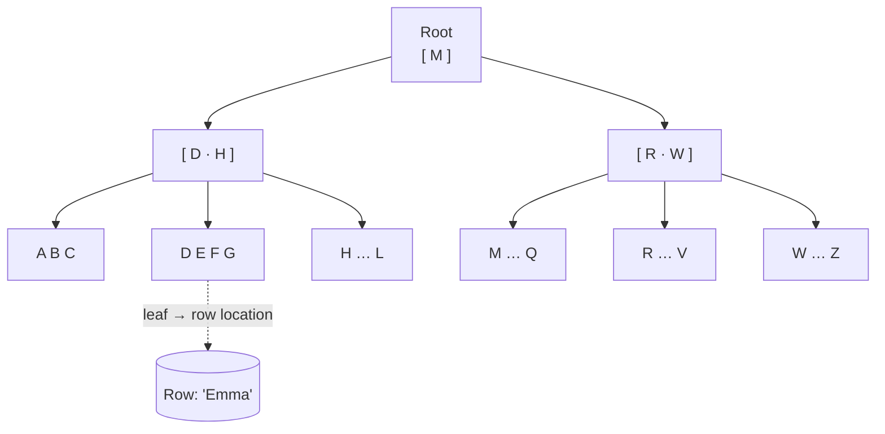

# 037 · Database Indexes

> ⏱ 10 min · 📈 37% · 🅰️ Part A (core) · Phase 05: Databases
>
> `███████░░░░░░░░░░░░░` 37% of the whole guide

---

## 📖 Story

A loyal customer with 3,000 past orders opened "My orders," and it took eight seconds to load. Maya discovered that the database was reading every one of Pantry's 50 million orders just to find hers. I asked her to picture the index at the back of her old school textbook. Now I'll ask you to do the same.

## 🎯 One-sentence idea

**An index is a sorted lookup structure (usually a B-tree) that lets the database find matching rows without scanning the whole table. It makes reads dramatically faster, at the cost of extra storage and slower writes.**

## 🧸 Analogy

The **index at the back of a textbook**:

- Without it, to find "photosynthesis" you **read every page** (a full table scan).
- With it, you look up "P → photosynthesis → pages 42, 97" and jump straight there.
- But every time the book is edited, the **index must be updated too** (slower writes), and the index **takes pages** itself (storage).
- An index on "page color" would be useless. Indexes help when they **narrow things down a lot** (selectivity).

## 🖼️ Visual



A B-tree with millions of rows is only **3–4 levels deep**, so a lookup is about 3–4 page reads instead of millions.

## 🔬 How it works

- **B-tree index** (the default in almost every relational database): sorted, balanced, O(log n) lookups. It supports **equality**, **ranges** (`BETWEEN`, `<`, `>`), **prefix** (`LIKE 'abc%'`), and **ORDER BY** without a sort.
- **Hash index:** O(1) equality only. No ranges.
- **Primary key / clustered index:** in some databases (MySQL InnoDB), the table itself is stored in primary-key order. Secondary indexes point to the primary key.
- **Composite (multi-column) index** `(a, b, c)`: works for queries filtering on `a`, `a+b`, or `a+b+c` (the **leftmost prefix rule**), but *not* on `b` alone.
- **Covering index:** includes all the columns a query needs, so the DB never touches the table ("index-only scan").
- **Other types:** **GIN/inverted** (full-text, JSON, arrays), **GiST/R-tree** (geospatial), **partial** indexes (`WHERE status='active'`), and **expression** indexes (`lower(email)`).
- **Costs:** every INSERT, UPDATE, or DELETE must update **every index** on the table. Indexes use disk and RAM. Too many indexes = slow writes.
- **Selectivity:** an index on a column with few distinct values (`is_active`) rarely helps. The planner may prefer a full scan.
- **Check with `EXPLAIN`:** see whether the database uses your index (`Index Scan`) or scans everything (`Seq Scan`).

## 🧩 Worked example

**Table:** `orders` with 50M rows.

```sql
-- 🐢 Without an index: scans 50M rows (~seconds)
EXPLAIN SELECT * FROM orders WHERE customer_id = 42 ORDER BY created_at DESC LIMIT 20;
-- Seq Scan on orders  (cost=0.00..1250000.00 rows=...)

-- 🚀 Composite index that matches filter + sort
CREATE INDEX idx_orders_cust_created ON orders (customer_id, created_at DESC);

EXPLAIN SELECT * FROM orders WHERE customer_id = 42 ORDER BY created_at DESC LIMIT 20;
-- Index Scan using idx_orders_cust_created (cost=0.56..80.12 rows=20)   ~1 ms
```

**The leftmost-prefix rule with index `(customer_id, created_at)`:**

| Query filter | Uses index? |
|---|---|
| `WHERE customer_id = 42` | ✅ |
| `WHERE customer_id = 42 AND created_at > '2026-01-01'` | ✅ |
| `WHERE created_at > '2026-01-01'` | ❌ (no leading column) |

**Covering index to skip table lookups:**

```sql
CREATE INDEX idx_cover ON orders (customer_id, created_at) INCLUDE (total);
SELECT created_at, total FROM orders WHERE customer_id = 42;   -- index-only scan
```

**Common index killers:**

```sql
WHERE lower(email) = 'a@b.com'     -- needs an expression index on lower(email)
WHERE name LIKE '%smith'           -- a leading wildcard can't use a B-tree → full-text search
WHERE created_at::date = '2026-10-01'  -- a function on the column → rewrite as a range
```

## ⚖️ Trade-offs

| You gain | You pay | Use it when |
|---|---|---|
| Fast lookups, ranges, sorting | Slower writes (index maintenance) | Columns in frequent WHERE, JOIN, ORDER BY |
| Covering indexes → index-only reads | More storage | Hot, read-heavy queries |
| Composite indexes | Order matters, and some queries can't use them | Multi-column filters |
| Few indexes | Fast writes | Write-heavy tables (logs, events) |

## 🌍 Real world

- **"Add an index" is the #1 fix for slow queries** in production. Always check `EXPLAIN` / `EXPLAIN ANALYZE`.
- **pg_stat_statements** (Postgres) and the **slow query log** (MySQL) show which queries need indexes.
- **Unused indexes** are a silent write tax. Periodically find and drop them.

## 📌 Cheat card

> - Index = **the book's index**: find rows without reading every page.
> - **B-tree** (default): equality + ranges + sort + prefix. **Hash**: equality only.
> - **Composite index = leftmost prefix rule.** Put **equality columns first, then range/sort**.
> - **Covering index** → index-only scans.
> - **Every index slows writes.** Index for your **real queries**, verified with **EXPLAIN**.
> - Leading `%wildcard` or a function on the column → the index isn't used.

## 🧪 Feynman check

Explain the textbook index analogy, why an index on "page colour" is useless, and why every edit to the book becomes slower.

⚠️ **Common confusion:** "Index every column just in case." Each index costs write speed and memory, and single-column indexes often can't serve multi-column queries well. **Design indexes from query patterns.**

## ⚡ Quick recall

1. Can a B-tree index on `(a, b)` help `WHERE b = 5`?
<details><summary>Answer</summary>

Generally no. It needs the leftmost column `a` (some DBs can do skip scans, but don't count on it).
</details>

2. What's a covering index?
<details><summary>Answer</summary>

An index containing every column a query needs, so the DB answers from the index alone without reading the table rows.
</details>

3. Why do indexes slow down writes?
<details><summary>Answer</summary>

Every insert, update, or delete must also update each index on the table.
</details>

## 🎤 Interview practice

**Q1. "This query is slow: `SELECT * FROM messages WHERE chat_id = ? ORDER BY sent_at DESC LIMIT 50`. Fix it."**
<details><summary>Model answer</summary>

- Create a composite index `(chat_id, sent_at DESC)`. It matches the filter *and* the sort, so the DB reads just 50 index entries.
- Select only the needed columns (and consider a covering index with `INCLUDE`).
- Use **cursor pagination** (`AND sent_at < :last_seen`) for older pages instead of OFFSET.
- Verify with `EXPLAIN ANALYZE`.
- **Likely follow-up:** "The table has 10B rows?" → partition or shard by `chat_id` (or use a wide-column store keyed by chat_id + time).
</details>

**Q2. "Writes on our events table got slow over time. What would you check?"**
<details><summary>Model answer</summary>

- **Too many indexes** (each insert updates all of them). Drop unused ones (check index usage stats).
- **Random-key indexes** (e.g., UUIDv4 primary keys) cause page splits and cache misses. Prefer time-ordered IDs (UUIDv7/Snowflake).
- **Table/index bloat**, autovacuum lag (Postgres), lock contention, and a big uncommitted transaction.
- **Growth:** partition by time (drop old partitions instead of deleting rows).
- **Likely follow-up:** "Why do random UUIDs hurt?" → inserts land all over the B-tree, the working set doesn't fit in memory, and there's more I/O and fragmentation.
</details>

> 📖 *Next, chat messages pile up by the billion, and the relational database starts to strain.*

---

⬅️ [036 · Transactions & Isolation](036-transactions-and-isolation.md) · 🗺️ [Phase map](README.md) · ➡️ [038 · NoSQL Families](038-nosql-families.md)

✅ **Safe stopping point.** Tick lesson 037 in [PROGRESS.md](../../PROGRESS.md).
