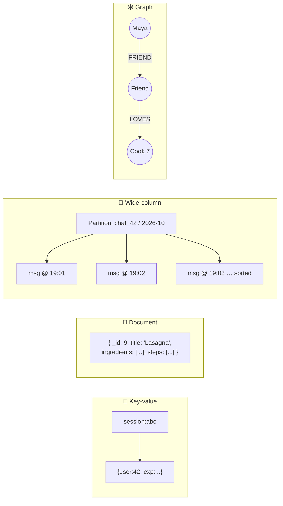

# 038 · NoSQL Families: Key-Value, Document, Wide-Column, Graph

> ⏱ 10 min · 📈 38% · 🅰️ Part A (core) · Phase 05: Databases
>
> `███████░░░░░░░░░░░░░` 38% of the whole guide

---

## 📖 Story

Three monsters are now prowling Pantry's single Postgres box at the same time.

**Monster one:** chat has hit **two billion messages**, gaining 40 million a day, an endless conveyor belt of tiny writes that bloats indexes and starves everything else of IOPS.

**Monster two:** recipes arrive in every imaginable shape: some with 3 fields, some with 300, nested ingredient trees, video chapters, translations. The schema migration file is longer than a novel.

**Monster three:** Maya wants a "cooks your friends love" feature: friends of friends of friends. In SQL, that's a self-join of a self-join of a self-join, and the query planner gives up and goes home.

Maya types into a search bar: *"best NoSQL database."* I had to explain that "NoSQL" isn't one thing at all. It's **four very different tools wearing one name**. Let me introduce you to each.

## 🎯 One-sentence idea

**"NoSQL" is four families, key-value (a giant dictionary), document (self-contained JSON records), wide-column (rows partitioned and sorted for massive writes), and graph (nodes and relationships), and each one excels at exactly one access pattern.**

## 🧸 Analogy

Four ways to organize a **school's information**:

- 🔑 **Key-value = a coat check.** Ticket in, coat out. You can't ask "show me all red coats."
- 📄 **Document = a student folder.** Everything about one student in one place.
- 🧱 **Wide-column = attendance ledgers**, one book per class, each page sorted by date.
- 🕸️ **Graph = a friendship map** with strings between students.

## 🖼️ Visual

*Diagram brief:* four panels side by side. A ticket → coat lookup. A fat nested folder. A partition "book" with rows sorted by time. A web of labelled arrows between people.



## 🔬 How it works

- **🔑 Key-value** (Redis, DynamoDB, etcd): `get`/`put` by key, sharded by key. It's the fastest and simplest, but you can't query by value unless the database adds secondary indexes. Use it for sessions, carts, flags, counters, and rate limits.
- **📄 Document** (MongoDB, Couchbase, Firestore): JSON/BSON with nesting, arrays, and secondary indexes. **Embed what you read together** and fetch a whole aggregate in one read. Joins are weak, and duplicated data must be synced. Use it for catalogues, CMS content, profiles, and variable-shape records.
- **🧱 Wide-column** (Cassandra, ScyllaDB, HBase, Bigtable): the **partition key picks the replicas**, and the **clustering key sorts rows inside the partition**. LSM storage (lesson 081) handles **massive write throughput** with linear scaling and multi-DC replication. You get **one table per query**, no joins, and no ad-hoc queries.
- **🕸️ Graph** (Neo4j, Neptune, JanusGraph): nodes + edges with properties. Traversals **follow pointers** (index-free adjacency) instead of joining, so 3–4 hop queries take milliseconds. It's harder to shard and more niche.
- **Common rule:** list the **access patterns first**, then pick the family whose native operation *is* your hottest query.

## 🧩 Worked example

**Chat in Cassandra, with the table designed for "latest 50 messages in chat X":**

```sql
CREATE TABLE messages_by_chat (
  chat_id   uuid,
  bucket    text,          -- '2026-10' keeps partitions bounded (≲100 MB)
  sent_at   timeuuid,
  sender_id uuid,
  body      text,
  PRIMARY KEY ((chat_id, bucket), sent_at)
) WITH CLUSTERING ORDER BY (sent_at DESC);

SELECT * FROM messages_by_chat WHERE chat_id = ? AND bucket = '2026-10' LIMIT 50;
-- one partition, one sequential read, ~2–5 ms at any table size
```

Need "messages by sender"? → a **second table**, `messages_by_sender`, written alongside the first.

**"Cooks my friends love" (Cypher):**

```cypher
MATCH (me:User {id: 42})-[:FRIEND]->(f)-[:LOVES]->(c:Cook)
WHERE NOT (me)-[:LOVES]->(c)
RETURN c, count(f) AS friends ORDER BY friends DESC LIMIT 10;
```

## ⚖️ Trade-offs

| Family | Best at | Worst at | Scale |
|---|---|---|---|
| Key-value | Get/put by key | Everything else | 🚀 Huge |
| Document | Whole-aggregate reads, variable shapes | Cross-document joins | High |
| Wide-column | Massive writes, partition + range reads | Ad-hoc queries, joins | 🚀 Huge |
| Graph | Multi-hop relationships | Bulk scans, sharding | Moderate |

## 🌍 Real world

- **DynamoDB** runs Amazon's carts and many AWS control planes.
- **Cassandra** at Apple, Netflix, and Instagram. **ScyllaDB** holds Discord's trillions of messages.
- **Google Bigtable** underpins Search indexing and Maps.
- **Neo4j** powers fraud-ring detection at banks.

## 📌 Cheat card

> - **KV = coat check · Document = folder · Wide-column = sorted ledgers · Graph = string map.**
> - Wide-column: **PRIMARY KEY ((partition), clustering)**, **one table per query**, **time-bucket** the partitions.
> - Document: **embed what's read together**, reference what's shared and changes often.
> - Graph when **relationships are the query**.
> - **Access patterns first, always.**

## 🧪 Feynman check

Using the school analogy, pick a family for (a) login sessions, (b) a recipe catalogue, (c) chat history, and (d) "cooks your friends love", and justify each in one sentence.

⚠️ **Common confusion:** "Cassandra is basically SQL, because it has CQL." CQL *looks* like SQL, but there are no joins, and a query that doesn't follow the primary key either fails or needs `ALLOW FILTERING`, a full-cluster scan that can melt production.

## ⚡ Quick recall

1. In a wide-column store, what do the partition key and the clustering key do?
<details><summary>Reveal Answer</summary>

The partition key decides which nodes store the data and groups rows together. The clustering key sorts rows within that partition.
</details>

2. When is a graph database the right choice?
<details><summary>Reveal Answer</summary>

When queries traverse many relationship hops: social graphs, recommendations, fraud rings, dependency graphs.
</details>

3. Why do document databases encourage embedding?
<details><summary>Reveal Answer</summary>

So data that's read together lives in one document and comes back in a single read, with no joins.
</details>

## 🎤 Interview practice

**Q. "Model billions of IoT sensor readings queried by device and time range. Then: MongoDB or Postgres for a product catalogue with wildly varying attributes?"**
<details><summary>Model answer</summary>

- **IoT readings:**
  - **Wide-column** (Cassandra/Bigtable) or a **time-series DB** (lesson 044).
  - Partition key `(device_id, day)` to bound partition size, clustering key `ts DESC`.
  - Query `WHERE device_id=? AND day IN (…) AND ts BETWEEN ? AND ?` → a few partitions, sequential reads.
  - Writes are append-only into an LSM (fast). **TTL** for retention, and **downsampled rollups** (1-min, 1-hour tables) for long ranges.
  - **Fleet-wide analytics** (the average temperature per city) → stream into an **OLAP** store (lesson 041). Never scan the wide-column store.
- **Catalogue:**
  - Varied attributes favour a document shape, but orders, inventory, and payments next door need **transactions and relations**.
  - Pragmatic pick: **Postgres + a JSONB `attributes` column with a GIN index**. One database, flexible where needed, ACID where it matters.
  - Choose MongoDB if the domain is truly document-centric and cross-entity transactions are rare.
  - **Faceted search** (brand, size, price filters) goes to **Elasticsearch/OpenSearch** either way (lesson 043).
- **Likely follow-up:** "Why time-bucket the partitions?" → an unbounded partition grows without limit, becomes a hotspot, and slows compaction and repair. Buckets cap the size (~100 MB guideline).
</details>

## 📖 Teaser

> 📖 *Chat has its new home, but Pantry's recipe feed now needs six joins to draw one card, and Maya is tempted to start copying data everywhere.*

---

⬅️ [037 · Indexes](037-indexes.md) · 🗺️ [Phase map](README.md) · ➡️ [039 · Normalization vs Denormalization](039-normalization-vs-denormalization.md)

✅ **Safe stopping point.** Tick lesson 038 in [PROGRESS.md](../../PROGRESS.md).
