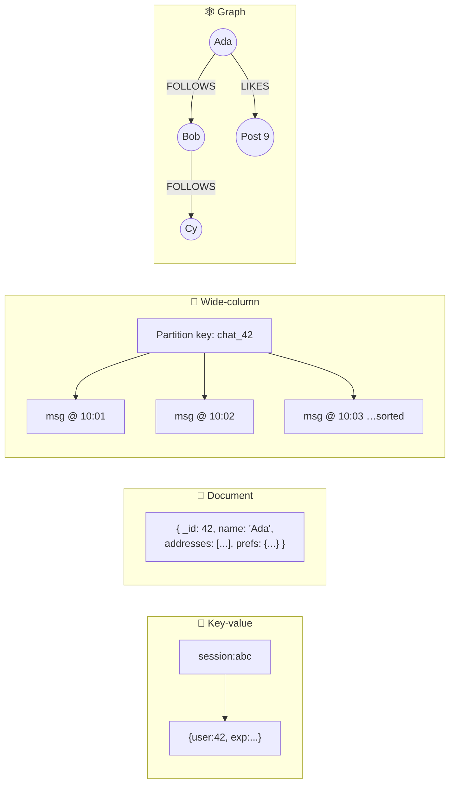

# 038 · NoSQL Families: Key-Value, Document, Wide-Column, Graph

> ⏱ 10 min · 📈 38% · 🅰️ Part A (core) · Phase 05: Databases
>
> `███████░░░░░░░░░░░░░` 38% of the whole guide

---

## 🎯 One-sentence idea

**"NoSQL" is four very different families: key-value (a giant dictionary), document (self-contained JSON records), wide-column (rows partitioned and sorted for massive writes), and graph (nodes and relationships). Each is great at one access pattern.**

## 🧸 Analogy

Four ways to organize a **school's information**:

- 🔑 **Key-value = a coat check.** Give a ticket number, get the coat. Blazing fast, but you can't ask "show me all red coats."
- 📄 **Document = a student file folder.** Everything about one student in one folder: grades, contacts, clubs. Easy to grab it all at once.
- 🧱 **Wide-column = a giant attendance ledger** split into books by class, with each page sorted by date. Perfect for "all attendance for class 7B in October" and for writing millions of entries.
- 🕸️ **Graph = a friendship map** with strings between students. Perfect for "friends of friends who play chess."

## 🖼️ Visual



## 🔬 How it works

- **🔑 Key-value** (Redis, DynamoDB, Riak, etcd):
  - `get(key)`, `put(key, value)`. The value is opaque (or lightly structured).
  - ✅ Fastest and simplest, easy to shard by key. ❌ No queries by value (unless the database adds secondary indexes).
  - Use for: sessions, caches, carts, feature flags, counters, rate limits.
- **📄 Document** (MongoDB, Couchbase, Firestore):
  - JSON/BSON documents in collections. Nested objects and arrays. Secondary indexes on fields.
  - ✅ Flexible schema, and you fetch a whole aggregate in one read. ❌ Joins are weak, and duplicated data must be kept in sync.
  - Use for: catalogs, CMS content, user profiles, event data with varying shapes.
- **🧱 Wide-column** (Cassandra, ScyllaDB, HBase, Bigtable):
  - Data is grouped by a **partition key** (which decides the node), and **sorted within the partition by a clustering key**.
  - Optimized for **huge write throughput** (LSM trees, lesson 081) and **queries by partition + range**.
  - ✅ Linear scaling, multi-datacenter replication, tunable consistency. ❌ You must design one table **per query**. No joins, limited ad-hoc queries.
  - Use for: messages, activity feeds, IoT and time series, logs.
- **🕸️ Graph** (Neo4j, Amazon Neptune, JanusGraph):
  - **Nodes** + **edges** with properties. Traversals follow pointers instead of doing joins.
  - ✅ Multi-hop queries ("friends of friends", "fraud rings") are fast. ❌ Harder to shard, and it's niche.
  - Use for: social graphs, recommendations, fraud detection, knowledge graphs, access-control graphs.

## 🧩 Worked example

**Chat messages in Cassandra: design the table for the query.**

Query: *"Get the latest 50 messages in chat X."*

```sql
CREATE TABLE messages_by_chat (
  chat_id    uuid,
  bucket     text,        -- e.g., '2026-10' to keep partitions bounded
  sent_at    timeuuid,
  sender_id  uuid,
  body       text,
  PRIMARY KEY ((chat_id, bucket), sent_at)
) WITH CLUSTERING ORDER BY (sent_at DESC);

SELECT * FROM messages_by_chat WHERE chat_id = ? AND bucket = '2026-10' LIMIT 50;
```

- `(chat_id, bucket)` = **partition key** → all of a chat's messages for a month live together on the same replicas.
- `sent_at` = **clustering key** → already sorted, so "latest 50" is one sequential read.
- Need "messages by user"? → create **another table** `messages_by_user`, written at the same time (denormalization).

**Graph query (Cypher): "friends of my friends I don't follow yet."**

```cypher
MATCH (me:User {id: 42})-[:FOLLOWS]->(f)-[:FOLLOWS]->(fof)
WHERE NOT (me)-[:FOLLOWS]->(fof) AND fof <> me
RETURN fof, count(*) AS mutual ORDER BY mutual DESC LIMIT 10;
```

## ⚖️ Trade-offs

| Family | Best at | Worst at | Scale |
|---|---|---|---|
| Key-value | Get/put by key | Anything else | 🚀 Huge |
| Document | Whole-aggregate reads, flexible shapes | Cross-document joins | High |
| Wide-column | Massive writes, partition + range reads | Ad-hoc queries, joins | 🚀 Huge |
| Graph | Multi-hop relationships | Bulk scans, sharding | Moderate |

## 🌍 Real world

- **DynamoDB** (key-value/document) runs Amazon.com's carts and many AWS services.
- **Cassandra** at Apple, Netflix, and Instagram. **ScyllaDB** at Discord (trillions of messages).
- **MongoDB** is common in startups and content platforms. **Neo4j** is used for fraud detection at banks.
- **Google Bigtable** (wide-column) underpins Search indexing, Maps, and Gmail historically.

## 📌 Cheat card

> - **KV = coat check · Document = folder · Wide-column = sorted ledgers per partition · Graph = string map.**
> - Wide-column: **PRIMARY KEY ((partition), clustering)**. **One table per query.** Keep partitions bounded (time buckets).
> - Document: **embed what you read together**, reference what's shared and changes often.
> - Graph: pick it when **relationships are the query**.
> - All of them: **start from the access patterns.**

## 🧪 Feynman check

Using the school analogy, explain which family you'd use for (a) login sessions, (b) a product catalog, (c) chat history, and (d) "people you may know".

⚠️ **Common confusion:** "Cassandra is like SQL because it has CQL." CQL *looks* like SQL, but there are no joins, and queries must follow the primary key design. Unplanned queries either fail or need full scans.

## ⚡ Quick recall

1. In a wide-column store, what do the partition key and the clustering key do?
<details><summary>Answer</summary>

The partition key decides which node(s) store the data (and groups rows together). The clustering key sorts rows within that partition.
</details>

2. When is a graph database the right choice?
<details><summary>Answer</summary>

When queries traverse many relationship hops: social networks, recommendations, fraud rings, dependency graphs.
</details>

3. Why do document databases encourage embedding?
<details><summary>Answer</summary>

So data that's read together lives in one document, giving a single fast read without joins.
</details>

## 🎤 Interview practice

**Q1. "Design the data model for storing billions of IoT sensor readings, queried by device and time range."**
<details><summary>Model answer</summary>

- **Wide-column** (Cassandra/Bigtable) or a **time-series DB** (lesson 044).
- Partition key `(device_id, day)` to bound the partition size. Clustering key `timestamp DESC`.
- Query: `WHERE device_id=? AND day IN (...) AND ts BETWEEN ? AND ?`.
- Writes are append-only and very fast (LSM). Use a TTL for retention, and downsample old data into rollup tables.
- **Likely follow-up:** "Queries across all devices (the average temperature per city)?" → stream the data to an OLAP store or warehouse (lesson 041). Don't scan the wide-column store.
</details>

**Q2. "MongoDB or Postgres for an e-commerce product catalog?"**
<details><summary>Model answer</summary>

- Products have **varied attributes** (shirts have size and colour, TVs have resolution and ports), which fits a document model.
- But orders, inventory, and payments need transactions and relations.
- A pragmatic choice: **Postgres with a JSONB `attributes` column** (GIN-indexed) for the catalog, plus relational tables for orders. One database, and flexibility where it's needed.
- Choose MongoDB if the team and workload are document-centric and cross-entity transactions are rare. Search goes to Elasticsearch either way.
- **Likely follow-up:** "How would you support faceted search (filter by brand, size, price)?" → a search engine with facets/aggregations (lesson 043).
</details>

---

⬅️ [037 · Indexes](037-indexes.md) · 🗺️ [Phase map](README.md) · ➡️ [039 · Normalization vs Denormalization](039-normalization-vs-denormalization.md)

✅ **Safe stopping point.** Tick lesson 038 in [PROGRESS.md](../../PROGRESS.md).
