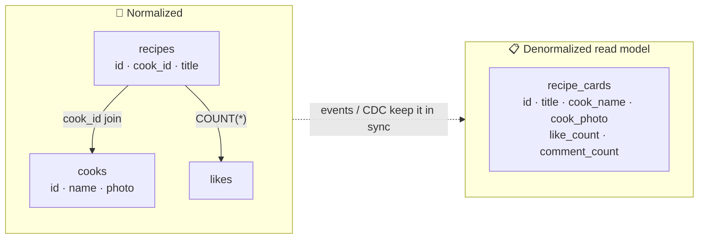

# 039 · Normalization vs Denormalization

> ⏱ 9 min · 📈 39% · 🅰️ Part A (core) · Phase 05: Databases
>
> `███████░░░░░░░░░░░░░` 39% of the whole guide

---

## 📖 Story

Pantry's recipe feed shows twenty cards. Each card needs the **dish**, the **cook's name**, the **cook's photo**, the **like count**, and the **comment count**.

Building one page takes **six joins** and two `COUNT(*)` subqueries over tables with hundreds of millions of rows. At dinner time it runs **3,000 times a second**. The feed p99 climbs past **900 ms**, and the database's CPU graph looks like a city skyline on fire.

Maya has an idea that feels like cheating: *just copy the cook's name, photo, and counts straight onto every recipe row.* One table, one read, done.

I've been tempted by exactly that. It's often the right move. But first, ask yourself the question I asked her:

*When a cook changes her profile photo, how many rows do you now have to find and fix?*

## 🎯 One-sentence idea

**Normalization stores each fact exactly once (safe updates, but reads need joins), while denormalization copies or precomputes facts where they're read (fast reads, but every copy must be maintained), so you normalize the source of truth and denormalize deliberately for hot read paths.**

## 🧸 Analogy

A friend **changes their phone number**:

- 📒 **Normalized:** it's in **one address book**, and everyone looks it up there. One update, but every read is a lookup (a join).
- 📋 **Denormalized:** it's written on **20 sticky notes** around the house. Reading is instant, but now you must update all 20, and you'll miss one.

## 🖼️ Visual

*Diagram brief:* on the left, a posts table with an arrow pointing to the users table (a join on every read). On the right, one wide posts row carrying copied author fields and counters, with dotted "sync" arrows feeding it from events.



## 🔬 How it works

- **Normalization (≈3NF)** means every fact lives in one place: "every column depends on the key, the whole key, and nothing but the key." There are **no update anomalies** and writes are small, but **joins** get expensive at scale and impossible across shards.
- **Denormalization comes in three flavours:** **copied fields** (`cook_name` on the recipe), **precomputed aggregates** (`like_count` instead of `COUNT(*)`), and **read models / materialized views** shaped for one screen.
- **Keeping copies honest:** update them in the **same transaction** (one DB), **asynchronously via events/CDC** (eventually consistent, lesson 062), or with a DB **materialized view**.
- **Some copies must never sync:** an order's **price and address are snapshots**, a historical truth that must not change when the menu does.
- **The rule:** **normalize the source of truth, and denormalize the derived read paths** (caches, counters, read models, search indexes). Denormalize **stable** data, and **look up** volatile shared data.

## 🧩 Worked example

**Before:** six joins + counts, 900 ms p99.

**After:**

```sql
-- Counters: maintained in the same transaction as the like
BEGIN;
  INSERT INTO likes(recipe_id, user_id) VALUES (?, ?) ON CONFLICT DO NOTHING;
  UPDATE recipes SET like_count = like_count + 1 WHERE id = ?;
COMMIT;

-- Feed: one indexed query for 20 cards
SELECT id, title, cook_id, like_count, comment_count FROM recipes WHERE id = ANY(:ids);

-- Cook name/photo: NOT copied (a cook may have 5,000 recipes)
-- → batch-fetch the ≤20 distinct cooks with WHERE id = ANY(...), served from a Redis cache
```

**Result:** feed p99 **900 ms → 18 ms**. A cook changing her photo touches **one row + one cache key**, not 5,000 rows.

| Data | Denormalize? | Why |
|---|---|---|
| Like/comment counts | ✅ counters | Read constantly, simple increments |
| Cook name/photo on recipes | ❌ fetch + cache | Changes, and has many copies |
| Price on an order line | ✅ snapshot | Historical truth |
| Category name in the search index | ✅ derived | Rebuilt from events |

## ⚖️ Trade-offs

| | Normalized | Denormalized |
|---|---|---|
| Reads | Joins (slower at scale) | Single lookups |
| Writes | One place | Many places |
| Consistency | Automatic | Must be maintained |
| Storage | Minimal | More |
| Fits | OLTP source of truth | Read-heavy, NoSQL, sharded, analytics |

## 🌍 Real world

- **Instagram and X** store denormalized counters, often in dedicated counter services.
- **DynamoDB single-table design** and **Cassandra** are denormalization by default: one table per query.
- **Data warehouses** use **star schemas**, which are denormalized dimensions around fact tables (lesson 041).

## 📌 Cheat card

> - **Normalize = one address book. Denormalize = sticky notes everywhere.**
> - **Normalize the source of truth. Denormalize the read paths.**
> - Sync via **transaction · events/CDC · materialized views**.
> - **Snapshots on purpose:** prices and addresses on orders.
> - Copy **stable** data, look up **volatile shared** data.

## 🧪 Feynman check

Explain the sticky notes, and when it's actually *correct* for a copy to never update.

⚠️ **Common confusion:** "Denormalization is bad design." It's a **deliberate performance trade-off** that every high-scale system makes. The skill is choosing **what** to duplicate and **how** you'll keep it consistent, and writing both decisions down.

## ⚡ Quick recall

1. What's an update anomaly?
<details><summary>Reveal Answer</summary>

The same fact is stored in several places, and an update changes some copies but not others, leaving contradictory data.
</details>

2. Give an example of denormalized data that should never be synced.
<details><summary>Reveal Answer</summary>

The price or address on a past order or invoice. It must reflect the value at purchase time.
</details>

3. How can denormalized copies be kept in sync across services?
<details><summary>Reveal Answer</summary>

Publish change events (outbox or CDC) that consumers apply to their copies, which is eventually consistent.
</details>

## 🎤 Interview practice

**Q. "Posts get up to 100k likes per minute, and the listing page joins six tables in 800 ms. Fix both."**
<details><summary>Model answer</summary>

- **The listing page:**
  1. **`EXPLAIN ANALYZE`** first and add missing indexes (lesson 037). Sometimes that alone fixes it.
  2. Build a **read model**: a denormalized `post_cards` table or materialized view holding exactly the page's fields, maintained by **CDC/events**, with the normalized tables as the source of truth.
  3. Batch-fetch volatile shared data (author profiles) by ID and **cache** it.
  4. Cache the rendered page fragment with invalidation.
  5. Freshness is eventual (ms–s). Critical fields (stock at checkout) are read from the source.
- **100k likes/min on one post:**
  - A single `UPDATE posts SET like_count = like_count + 1` row gets **lock contention**: every like queues on one row lock.
  - Use **sharded counters** (N rows or keys per post, sum on read), or **Redis `INCR` + periodic flush** (write-back, lesson 029), or **stream aggregation** (Kafka → windowed sums → upsert).
  - The **`likes` table** (who liked what, unique per user) stays the source of truth. Reconcile counters periodically.
  - Display counts are allowed to be approximate for seconds.
- **Likely follow-up:** "Why not copy the author name onto each post?" → an author with 100k posts turns a rename into 100k writes and a long inconsistency window. Look it up and cache it instead.
</details>

## 📖 Teaser

> 📖 *The feed flies now, until a profiling tool shows that one innocent-looking page is quietly firing 101 separate database queries.*

---

⬅️ [038 · NoSQL Families](038-nosql-families.md) · 🗺️ [Phase map](README.md) · ➡️ [040 · Access Patterns, N+1 & Pooling](040-access-patterns-and-pooling.md)

✅ **Safe stopping point.** Tick lesson 039 in [PROGRESS.md](../../PROGRESS.md).
