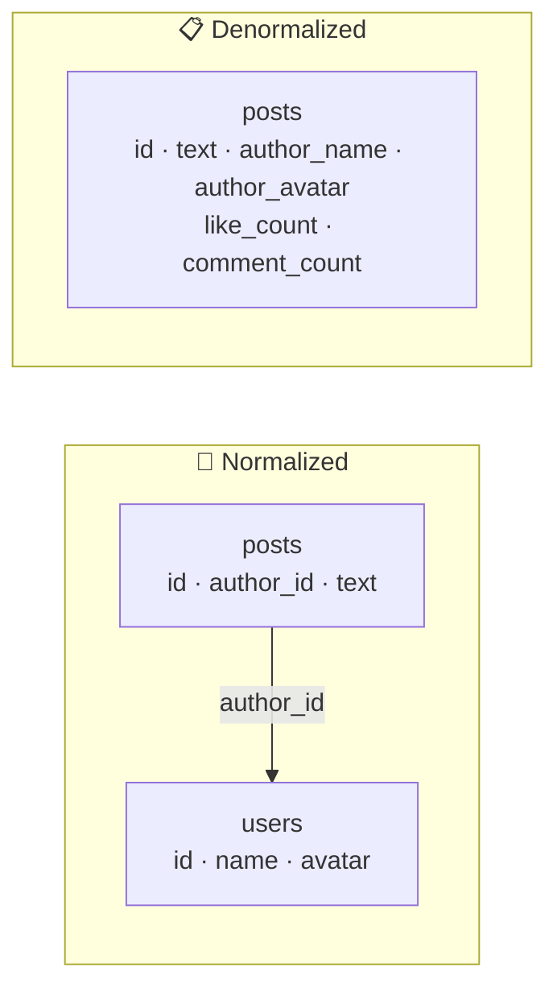

# 039 · Normalization vs Denormalization

> ⏱ 9 min · 📈 39% · 🅰️ Part A (core) · Phase 05: Databases
>
> `███████░░░░░░░░░░░░░` 39% of the whole guide

---

## 🎯 One-sentence idea

**Normalization stores each fact exactly once (easy, safe updates, but reads need joins). Denormalization copies facts where they're read (fast reads, but every copy must be updated). Normalize by default, and denormalize deliberately for hot read paths.**

## 🧸 Analogy

Your friend **changes their phone number**:

- 📒 **Normalized:** the number lives in **one address book**. Everyone who needs it **looks it up** there. You update one place, but everyone has to look it up (a join).
- 📋 **Denormalized:** you've **written the number on 20 sticky notes** (fridge, car, wallet…). Reading is instant because it's right there. But now you must find and update **all 20 notes**, and you'll probably miss one.

## 🖼️ Visual



## 🔬 How it works

- **Normalization** (1NF → 2NF → 3NF, in short: *every fact in one place, and every column depends on the key, the whole key, and nothing but the key*):
  - ✅ No duplicate data → **no update anomalies** (the same fact with two different values).
  - ✅ Smaller storage, and simpler writes.
  - ❌ Reads need **joins**, which get expensive at scale or across shards.
- **Denormalization:** duplicate or precompute data for reads.
  - **Copied fields:** `author_name` stored on each post.
  - **Precomputed aggregates:** `like_count` column instead of `COUNT(*)` each time.
  - **Materialized views / read models:** a table shaped exactly for one screen.
  - ✅ Fast, simple reads (one row / one partition). Essential in NoSQL and sharded systems.
  - ❌ **Writes must update all copies.** There's a risk of inconsistency, and more storage.
- **How to keep copies in sync:**
  - In the **same transaction** (when in one DB).
  - **Asynchronously** via events or CDC (eventually consistent, lesson 062).
  - **Materialized views** refreshed by the DB.
  - Sometimes **don't sync on purpose**: an invoice should keep the price *at the time of purchase*.
- **Rule of thumb:** normalize the **source of truth**, and denormalize into **caches, read models, and search indexes** derived from it.

## 🧩 Worked example

**Feed page: show 20 posts with author name, avatar, like count, and comment count.**

Normalized (correct, but heavy at scale):

```sql
SELECT p.id, p.text, u.name, u.avatar,
       (SELECT count(*) FROM likes    l WHERE l.post_id = p.id) AS likes,
       (SELECT count(*) FROM comments c WHERE c.post_id = p.id) AS comments
FROM posts p JOIN users u ON u.id = p.author_id
WHERE p.id IN (...20 ids...);
```

Denormalized counters (fast):

```sql
-- On like (same transaction):
INSERT INTO likes(post_id, user_id) VALUES (?, ?);
UPDATE posts SET like_count = like_count + 1 WHERE id = ?;

-- Feed read: one simple query
SELECT id, text, author_id, like_count, comment_count FROM posts WHERE id IN (...);
```

Author name/avatar: **don't copy it** into posts (it changes, and a user may have 100k posts). Instead, batch-fetch the users (`WHERE id IN (...)`) and cache them. This is a **selective** denormalization decision.

**Decision guide:**

| Data | Denormalize? | Why |
|---|---|---|
| Like/comment counts | ✅ counters | Read constantly, and updates are simple increments |
| Author display name on posts | ❌ fetch + cache | Changes, and has many copies |
| Price on order line items | ✅ snapshot | Historical truth, **must not** change later |
| Shipping address on orders | ✅ snapshot | Same reason |
| Product category name | ⚠️ in search index only | Derived, and rebuilt via events |

## ⚖️ Trade-offs

| | Normalized | Denormalized |
|---|---|---|
| Reads | Joins (slower at scale) | Fast, single lookups |
| Writes | One place | Many places |
| Consistency | Automatic | Must be maintained |
| Storage | Minimal | More |
| Fits | OLTP source of truth, write-heavy | Read-heavy, NoSQL, sharded, analytics |

## 🌍 Real world

- **Instagram/Twitter** store counters denormalized (and often in a separate counter service).
- **NoSQL design (DynamoDB single-table design, Cassandra)** is denormalization by default: one table per query.
- **Data warehouses** use **star schemas**: a big fact table + denormalized dimension tables (lesson 041).

## 📌 Cheat card

> - **Normalize = one address book. Denormalize = sticky notes everywhere.**
> - **Normalize the source of truth, and denormalize the read paths** (caches, counters, read models, search).
> - Keep copies in sync via a **transaction**, **events/CDC**, or **materialized views**.
> - **Snapshots are denormalization on purpose** (prices on invoices).
> - Denormalize **stable** data, and look up **frequently changing** shared data.

## 🧪 Feynman check

Explain the phone-number sticky-note analogy, and when it's actually *correct* for a copy to never update (think invoices).

⚠️ **Common confusion:** "Denormalization is bad design." It's a **deliberate performance trade-off**. Every high-scale system does it. The skill is choosing *what* to duplicate and *how* to keep it consistent.

## ⚡ Quick recall

1. What's an update anomaly?
<details><summary>Answer</summary>

When the same fact is stored in several places, and an update changes some copies but not others, leaving contradictory data.
</details>

2. Give an example of denormalization that should never be "synced."
<details><summary>Answer</summary>

The price or address stored on a past order or invoice. It must reflect the value at the time of purchase.
</details>

3. How can denormalized copies be kept in sync across services?
<details><summary>Answer</summary>

Publish change events (outbox/CDC) that consumers use to update their copies (eventual consistency).
</details>

## 🎤 Interview practice

**Q1. "Our product listing page does 6 joins and takes 800 ms. What do you do?"**
<details><summary>Model answer</summary>

- First: `EXPLAIN` it, and add the missing indexes (lesson 037).
- Then: build a **read model**: a denormalized `product_listing` table, materialized view, or search index containing exactly the fields the page needs, updated on change (events/CDC or triggers).
- **Cache** the rendered result (Redis/CDN) with invalidation.
- Keep the normalized tables as the source of truth.
- **Likely follow-up:** "How fresh is the read model?" → it's eventual (ms to s). Show "last updated", or read the source for critical fields like stock at checkout.
</details>

**Q2. "How would you store like counts for posts that get 100k likes per minute?"**
<details><summary>Model answer</summary>

- A denormalized counter, but not one DB row updated 100k times/min (that's row lock contention).
- **Sharded counters** (N rows or keys per post, summed on read) or **Redis INCR + periodic flush** (write-back, lesson 029), or stream aggregation (Kafka → windowed counts).
- Keep the `likes` table (who liked what) as the source of truth, and reconcile counters periodically.
- **Likely follow-up:** "Does the count need to be exact in real time?" → usually no. Approximate counts are fine for display.
</details>

---

⬅️ [038 · NoSQL Families](038-nosql-families.md) · 🗺️ [Phase map](README.md) · ➡️ [040 · Access Patterns, N+1 & Pooling](040-access-patterns-and-pooling.md)

✅ **Safe stopping point.** Tick lesson 039 in [PROGRESS.md](../../PROGRESS.md).
