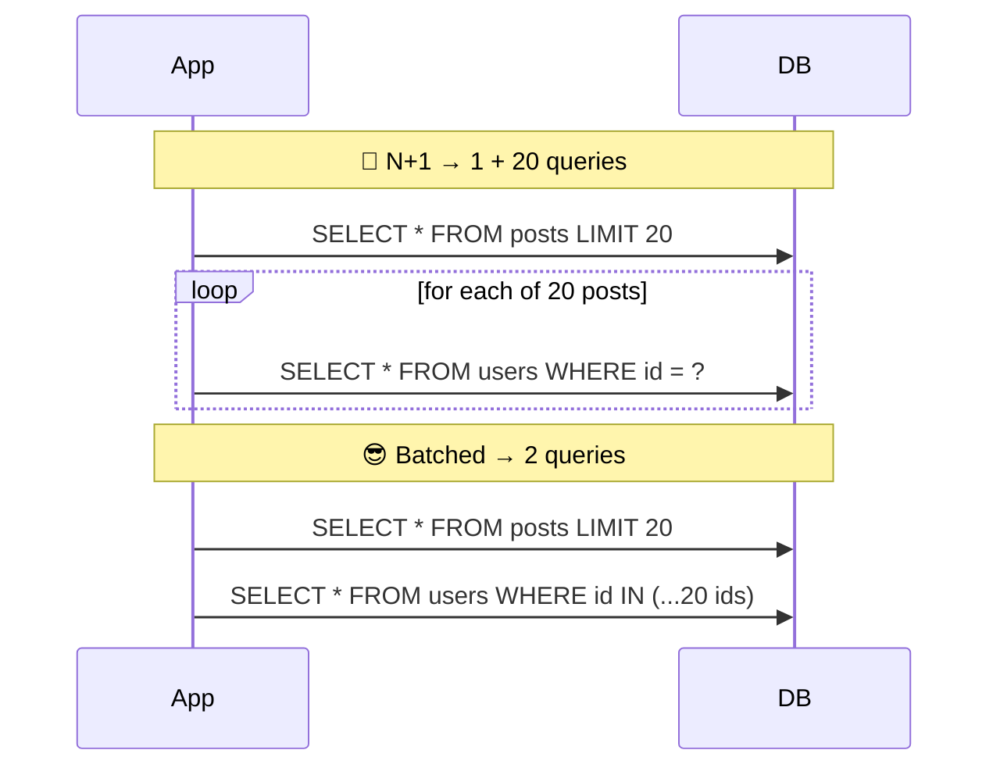
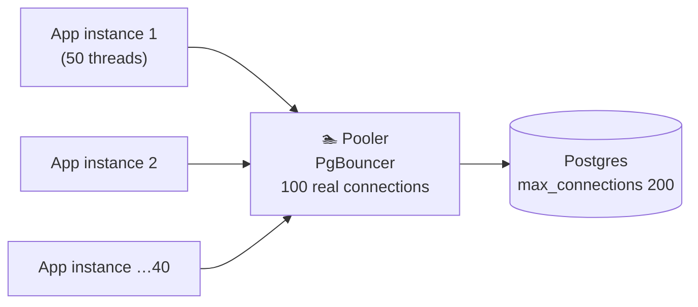

# 040 · Access Patterns, the N+1 Problem & Connection Pooling

> ⏱ 9 min · 📈 40% · 🅰️ Part A (core) · Phase 05: Databases
>
> `████████░░░░░░░░░░░░` 40% of the whole guide

---

## 📖 Story

Maya profiled the "Cooks near you" page and found 101 database queries: one for the list, then one per cook. Worse, the new autoscaled servers were opening so many connections that the database started refusing them. I've made both of these mistakes in production. Let me show you the two simple fixes.

## 🎯 One-sentence idea

**Design your data around how it's actually read and written (access patterns), avoid making one query per item in a loop (the N+1 problem), and reuse database connections through a pool instead of opening new ones per request.**

## 🧸 Analogy

Grocery shopping for a recipe with **10 ingredients**:

- 🤦 **N+1:** drive to the store, buy **one** ingredient, drive home, check the list, drive back for the next… **11 trips**.
- 😎 **Batching:** read the whole list, then **one trip** for everything.
- 🚗 **Connection pooling:** instead of **buying a new car** for every trip (opening a DB connection: handshakes, auth, memory), you share a **fleet of cars** that are always ready.

## 🖼️ Visual





## 🔬 How it works

- **Access patterns first:** before designing tables, list the queries and their frequency:
  - "Get user by ID" (100k/s), "list the last 20 orders for a user" (5k/s), "monthly revenue report" (1/day).
  - Then choose keys, indexes, and denormalization so the **hot queries are cheap**. Rare queries can be slow or go elsewhere (warehouse).
- **The N+1 problem:** one query for a list, then **one more query per item**. It's common with ORMs and lazy loading.
  - At 20 items with 1 ms per query: 21 ms. At 1,000 items: 1 s+, plus DB load.
  - Fixes: **JOIN**, **batch `WHERE id IN (...)`**, ORM **eager loading** (`select_related`, `includes`, `JOIN FETCH`), GraphQL **DataLoader**.
- **Connection pooling:**
  - Opening a DB connection costs **TCP + TLS + auth + process/memory on the DB** (~ms, and in Postgres each connection is a process using ~MBs).
  - A **pool** keeps N connections open and lends them to requests.
  - **App-side pools** (HikariCP, SQLAlchemy pool) + **external poolers** (PgBouncer, RDS Proxy, ProxySQL) when there are many app instances.
  - **Size it with Little's Law:** connections ≈ queries/s × avg query time. It's often much smaller than you'd think. Too many connections make the DB slower (contention).
- **Other access-pattern tools:** read replicas for read-heavy work (lesson 046), caching, pagination, and precomputation.

## 🧩 Worked example

**ORM N+1 and its fix (Django):**

```python
# 🤦 N+1: 1 query for posts + 1 per post for its author
for post in Post.objects.all()[:20]:
    print(post.author.name)

# 😎 1 query with a JOIN
for post in Post.objects.select_related("author")[:20]:
    print(post.author.name)

# 😎 2 queries for many-to-many (tags)
Post.objects.prefetch_related("tags")[:20]
```

**Pool sizing:**

```
Peak: 3,000 queries/s, avg query 4 ms
In flight = 3,000 × 0.004 = 12 connections
Pool ≈ 12 × 2 (headroom) ≈ 25 total, not 40 instances × 50 = 2,000 😱
→ PgBouncer (transaction pooling) multiplexes 2,000 client connections onto ~25–50 DB connections
```

**Access-pattern table (do this in every design):**

| Query | Frequency | Pattern | Solution |
|---|---|---|---|
| Get user profile | 50k/s | by PK | PK lookup + cache |
| User's recent orders | 5k/s | by user, sorted by time | Index `(user_id, created_at DESC)` |
| Search products by text | 2k/s | full-text | Elasticsearch |
| Daily revenue by region | 1/day | full aggregate | Warehouse, not OLTP |

## ⚖️ Trade-offs

| Choice | Gain | Cost |
|---|---|---|
| Eager loading / JOIN | Few round trips | May fetch more than needed |
| Batching `IN (...)` | Few round trips, simple | Very large IN lists need chunking |
| Big connection pool | Handles bursts | DB contention, memory; slower overall past a point |
| External pooler (PgBouncer) | Supports thousands of clients | Transaction mode breaks session features (prepared statements, temp tables, `SET`) |

## 🌍 Real world

- **N+1 is one of the most common performance bugs** in Rails, Django, and Hibernate apps. Tools like Bullet (Rails) detect it.
- **PgBouncer** is standard in front of Postgres at scale. **AWS RDS Proxy** does pooling for Lambda-heavy apps (serverless can open thousands of connections).
- The **HikariCP** docs famously argue that small pools outperform large ones.

## 📌 Cheat card

> - **List the queries first** (with frequencies), then design keys and indexes for the hot ones.
> - **N+1 = a query inside a loop.** Fix it with a **JOIN, IN (...), eager loading, or DataLoader**.
> - **Pool connections.** Size ≈ **QPS × query time** (Little's Law) × 2.
> - Many app instances or serverless → **external pooler** (PgBouncer / RDS Proxy).
> - Rare heavy analytics → **not on the OLTP database**.

## 🧪 Feynman check

Explain the grocery-trip analogy for N+1, and why buying a new car per trip is like opening a new DB connection per request.

⚠️ **Common confusion:** "A bigger pool = more throughput." Past a small number (often ~2–4× CPU cores on the DB), more connections just fight for CPU, locks, and disk, and **everything gets slower**.

## ⚡ Quick recall

1. What is the N+1 query problem?
<details><summary>Answer</summary>

Running one query to get N items, then one extra query per item for related data, which makes N+1 round trips instead of 1–2.
</details>

2. Why is opening a DB connection per request bad?
<details><summary>Answer</summary>

Connection setup is expensive (TCP/TLS/auth, and a process or memory on the DB), and too many connections overwhelm the database.
</details>

3. How do you estimate the connection pool size?
<details><summary>Answer</summary>

Little's Law: concurrent connections ≈ queries per second × average query duration, plus headroom.
</details>

## 🎤 Interview practice

**Q1. "Our API endpoint that lists 100 orders with customer names takes 2 seconds. The DB CPU is fine. Why?"**
<details><summary>Model answer</summary>

- The DB CPU is fine but latency is high, which suggests **many small sequential queries (N+1)**: 1 for the orders + 100 for customers = 101 round trips × ~10–20 ms.
- Confirm with query logs or APM tracing (a tight loop of identical queries).
- Fix: a JOIN or a batched `WHERE id IN (...)`, eager loading in the ORM, and caching customer names.
- **Likely follow-up:** "How would you prevent this regressing?" → N+1 detection in tests (e.g., assert the query count), and APM alerts.
</details>

**Q2. "We moved to AWS Lambda and now the database runs out of connections. Fix it."**
<details><summary>Model answer</summary>

- Each concurrent Lambda instance opens its own connection. A burst of 1,000 concurrent invocations = 1,000 connections.
- Fix: **RDS Proxy / PgBouncer** to multiplex. Reuse connections across invocations (initialize outside the handler). Cap Lambda concurrency. Or use HTTP-based data APIs.
- **Likely follow-up:** "What's transaction pooling mode?" → a server connection is assigned only for the duration of a transaction, so many clients share a few connections. But session-level state isn't preserved.
</details>

> 📖 *Next, Leo runs a huge sales report, and everyone's checkout slows down.*

---

⬅️ [039 · Normalization vs Denormalization](039-normalization-vs-denormalization.md) · 🗺️ [Phase map](README.md) · ➡️ [✅ Checkpoint 40%](checkpoint-40.md)

✅ **Safe stopping point.** Tick lesson 040 in [PROGRESS.md](../../PROGRESS.md), then do the checkpoint!
