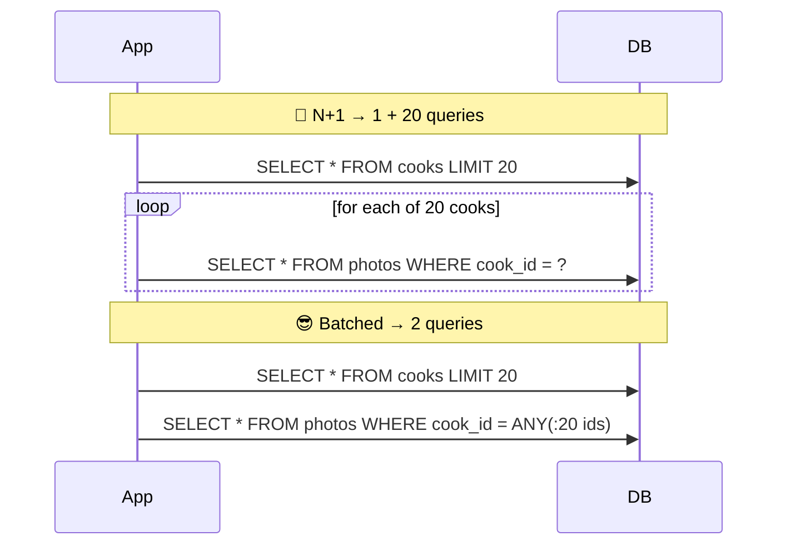
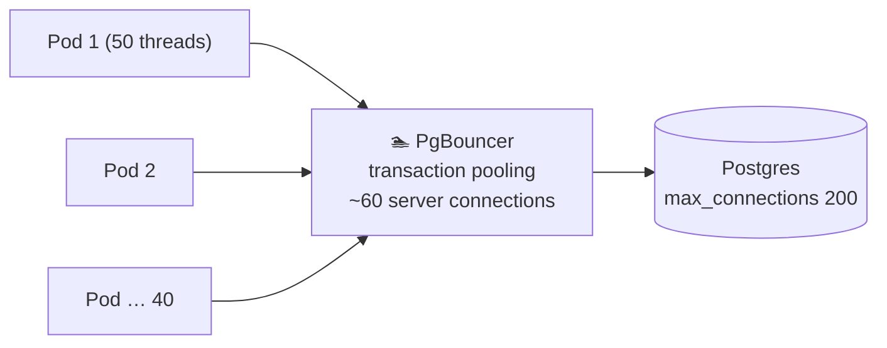

# 040 · Access Patterns, the N+1 Problem & Connection Pooling

> ⏱ 9 min · 📈 40% · 🅰️ Part A (core) · Phase 05: Databases
>
> `████████░░░░░░░░░░░░` 40% of the whole guide

---

## 📖 Story

Maya opens the trace for the **"Cooks near you"** page, and her jaw drops.

The trace isn't a bar. It's a **staircase**: one query for the list of 100 cooks, then **one query per cook** for their photo, then another per cook for their rating. **201 round trips**, each a few milliseconds, stacked one on top of another like a tower of plates. The page takes **1.9 seconds**, and the database CPU is barely at 20%. It isn't working hard. It's being **interrupted to death**.

Then, at 7 p.m., the autoscaler adds 30 new app pods. Each pod opens a pool of 50 database connections. Postgres hits `max_connections = 500`, and the log turns red:

```
FATAL: sorry, too many clients already
```

New pods can't connect. Old pods start timing out.

I've made both of these mistakes in production. Let me show you the two simple fixes.

## 🎯 One-sentence idea

**Design data around how it's actually read and written (access patterns), never run one query per item in a loop (the N+1 problem), and reuse database connections through a pool instead of opening new ones per request.**

## 🧸 Analogy

Shopping for a recipe with **10 ingredients**:

- 🤦 **N+1:** drive to the store, buy **one** item, drive home, check the list, drive back… **11 trips**.
- 😎 **Batching:** read the whole list, then **one trip**.
- 🚗 **Pooling:** instead of **buying a new car per trip** (a new DB connection: TCP + TLS + auth + a server process), share a **fleet of ready cars**.

## 🖼️ Visual

*Diagram brief:* on the left, a staircase of 21 tiny query bars (N+1). On the right, two fat bars (batched). Below, many app instances funnelling through a narrow pooler into a database with a small, fixed number of connections.





## 🔬 How it works

- **Access patterns first:** list every query with its **frequency** ("cook by ID: 50k/s", "user's last 20 orders: 5k/s", "monthly revenue: 1/day"). Design keys, indexes, and denormalization so the **hot** ones are cheap, and push rare heavy ones elsewhere (the warehouse).
- **N+1:** one list query + one per item. It's the classic ORM lazy-loading trap. Fix it with a **JOIN**, a batched **`WHERE id = ANY(...)`**, ORM **eager loading** (`select_related`, `includes`, `JOIN FETCH`), or a GraphQL **DataLoader**.
- **Connections are expensive:** each Postgres connection is a **backend process (~5–10 MB)**, and setup costs TCP + TLS + auth (~ms). Past roughly **2–4× the DB's cores**, extra concurrency just causes lock, CPU, and cache contention.
- **Pool at two layers:** **in-app pools** (HikariCP, SQLAlchemy) plus an **external pooler** (PgBouncer, RDS Proxy, ProxySQL) when there are many instances or serverless functions. **Transaction pooling** lends a server connection only for one transaction.
- **Size with Little's Law:** connections ≈ **QPS × average query time**, × ~2 for headroom. It's almost always smaller than people guess.

## 🧩 Worked example

```python
# 🤦 N+1: 1 + 100 queries
for cook in Cook.objects.filter(city="london")[:100]:
    print(cook.photo.url)

# 😎 1 query with a JOIN
for cook in Cook.objects.select_related("photo").filter(city="london")[:100]:
    print(cook.photo.url)

# 😎 2 queries for many-to-many
Cook.objects.prefetch_related("specialities").filter(city="london")[:100]
```

**Maya's page:** 201 queries × ~9 ms = **1.9 s** → **3 queries = 25 ms**.

**Pool sizing:**

```
Peak 3,000 queries/s × 4 ms avg = 12 connections busy at any instant
→ ~25–50 real DB connections is plenty
NOT 40 pods × 50 = 2,000 😱
PgBouncer multiplexes 2,000 client connections onto ~50 server connections
```

| Query | Freq | Pattern | Solution |
|---|---|---|---|
| Cook profile | 50k/s | by PK | PK lookup + cache |
| User's recent orders | 5k/s | by user, sorted by time | Index `(user_id, created_at DESC)` |
| Dish text search | 2k/s | full-text | Search engine |
| Daily revenue by city | 1/day | full aggregate | Warehouse |

## ⚖️ Trade-offs

| Maya's choice | What she gains | What she pays |
|---|---|---|
| JOIN / eager loading | Few round trips | May fetch more than needed |
| Batched `IN (...)` | Few round trips, simple | Huge lists need chunking |
| A big connection pool | Absorbs bursts | DB contention: slower past a point |
| PgBouncer transaction mode | Thousands of clients | Session features break (session-level prepared statements, temp tables, `SET`) |

## 🌍 Real world

- **N+1** is among the most common performance bugs in Rails, Django, and Hibernate apps. **Bullet** (Rails) and APM tools flag it.
- **PgBouncer** fronts Postgres at most large deployments. **AWS RDS Proxy** exists largely because Lambda bursts open thousands of connections.
- The **HikariCP** "About Pool Sizing" guide argues that small pools beat big ones.

## 📌 Cheat card

> - **List the queries + frequencies first.** Design for the hot ones.
> - **N+1 = a query inside a loop** → JOIN, `ANY(...)`, eager loading, DataLoader.
> - **Pool size ≈ QPS × query time × 2.**
> - Many instances or serverless → **external pooler**.
> - Heavy analytics → **not on the OLTP primary**.

## 🧪 Feynman check

Explain the 11 grocery trips, and why buying a new car per trip is like opening a DB connection per request.

⚠️ **Common confusion:** "A bigger pool means more throughput." Beyond a small number of connections, the database spends its time context-switching and fighting over locks, and **throughput falls while latency rises**. Fewer, busier connections win.

## ⚡ Quick recall

1. What is the N+1 query problem?
<details><summary>Reveal Answer</summary>

One query to fetch N items, then one extra query per item for related data: N+1 round trips instead of 1–2.
</details>

2. Why is opening a DB connection per request bad?
<details><summary>Reveal Answer</summary>

Setup is expensive (TCP/TLS/auth plus a server process and memory), and too many connections overwhelm the database.
</details>

3. How do you estimate connection pool size?
<details><summary>Reveal Answer</summary>

Little's Law: concurrent connections ≈ queries per second × average query duration, plus headroom.
</details>

## 🎤 Interview practice

**Q. "An endpoint listing 100 orders with customer names takes 2 s while DB CPU sits at 15%. Separately, after moving to Lambda, the DB keeps running out of connections. Diagnose and fix both."**
<details><summary>Model answer</summary>

- **The 2 s endpoint:**
  - Low DB CPU but high latency means **latency-bound, not compute-bound**: many sequential tiny queries, classic **N+1** (1 + 100 round trips × 10–20 ms).
  - Confirm with APM traces or the query log (100 identical statements in a tight loop).
  - Fix with a **JOIN** or a batched `WHERE id = ANY(...)`, ORM eager loading, and caching of customer names.
  - Prevent regressions with **query-count assertions** in tests and APM alerts on queries per request.
- **Lambda connection exhaustion:**
  - Each concurrent Lambda instance holds its own connection, so 1,000 concurrent invocations = 1,000 Postgres backends.
  - Put **RDS Proxy / PgBouncer** in front (transaction pooling multiplexes them onto ~50 connections).
  - Create the client **outside the handler** so warm invocations reuse it.
  - **Cap reserved concurrency**, or use an HTTP data API.
- **Likely follow-up:** "What breaks in transaction pooling mode?" → anything session-scoped: session-level prepared statements, advisory locks held across transactions, temp tables, and `SET` variables. Use protocol-level prepared statement support or keep those flows on session mode.
</details>

## 📖 Teaser

> 📖 *The page is fast again, and then someone runs a three-year revenue report on the production database at lunchtime and every checkout in the city freezes.*

---

⬅️ [039 · Normalization vs Denormalization](039-normalization-vs-denormalization.md) · 🗺️ [Phase map](README.md) · ➡️ [✅ Checkpoint 40%](checkpoint-40.md)

✅ **Safe stopping point.** Tick lesson 040 in [PROGRESS.md](../../PROGRESS.md), then do the checkpoint!
