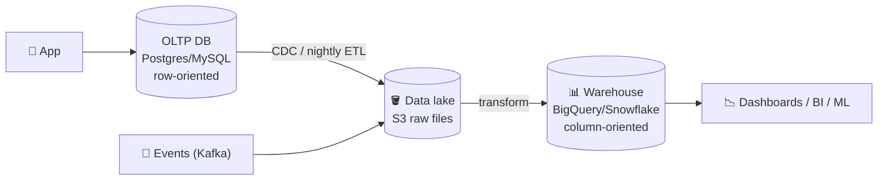
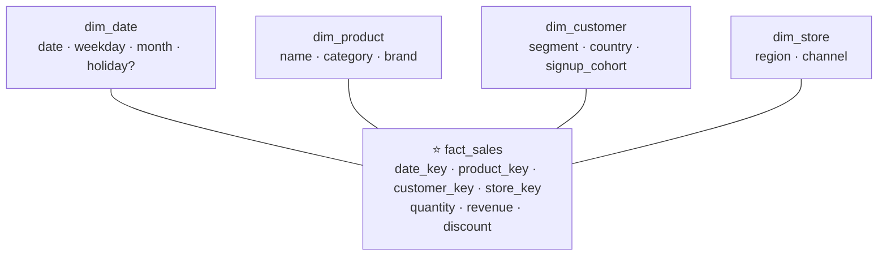

# 041 · OLTP vs OLAP & Data Warehouses

> ⏱ 9 min · 📈 41% · 🅰️ Part A (core) · Phase 05: Databases
>
> `████████░░░░░░░░░░░░` 41% of the whole guide

---

## 🎯 One-sentence idea

**OLTP databases handle many small, fast transactions for the live app ("place this order"). OLAP systems (data warehouses) handle huge analytical scans ("revenue by region for 3 years"). Keep them separate, and move data between them with ETL/ELT pipelines.**

## 🧸 Analogy

A **supermarket**:

- 🛒 **OLTP = the checkout tills.** Thousands of tiny, quick transactions: scan, pay, receipt. They must be fast and correct *right now*.
- 📈 **OLAP = the head office analyst** with a year of receipts, asking "which products sell best on rainy Tuesdays in the north?" Huge reads, not urgent to the second.

If the analyst ran their giant question **at the till**, the checkout lines would freeze. So receipts are **copied to head office every night** (ETL).

## 🖼️ Visual



**Row vs column storage:**

```
Row store (OLTP):   [id=1, name=Ada, city=Paris, total=30] [id=2, name=Bo, city=Rome, total=12] ...
                    → great for "get order 1" (one contiguous row)

Column store (OLAP): id:    [1, 2, 3, ...]
                     city:  [Paris, Rome, Paris, ...]   ← compresses extremely well
                     total: [30, 12, 55, ...]
                    → great for "SUM(total) GROUP BY city" (reads only 2 columns)
```

## 🔬 How it works

| | OLTP | OLAP |
|---|---|---|
| Purpose | Run the business | Understand the business |
| Queries | Point reads and writes by key, short transactions | Big scans, aggregations, joins over history |
| Data | Current state, normalized | Historical, often denormalized (star schema) |
| Storage | **Row-oriented** | **Column-oriented** (+ compression) |
| Latency | ms | seconds to minutes (fine for reports) |
| Examples | Postgres, MySQL, DynamoDB | BigQuery, Snowflake, Redshift, ClickHouse, Databricks |

- **Columnar storage:** reading 3 columns out of 100 → read ~3% of the data. Similar values compress 5–10×+. Vectorized execution.
- **ETL vs ELT:**
  - **ETL:** Extract → Transform → Load (transform before loading).
  - **ELT:** load raw into the lake/warehouse, then transform with SQL (dbt). This is the modern default.
- **Data lake:** cheap object storage (S3) holding raw files (Parquet/JSON). **Lakehouse:** tables with ACID over the lake (Delta Lake, Iceberg, Hudi).
- **Star schema:** a central **fact table** (sales: one row per event, with measures) + **dimension tables** (date, product, store: descriptive attributes).
- **Getting data in:** nightly batch dumps, **CDC** streams (Debezium), or app events via Kafka (lesson 059).
- **HTAP** systems (TiDB, SingleStore) try to do both, with trade-offs.

## 🧩 Worked example

**Star schema for an online shop:**



```sql
-- OLAP query: revenue by category and month for 3 years (billions of rows, seconds in a warehouse)
SELECT p.category, d.month, SUM(f.revenue)
FROM fact_sales f
JOIN dim_product p ON p.product_key = f.product_key
JOIN dim_date d    ON d.date_key = f.date_key
WHERE d.year BETWEEN 2023 AND 2025
GROUP BY 1, 2;
```

Running this on the production Postgres would scan billions of rows, evict the hot cache, and slow down checkout. **That's why they're separate.**

## ⚖️ Trade-offs

| Choice | Gain | Cost |
|---|---|---|
| Separate warehouse | Isolates analytics from prod, fast scans | Pipelines to maintain, data freshness lag |
| Analytics on a read replica | Simple, fresh | Still row-oriented (slow scans), can lag the replica |
| Batch ETL (nightly) | Simple, cheap | Data up to 24 h old |
| Streaming CDC → warehouse | Near-real-time | More infrastructure |
| Real-time OLAP (ClickHouse, Druid, Pinot) | Sub-second analytics on fresh data | Specialized systems |

## 🌍 Real world

- **Snowflake, BigQuery, Redshift, Databricks** dominate cloud warehousing and lakehouses.
- **ClickHouse, Apache Druid, Apache Pinot** power real-time analytics (e.g., user-facing dashboards like "who viewed your profile" at LinkedIn with Pinot).
- **dbt** is the standard tool for ELT transformations in SQL.

## 📌 Cheat card

> - **OLTP = the checkout till** (small, fast, row store). **OLAP = the analyst** (big scans, column store).
> - **Never run heavy analytics on the prod OLTP primary.**
> - Pipeline: **OLTP/events → CDC or ETL → lake (S3) → warehouse → BI**.
> - **Columnar = read only the needed columns + great compression.**
> - Warehouse modelling: **star schema** (facts + dimensions).

## 🧪 Feynman check

Explain the supermarket till vs head-office analyst analogy, and why column storage makes "total sales by city" fast.

⚠️ **Common confusion:** "Just add a read replica for analytics." It helps with isolation, but row-oriented storage still scans slowly, and long queries can conflict with replication. At real scale, use a columnar warehouse.

## ⚡ Quick recall

1. Why are column stores faster for analytics?
<details><summary>Answer</summary>

They read only the columns a query needs, compress similar values heavily, and process data in vectorized batches.
</details>

2. ETL vs ELT?
<details><summary>Answer</summary>

ETL transforms data before loading it into the warehouse. ELT loads raw data first and transforms it inside the warehouse (the modern default).
</details>

3. What are fact and dimension tables?
<details><summary>Answer</summary>

Facts: events with numeric measures (sales). Dimensions: descriptive context (product, date, customer) used to filter and group.
</details>

## 🎤 Interview practice

**Q1. "The business wants a dashboard of revenue by country, updated every few minutes. Our OLTP DB is Postgres. Design it."**
<details><summary>Model answer</summary>

- **Don't** query the Postgres primary.
- **CDC** (Debezium) → **Kafka** → stream into a **real-time OLAP** store (ClickHouse/Pinot/Druid), or micro-batch into a warehouse every few minutes.
- Pre-aggregate if needed (rollups by minute and country).
- The dashboard queries the OLAP store. Freshness is seconds to minutes.
- **Likely follow-up:** "What if they're fine with daily numbers?" → a nightly batch ELT into the warehouse is simpler and cheaper.
</details>

**Q2. "Where would you store 5 years of clickstream events (100 TB) for analysis?"**
<details><summary>Model answer</summary>

- A **data lake on object storage** (S3) in **Parquet** format, partitioned by date (and maybe event type), managed as **Iceberg/Delta tables**.
- Query it with a warehouse or engine (BigQuery external tables, Snowflake, Spark, Trino/Athena).
- Lifecycle policies move old partitions to cheaper storage tiers.
- **Likely follow-up:** "Why Parquet?" → columnar, compressed, splittable, and schema-aware, so engines scan only the needed columns and partitions.
</details>

---

⬅️ [✅ Checkpoint 40%](checkpoint-40.md) · 🗺️ [Phase map](README.md) · ➡️ [042 · Object Storage](042-object-storage.md)

✅ **Safe stopping point.** Tick lesson 041 in [PROGRESS.md](../../PROGRESS.md).
