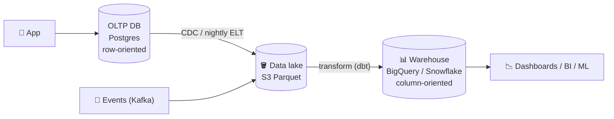
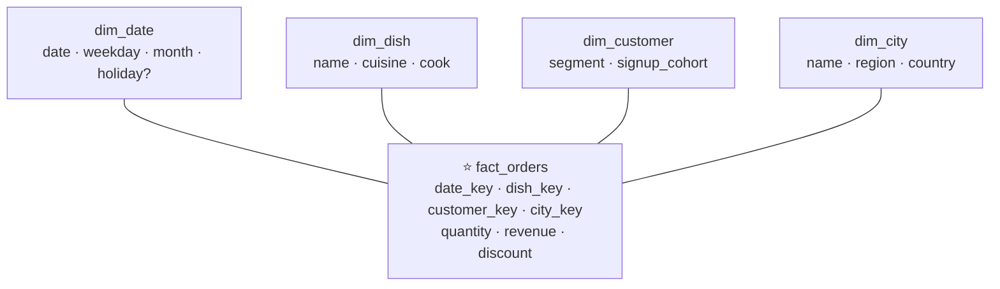

# 041 · OLTP vs OLAP & Data Warehouses

> ⏱ 9 min · 📈 41% · 🅰️ Part A (core) · Phase 05: Databases
>
> `████████░░░░░░░░░░░░` 41% of the whole guide

---

## 📖 Story

12:15 p.m., peak lunch. Maya needs one number for an investor deck: **revenue by city by month for the last three years.**

She opens a SQL console on the **production** database and types the query. It joins orders, line items, dishes, and cities across **400 million rows**. She hits enter and goes to make coffee.

Behind her, Pantry starts to **choke**.

The query drags years of cold data off disk, **evicting the hot pages** that checkout depends on from the buffer pool. Disk I/O pins at 100%. Checkout p99 jumps from 80 ms to **11 seconds**. The order queue backs up like traffic behind a broken-down truck in a tunnel.

She comes back, sees the alerts, and kills the query with shaking hands.

I've watched this happen at companies a hundred times Pantry's size. *Running* the business and *analyzing* the business need **different kinds of databases**.

## 🎯 One-sentence idea

**OLTP databases handle many small, fast transactions for the live app, OLAP systems (data warehouses) handle huge analytical scans over history, so you keep them separate and move data between them with ETL/ELT or CDC pipelines.**

## 🧸 Analogy

A **supermarket**:

- 🛒 **OLTP = the checkout tills.** Thousands of tiny, quick transactions that must be right *now*.
- 📈 **OLAP = the head-office analyst** with a year of receipts asking "what sells best on rainy Tuesdays?"
- If the analyst ran that question **at the till**, the lines would freeze. So receipts are **copied to head office** (ETL).

## 🖼️ Visual

*Diagram brief:* a live app writes to a row-store database. A pipe (CDC/ETL) copies data into a lake, then into a column-store warehouse, which feeds dashboards. Below, the same data laid out by rows vs by columns.



```
Row store:    [id=1, city=Paris, total=30][id=2, city=Rome, total=12] …  ← "get order 1" = one read
Column store: city:  [Paris, Rome, Paris, …]   ← compresses 5–10×+
              total: [30, 12, 55, …]           ← "SUM(total) BY city" reads 2 of 100 columns
```

## 🔬 How it works

- **OLTP** (Postgres, MySQL, DynamoDB): point reads and writes by key, short transactions, current state, normalized, **row-oriented**, millisecond latency.
- **OLAP** (BigQuery, Snowflake, Redshift, ClickHouse, Databricks): scans and aggregations over history, often **star schemas**, **column-oriented** with heavy compression and **vectorized** execution. Seconds of latency is fine.
- **Getting data across:** nightly **batch dumps**, **CDC** (Debezium tailing the WAL), or **app events** through Kafka. **ELT** (load raw, transform in-warehouse with dbt) is the modern default over ETL.
- **Lake and lakehouse:** raw **Parquet** files on object storage, made into ACID tables by **Iceberg / Delta / Hudi** and queried by many engines.
- **Star schema:** a central **fact** table (one row per sale, with measures) surrounded by **dimension** tables (date, dish, customer, city) used to filter and group.

## 🧩 Worked example



```sql
SELECT c.name AS city, d.month, SUM(f.revenue)
FROM fact_orders f
JOIN dim_city c ON c.city_key = f.city_key
JOIN dim_date d ON d.date_key = f.date_key
WHERE d.year BETWEEN 2023 AND 2025
GROUP BY 1, 2;
```

| Where it runs | 400M rows | Effect on checkout |
|---|---|---|
| Production Postgres (row store) | ~6 min, full scan | p99 80 ms → 11 s 💥 |
| Warehouse (column store) | **~4 s**, reads 3 columns, compressed | **None**, fully isolated |

## ⚖️ Trade-offs

| Maya's choice | What she gains | What she pays |
|---|---|---|
| A separate warehouse | Isolation, fast scans | Pipelines to maintain, freshness lag |
| Analytics on a read replica | Simple, fresh | Still row-oriented, and long queries fight replication |
| Nightly batch ELT | Simple, cheap | Data up to 24 h old |
| Streaming CDC → OLAP | Near-real-time numbers | More infrastructure |
| Real-time OLAP (ClickHouse, Pinot, Druid) | Sub-second analytics on fresh data | Specialized systems to run |

## 🌍 Real world

- **Snowflake, BigQuery, Redshift, and Databricks** dominate warehousing and lakehouses.
- **LinkedIn** built **Apache Pinot** for user-facing analytics like "who viewed your profile". **ClickHouse** powers analytics at Cloudflare.
- **dbt** is the de-facto standard for ELT transformations in SQL.

## 📌 Cheat card

> - **OLTP = the till** (small, fast, rows). **OLAP = the analyst** (big scans, columns).
> - **Never run heavy analytics on the prod primary.**
> - Pipeline: **OLTP/events → CDC or ELT → lake → warehouse → BI**.
> - **Columnar = read only the needed columns + great compression.**
> - Model it as a **star schema**.

## 🧪 Feynman check

Explain the till vs the analyst, and why storing data by column makes "total sales by city" fast.

⚠️ **Common confusion:** "Just point analytics at a read replica." It isolates the primary, but a row store still scans slowly, and on Postgres a long query on a hot standby can be **cancelled by replication conflicts** (or, with `hot_standby_feedback`, bloat the primary). At real scale, use a columnar warehouse.

## ⚡ Quick recall

1. Why are column stores faster for analytics?
<details><summary>Reveal Answer</summary>

They read only the columns a query needs, compress similar values heavily, and process data in vectorized batches.
</details>

2. What's the difference between ETL and ELT?
<details><summary>Reveal Answer</summary>

ETL transforms data before loading it into the warehouse. ELT loads raw data first and transforms it inside the warehouse (the modern default).
</details>

3. What are fact and dimension tables?
<details><summary>Reveal Answer</summary>

Facts are events with numeric measures (sales). Dimensions are descriptive context (dish, date, customer) used to filter and group.
</details>

## 🎤 Interview practice

**Q. "The business wants a revenue-by-country dashboard refreshed every few minutes, plus 5 years of clickstream (100 TB) for analysts. The OLTP DB is Postgres. Design it."**
<details><summary>Model answer</summary>

- **Rule one:** nothing touches the Postgres primary except the app.
- **Live dashboard:**
  - **CDC** (Debezium on the WAL) → **Kafka**.
  - Stream into a **real-time OLAP** store (ClickHouse/Pinot/Druid) with **pre-aggregated rollups** by minute × country.
  - The dashboard reads the rollups with sub-second queries and seconds-to-minutes freshness.
  - If daily numbers suffice, a nightly ELT into the warehouse is simpler and cheaper.
- **5 years of clickstream:**
  - Land events in a **data lake** on S3 as **Parquet**, **partitioned by date** (and event type), managed as **Iceberg/Delta** tables (ACID, schema evolution, time travel).
  - Query with **Trino/Athena, Spark, or warehouse external tables**. Partition pruning and columnar reads scan only the needed slice.
  - **Lifecycle tiers** move old partitions to cheaper storage classes.
  - Curate business tables with **dbt** into a **star schema** for BI.
- **Why Parquet?** It's columnar, compressed, splittable, and carries its schema, so engines read only the needed columns and row groups.
- **Likely follow-up:** "How do you handle late or duplicate events?" → event-time partitioning, idempotent merges on event ID, and reprocessing windows in the lakehouse.
</details>

## 📖 Teaser

> 📖 *Analytics has moved out, and now recipe videos, hundreds of megabytes each, start silently filling the database's disk.*

---

⬅️ [✅ Checkpoint 40%](checkpoint-40.md) · 🗺️ [Phase map](README.md) · ➡️ [042 · Object Storage](042-object-storage.md)

✅ **Safe stopping point.** Tick lesson 041 in [PROGRESS.md](../../PROGRESS.md).
