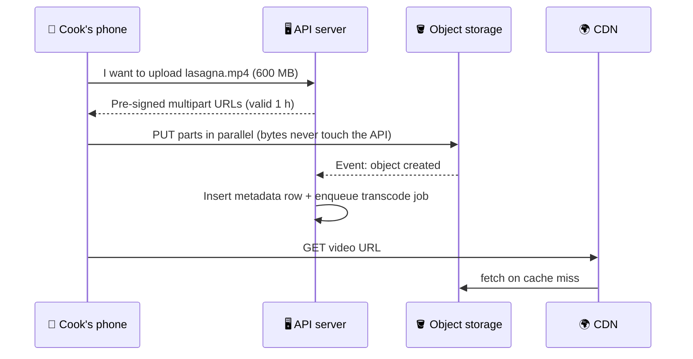

# 042 · Object / Blob Storage

> ⏱ 8 min · 📈 42% · 🅰️ Part A (core) · Phase 05: Databases
>
> `████████░░░░░░░░░░░░` 42% of the whole guide

---

## 📖 Story

Pantry's cooks love the new feature: **recipe videos**. They upload them by the hundreds, 200 MB here, 600 MB there.

Maya has been storing them the quick way: as `BYTEA` columns **inside Postgres**.

Now the database is **4 TB**, and **3.7 TB of it is video**. The nightly backup takes **nine hours** and is still running when the morning rush begins. Every new read replica has to copy terabytes of video before it can serve a single query. The buffer pool, the RAM meant to hold hot rows like orders, keeps getting flushed by a single cooking clip. And the disk alarm reads **91% full**.

It's like keeping all your furniture in the kitchen drawers. Technically it fits, and nothing else works.

I told her I'd done exactly the same thing on my first project. She needs a home built for big files: **cheap, endless, and nearly impossible to lose.**

## 🎯 One-sentence idea

**Object storage (S3, GCS, Azure Blob) keeps whole files by key in practically unlimited, extremely durable, cheap buckets, which makes it the right home for images, video, backups, and data lakes, and the wrong home for data you edit in small pieces or query.**

## 🧸 Analogy

A **giant warehouse of labelled boxes**:

- Hand over a box and a **label** (`videos/cook7/lasagna.mp4`), and copies are stored in several buildings.
- Get it back by its label, replace it, or delete it.
- You **can't** reach in and edit page 5. You swap the whole box.
- **Cheap per shelf**, and it never runs out of shelves.

## 🖼️ Visual

*Diagram brief:* the client asks the API for a signed ticket, then hands the box straight to the warehouse, completely bypassing the app servers. A "box arrived" bell triggers processing, and the CDN serves the result.



## 🔬 How it works

- **Buckets + keys in a flat namespace:** "folders" are just prefixes. You **PUT/GET whole objects**, with no in-place partial edits (use range GETs to read slices).
- **Durability and consistency:** data is replicated or **erasure-coded across AZs**. S3 is designed for **11 nines** of durability and offers **strong read-after-write** consistency.
- **Blobs in storage, metadata in the DB:** the owner, size, type, status, and permissions live in a row whose `object_key` points at the blob.
- **Pre-signed URLs + multipart:** the API signs a short-lived URL, and the client uploads or downloads **directly**. Large files go in **parallel parts** (5 MB–5 GB each, required above 5 GB), retrying only the failed parts.
- **Events and lifecycle:** an "object created" event triggers transcoding, scanning, or indexing. **Lifecycle rules** move cold objects to infrequent-access or archive tiers and expire temp uploads. Put a **CDN** in front for reads (lesson 023).

## 🧩 Worked example

```python
url = s3.generate_presigned_url(
    "put_object",
    Params={"Bucket": "pantry-media", "Key": f"raw/{cook_id}/{uuid4()}.mp4",
            "ContentType": "video/mp4"},
    ExpiresIn=3600,
)   # the client PUTs bytes straight to storage; the API never touches them
```

**Maya's migration results:**

| Metric | Video in Postgres | Video in S3 + CDN |
|---|---|---|
| DB size | 4 TB | **300 GB** |
| Nightly backup | 9 h | **40 min** |
| New replica bootstrap | ~12 h | **~1 h** |
| Storage cost (3.7 TB) | SSD + replicas ≈ $1,500/mo | **≈ $85/mo** (~$0.023/GB) |

| Data | Home | Why |
|---|---|---|
| Videos, photos | Object storage + CDN | Big blobs, cheap, durable |
| Video metadata | Database | Queried and updated |
| DB data files | Block storage (EBS) | Random in-place writes |
| Shared config for servers | File storage (EFS/NFS) | POSIX semantics |
| Backups, logs, data lake | Object storage + archive tiers | Cheap at massive scale |

## ⚖️ Trade-offs

| | Object | Block | File | Database |
|---|---|---|---|---|
| Access | HTTP API by key | Raw disk, one VM | Shared POSIX | Queries |
| Partial updates | ❌ | ✅ | ✅ | ✅ |
| Scale | ♾️ | TBs per volume | Large | Varies |
| Cost/GB | 💲 Lowest | 💲💲 | 💲💲💲 | 💲💲💲 |

## 🌍 Real world

- **Amazon S3** stores hundreds of trillions of objects, and its API is a de-facto standard (MinIO, Cloudflare R2, Backblaze B2).
- **Dropbox** moved exabytes from S3 to its own **Magic Pocket** system.
- **Data lakes** (Parquet on S3) underpin modern analytics (lesson 041).

## 📌 Cheat card

> - **Labelled boxes in an infinite warehouse.** Whole-object PUT/GET by key.
> - **Blobs in storage, metadata in the DB.**
> - **Pre-signed URLs** → clients move the bytes directly.
> - **Multipart** for big files, **lifecycle rules** for cost.
> - **11 nines durability.** Put a **CDN** in front.

## 🧪 Feynman check

Explain the warehouse of boxes, why you can't edit page 5 inside a box, and why customers should drop boxes off directly instead of carrying them through your office.

⚠️ **Common confusion:** "Durable means backed up." 11 nines protects against **hardware loss**, not against **you** deleting or overwriting objects. Turn on **versioning**, **object lock** for compliance, and **cross-region replication** for disaster recovery.

## ⚡ Quick recall

1. What's a pre-signed URL?
<details><summary>Reveal Answer</summary>

A time-limited, signed URL that lets a client upload or download one specific object directly, without holding storage credentials.
</details>

2. Why is multipart upload useful?
<details><summary>Reveal Answer</summary>

It uploads large files in parallel parts, retries only the failed parts, and supports very large objects.
</details>

3. Where should an uploaded file's owner and tags live?
<details><summary>Reveal Answer</summary>

In a database (metadata), with the object key referencing the file in object storage.
</details>

## 🎤 Interview practice

**Q. "Design the upload pipeline for a photo app handling 1,000 uploads/s of 3 MB photos, and explain why not just store files on the app servers."**
<details><summary>Model answer</summary>

- **Upload:**
  - The client requests a **pre-signed PUT** (the API checks auth and enforces size and type limits).
  - The client uploads **directly to object storage**, so ~**3 GB/s** of bytes never touch the app tier.
  - The key carries a random prefix for spread and no PII.
- **Processing:**
  - An **object-created event** → a queue → workers generate sizes and WebP/AVIF variants, **strip EXIF GPS**, and run moderation.
  - Variants are written back to storage.
  - The metadata row moves `processing → ready`.
- **Serving:** through a **CDN**, with **signed CDN URLs** for private photos.
- **Capacity:** 3 MB × 1,000/s × 86,400 ≈ **260 TB/day** of originals → **lifecycle tiering**, and consider re-encoding originals.
- **Hygiene:** a lifecycle rule expires orphaned objects under `uploads/tmp/` (clients that never confirm). Turn on versioning to protect against accidental deletes.
- **Why not the app servers' disks:**
  - They become **stateful** (no free scaling or replacement, lesson 018).
  - Disks fill up, a disk failure loses data, and serving bytes wastes app CPU and bandwidth.
  - Object storage brings durability, infinite scale, cost tiers, and CDN integration.
- **Likely follow-up:** "Object storage first-byte latency is ~tens of ms. Is that a problem?" → not behind a CDN. Hot objects are served from the edge.
</details>

## 📖 Teaser

> 📖 *Videos have a proper home now, and then a customer searches "spicy vegan noodels" and Pantry confidently answers: zero results.*

---

⬅️ [041 · OLTP vs OLAP](041-oltp-vs-olap.md) · 🗺️ [Phase map](README.md) · ➡️ [043 · Search & Inverted Index](043-search-and-inverted-index.md)

✅ **Safe stopping point.** Tick lesson 042 in [PROGRESS.md](../../PROGRESS.md).
