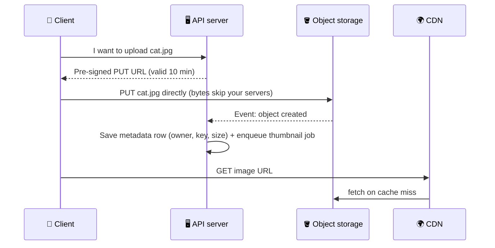

# 042 · Object / Blob Storage

> ⏱ 8 min · 📈 42% · 🅰️ Part A (core) · Phase 05: Databases
>
> `████████░░░░░░░░░░░░` 42% of the whole guide

---

## 🎯 One-sentence idea

**Object storage (S3, GCS, Azure Blob) stores files ("objects") by key in practically unlimited, very durable, cheap buckets. It's the right home for images, video, backups, and data lakes, and the wrong home for data you update in small pieces or query.**

## 🧸 Analogy

A **giant warehouse of labelled boxes**:

- You hand over a box and a **label** (`photos/user42/cat.jpg`), and the warehouse stores it **somewhere safe** (actually, copies in several buildings).
- You can get the whole box back by its label, or replace it, or delete it.
- You **can't** reach inside and change one page of a book in the box. You swap the whole box.
- It's **cheap per shelf**, and it never runs out of shelves.

Compare with a **filing cabinet with folders you edit in place** (a file system/block storage) or a **spreadsheet you query** (a database).

## 🖼️ Visual



## 🔬 How it works

- **Buckets + keys:** a flat namespace (`bucket/key`). "Folders" are just key prefixes.
- **Objects are immutable-ish:** you **PUT whole objects** (or use multipart upload for big ones). There are no in-place partial edits.
- **Durability:** replicated or erasure-coded across devices and availability zones. S3 advertises **11 nines** (99.999999999%) durability.
- **Consistency:** S3 now offers **strong read-after-write consistency** for PUTs and DELETEs.
- **Cost tiers:** hot (Standard), infrequent access, archive (Glacier), with **lifecycle rules** to move old objects automatically.
- **Metadata goes in a database:** store the owner, size, content type, and permissions in your DB, with the object key pointing to the blob.
- **Pre-signed URLs:** your API signs a time-limited URL, and clients **upload or download directly** to storage. Your servers never handle the bytes.
- **Multipart upload:** split big files into parts (e.g., 5–100 MB), upload them in parallel, and retry failed parts only. Needed above ~100 MB (and required above 5 GB on S3).
- **Event notifications:** "object created" → trigger thumbnailing, virus scans, and indexing (via queue or Lambda).
- **Pair it with a CDN** for global, fast reads (lesson 023).

## 🧩 Worked example

**Generating a pre-signed upload URL (Python, boto3):**

```python
url = s3.generate_presigned_url(
    "put_object",
    Params={"Bucket": "user-photos", "Key": f"u/{user_id}/{uuid4()}.jpg",
            "ContentType": "image/jpeg"},
    ExpiresIn=600,                        # 10 minutes
)
# Return `url` to the client → the client PUTs the file bytes directly to S3
```

**Storage choice cheat table:**

| Data | Where | Why |
|---|---|---|
| Profile photos, videos | Object storage + CDN | Big blobs, cheap, durable |
| Photo metadata (owner, tags) | Database | Queried, updated |
| Database files | Block storage (EBS) | Random in-place writes |
| Shared config files for servers | File storage (EFS/NFS) | POSIX file semantics |
| Backups, logs, data lake | Object storage (+ archive tiers) | Cheap at massive scale |

**Cost intuition** (illustrative list prices): standard object storage is roughly **$0.02/GB-month**, so **1 PB ≈ $20k/month**. Archive tiers can be ~10–20× cheaper, with retrieval delays.

## ⚖️ Trade-offs

| | Object storage | Block storage | File storage | Database |
|---|---|---|---|---|
| Access | HTTP API by key | Raw disk to one VM | Shared POSIX FS | Queries |
| Partial updates | ❌ Whole object | ✅ | ✅ | ✅ |
| Scale | ♾️ | Per volume (TBs) | Large | Varies |
| Cost/GB | 💲 Lowest | 💲💲 | 💲💲💲 | 💲💲💲 |
| Best for | Media, backups, lakes | DB and VM disks | Shared files | Structured data |

## 🌍 Real world

- **Amazon S3** holds hundreds of trillions of objects. Its API has become a de-facto standard (MinIO, Cloudflare R2, Backblaze B2 are S3-compatible).
- **Dropbox** moved its storage from S3 to its own system (Magic Pocket) at exabyte scale.
- **Data lakes** (Parquet on S3) underpin modern analytics (lesson 041).

## 📌 Cheat card

> - **Object storage = labelled boxes in an infinite warehouse.** Whole-object PUT/GET by key.
> - **Blobs in S3, metadata in a DB.**
> - **Pre-signed URLs** → clients upload and download directly. Servers skip the bytes.
> - **Multipart** for big files. **Lifecycle rules** for cost tiers.
> - **11 nines durability.** Put a **CDN** in front for speed.

## 🧪 Feynman check

Explain the labelled-box warehouse, why you can't "edit page 5 inside the box," and why you should let customers drop boxes off directly instead of carrying them through your office.

⚠️ **Common confusion:** Storing images as BLOBs in the relational database. It bloats backups and replicas, wastes the buffer cache, and costs far more per GB. Put the blob in object storage, and the key in the DB.

## ⚡ Quick recall

1. What's a pre-signed URL?
<details><summary>Answer</summary>

A time-limited, signed URL that lets a client upload or download a specific object directly from storage without having credentials.
</details>

2. Why is multipart upload useful?
<details><summary>Answer</summary>

It uploads large files in parallel parts, retries only failed parts, and supports very large objects.
</details>

3. Where should you keep an uploaded file's owner and tags?
<details><summary>Answer</summary>

In a database (metadata), with the object key referencing the file in object storage.
</details>

## 🎤 Interview practice

**Q1. "Design the upload flow for a photo-sharing app handling 1,000 uploads/s of 3 MB photos."**
<details><summary>Model answer</summary>

- The client asks the API for a **pre-signed PUT URL** (auth, size and type limits) → **uploads directly to S3** (3 GB/s of bytes never touch the app servers).
- An S3 event → queue → **workers** generate thumbnails and sizes, strip EXIF location data, and run moderation. They write the variants to S3.
- Metadata row in the DB (`photo_id, owner, key, status=processing→ready`).
- Serve through a **CDN**. Private photos use signed CDN URLs.
- Storage: 3 MB × 1,000/s × 86,400 ≈ **260 TB/day** of originals, so use lifecycle tiering and consider compressing originals.
- **Likely follow-up:** "What if the client uploads but never confirms?" → cleanup job for orphaned objects (a lifecycle rule on an `uploads/tmp/` prefix).
</details>

**Q2. "Why not just store files on the app servers' disks?"**
<details><summary>Model answer</summary>

- The app servers become **stateful** (you can't scale out or replace them freely, lesson 018), disks fill up, there's no redundancy (a disk failure = data loss), and serving files wastes app CPU and bandwidth.
- Object storage gives durability, unlimited scale, cheap tiers, and direct CDN integration.
- **Likely follow-up:** "What about latency for small, frequently read files?" → the CDN plus caching solves reads, and object storage first-byte latency (~tens of ms) is fine behind a CDN.
</details>

---

⬅️ [041 · OLTP vs OLAP](041-oltp-vs-olap.md) · 🗺️ [Phase map](README.md) · ➡️ [043 · Search & Inverted Index](043-search-and-inverted-index.md)

✅ **Safe stopping point.** Tick lesson 042 in [PROGRESS.md](../../PROGRESS.md).
