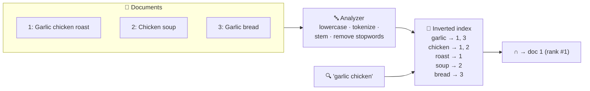
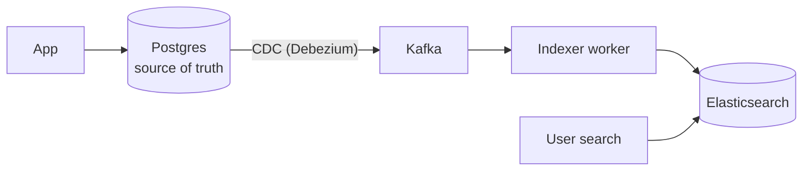

# 043 · Search & the Inverted Index

> ⏱ 9 min · 📈 43% · 🅰️ Part A (core) · Phase 05: Databases
>
> `████████░░░░░░░░░░░░` 43% of the whole guide

---

## 📖 Story

A customer searches for "spicy vegan noodels" (typo included) and gets zero results, even though Pantry has forty matching dishes. The database's simple text matching can't handle typos, word forms, or ranking. Maya needs a real search engine.

## 🎯 One-sentence idea

**Search engines flip the data around: instead of "document → words," they store "word → list of documents containing it" (an inverted index). That makes full-text search across millions of documents fast, with relevance ranking on top.**

## 🧸 Analogy

The **index at the back of a cookbook**, but for *every* word:

- "garlic → recipes 3, 17, 42"
- "chicken → recipes 17, 42, 88"
- Want "chicken **and** garlic"? **Intersect** the lists → 17, 42. You never read a single recipe.
- Then **rank** them: the recipe that mentions garlic 5 times in the title probably beats one that mentions it once in a footnote.

## 🖼️ Visual



## 🔬 How it works

- **Analysis (at index time and query time):**
  - **Tokenize** ("Garlic-Chicken!" → `garlic`, `chicken`), **lowercase**, remove **stopwords** ("the", "a"), **stem/lemmatize** ("running" → `run`), **synonyms** ("tv" = "television").
- **Inverted index:** term → **postings list** (doc IDs, plus positions and frequencies). Sorted lists make intersection fast.
- **Relevance ranking:** **TF-IDF / BM25**: a term matters more if it's *frequent in this doc* (TF) and *rare across all docs* (IDF). Plus boosts (title > body), freshness, popularity, and personalization.
- **Features:** phrase search (uses positions), fuzzy matching (typos via edit distance), prefix and autocomplete, **facets/aggregations** (filter by brand, price range), highlighting, and geo filters.
- **Scaling:** the index is split into **shards** (each a Lucene index) with **replicas**. A query fans out to all shards, and the results are merged (scatter-gather).
- **Near-real-time:** new docs become searchable after a **refresh** (~1 s in Elasticsearch), not instantly.
- **Architecture rule:** the search engine is **not your source of truth**. Keep data in the DB, and **sync it to search** via events/CDC (lesson 031). Rebuild the index from the source if needed.
- **Semantic/vector search:** embeddings + **nearest-neighbour** indexes (HNSW) find *meaning* ("cheap laptop" ≈ "budget notebook"). Often combined with keyword search as **hybrid search** (lesson 044).

## 🧩 Worked example

**Why SQL `LIKE` isn't search:**

```sql
SELECT * FROM products WHERE description LIKE '%wireless headphones%';
-- ❌ full table scan (a leading wildcard can't use a B-tree)
-- ❌ no ranking, no typos ("wireles"), no stemming ("headphone")
```

**Elasticsearch query with a boost, fuzziness, filter, and facet:**

```json
POST /products/_search
{
  "query": {
    "bool": {
      "must": {
        "multi_match": {
          "query": "wireles headphones",
          "fields": ["title^3", "description"],
          "fuzziness": "AUTO"
        }
      },
      "filter": [{ "range": { "price": { "lte": 200 } } }]
    }
  },
  "aggs": { "brands": { "terms": { "field": "brand" } } }
}
```

**Keeping it in sync:**



## ⚖️ Trade-offs

| Choice | Gain | Cost |
|---|---|---|
| DB full-text (Postgres `tsvector`) | No extra system, transactional | Limited relevance and scale |
| Dedicated engine (Elasticsearch/OpenSearch/Solr) | Rich relevance, facets, scale | Another cluster, sync pipeline, eventual consistency |
| Managed search (Algolia, Elastic Cloud) | Fast to ship, great typo tolerance | Cost, less control |
| Vector search | Semantic matching | Embedding cost, less exact, tuning |

## 🌍 Real world

- **Elasticsearch/OpenSearch** power product search, log search (the ELK stack), and site search at countless companies. All are built on **Apache Lucene**.
- **GitHub code search**, **Wikipedia search** (CirrusSearch on Elasticsearch), **Shopify** product search.
- **Google** built the ultimate inverted index, with ranking signals like PageRank.

## 📌 Cheat card

> - **Inverted index = word → list of docs.** Search = look up + **intersect** + **rank (BM25)**.
> - **Analyzers:** tokenize, lowercase, stem, stopwords, synonyms.
> - Search is **not the source of truth**. Sync it from the DB via **CDC/events**.
> - `LIKE '%x%'` = full scan, no relevance → use a **search engine**.
> - Shards + replicas, **scatter-gather** queries, **~1 s refresh** (near-real-time).

## 🧪 Feynman check

Explain the cookbook index analogy, how "chicken AND garlic" is answered without reading any recipe, and why one recipe ranks above another.

⚠️ **Common confusion:** "Elasticsearch can be our main database." It isn't designed for transactions, strong consistency, or guaranteed durability of every write. Use it as a **derived, rebuildable index**.

## ⚡ Quick recall

1. What does an inverted index map?
<details><summary>Answer</summary>

Each term to the list of documents (and positions) that contain it.
</details>

2. What does IDF reward?
<details><summary>Answer</summary>

Terms that are rare across the whole collection (more distinctive, so more informative).
</details>

3. Why is a search index usually eventually consistent with the DB?
<details><summary>Answer</summary>

It's updated asynchronously (events/CDC plus the engine's refresh interval), so there's a short lag after writes.
</details>

## 🎤 Interview practice

**Q1. "Design product search for an e-commerce site with 50M products."**
<details><summary>Model answer</summary>

- **Elasticsearch/OpenSearch** cluster: products sharded (e.g., 20–50 shards) with replicas. Fields: title (boosted), description, brand, category, price, rating, stock.
- **Ingestion:** DB → CDC → Kafka → indexer (bulk API), idempotent upserts by product ID.
- **Query:** multi_match with fuzziness + filters (price, category, in-stock) + facets (brand, size) + a ranking blend (text relevance + popularity + conversion rate).
- **Autocomplete:** a separate edge-n-gram or completion index (lesson 093).
- **Performance:** cache popular queries, and the scatter-gather p99 depends on the slowest shard.
- **Likely follow-up:** "How do you reindex with a new mapping without downtime?" → build a new index in the background, dual-write, then switch an **alias** atomically.
</details>

**Q2. "Search results show an item that was deleted 2 minutes ago. Why, and is it OK?"**
<details><summary>Model answer</summary>

- The search index lags the DB (the async pipeline, a refresh interval, or a failed or stuck consumer).
- Mitigate: monitor consumer lag, retry failed index updates, and **filter results against the source of truth** at display time (e.g., check that the IDs still exist or are in stock in the DB/cache) for critical cases.
- A short lag is usually acceptable. A lag of minutes signals a pipeline problem.
- **Likely follow-up:** "How do you handle deletes in CDC?" → a tombstone event → a delete-by-ID in the index.
</details>

> 📖 *Next time: Leo asks about fridge sensors, courier locations, and "dishes similar to this one."*

---

⬅️ [042 · Object Storage](042-object-storage.md) · 🗺️ [Phase map](README.md) · ➡️ [044 · Specialized Databases](044-specialized-databases.md)

✅ **Safe stopping point.** Tick lesson 043 in [PROGRESS.md](../../PROGRESS.md).
