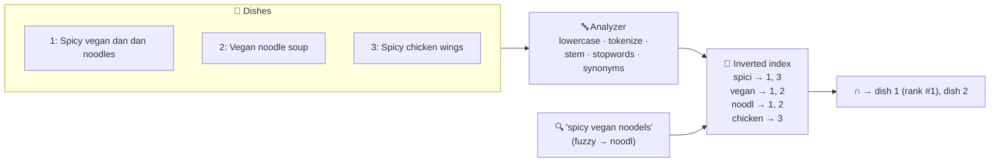
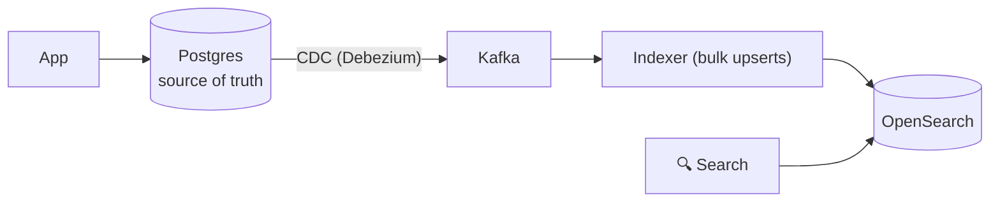

# 043 · Search & the Inverted Index

> ⏱ 9 min · 📈 43% · 🅰️ Part A (core) · Phase 05: Databases
>
> `████████░░░░░░░░░░░░` 43% of the whole guide

---

## 📖 Story

A hungry customer types into Pantry's search bar, thumbs moving fast:

**`spicy vegan noodels`**

Pantry thinks for **2.4 seconds**, then answers with a blank white page: **"No results found."**

There are **forty** matching dishes. But the search was a SQL `LIKE '%spicy vegan noodels%'`, which:

- scanned **every one of 2 million dishes** (a leading wildcard can't use a B-tree),
- choked on the typo,
- didn't know "noodle" and "noodles" are the same word,
- and couldn't rank a "Spicy Vegan Dan Dan Noodles" title above a passing mention in a footnote.

The customer closes the app and orders somewhere else.

I'll show you how real search engines work. It's one of my favourite "aha" moments to teach: you **flip the data inside out**.

## 🎯 One-sentence idea

**Search engines invert the data: instead of "document → words" they store "word → documents containing it" (an inverted index), so full-text search across millions of documents is fast, typo-tolerant, and ranked by relevance.**

## 🧸 Analogy

The **index at the back of a cookbook**, but for *every* word:

- "garlic → recipes 3, 17, 42" · "chicken → recipes 17, 42, 88"
- "chicken **and** garlic"? **Intersect** the lists → 17, 42, without reading a single recipe.
- Then **rank**: garlic five times in the title beats once in a footnote.

## 🖼️ Visual

*Diagram brief:* documents flow through an "analyzer" grinder (lowercase, split, stem) and come out as a card catalogue of word → document lists. A query enters, two lists are intersected, and the ranked winner pops out.



## 🔬 How it works

- **Analysis, at index time and query time:** **tokenize** → **lowercase** → drop **stopwords** → **stem/lemmatize** ("noodles" → `noodl`) → **synonyms** ("chilli" = "chili"). The same analyzer must run on both sides.
- **Inverted index:** term → a **postings list** of sorted doc IDs (plus positions and frequencies). Boolean queries become fast **merges and intersections** of sorted lists. Positions enable **phrase** queries.
- **Ranking with BM25:** a term counts more if it's frequent *in this doc* (TF, with saturation) and **rare across the corpus** (IDF), normalized by doc length. Then add field boosts (title^3), freshness, popularity, and personalization.
- **Typos and features:** **fuzzy** matching (Levenshtein edit distance ≤ 2), prefix/autocomplete, **facets** (aggregations), highlighting, and geo filters. **Near-real-time:** new docs are searchable after a **~1 s refresh**.
- **Architecture rule:** search is a **derived, rebuildable index**, not the source of truth. Sync from the DB via **CDC/events**, and scale with **shards + replicas** via **scatter-gather** queries. **Vector/semantic search** (embeddings + HNSW) is often blended in as **hybrid** search (lesson 044).

## 🧩 Worked example

```json
POST /dishes/_search
{
  "query": {
    "bool": {
      "must": {
        "multi_match": {
          "query": "spicy vegan noodels",
          "fields": ["title^3", "description", "tags^2"],
          "fuzziness": "AUTO"
        }
      },
      "filter": [{ "term": { "available": true } },
                 { "geo_distance": { "distance": "5km", "location": [-0.12, 51.5] } }]
    }
  },
  "aggs": { "cuisines": { "terms": { "field": "cuisine" } } }
}
```

**Result:** 40 hits in **~25 ms**, "Spicy Vegan Dan Dan Noodles" ranked #1, plus cuisine facets for filtering.



## ⚖️ Trade-offs

| Maya's choice | What she gains | What she pays |
|---|---|---|
| Postgres `tsvector` full-text | No new system, transactional | Limited relevance, typo handling, and scale |
| Elasticsearch/OpenSearch/Solr | Rich relevance, facets, scale | Another cluster, a sync pipeline, eventual consistency |
| Managed (Algolia, Elastic Cloud) | Fast to ship, great typo tolerance | Cost, less control |
| Vector search | Matches meaning | Embedding cost, fuzzier precision |

## 🌍 Real world

- **Elasticsearch/OpenSearch/Solr** are all built on **Apache Lucene**, and power product search, the ELK log stack, and site search.
- **Wikipedia** (CirrusSearch), **GitHub code search**, and **Shopify** product search.
- **Google** is the ultimate inverted index, with ranking signals like PageRank layered on top.

## 📌 Cheat card

> - **Inverted index = word → docs.** Search = look up → **intersect** → **rank (BM25)**.
> - **Analyzers** (tokenize, lowercase, stem, synonyms) run on **both** index and query.
> - `LIKE '%x%'` = full scan, no relevance → use a **search engine**.
> - Search is **derived**: sync from the DB via **CDC**, and **rebuild via alias swap**.
> - Shards + replicas · scatter-gather · **~1 s refresh**.

## 🧪 Feynman check

Explain the cookbook index, how "chicken AND garlic" is answered without opening a single recipe, and why one recipe ranks above another.

⚠️ **Common confusion:** "Elasticsearch can be our main database." It isn't built for transactions, strong consistency, or guaranteed durability of every acknowledged write. Treat it as a **derived index you can always rebuild** from the source of truth.

## ⚡ Quick recall

1. What does an inverted index map?
<details><summary>Reveal Answer</summary>

Each term to the list of documents (and positions) that contain it.
</details>

2. What does IDF reward?
<details><summary>Reveal Answer</summary>

Terms that are rare across the whole collection, because they're more distinctive and informative.
</details>

3. Why is a search index usually eventually consistent with the DB?
<details><summary>Reveal Answer</summary>

It's updated asynchronously (events/CDC plus the engine's refresh interval), so there's a short lag after writes.
</details>

## 🎤 Interview practice

**Q. "Design product search for 50M products. Then: a deleted item still shows in results two minutes later. Why, and how do you change the index mapping without downtime?"**
<details><summary>Model answer</summary>

- **Cluster:**
  - OpenSearch/Elasticsearch with **~20–50 primary shards** (aim for 10–50 GB per shard) plus **replicas** for throughput and HA.
  - Fields: title (boosted), description, brand, category, price, rating, `in_stock`, and a geo point if relevant.
- **Ingestion:** DB → **CDC** → Kafka → indexer using the **bulk API**, with **idempotent upserts by product ID**. Deletes arrive as **tombstones** → delete-by-ID.
- **Query:**
  - `multi_match` with `fuzziness: AUTO`, plus filters (price, category, in-stock) and **facets**.
  - Ranking blends BM25 with popularity and conversion signals, and optionally **hybrid** vector similarity.
- **Autocomplete:** a separate edge-n-gram or completion index (lesson 093).
- **Performance:** cache hot queries. Scatter-gather p99 is set by the **slowest shard**, so watch hot shards and use replicas.
- **The ghost item:**
  - The index **lags the DB**: async pipeline + refresh interval, or a **stuck consumer**.
  - Monitor consumer lag, retry failed updates with a dead-letter queue, and **filter results against the source of truth** at display time for critical fields (still exists? in stock?).
  - Seconds of lag is normal. Minutes means a broken pipeline.
- **Zero-downtime remapping:**
  - Create `products_v2` with the new mapping and **backfill** it from the source.
  - **Dual-write** new changes to both indexes.
  - **Atomically swap the alias** `products → products_v2`, then delete v1.
- **Likely follow-up:** "Why not one giant shard?" → shards are the unit of parallelism and recovery. One huge shard means slow queries and very slow recovery.
</details>

## 📖 Teaser

> 📖 *Search finally understands hungry humans, and then Pantry starts collecting fridge-temperature sensor data, live courier coordinates, and a request for "dishes like this one".*

---

⬅️ [042 · Object Storage](042-object-storage.md) · 🗺️ [Phase map](README.md) · ➡️ [044 · Specialized Databases](044-specialized-databases.md)

✅ **Safe stopping point.** Tick lesson 043 in [PROGRESS.md](../../PROGRESS.md).
