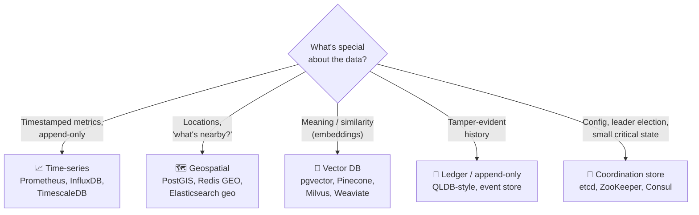

# 044 · Time-Series & Other Specialized Stores

> ⏱ 8 min · 📈 44% · 🅰️ Part A (core) · Phase 05: Databases
>
> `████████░░░░░░░░░░░░` 44% of the whole guide

---

## 🎯 One-sentence idea

**Some data has such a distinctive shape (metrics over time, locations, vectors, immutable ledgers) that purpose-built databases handle it 10–100× better than a general-purpose one. Know they exist, and know when to reach for them.**

## 🧸 Analogy

A **toolbox**. A general-purpose database is a **Swiss-army knife**: it does everything decently. But if you're cutting 10,000 planks a day, you buy a **table saw** (a time-series DB). For screws, a **power drill** (a geo index). The knife still has a place, but specialists win at their one job.

## 🖼️ Visual



## 🔬 How it works

- **📈 Time-series databases (TSDB):**
  - Data = (metric name, **tags/labels**, timestamp, value). Extremely **write-heavy, append-only**, mostly queried by **time range** and aggregated.
  - Tricks: **columnar + delta/Gorilla compression** (10×+), time partitioning, **downsampling/rollups** (1 s → 1 min → 1 h), **retention policies** (drop old raw data).
  - ⚠️ **High cardinality** (too many unique tag combinations, like a `user_id` tag) explodes memory.
  - Examples: **Prometheus** (monitoring, pull-based), **InfluxDB**, **TimescaleDB** (Postgres extension), **VictoriaMetrics**.
- **🗺️ Geospatial:**
  - Indexes like **R-trees**, **geohash**, **quadtrees**, **S2 cells** answer "within 2 km of me" fast (lesson 095).
  - Examples: **PostGIS**, **Redis `GEOADD`/`GEOSEARCH`**, MongoDB 2dsphere, Elasticsearch geo_point.
- **🧭 Vector databases:**
  - Store **embeddings** (arrays of numbers representing meaning, from ML models) and find **nearest neighbours** using approximate indexes (**HNSW**, IVF).
  - Used for semantic search, recommendations, and **RAG** for LLM apps.
  - Examples: **pgvector**, Pinecone, Milvus, Weaviate, Qdrant, and vector support in Elasticsearch/OpenSearch.
- **📜 Ledger / append-only stores:** immutable, cryptographically verifiable history (hash chains), and event stores for event sourcing (lesson 089).
- **🔐 Coordination stores:** tiny, **strongly consistent** (Raft/ZAB) key-value stores for configuration, service discovery, locks, and leader election (lessons 071, 085, 086). **Not** for bulk data.
- **Rule:** start with Postgres + extensions (TimescaleDB, PostGIS, pgvector) and move to dedicated systems when scale or features demand it.

## 🧩 Worked example

**Prometheus metric + query:**

```
http_requests_total{service="checkout", status="500", region="eu"}  → counter

# Error rate per service over 5 min
sum by (service) (rate(http_requests_total{status=~"5.."}[5m]))
  /
sum by (service) (rate(http_requests_total[5m]))
```

**Redis geo: drivers near a rider:**

```bash
GEOADD drivers -122.4194 37.7749 "driver:17"
GEOSEARCH drivers FROMLONLAT -122.42 37.78 BYRADIUS 2 km ASC COUNT 10
```

**pgvector semantic search:**

```sql
CREATE EXTENSION vector;
CREATE TABLE docs (id bigserial, body text, embedding vector(768));
CREATE INDEX ON docs USING hnsw (embedding vector_cosine_ops);

SELECT id, body FROM docs
ORDER BY embedding <=> :query_embedding     -- cosine distance
LIMIT 5;
```

**Cardinality trap:**

```
Labels: service (20) × endpoint (50) × status (10) × region (5) = 50,000 series ✅
Add user_id (10M users) → 500 BILLION series 💥 → never label metrics with unbounded IDs
```

## ⚖️ Trade-offs

| Store | Gain | Cost |
|---|---|---|
| Postgres + extension | One system, SQL, transactions | Less scale than dedicated systems |
| Dedicated TSDB | Compression, fast time queries, retention | Another system, limited query model |
| Vector DB | Fast semantic similarity | Approximate results, embedding pipeline |
| Coordination store | Strong consistency for tiny critical state | Low throughput, small data only |

## 🌍 Real world

- **Prometheus + Grafana** is the default open-source monitoring stack.
- **Uber** built H3 (hexagonal geo indexing). **Lyft/Uber** geo-index millions of driver updates.
- **Kubernetes** stores all cluster state in **etcd**.
- **RAG** apps (chatbots over your docs) use vector search, often pgvector or managed vector DBs.

## 📌 Cheat card

> - **Metrics → TSDB** (compression, downsampling, retention). Watch **cardinality**.
> - **Nearby → geo index** (geohash, R-tree, S2, H3).
> - **Similar meaning → vector index** (HNSW).
> - **Tiny critical config and locks → etcd/ZooKeeper.**
> - **Start with Postgres extensions**, and specialize when needed.

## 🧪 Feynman check

Explain the toolbox analogy, and give one example of data that deserves a specialist tool and why.

⚠️ **Common confusion:** "etcd/ZooKeeper is a fast key-value database." They're built for **consistency**, not throughput or size, and every write goes through consensus. Keep them for small coordination data.

## ⚡ Quick recall

1. Why do TSDBs compress so well?
<details><summary>Answer</summary>

Consecutive timestamps and values change little, so delta and XOR encoding plus columnar storage shrink them dramatically.
</details>

2. What is metric cardinality and why does it matter?
<details><summary>Answer</summary>

The number of unique label combinations (series). High cardinality (e.g., per-user labels) explodes memory and slows queries.
</details>

3. What does a vector database do?
<details><summary>Answer</summary>

It stores embeddings and quickly finds the most similar vectors (approximate nearest neighbours) for semantic search and recommendations.
</details>

## 🎤 Interview practice

**Q1. "Design storage for monitoring metrics from 10,000 servers, each emitting 500 metrics every 10 s."**
<details><summary>Model answer</summary>

- Ingest = 10,000 × 500 / 10 = **500k samples/s**.
- A **TSDB** (Prometheus with remote storage like Thanos/Cortex/Mimir, or VictoriaMetrics), sharded by series, replicated.
- ~1–2 bytes/sample compressed → ~1 MB/s → ~86 GB/day raw. Retain raw data for 15 days, and downsample to 5 min/1 h rollups for a year.
- Control cardinality (no per-request IDs in labels).
- **Likely follow-up:** "Pull vs push?" → Prometheus pulls (easy health detection, and the server controls load). Push suits short-lived jobs and IoT (via a gateway).
</details>

**Q2. "How would you add 'semantic search' to an existing product search?"**
<details><summary>Model answer</summary>

- Generate **embeddings** for products (an offline batch job, plus on update) and for queries (at request time).
- Store them in a **vector index** (pgvector, OpenSearch k-NN, or a vector DB) using **HNSW**.
- **Hybrid ranking:** combine BM25 keyword scores and vector similarity (e.g., reciprocal rank fusion), and still apply filters (price, stock).
- Evaluate with click-through and relevance judgments, and cache embeddings for popular queries.
- **Likely follow-up:** "Why not vectors only?" → exact matches (SKUs, brand names) and filters work better with keyword search, so hybrid gets both.
</details>

---

⬅️ [043 · Search & Inverted Index](043-search-and-inverted-index.md) · 🗺️ [Phase map](README.md) · ➡️ [045 · Choosing a Database](045-choosing-a-database.md)

✅ **Safe stopping point.** Tick lesson 044 in [PROGRESS.md](../../PROGRESS.md).
