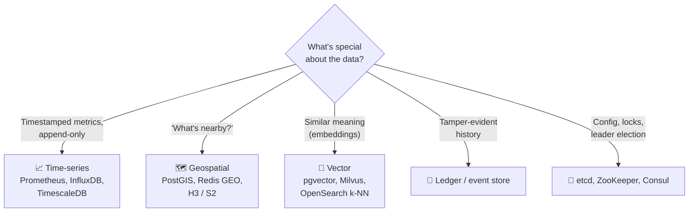

# 044 · Time-Series & Other Specialized Stores

> ⏱ 8 min · 📈 44% · 🅰️ Part A (core) · Phase 05: Databases
>
> `████████░░░░░░░░░░░░` 44% of the whole guide

---

## 📖 Story

Three new firehoses have just been connected to Pantry, all at once.

**Firehose one:** 2,000 partner kitchens now have **smart fridges**, each reporting its temperature **every second**. That's 172 million rows a day, and Postgres's disk usage climbs a gigabyte an hour.

**Firehose two:** couriers stream **GPS coordinates** every 3 seconds, and the dispatch screen needs *"every courier within 2 km of this kitchen, right now."* A `WHERE` clause with trigonometry over every courier row takes 800 ms.

**Firehose three:** Maya wants a "**dishes like this one**" carousel. Not "same tags", but *similar in spirit*: a creamy mushroom risotto should suggest a truffle orzo.

Maya asks if one database can handle it all. A general-purpose database *can*, the way a Swiss-army knife *can* cut down a tree.

There are specialist databases shaped for exactly these jobs. Let me introduce them.

## 🎯 One-sentence idea

**Some data has such a distinctive shape (metrics over time, locations, embeddings, immutable history, tiny critical config) that purpose-built stores handle it 10–100× better than a general-purpose database, so know they exist and know when to reach for them.**

## 🧸 Analogy

A **toolbox**: a general-purpose database is a **Swiss-army knife**. Cutting 10,000 planks a day? Buy a **table saw** (a time-series DB). Driving screws? A **power drill** (a geo index). The knife still has its place, but specialists win at their one job.

## 🖼️ Visual

*Diagram brief:* a decision fork that starts from "what's special about this data?" and ends at five labelled specialist tools.



## 🔬 How it works

- **📈 Time-series DBs:** `(metric, labels, timestamp, value)` arrives append-only and is queried by **time range + aggregation**. They use **columnar + delta-of-delta/XOR (Gorilla) compression** (~1–2 bytes/sample), time partitioning, **downsampling** (1 s → 1 min → 1 h), and **retention** policies. The killer is **cardinality**: every unique label combination is a new series held in memory.
- **🗺️ Geospatial:** **R-trees, geohash, quadtrees, S2/H3 cells** turn "within 2 km" into a few index range lookups instead of a full scan (lesson 095). Options include PostGIS, Redis `GEOSEARCH`, and Elasticsearch `geo_point`.
- **🧭 Vector search:** ML **embeddings** (e.g. 768 floats) capture meaning, and **approximate nearest neighbour** indexes (**HNSW**, IVF) return the closest vectors in milliseconds, trading a little recall for huge speed. It powers semantic search, recommendations, and **RAG**.
- **📜 Ledgers / event stores:** immutable, append-only history, often hash-chained for tamper evidence. They're the backbone of event sourcing (lesson 089).
- **🔐 Coordination stores:** tiny, **strongly consistent** (Raft/ZAB) KV stores for config, discovery, locks, and leader election (lessons 071, 085, 086). Every write goes through **consensus**, so they're never for bulk data. **Default to Postgres + extensions** (TimescaleDB, PostGIS, pgvector) and graduate to dedicated systems when scale demands it.

## 🧩 Worked example

**Fridge alerts (PromQL):** the share of kitchens running warm.

```
avg_over_time(fridge_temp_celsius{kitchen=~".+"}[5m]) > 5
```

**Couriers near a kitchen (Redis GEO, sub-millisecond):**

```bash
GEOADD couriers -0.1278 51.5074 "courier:17"
GEOSEARCH couriers FROMLONLAT -0.13 51.51 BYRADIUS 2 km ASC COUNT 10
```

**"Dishes like this one" (pgvector):**

```sql
CREATE EXTENSION vector;
CREATE TABLE dish_vecs (dish_id bigint PRIMARY KEY, embedding vector(768));
CREATE INDEX ON dish_vecs USING hnsw (embedding vector_cosine_ops);

SELECT dish_id FROM dish_vecs
ORDER BY embedding <=> (SELECT embedding FROM dish_vecs WHERE dish_id = 42)
LIMIT 8;                                        -- ~5 ms over 2M dishes
```

**The cardinality trap:**

```
kitchen (2,000) × sensor (3) × region (10) = 60,000 series ✅
add order_id as a label (millions) → billions of series 💥  Never label metrics with unbounded IDs.
```

## ⚖️ Trade-offs

| Maya's choice | What she gains | What she pays |
|---|---|---|
| Postgres + extensions | One system, SQL, transactions | Lower ceiling than dedicated systems |
| A dedicated TSDB | 10×+ compression, fast range queries, retention | Another system, a narrower query model |
| A vector index | Semantic similarity in ms | Approximate results, an embedding pipeline |
| A coordination store | Linearizable tiny state | Low throughput, small data only |

## 🌍 Real world

- **Prometheus + Grafana** is the default open-source monitoring stack.
- **Uber** open-sourced **H3** hexagonal geo indexing. **Google** uses **S2** cells.
- **Kubernetes** keeps all cluster state in **etcd**.
- **RAG chatbots** retrieve context with vector search, often through pgvector or managed vector DBs.

## 📌 Cheat card

> - **Metrics → TSDB** (compression, rollups, retention). **Guard cardinality.**
> - **Nearby → geo index** (geohash, R-tree, S2, H3).
> - **Similar meaning → vector index** (HNSW).
> - **Tiny critical state → etcd/ZooKeeper.**
> - **Start with Postgres extensions.** Specialize when needed.

## 🧪 Feynman check

Explain the toolbox, and give one example of data that deserves a specialist tool and exactly why the Swiss-army knife struggles with it.

⚠️ **Common confusion:** "etcd/ZooKeeper is a fast key-value database." It's built for **consistency**, not throughput or size. Every write is a consensus round, and etcd's default storage quota is just a few GB. Use it for coordination, never as a data store.

## ⚡ Quick recall

1. Why do TSDBs compress so well?
<details><summary>Reveal Answer</summary>

Consecutive timestamps and values change little, so delta and XOR encoding plus columnar storage shrink them dramatically.
</details>

2. What is metric cardinality, and why does it matter?
<details><summary>Reveal Answer</summary>

The number of unique label combinations (series). High cardinality (e.g. per-user labels) explodes memory and slows queries.
</details>

3. What does a vector database do?
<details><summary>Reveal Answer</summary>

It stores embeddings and quickly finds the most similar ones (approximate nearest neighbours) for semantic search and recommendations.
</details>

## 🎤 Interview practice

**Q. "Design metrics storage for 10,000 servers × 500 metrics every 10 s. Then add semantic search to an existing keyword product search."**
<details><summary>Model answer</summary>

- **Metrics:**
  - Ingest = 10,000 × 500 ÷ 10 = **500k samples/s**.
  - A **TSDB**: Prometheus scrapers with remote-write into a horizontally scalable backend (Mimir/Thanos/VictoriaMetrics), **sharded by series** and replicated.
  - At ~1.5 bytes/sample: **~750 KB/s ≈ 65 GB/day**. Keep raw data 15 days, then **downsample** to 5 min/1 h rollups kept for a year in object storage.
  - **Cardinality budget per team**, with no request or user IDs in labels.
  - **Pull vs push:** pull gives free up/down detection and server-controlled load. Push (via a gateway) suits short-lived jobs and IoT.
- **Semantic search:**
  - **Embed** products offline (and on update), and embed queries at request time (cache hot query embeddings).
  - Store vectors in an **HNSW** index (pgvector, OpenSearch k-NN, or a vector DB).
  - **Hybrid ranking:** fuse BM25 and vector scores (e.g. **reciprocal rank fusion**), and keep **filters** (price, stock) as hard constraints.
  - Evaluate offline (NDCG on judged queries) and online (CTR, conversion) with an A/B test.
- **Likely follow-up:** "Why not vectors only?" → exact matches (SKUs, brand names, "size 10") and strict filters are where keyword search wins. Hybrid gets both.
</details>

## 📖 Teaser

> 📖 *Pantry now runs six different kinds of database, and a sharp-eyed reviewer asks Maya to justify every single one of them.*

---

⬅️ [043 · Search & Inverted Index](043-search-and-inverted-index.md) · 🗺️ [Phase map](README.md) · ➡️ [045 · Choosing a Database](045-choosing-a-database.md)

✅ **Safe stopping point.** Tick lesson 044 in [PROGRESS.md](../../PROGRESS.md).
