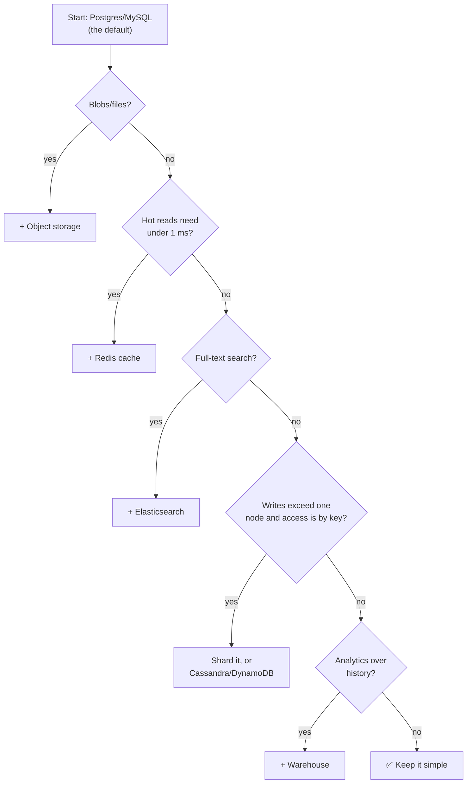

# 045 · How to Choose a Database

> ⏱ 8 min · 📈 45% · 🅰️ Part A (core) · Phase 05: Databases
>
> `█████████░░░░░░░░░░░` 45% of the whole guide

---

## 📖 Story

A new hire studies Pantry's architecture diagram and asks, "Why so many databases?" Maya realizes she should be able to justify every single one. Let's learn a repeatable way to choose, so that you never pick a database based on hype again.

## 🎯 One-sentence idea

**Choose a database by answering five questions: what's the data shape, what are the access patterns, how consistent must it be, how big and fast will it get, and what can your team operate? Default to boring, proven choices, and add specialists only for specific needs.**

## 🧸 Analogy

Choosing a **vehicle**:

- Moving furniture? A **van** (bulk storage: object storage).
- Commuting daily with passengers, where safety matters? A **reliable family car** (Postgres: the sensible default).
- Delivering 10,000 parcels a day on fixed routes? A **fleet of delivery trucks** (Cassandra/DynamoDB: massive, predictable workloads).
- Racing? A **sports car** (Redis: blazing fast, but not for moving house).

No one vehicle is "best." The **job** decides.

## 🖼️ Visual

## 🔬 How it works

**The five questions:**

1. **Shape:** relational (entities + relationships)? documents? key → blob? time series? graph? files?
2. **Access patterns:** by primary key? ranges? ad-hoc filters? full-text? aggregations? traversals? What's the read:write ratio?
3. **Consistency & transactions:** multi-row atomicity needed? Is strong consistency required, or is eventual OK?
4. **Scale & latency:** QPS (reads and writes), data size and growth, latency targets, multi-region needs.
5. **Operations & team:** managed vs self-hosted? team expertise? cost? ecosystem and tooling?

**Sensible defaults:**

| Need | Default choice |
|---|---|
| Core business data | **PostgreSQL** (or MySQL) |
| Cache / sessions / counters / leaderboards | **Redis** |
| Files, media, backups | **S3-compatible object storage** |
| Search | **Elasticsearch/OpenSearch** |
| Events / streams | **Kafka** |
| Analytics | **BigQuery/Snowflake/ClickHouse** |
| Massive key-based writes | **DynamoDB / Cassandra** |
| Metrics | **Prometheus-compatible TSDB** |

**Red flags:**

- Choosing on hype ("everyone uses X").
- A NoSQL DB with relational, ad-hoc query needs.
- Too many databases for a small team, where each adds on-call burden.
- Search or cache treated as the source of truth.

## 🧩 Worked example

**Designing storage for a food-delivery app.**

| Data | Shape / access | Choice | Why |
|---|---|---|---|
| Users, restaurants, menus, orders, payments | Relational, transactions | **Postgres** (sharded by region/city later) | Integrity and money |
| Courier live locations | 100k updates/s, "nearby" queries, ephemeral | **Redis GEO** (in memory) | Speed, TTL, geo queries |
| Order status events | Stream, many consumers | **Kafka** | Fan-out to notifications, analytics, ETA |
| Menu photos | Blobs | **S3 + CDN** | Cheap, durable, fast |
| Restaurant search ("sushi near me, open now") | Text + geo + filters | **Elasticsearch** | Relevance + geo + facets |
| Business analytics | Big scans | **Warehouse** | Isolated from prod |
| Courier location history | Time series, huge | **Object storage (Parquet)** or a TSDB | Cheap retention |

That's 6 systems, and each is **justified by a distinct need**. A 3-person startup might start with **Postgres + Redis + S3** and add the others later.

## ⚖️ Trade-offs

| Approach | Gain | Cost |
|---|---|---|
| One general DB for everything | Simplicity, one thing to operate | Hits limits for special workloads |
| Polyglot persistence | Best tool per job | Ops burden, data sync, consistency across stores |
| Managed services | Less ops | Cost, lock-in |
| Self-hosted | Control, cost at scale | On-call, expertise |

## 🌍 Real world

- **Uber** has used MySQL (Schemaless), Cassandra, Redis, and Kafka, each for different needs.
- **Instagram** grew on Postgres + Redis + Memcached, and added Cassandra for specific high-write features.
- Many successful startups run **only Postgres** (plus Redis) for years.

## 📌 Cheat card

> - **Five questions: shape, access patterns, consistency, scale, team.**
> - **Default: Postgres + Redis + S3.** Add search, Kafka, a warehouse, or NoSQL **for a specific reason**.
> - **One source of truth.** Caches and indexes are **derived**.
> - **Justify every extra database** with a need the default can't meet.
> - Full chooser: [DATABASE-CHOOSER.md](../../cheatsheets/DATABASE-CHOOSER.md)

## 🧪 Feynman check

Use the vehicle analogy to explain why a food-delivery app might use Postgres, Redis, *and* S3, and why that's not over-engineering.

⚠️ **Common confusion:** "We need to pick the DB that scales to a billion users." Pick what fits **today's** requirements with a **clear path** for growth. Premature scaling choices slow you down.

## ⚡ Quick recall

1. What are the five questions for choosing a database?

Answer

Data shape, access patterns, consistency/transactions, scale/latency, team/operations.

2. What's the sensible default stack for a new product?

Answer

A relational DB (Postgres/MySQL) + Redis for caching + object storage for files.

3. Why is "polyglot persistence" a trade-off?

Answer

You get the best tool for each job, but pay in operational burden and in keeping data synchronized and consistent across stores.

## 🎤 Interview practice

**Q1. "Which database would you use for [X]?" (the general strategy)**

Model answer

- Don't name a product first. **State the access patterns and requirements** ("reads by user ID, 50k QPS, needs transactions for balance updates…").
- Map them to a **category** (relational / KV / wide-column / …), then name a product and **why**.
- Mention the trade-off and the growth path ("Postgres now. Shard by user_id past ~10 TB or ~20k writes/s").
- **Likely follow-up:** "What would make you change your choice?" → name a concrete trigger: a write volume ceiling, multi-region active-active needs, or query patterns shifting to search or analytics.

**Q2. "Design the storage layer for a URL shortener (100M new links/day, 10B redirects/day)."**

Model answer

- Writes: 100M/day ≈ 1,200/s. Reads: 10B/day ≈ 115k/s (peak ~300k/s). Read-heavy, key-value access (`short → long`).
- **Store:** DynamoDB/Cassandra (a simple key lookup, easy horizontal scale), or sharded Postgres keyed by short code. ~500 bytes × 100M/day × 365 × 5 years ≈ 90 TB → a distributed store.
- **Cache:** Redis/CDN for hot links (a power-law distribution), so most redirects never hit the DB.
- **Analytics:** click events → Kafka → warehouse (not the KV store).
- **Likely follow-up:** "How do you generate unique short codes?" → lessons 072 and 074 (counter + base62, or a pre-generated key pool).

> 📖 *Next time: Chapter 6 begins. Pantry goes national, and one database machine is no longer enough.*

---

⬅️ [044 · Specialized Databases](044-specialized-databases.md) · 🗺️ [Phase map](README.md) · ➡️ [✅ Checkpoint 45%](checkpoint-45.md)

✅ **Safe stopping point.** Tick lesson 045 in [PROGRESS.md](../../PROGRESS.md), then do the checkpoint!
