# 🗄️ Phase 05: Databases

> **Lessons 034–045 · 34% → 45% · 🅰️ Part A (core)**
> By the end of this phase you'll **choose the right database for the job**, understand **transactions and indexes**, and model data around **how it's accessed**.

## 📖 Chapter 5: A Home for Every Kind of Data

By now Pantry's database was a junk drawer of orders, recipes, chats, videos, and reports. In this chapter, I'll teach you what I taught Maya: what makes data safe (transactions), fast to find (indexes), and well-shaped (modelling), and how to give each kind of data its proper home: relational, NoSQL, warehouse, object storage, search engine, or specialist store.

## 🗺️ Phase map

```mermaid
flowchart LR
    L34["034<br/>SQL vs NoSQL"] --> L35["035<br/>ACID"]
    L35 --> C35{{"✅ 35%"}}
    C35 --> L36["036<br/>Isolation<br/>levels"]
    L36 --> L37["037<br/>Indexes"]
    L37 --> L38["038<br/>NoSQL<br/>families"]
    L38 --> L39["039<br/>Normalize vs<br/>denormalize"]
    L39 --> L40["040<br/>Access patterns,<br/>N+1, pooling"]
    L40 --> C40{{"✅ 40%"}}
    C40 --> L41["041<br/>OLTP vs<br/>OLAP"]
    L41 --> L42["042<br/>Object<br/>storage"]
    L42 --> L43["043<br/>Search &<br/>inverted index"]
    L43 --> L44["044<br/>Specialized<br/>stores"]
    L44 --> L45["045<br/>Choosing a<br/>database"]
    L45 --> C45{{"✅ 45%"}}
```

| # | Lesson | ⏱ | One-line idea |
|---|---|---|---|
| 034 | [SQL vs NoSQL](034-sql-vs-nosql.md) | 9 min | Tables + joins + transactions vs flexible shapes + easy horizontal scale |
| 035 | [ACID](035-acid.md) | 8 min | All or nothing, rules hold, no peeking, survives crashes |
| ✅ | [Checkpoint 35%](checkpoint-35.md) | 15 min | |
| 036 | [Transactions & isolation levels](036-transactions-and-isolation.md) | 10 min | How much can concurrent transactions see of each other? |
| 037 | [Indexes](037-indexes.md) | 10 min | The book's index: find rows without reading every page |
| 038 | [NoSQL families](038-nosql-families.md) | 10 min | Key-value, document, wide-column, graph |
| 039 | [Normalization vs denormalization](039-normalization-vs-denormalization.md) | 9 min | Store facts once (integrity) vs copy them (read speed) |
| 040 | [Access patterns, N+1 & connection pooling](040-access-patterns-and-pooling.md) | 9 min | Design for your queries, and don't make 101 calls where 2 will do |
| ✅ | [Checkpoint 40%](checkpoint-40.md) | 15 min | 🎉 Level-up! |
| 041 | [OLTP vs OLAP & data warehouses](041-oltp-vs-olap.md) | 9 min | Many small transactions vs huge analytical scans |
| 042 | [Object/blob storage](042-object-storage.md) | 8 min | Cheap, infinite buckets for files |
| 043 | [Search & inverted index](043-search-and-inverted-index.md) | 9 min | How search engines find words fast |
| 044 | [Time-series & specialized stores](044-specialized-databases.md) | 8 min | The right tool for metrics, geo, vectors, ledgers |
| 045 | [Choosing a database](045-choosing-a-database.md) | 8 min | A repeatable decision process |
| ✅ | [Checkpoint 45%](checkpoint-45.md) | 15 min | |

📌 [Phase cheatsheet](CHEATSHEET.md) · 🎤 [Phase interview questions](INTERVIEW-QUESTIONS.md) · 🗄️ [Database chooser](../../cheatsheets/DATABASE-CHOOSER.md)

⬅️ Previous phase: [04 Caching](../04-caching/README.md) · ➡️ Next phase: [06 Scaling data](../06-scaling-data/README.md)
