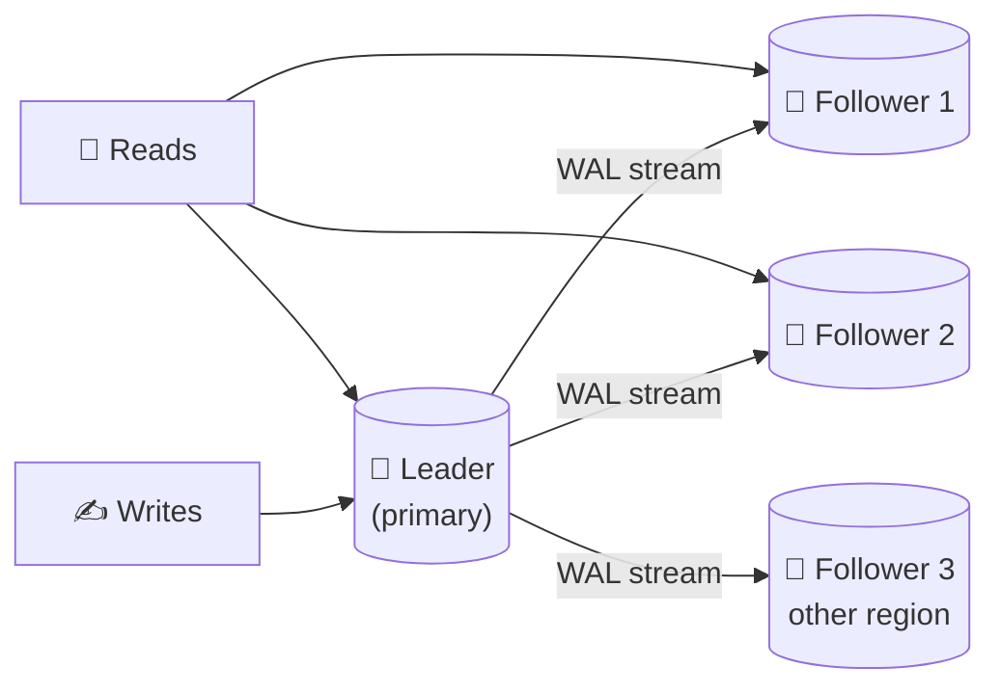

# 046 · Leader–Follower Replication

> ⏱ 9 min · 📈 46% · 🅰️ Part A (core) · Phase 06: Scaling Data
>
> `█████████░░░░░░░░░░░` 46% of the whole guide

---

## 📖 Story

Pantry goes **nationwide** on a Monday. By Wednesday, the database is drowning.

**40,000 reads per second** pound against a single Postgres machine that comfortably handles ten. Every menu view, every order history, every "track my courier" is a hand reaching into the same small box. CPU sits at 97%.

And there's a colder fear underneath. That machine is the **only** copy of Pantry's data. If its disk dies tonight, Pantry doesn't just go down. It **forgets**: every order, every cook, every payout.

Maya decides to keep **copies** of the data on several machines. Copies can share the reading. Copies can take over if the original dies.

But before she touches a config file, I ask her the two questions I'll ask you:

**Who is allowed to write?** And **how do the copies stay in step?**

## 🎯 One-sentence idea

**Replication keeps copies of the same data on several machines, and in leader–follower replication all writes go to one leader, which streams its change log to followers that serve reads and stand ready to take over if the leader dies.**

## 🧸 Analogy

A **teacher and classroom notebooks**:

- Only the **teacher** (leader) writes on the **whiteboard**.
- **Students** (followers) copy everything into notebooks, and anyone can read a student's notebook.
- If the teacher falls ill, the **most up-to-date student becomes the teacher** (failover).
- Slow copiers are a line or two behind (**replication lag**).

## 🖼️ Visual

*Diagram brief:* one crowned leader receiving all write arrows. Thin "change log" pipes flow out to three followers (one in another region). Read arrows fan across all of them.



## 🔬 How it works

- **Writes go only to the leader**, which appends each change to its log (**Postgres WAL**, **MySQL binlog**) and streams it to followers, which **replay it in order**. Followers scale **reads and availability, never writes**: each one must replay *every* write.
- **Sync vs async:** **synchronous** means the leader waits for a follower's ACK (zero loss on failover, slower writes, and a stall if that follower dies). **Asynchronous** means it ACKs immediately (fast, but **acknowledged writes can be lost**). **Semi-sync** waits for **≥ 1** follower, the common compromise.
- **Failover:** detect leader death (heartbeat timeout) → **promote the most up-to-date follower** → repoint clients and the other followers. Tools: Patroni + etcd, RDS Multi-AZ, Orchestrator.
- **Failover hazards:** **split brain** (the old leader wakes up and keeps writing, so you need **fencing**, lesson 086), **lost writes** under async, and **timeout tuning** (too short = false failovers, too long = long outages).
- **New followers** bootstrap from a **snapshot + log replay** from the snapshot's position. Followers also host backups and analytics without burdening the leader.

## 🧩 Worked example

```
Load: 40k reads/s, 2k writes/s. One node ≈ 10k reads/s comfortably.
→ 1 leader (all 2k writes + a few reads) + 4 followers (~9k reads/s each)
→ App: writes → writer endpoint, reads → reader endpoint (load-balanced followers)
```

```python
def get_order(order_id):
    return replica_pool.query("SELECT * FROM orders WHERE id=%s", order_id)

def place_order(data):
    return primary.execute("INSERT INTO orders …", data)
```

**The async failover trap:**

```
t0  Leader ACKs write #1001 ("payout sent ✅"), not shipped yet
t1  Leader crashes 💥
t2  Follower A (has up to #1000) is promoted
→ #1001 is gone, though the client was told "success".
Fix: semi-sync for payment tables (wait for ≥ 1 follower in another AZ).
```

## ⚖️ Trade-offs

| Maya's choice | What she gains | What she pays |
|---|---|---|
| Async replication | Fast writes, the leader ignores slow followers | Lost writes on failover, stale reads |
| Sync replication | Zero data loss | Write latency, and a stall if the sync follower dies |
| Semi-sync | No loss while ≥ 1 replica is healthy | Slightly slower writes |
| Automatic failover | Seconds of downtime | Split-brain risk, false positives |
| Reads from followers | Read scale | Stale reads (lesson 047) |

## 🌍 Real world

- **Postgres streaming replication, MySQL replication, MongoDB replica sets, and Redis replicas** are all leader–follower.
- **AWS RDS Multi-AZ** keeps a synchronous standby. **Read replicas** are async.
- **GitHub's October 2018 outage:** a 43-second network partition triggered a cross-coast MySQL failover, leaving writes on both sides and **~24 hours** of degraded service while they reconciled.

## 📌 Cheat card

> - **One leader writes. Followers replay the log and serve reads.**
> - Replicas scale **reads + availability**, not **writes** (writes → sharding, lesson 049).
> - **Async = fast but lossy · Sync = safe but slow · Semi-sync = compromise.**
> - Failover risks: **split brain, lost writes, bad timeouts** → use **fencing**.
> - Rebuild a follower with **snapshot + log replay**.

## 🧪 Feynman check

Explain the teacher and the notebooks, what happens when the teacher falls ill, and why a slow-copying student might give you an outdated answer.

⚠️ **Common confusion:** "More replicas means more write capacity." Every follower replays **every** write, so replicas add *read* capacity and survivability only. Write scaling needs **partitioning**.

## ⚡ Quick recall

1. Where do writes go in leader–follower replication?
<details><summary>Reveal Answer</summary>

Only to the leader.
</details>

2. What's the main risk of asynchronous replication?
<details><summary>Reveal Answer</summary>

Losing recently acknowledged writes if the leader fails before shipping them (plus stale reads from followers).
</details>

3. What is split brain?
<details><summary>Reveal Answer</summary>

Two nodes both believe they're the leader and accept writes, producing conflicting data.
</details>

## 🎤 Interview practice

**Q. "Design database failover that minimizes both downtime and data loss, for a payments service with heavy reads."**
<details><summary>Model answer</summary>

- **Reads:** cache hot data first. Then add **async read replicas** behind a reader endpoint, eject replicas whose lag exceeds a threshold, and keep **read-your-writes** paths on the primary (lesson 047). Analytics goes to a dedicated replica or the warehouse.
- **Durability:** **semi-synchronous** replication to **≥ 1 standby in another AZ** (`synchronous_standby_names` with `ANY 1`), so no acknowledged payment is lost if the primary dies.
- **Leader election:** a **consensus-backed** manager (Patroni + etcd, or a managed service), so exactly one primary is ever elected.
- **Fencing:**
  - Before the new primary takes writes, the old one is **fenced**: STONITH or a VIP/DNS move, plus the app checking a **leader epoch**.
  - A zombie leader must be unable to commit (lesson 086).
- **Client side:** a stable endpoint (VIP/DNS/proxy), **retries with backoff**, and **idempotency keys** on writes, so a retry across failover can't double-charge.
- **Expected downtime:** ~**10–60 s** (detection timeout + promotion + reconnect). Tune the detection timeout above normal GC and network jitter to avoid false failovers.
- **Practice:** scheduled **failover game days**, and alert on replication lag and sync-standby health (if the sync standby dies, semi-sync must fall back deliberately, not silently).
- **Likely follow-up:** "Why not fully synchronous to all replicas?" → every write would wait for the slowest replica, and any single replica outage would block all writes.
</details>

## 📖 Teaser

> 📖 *Copies are humming, and then a customer updates her delivery address, refreshes, and watches her old address stare back at her.*

---

⬅️ [✅ Checkpoint 45%](../05-databases/checkpoint-45.md) · 🗺️ [Phase map](README.md) · ➡️ [047 · Replication Lag](047-replication-lag.md)

✅ **Safe stopping point.** Tick lesson 046 in [PROGRESS.md](../../PROGRESS.md).
