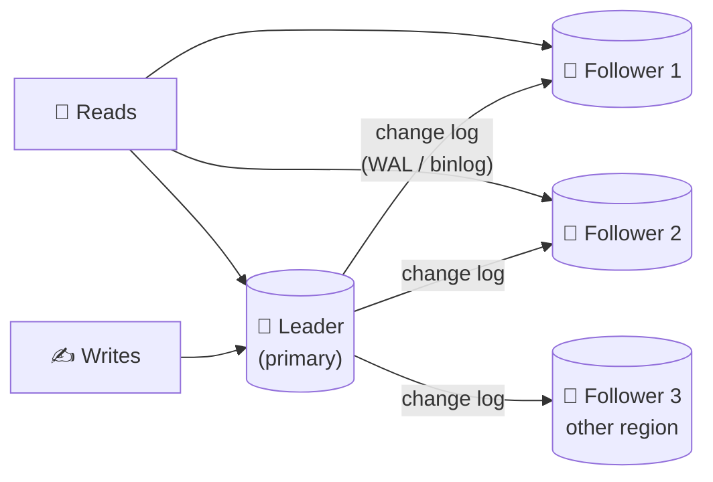

# 046 · Leader–Follower Replication

> ⏱ 9 min · 📈 46% · 🅰️ Part A (core) · Phase 06: Scaling Data
>
> `█████████░░░░░░░░░░░` 46% of the whole guide

---

## 📖 Story

Pantry launched nationwide. Reads exploded, and the single database was at its limit, and it was also a single point of failure. Maya decided to keep copies of the data on several machines. I asked her the two questions I'll ask you: who is allowed to write? And how do the copies stay in step?

## 🎯 One-sentence idea

**Replication keeps copies of the same data on several machines. In leader–follower (primary–replica) replication, all writes go to one leader, which streams changes to followers that serve reads and stand by to take over if the leader dies.**

## 🧸 Analogy

A **teacher and classroom notebooks**:

- The **teacher** (leader) is the only one who writes on the **whiteboard** (accepts writes).
- **Students** (followers) **copy** everything into their notebooks. Anyone can look at a student's notebook to read (read replicas).
- If the teacher gets sick, a **student becomes the teacher** (failover).
- Some students copy a bit **slower** than others, so their notebooks might be a line behind (replication lag).

## 🖼️ Visual



## 🔬 How it works

- **Writes → the leader only.** The leader records each change in its **log** (Postgres WAL, MySQL binlog) and ships it to followers, which **replay** it in order.
- **Reads → the leader or followers.** Adding followers scales **reads** (not writes).
- **Synchronous vs asynchronous:**
  - **Synchronous:** the leader waits for a follower to confirm before acknowledging the client. ✅ No data loss on failover. ❌ Slower writes, and the leader is blocked if that follower is down.
  - **Asynchronous:** acknowledge immediately and replicate in the background. ✅ Fast. ❌ **Recent writes can be lost** if the leader dies before shipping them.
  - **Semi-synchronous:** wait for **at least one** follower (a common compromise).
- **Failover:** detect that the leader is dead (heartbeat timeout) → **choose the most up-to-date follower** → promote it → repoint clients and the other followers. It can be automatic (Patroni, RDS Multi-AZ, Orchestrator) or manual.
- **Failover dangers:**
  - **Split brain:** the old leader comes back and thinks it's still the leader → two writers (fix: fencing, lesson 086).
  - **Lost writes** with async replication.
  - **Timeout tuning:** too short → false failovers. Too long → longer downtime.
- **New follower setup:** take a snapshot → copy it → replay the log from the snapshot's position.
- **Uses:** read scaling, high availability, geographic read locality, and running backups or analytics on a replica without hurting the leader.

## 🧩 Worked example

**Scaling a read-heavy app:**

```
Traffic: 40k reads/s, 2k writes/s
One Postgres node handles ~10k reads/s comfortably

→ 1 leader (all 2k writes + some reads) + 4 followers (~8–10k reads/s each)
→ App routes: writes → leader endpoint, reads → reader endpoint (load-balanced followers)
```

**Routing in code (conceptually):**

```python
def get_order(order_id):
    return replica_pool.query("SELECT * FROM orders WHERE id=%s", order_id)

def place_order(data):
    return primary.execute("INSERT INTO orders ...", data)
```

**Failover timeline (async replication):**

```
t0  Leader acks write #1001 to the client, but hasn't shipped it yet
t1  Leader crashes 💥
t2  Follower A (has up to #1000) is promoted
→ write #1001 is lost, even though the client was told "success"
Fix: semi-sync (wait for ≥1 follower) for critical data
```

## ⚖️ Trade-offs

| Choice | Gain | Cost |
|---|---|---|
| Async replication | Fast writes, leader unaffected by slow followers | Possible data loss on failover, stale reads |
| Sync replication | Zero data loss | Higher write latency, stalls if a sync follower is down |
| Semi-sync | Balance: no loss if ≥1 replica is up | A bit slower |
| Automatic failover | Low downtime | Split-brain risk, false positives |
| Read from followers | Read scaling | Stale reads (lesson 047) |

## 🌍 Real world

- **Postgres streaming replication**, **MySQL replication**, **MongoDB replica sets**, and **Redis replicas** all use leader–follower.
- **AWS RDS Multi-AZ** keeps a synchronous standby for failover. **Read replicas** (async) serve reads.
- **GitHub's 2018 outage**: a network partition triggered a cross-region MySQL failover, leaving writes on both sides that took ~24 hours to reconcile.

## 📌 Cheat card

> - **One leader writes. Followers copy the log and serve reads.**
> - Replicas scale **reads**, not **writes** (writes need sharding, lesson 049).
> - **Async = fast but lossy on failover · Sync = safe but slower · Semi-sync = compromise.**
> - Failover risks: **split brain, lost writes, bad timeouts**.
> - Rebuild a follower with **snapshot + log replay**.

## 🧪 Feynman check

Explain the teacher-and-notebooks analogy, including what happens when the teacher gets sick and why a slow-copying student might give you an outdated answer.

⚠️ **Common confusion:** "Adding replicas makes my database handle more writes." Every follower must replay *every* write. Replicas only help reads and availability.

## ⚡ Quick recall

1. Where do writes go in leader–follower replication?
<details><summary>Answer</summary>

Only to the leader.
</details>

2. What's the main risk of asynchronous replication?
<details><summary>Answer</summary>

Losing recently acknowledged writes if the leader fails before they reach a follower (and stale reads from followers).
</details>

3. What is split brain?
<details><summary>Answer</summary>

Two nodes both believe they're the leader and accept writes, which causes conflicting data.
</details>

## 🎤 Interview practice

**Q1. "Our database handles writes fine but reads are overwhelming it. What do you do?"**
<details><summary>Model answer</summary>

- **Cache** hot reads first (lesson 027). It's the cheapest win.
- Add **read replicas**, route read-only queries to them via a reader endpoint or proxy, and keep writes and read-after-write-sensitive reads on the primary.
- Watch **replication lag** and handle read-your-writes (lesson 047).
- Move analytics to a dedicated replica or a warehouse.
- **Likely follow-up:** "What if a replica falls far behind?" → take it out of the read pool when lag exceeds a threshold, and investigate (long queries, I/O).
</details>

**Q2. "How would you design database failover to minimize both downtime and data loss?"**
<details><summary>Model answer</summary>

- **Semi-synchronous replication** to at least one standby in another AZ, so no acknowledged write is lost.
- **Automated failover** via a consensus-backed manager (Patroni + etcd, or a managed service), so only one leader is elected.
- **Fencing** the old leader (revoke its writes, STONITH, or a VIP move) to prevent split brain.
- Clients reconnect via a stable endpoint (DNS/VIP/proxy) with retries.
- Test failovers regularly (game days).
- **Likely follow-up:** "What's the expected downtime?" → typically 10–60 s for detection + promotion + client reconnection.
</details>

> 📖 *Next, customers edit their profiles, and their changes seem to vanish.*

---

⬅️ [✅ Checkpoint 45%](../05-databases/checkpoint-45.md) · 🗺️ [Phase map](README.md) · ➡️ [047 · Replication Lag](047-replication-lag.md)

✅ **Safe stopping point.** Tick lesson 046 in [PROGRESS.md](../../PROGRESS.md).
