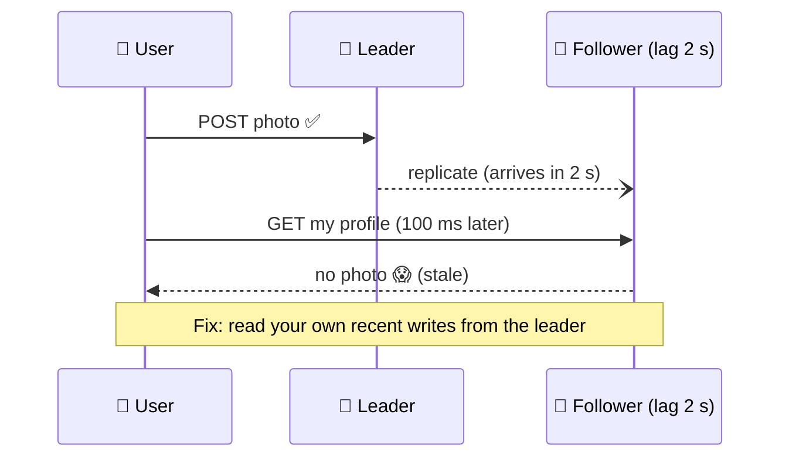

# 047 · Replication Lag & Read-Your-Writes

> ⏱ 9 min · 📈 47% · 🅰️ Part A (core) · Phase 06: Scaling Data
>
> `█████████░░░░░░░░░░░` 47% of the whole guide

---

## 📖 Story

A customer updated her delivery address, refreshed the page, and saw the old one. She updated it again. And again. Three dinners went to the wrong house. When Maya explained it, I recognized it right away: her write went to the leader, but her reads went to a copy that was a second behind.

## 🎯 One-sentence idea

**Followers apply changes slightly after the leader (replication lag), so a read from a follower can return old data. Guarantees like read-your-writes and monotonic reads hide that lag from users where it matters.**

## 🧸 Analogy

You **post a photo**, then refresh your profile, and **it's not there**. 😱 You panic and post it again. Now it's there **twice**.

What happened: your post went to the **leader**, but your refresh was served by a **follower** that hadn't copied it yet. Like texting a friend "I moved!", then checking the **old phone book**, which hasn't been reprinted yet.

## 🖼️ Visual



## 🔬 How it works

- **Lag** is usually milliseconds, but it can grow to **seconds or minutes** under heavy load, long-running queries on the replica, network problems, or big batch writes.
- **Anomalies users notice:**
  - **Read-your-writes violation:** you don't see your own change.
  - **Non-monotonic reads (time going backwards):** refresh 1 hits an up-to-date replica (you see the comment), refresh 2 hits a lagging one (the comment disappears).
  - **Causality violations:** you see an answer before the question it replies to.
- **Fixes:**
  - **Read-your-writes (read-after-write) consistency:**
    - Read **your own** data from the leader (e.g., your profile) and others' data from followers.
    - After a write, **pin the user to the leader for N seconds**.
    - Track the **write's log position (LSN/GTID/timestamp)**, and only read from a replica that has caught up to it.
  - **Monotonic reads:** keep each user **sticky to the same replica** (e.g., hash user_id → replica).
  - **Consistent prefix reads:** keep causally related writes in the same partition or order.
- **Monitor lag** (`pg_stat_replication`, `Seconds_Behind_Master`), and **remove lagging replicas** from the read pool automatically.

## 🧩 Worked example

**"Pin to the leader after a write" with a cookie:**

```python
def handle_write(req):
    primary.execute(...)
    resp = ok()
    resp.set_cookie("recent_write_until", now() + 5)   # 5 s > typical lag
    return resp

def choose_db(req):
    if req.cookies.get("recent_write_until", 0) > now():
        return primary          # read-your-writes
    return replica_for(req.user_id)   # sticky replica → monotonic reads
```

**LSN-based (more precise):**

```
Write returns commit LSN = 0/5A3F20
Client sends header X-Min-LSN: 0/5A3F20 on the next read
Router picks a replica whose replay_lsn ≥ 0/5A3F20, else falls back to the leader
```

**What to read where:**

| Read | From | Why |
|---|---|---|
| My own profile / settings right after editing | Leader (or a caught-up replica) | Read-your-writes |
| Someone else's profile | Any replica | A few seconds of staleness is fine |
| Account balance before a transfer | Leader | Correctness |
| Product listing | Replica / cache | Staleness is OK |

## ⚖️ Trade-offs

| Technique | Gain | Cost |
|---|---|---|
| Always read from the leader | Always fresh | No read scaling |
| Pin to the leader after a write | Simple read-your-writes | More leader load right after writes |
| LSN/timestamp tracking | Precise, scales | Complexity (routing, passing tokens) |
| Sticky replica per user | Monotonic reads | Uneven load, failover breaks stickiness |
| Synchronous replication | No lag | Slow writes, availability risk |

## 🌍 Real world

- **Facebook** and **LinkedIn** route "your own recent writes" to the primary or caught-up replicas.
- **MongoDB** supports **causal consistency sessions** (it tracks operation times per session).
- **AWS Aurora** replicas typically lag less than 100 ms, but "typically" isn't "always".

## 📌 Cheat card

> - **Lag = followers are behind.** Usually ms, sometimes minutes.
> - **Read-your-writes:** read your own data from the leader, or track the write's LSN.
> - **Monotonic reads:** keep a user on the **same replica**.
> - **Critical reads (money, auth) → the leader.** Casual reads → replicas.
> - **Monitor lag**, and drop lagging replicas from the pool.

## 🧪 Feynman check

Explain the "posted photo disappeared" story, and two ways to make sure users always see their own posts immediately.

⚠️ **Common confusion:** "Replication lag only matters for huge systems." Even ~100 ms of lag breaks "save, then immediately redirect to the page", which is one of the most common web flows.

## ⚡ Quick recall

1. What is read-your-writes consistency?
<details><summary>Answer</summary>

A guarantee that after you write something, your subsequent reads will reflect that write.
</details>

2. How do sticky replicas help?
<details><summary>Answer</summary>

Always reading from the same replica prevents "time going backwards" (monotonic reads) when replicas have different lags.
</details>

3. Name two causes of replication lag spikes.
<details><summary>Answer</summary>

Heavy write bursts or bulk jobs, long-running queries on the replica, network issues, and replica I/O or CPU saturation (any two).
</details>

## 🎤 Interview practice

**Q1. "Users edit their profile, get redirected, and see the old data. How do you fix it without abandoning read replicas?"**
<details><summary>Model answer</summary>

- Route **reads of the user's own profile** to the leader, or pin that user to the leader for a few seconds after any write (a cookie or session flag).
- Better at scale: return the write's **LSN/timestamp**, and route reads to a replica that has replayed past it (fall back to the leader).
- Also check the **cache**: delete the cache key on write (lesson 031).
- **Likely follow-up:** "What about other users seeing the change?" → eventual consistency is acceptable, typically within a second.
</details>

**Q2. "A nightly batch job causes replicas to lag by 10 minutes, and users see stale data. What do you do?"**
<details><summary>Model answer</summary>

- **Throttle or chunk** the batch job (small transactions, pauses between chunks).
- Run heavy reads on a **dedicated analytics replica** that's excluded from the user read pool.
- **Automatically eject** replicas whose lag exceeds a threshold (e.g., 2 s) from the read pool, and route to the leader or healthy replicas.
- Schedule the job at low-traffic times, and investigate replica I/O limits.
- **Likely follow-up:** "What if all replicas lag?" → temporarily send reads to the leader (if capacity allows), degrade non-critical features, and alert.
</details>

> 📖 *Next, Pantry opens in Europe, and every European write crawls across the ocean.*

---

⬅️ [046 · Leader–Follower Replication](046-leader-follower-replication.md) · 🗺️ [Phase map](README.md) · ➡️ [048 · Multi-Leader & Leaderless](048-multi-leader-and-leaderless.md)

✅ **Safe stopping point.** Tick lesson 047 in [PROGRESS.md](../../PROGRESS.md).
