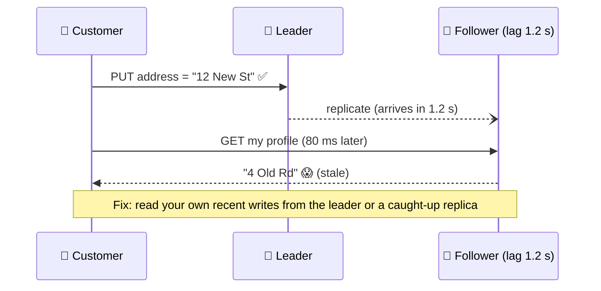

# 047 · Replication Lag & Read-Your-Writes

> ⏱ 9 min · 📈 47% · 🅰️ Part A (core) · Phase 06: Scaling Data
>
> `█████████░░░░░░░░░░░` 47% of the whole guide

---

## 📖 Story

A customer moves house. She opens Pantry, changes her delivery address, and taps **Save**. A green toast: *"Address updated!"*

The page redirects to her profile, and there's her **old address**, staring back at her.

She frowns and saves again. Old address. And again. Old address. She gives up and orders dinner. Then breakfast the next morning. Then lunch.

**Three meals go to the wrong house.**

Maya traces it, and it's almost elegant in its cruelty. The **save** went to the leader. The **refresh**, 80 milliseconds later, was served by a follower that was **1.2 seconds behind**. The new address was still in flight, somewhere inside the replication stream.

When Maya explained it, I recognized it instantly: the copy you read from is a step behind the one you wrote to.

## 🎯 One-sentence idea

**Followers apply changes slightly after the leader (replication lag), so a follower read can return old data, and guarantees like read-your-writes and monotonic reads hide that lag from users exactly where it matters.**

## 🧸 Analogy

You text a friend *"I moved!"*, then look yourself up in the **phone book**, which hasn't been reprinted yet. Old address. You panic and text again.

The write arrived. You just **read from an old copy**.

## 🖼️ Visual

*Diagram brief:* a write arrow hits the leader. A slow replication arrow crawls toward the follower. A read arrow hits the follower *before* the replication arrow arrives, and a red "stale!" stamp appears.



## 🔬 How it works

- **Lag is usually ms, sometimes minutes:** bulk writes, long queries on the replica, I/O saturation, or network trouble can stretch it from 50 ms to 10+ minutes.
- **Three user-visible anomalies:** **read-your-writes violations** (your own change "vanishes"), **non-monotonic reads** (refresh 1 shows a comment, refresh 2 from a laggier replica hides it, so time goes backwards), and **consistent-prefix violations** (an answer appears before its question).
- **Read-your-writes fixes:** read **your own** data from the leader, **pin the user to the leader for N seconds** after a write, or carry the write's **log position (LSN/GTID)** and only read from a replica that has replayed past it.
- **Monotonic reads:** keep each user **sticky to one replica** (`hash(user_id) → replica`). **Consistent prefix:** keep causally related writes in the same partition and order.
- **Operate it:** monitor `pg_stat_replication.replay_lag` / `Seconds_Behind_Source`, and **automatically eject** replicas above a lag threshold from the read pool.

## 🧩 Worked example

**Pin-after-write with a cookie:**

```python
def handle_write(req):
    primary.execute("UPDATE users SET address=%s WHERE id=%s", …)
    resp = ok()
    resp.set_cookie("rw_until", now() + 5)        # 5 s > p99 lag
    return resp

def choose_db(req):
    if req.cookies.get("rw_until", 0) > now():
        return primary                             # read-your-writes
    return replica_for(req.user_id)                # sticky → monotonic reads
```

**LSN tokens (precise, and they scale):**

```
Write returns commit LSN 0/5A3F20 → client sends X-Min-LSN: 0/5A3F20 on its next read
Router picks a replica with replay_lsn ≥ 0/5A3F20, else falls back to the leader
```

| Read | From | Why |
|---|---|---|
| My profile right after editing | Leader / caught-up replica | Read-your-writes |
| A cook's public profile | Any replica | Seconds of staleness is fine |
| Wallet balance before a payout | Leader | Correctness |
| Dish listings | Replica / cache | Staleness is OK |

## ⚖️ Trade-offs

| Maya's choice | What she gains | What she pays |
|---|---|---|
| Always read the leader | Always fresh | No read scaling |
| Pin to the leader after a write | Simple read-your-writes | Extra leader load after writes |
| LSN tokens | Precise and scalable | Routing complexity, token plumbing |
| Sticky replica per user | Monotonic reads | Uneven load, stickiness breaks on failover |
| Synchronous replication | No lag | Slow writes, availability risk |

## 🌍 Real world

- **Meta** and **LinkedIn** route reads of a user's own recent writes to primaries or caught-up replicas.
- **MongoDB causal-consistency sessions** track `operationTime`/`clusterTime` per session to guarantee read-your-writes.
- **Aurora** replicas usually lag under 100 ms, but "usually" is not a guarantee.

## 📌 Cheat card

> - **Lag = followers are behind.** Usually ms, sometimes minutes.
> - **Read-your-writes:** own data from the leader, pin-after-write, or **LSN tokens**.
> - **Monotonic reads:** keep a user on **one replica**.
> - **Money and auth reads → the leader.** Casual reads → replicas.
> - **Monitor lag** and auto-eject laggards.

## 🧪 Feynman check

Tell the "my address won't change" story, then give two ways to guarantee users always see their own edits immediately.

⚠️ **Common confusion:** "Lag only matters at huge scale." Even **100 ms** breaks the most common web flow there is, *save → redirect → show*, because the redirect lands faster than the replication stream.

## ⚡ Quick recall

1. What is read-your-writes consistency?
<details><summary>Reveal Answer</summary>

A guarantee that after you write something, your subsequent reads reflect that write.
</details>

2. How do sticky replicas help?
<details><summary>Reveal Answer</summary>

Always reading from the same replica prevents "time going backwards" (monotonic reads) when replicas lag by different amounts.
</details>

3. Name two causes of replication lag spikes.
<details><summary>Reveal Answer</summary>

Any two of: write bursts or bulk jobs, long-running queries on the replica, network issues, replica I/O or CPU saturation.
</details>

## 🎤 Interview practice

**Q. "Users edit their profile and see old data after the redirect. Separately, a nightly batch job makes replicas lag 10 minutes. Fix both without abandoning replicas."**
<details><summary>Model answer</summary>

- **The redirect problem (read-your-writes):**
  - Route reads of **the user's own data** to the leader, or **pin** them to the leader for a few seconds after any write (cookie or session flag).
  - At scale: return the write's **LSN/GTID**, send it back on the next read, and route to a replica that has **replayed past it** (falling back to the leader).
  - Check the **cache** too: delete keys on write and re-populate from the primary (lesson 031).
  - **Other** users can see the change eventually, typically within a second.
- **The 10-minute batch lag:**
  - **Chunk and throttle** the job: small transactions (e.g. 5k rows), short sleeps, and a pause whenever replica lag exceeds a threshold.
  - Give heavy reads a **dedicated replica** excluded from the user pool.
  - **Auto-eject** replicas over ~2 s of lag from the read pool.
  - Schedule off-peak, and check the replica's I/O headroom.
- **If every replica lags:** shift reads to the leader if capacity allows, degrade non-critical features (hide "recently viewed"), and page someone.
- **Likely follow-up:** "Why not just synchronous replication?" → every write would pay a cross-AZ round trip, and a slow replica would stall all writes, which is too high a price for most read paths.
</details>

## 📖 Teaser

> 📖 *Pantry opens in Europe, and every European write has to cross the Atlantic to a leader in Virginia and back before anyone gets a confirmation.*

---

⬅️ [046 · Leader–Follower Replication](046-leader-follower-replication.md) · 🗺️ [Phase map](README.md) · ➡️ [048 · Multi-Leader & Leaderless](048-multi-leader-and-leaderless.md)

✅ **Safe stopping point.** Tick lesson 047 in [PROGRESS.md](../../PROGRESS.md).
