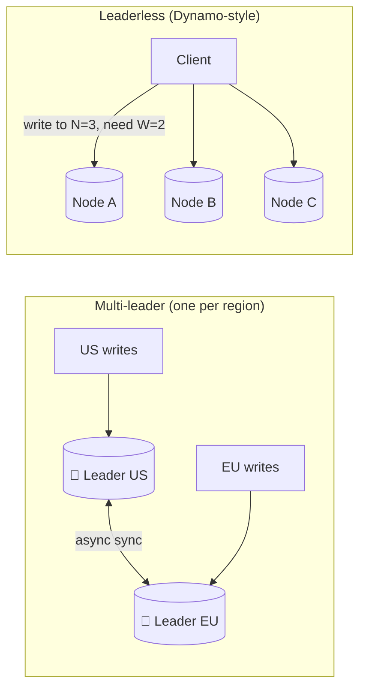

# 048 · Multi-Leader & Leaderless Replication

> ⏱ 10 min · 📈 48% · 🅰️ Part A (core) · Phase 06: Scaling Data
>
> `█████████░░░░░░░░░░░` 48% of the whole guide

---

## 📖 Story

Pantry opens in Lisbon, Berlin, and Dublin. European customers love the food and hate the **lag**.

Every "Add to cart" leaves Europe, crosses the Atlantic through an undersea cable, reaches the one and only leader in Virginia, waits for a commit, and swims back. **~150 ms per write**, on every tap. On a train with patchy signal it feels like wading through syrup.

Maya sketches the obvious fix: **a leader on each continent**. Europeans write in Europe, Americans write in America, and the leaders sync behind the scenes.

Then she imagines a couple sharing one Pantry account. One is in New York, one is in Lisbon. At the same second, one **adds a dish** to the shared cart and the other **removes it**. Two leaders, two truths, one cart.

I warned her, and now I'm warning you: once more than one node accepts writes, **conflicts stop being hypothetical**. Then what?

## 🎯 One-sentence idea

**When several nodes accept writes (multi-leader, or leaderless like Dynamo/Cassandra), writes stay fast and available across regions, but two nodes can accept conflicting writes, so you need an explicit conflict-resolution strategy.**

## 🧸 Analogy

A **shared family calendar** with a paper copy in **every room**:

- Anyone writes in **their room's copy**, and copies sync every evening.
- One parent writes "dentist 3 p.m. Tuesday" in the kitchen, the other writes "football 3 p.m. Tuesday" in the garage. 💥
- Resolve it by **"latest note wins"** (someone's plan silently vanishes), **"keep both and ask"** (siblings), or **"smart merge"** (CRDTs: combine two shopping lists).

## 🖼️ Visual

*Diagram brief:* on the left, two crowned leaders on two continents with a two-way sync arrow, each taking local writes. On the right, a client spraying one write to three peer nodes with no crown at all.



## 🔬 How it works

- **Multi-leader:** usually **one leader per region**, each accepting local writes and replicating asynchronously to the others. You get local write latency, survival of a full region outage, and offline clients (every phone becomes a "leader"). The cost is **write conflicts**.
- **Leaderless (Dynamo, Cassandra, Riak):** write to **N** replicas and succeed on **W** ACKs. Read from **R** (lesson 054). Convergence comes from **read repair**, **anti-entropy with Merkle trees**, and **hinted handoff** (a neighbour holds writes for a down replica). There's no failover, because there's no leader.
- **Last-write-wins (LWW):** keep the highest timestamp. It's simple, and it **silently drops data**, which **clock skew** makes worse (lesson 084).
- **Detect and merge:** **version vectors** spot truly concurrent writes and keep **siblings** for the app to merge (Dynamo's cart unions them). **CRDTs** (counters, OR-sets, sequence CRDTs for text) merge **automatically and deterministically**, so every replica converges.
- **Avoid conflicts entirely:** give each record a **home leader** (the user's home region) and route all its writes there. Most traffic stays local, and conflicts become impossible.

## 🧩 Worked example

**LWW losing data:**

```
t=100 (US):     cart = [lasagna]
t=101 (Lisbon): cart = [curry]          ← concurrent edits
LWW → [curry]   … the lasagna silently vanishes 😢
```

**OR-Set CRDT cart (add/remove-safe):**

```
US adds   (lasagna, tag u1)        Lisbon removes (lasagna, tags seen: {})   ← never saw u1
merge → lasagna stays: a remove only deletes tags it actually observed. No resurrection bugs,
        no silent loss.
```

**G-Counter (likes per dish):**

```
US: {US:5, EU:0}   EU: {US:0, EU:3}   merge = element-wise max → {US:5, EU:3} → 8 ✅
```

**Home-region routing:** `user 42 → home = EU` → every write for user 42 goes to the EU leader, US replicas serve their reads, and **zero conflicts**.

## ⚖️ Trade-offs

| Model | What Maya gains | What she pays | Use when |
|---|---|---|---|
| Single leader | Simple, conflict-free | Far-away writes are slow, and failover | Most systems |
| Multi-leader | Local writes, offline support | Conflicts, complexity | Multi-region, offline-first apps |
| Leaderless | Extreme availability, no failover | Eventual consistency, repair machinery | Massive write-heavy AP workloads |
| LWW | Trivial | Silent data loss | Sensor readings, idempotent overwrites |
| CRDTs | Correct automatic merges | Limited types, metadata overhead | Counters, sets, collaborative text |

## 🌍 Real world

- **Amazon's Dynamo paper (2007)** introduced sloppy quorums, hinted handoff, and vector clocks. **Cassandra** and **Riak** followed.
- **Figma, Linear, and Notion-style editors** use CRDT-inspired or server-ordered merging. **Google Docs** uses operational transformation.
- **CouchDB/PouchDB** sync powers offline-first apps. **DynamoDB Global Tables** replicate across regions with last-writer-wins.

## 📌 Cheat card

> - **Multi-leader** = a leader per region. **Leaderless** = write N, succeed at W.
> - You gain **availability + local write latency**, and you pay in **conflicts**.
> - Conflict tools: **LWW** (lossy) · **version vectors/siblings** · **CRDTs** · **avoid via a home leader**.
> - Leaderless repair: **read repair · Merkle anti-entropy · hinted handoff**.

## 🧪 Feynman check

Explain the family calendar, and why "latest note wins" is dangerous for a shopping cart but perfectly fine for "last known fridge temperature."

⚠️ **Common confusion:** "Timestamps tell us which write happened last." Machine clocks drift by milliseconds to seconds, so a write stamped "later" may have happened **earlier**. LWW with skewed clocks can throw away the genuinely newer write and keep the stale one (lesson 084).

## ⚡ Quick recall

1. What's the main problem multi-leader replication introduces?
<details><summary>Reveal Answer</summary>

Write conflicts: the same data modified concurrently on different leaders.
</details>

2. What is a CRDT?
<details><summary>Reveal Answer</summary>

A data type designed so concurrent updates always merge automatically and deterministically, and every replica converges to the same state.
</details>

3. What is hinted handoff?
<details><summary>Reveal Answer</summary>

When a target replica is down, another node stores the write with a "hint" and delivers it once the replica recovers.
</details>

## 🎤 Interview practice

**Q. "Design a note-taking app that works offline on phones and laptops and syncs across devices without losing edits. Then: what are your options for low-latency writes in both the US and EU?"**
<details><summary>Model answer</summary>

- **Offline notes (multi-leader by nature):**
  - Each device holds a local DB and acts as a leader, syncing **deltas** when online.
  - Represent note text as a **sequence CRDT** (Yjs/Automerge), so concurrent edits on a plane and on a laptop **both survive** and merge.
  - Track per-device **version vectors**, so sync is "send me everything since vector V."
  - **Tombstones** for deletes, so deleted notes don't resurrect, with garbage collection once every device has acknowledged them.
  - The server stores the merged state and the op log for new devices.
  - **Why not LWW per note:** editing on two devices would silently discard one whole session of work.
- **US + EU low-latency writes, choosing per data type:**
  1. **Multi-leader + conflict avoidance:** a **home region per user**, and route that user's writes there. It's local for ~all real traffic, with zero conflicts.
  2. **Multi-leader + resolution** (CRDTs/LWW) for naturally mergeable data: likes, preferences, presence.
  3. **Globally consistent SQL** (Spanner/CockroachDB) for money and inventory. Every write pays **~100+ ms** of cross-region consensus, but it's linearizable.
- **During a transatlantic partition:** multi-leader keeps both sides writable and reconciles afterwards (AP). Consensus systems **refuse writes on the minority side** (CP, lesson 052).
- **Likely follow-up:** "How do you test conflict handling?" → deterministic simulation and property tests asserting that every replica converges after random interleavings.
</details>

## 📖 Teaser

> 📖 *Writes are local now, but the orders table has hit 40 TB, grows by 2 TB a month, and there is no bigger machine left to buy.*

---

⬅️ [047 · Replication Lag](047-replication-lag.md) · 🗺️ [Phase map](README.md) · ➡️ [049 · Sharding](049-sharding.md)

✅ **Safe stopping point.** Tick lesson 048 in [PROGRESS.md](../../PROGRESS.md).
