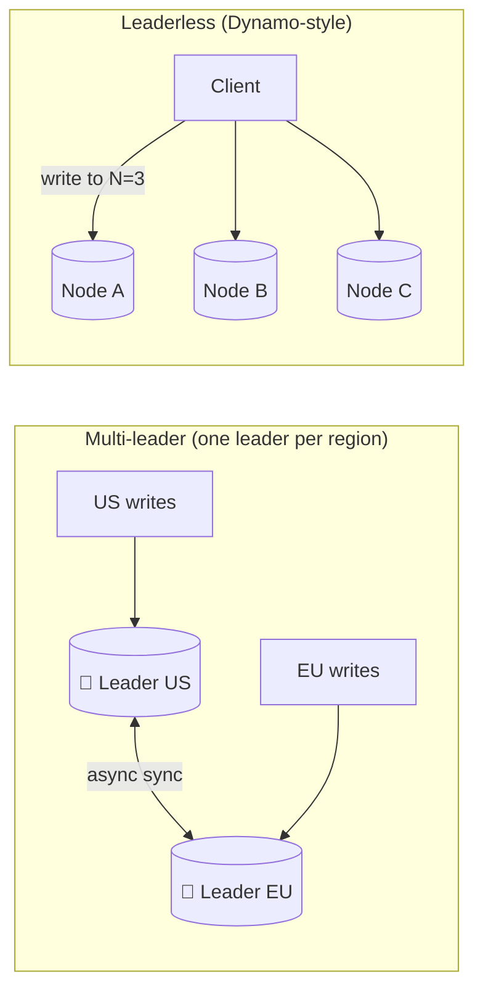

# 048 · Multi-Leader & Leaderless Replication

> ⏱ 10 min · 📈 48% · 🅰️ Part A (core) · Phase 06: Scaling Data
>
> `█████████░░░░░░░░░░░` 48% of the whole guide

---

## 📖 Story

Pantry's European customers waited 150 milliseconds on every save, because the only leader lived in America. Maya wanted a leader on each continent. I warned her, and now I'm warning you: two leaders might accept conflicting changes to the same shopping cart at the same moment. Then what?

## 🎯 One-sentence idea

**When several nodes accept writes (multi-leader, or leaderless like Dynamo/Cassandra), writes stay fast and available even across regions, but two nodes can accept conflicting writes, so you need a conflict-resolution strategy.**

## 🧸 Analogy

A **shared family calendar** with a paper copy in **every room**:

- Anyone can write in **their room's copy** (multi-leader), and copies are synced every evening.
- Mom writes "dentist 3pm Tuesday" in the kitchen. Dad writes "football 3pm Tuesday" in the garage, for the **same slot**. 💥 **Conflict!**
- How do you resolve it?
  - "**Latest note wins**" (last-write-wins): simple, but someone's plan silently vanishes.
  - "**Keep both and ask**" (siblings): the family decides later.
  - "**Smart merge**" (CRDTs): e.g., for a shopping list, just combine both lists.

## 🖼️ Visual



## 🔬 How it works

- **Multi-leader:**
  - Several leaders (usually **one per datacenter/region**), each accepting writes and replicating to the others asynchronously.
  - ✅ Local write latency in every region, it survives a region outage, and it supports offline clients (each phone is a "leader": calendars, notes apps).
  - ❌ **Write conflicts** when the same data is edited in two places concurrently.
- **Leaderless (Dynamo-style: Cassandra, Riak, DynamoDB internals):**
  - The client (or a coordinator) sends writes to **N replicas**, and succeeds when **W** acknowledge. Reads query **R** replicas (lesson 054).
  - **Read repair** (fix stale replicas during reads) and **anti-entropy** (background sync with Merkle trees) converge the data.
  - **Hinted handoff:** if a replica is down, another node temporarily holds its writes.
  - ✅ No failover needed (there's no leader), and it's highly available. ❌ Eventual consistency, and conflicts.
- **Conflict resolution strategies:**
  - **Last-write-wins (LWW):** keep the write with the highest timestamp. Simple, but it **silently loses data**, and clock skew makes it worse.
  - **Version vectors / siblings:** detect concurrent writes, keep both versions, and let the app or user merge (e.g., Amazon's shopping cart unions the items).
  - **CRDTs (Conflict-free Replicated Data Types):** data structures that **merge automatically and deterministically** (counters, sets, text). Used in collaborative editing and in Redis Enterprise active-active.
  - **Avoid conflicts:** route all writes for a given record to **one "home" leader** (e.g., a user's home region).

## 🧩 Worked example

**LWW losing data:**

```
t=100 (US): cart = [book]
t=101 (EU): cart = [pen]         ← concurrent edits of the same cart
LWW keeps the highest timestamp → cart = [pen]  → the book vanished 😢
```

**Sibling merge (Dynamo's cart):**

```
Versions detected as concurrent: {book} and {pen}
App merges: union → {book, pen}  ✅
(Side effect: deleted items can "resurrect" → track removals too)
```

**A CRDT counter (G-Counter): each node counts its own increments.**

```
Node A: {A:5, B:0}     Node B: {A:0, B:3}
merge = element-wise max → {A:5, B:3} → value = 8   (never loses increments)
```

**Conflict avoidance by home region:**

```
user 42's home = EU → all writes for user 42 go to the EU leader
US reads can use local replicas, and the US writes for user 42 are forwarded to the EU
```

## ⚖️ Trade-offs

| Model | Gain | Cost | Use when |
|---|---|---|---|
| Single leader | Simple, no write conflicts | Write latency far from the leader, failover | Most systems |
| Multi-leader | Local writes per region, offline support | Conflicts, complexity | Multi-region apps, collaborative/offline apps |
| Leaderless | Very high availability, no failover | Eventual consistency, repairs, conflicts | Massive write-heavy, AP systems |
| LWW | Simple | Silent data loss | Caches, idempotent overwrites, sensors |
| CRDTs | Automatic, correct merges | Limited data types, metadata overhead | Counters, sets, collaborative editing |

## 🌍 Real world

- **Amazon Dynamo paper (2007)** introduced leaderless replication, sloppy quorums, and vector clocks. **Cassandra** and **Riak** followed.
- **Google Docs** (operational transformation) and **Figma/Linear** (CRDT-inspired approaches) merge concurrent edits.
- **CouchDB/PouchDB** multi-leader sync powers offline-first apps.
- **DynamoDB Global Tables** use multi-region replication with last-writer-wins.

## 📌 Cheat card

> - **Multi-leader** = a leader per region. **Leaderless** = write to N, succeed at W.
> - Both get you **availability + low write latency**, and both cost you **conflicts**.
> - Conflict tools: **LWW** (loses data) · **version vectors/siblings** (app merges) · **CRDTs** (auto-merge) · **avoid** (a home leader per record).
> - Leaderless repair: **read repair, anti-entropy (Merkle trees), hinted handoff**.

## 🧪 Feynman check

Explain the family-calendar analogy, and why "latest note wins" is dangerous for a shopping cart but fine for "last known temperature".

⚠️ **Common confusion:** "Timestamps tell us which write happened last." Clocks on different machines drift, so "later" timestamps can belong to earlier events. LWW with skewed clocks can discard the genuinely newer write (lesson 084).

## ⚡ Quick recall

1. What's the main problem multi-leader replication introduces?
<details><summary>Answer</summary>

Write conflicts: the same data modified concurrently on different leaders.
</details>

2. What is a CRDT?
<details><summary>Answer</summary>

A data type designed so concurrent updates can always be merged automatically and deterministically, and all replicas converge.
</details>

3. What is hinted handoff?
<details><summary>Answer</summary>

When a target replica is down, another node temporarily stores the write (with a hint) and delivers it when the replica recovers.
</details>

## 🎤 Interview practice

**Q1. "Design a note-taking app that works offline on phones and syncs across devices."**
<details><summary>Model answer</summary>

- Each device is effectively a **leader** (a local DB), and changes sync to the server when online. It's multi-leader.
- Track changes per note with **version vectors** or per-field timestamps. Use **CRDTs** for text (e.g., sequence CRDTs like Yjs/Automerge), so concurrent edits merge.
- The server stores the merged state and the change log, and devices pull deltas since their last sync.
- For deletes, use **tombstones**, so deleted notes don't resurrect.
- **Likely follow-up:** "Why not last-write-wins per note?" → editing on the plane and on the laptop would silently drop one set of changes.
</details>

**Q2. "We need writes accepted in both the US and EU with low latency. What are your options?"**
<details><summary>Model answer</summary>

- **Multi-leader with conflict avoidance:** give each record a home region (e.g., the user's region), and route writes there. Most writes are local because users mostly act in their own region.
- **Multi-leader with conflict resolution** (LWW or CRDTs) for data where concurrent edits are rare or mergeable.
- **Globally consistent DB** (Spanner/CockroachDB): writes need cross-region consensus (~100+ ms) but give strong consistency.
- Choose per data type: payments → strong. Likes and preferences → multi-leader/LWW.
- **Likely follow-up:** "What happens during a transatlantic partition?" → multi-leader keeps accepting writes on both sides and reconciles later. Strongly consistent systems reject writes on the minority side (CAP, lesson 052).
</details>

> 📖 *Next, the orders table reaches 40 TB, and no single machine can hold it.*

---

⬅️ [047 · Replication Lag](047-replication-lag.md) · 🗺️ [Phase map](README.md) · ➡️ [049 · Sharding](049-sharding.md)

✅ **Safe stopping point.** Tick lesson 048 in [PROGRESS.md](../../PROGRESS.md).
