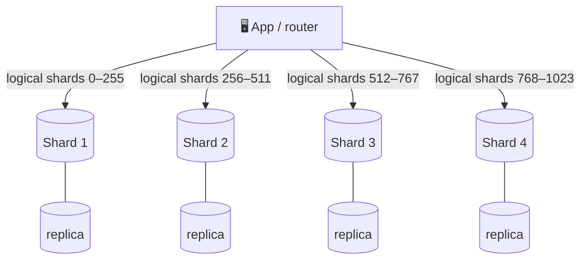

# 049 · Sharding (Partitioning)

> ⏱ 10 min · 📈 49% · 🅰️ Part A (core) · Phase 06: Scaling Data
>
> `█████████░░░░░░░░░░░` 49% of the whole guide

---

## 📖 Story

Maya opens the cloud console and scrolls to the **biggest database instance money can buy**. She already has it.

The orders table is **40 TB** and grows **2 TB a month**. The primary absorbs **60,000 writes per second** at dinner, six times what it can do comfortably. Vacuum never finishes. Index rebuilds take days. Disk alarms are now a weekly ritual.

The machine is a single dam holding back a rising river, and water is already seeping through the cracks.

There is no bigger dam. So Maya has to do the thing engineers whisper about: **split the river.** Cut the data into slices, give each slice its own machine, and make the whole thing still feel like one database.

I'll be honest with you: it's one of the most powerful moves in system design, and one of the most painful.

## 🎯 One-sentence idea

**Sharding splits one large dataset into pieces stored on different machines, so storage and write throughput scale horizontally, at the cost of harder cross-shard queries, cross-shard transactions, and rebalancing.**

## 🧸 Analogy

A **library that outgrew its building**:

- Titles A–F → Building 1, G–M → Building 2, N–Z → Building 3 (**range**).
- Or a formula on each book ID picks the building (**hash**), so they fill evenly.
- Looking for "Moby Dick"? Go **straight to the right building**.
- "**All books from 1851**"? Visit **every building** (a cross-shard query).

## 🖼️ Visual

*Diagram brief:* a router at the top sends each request down one of several lanes to a separate database shard. Each shard has its own shadow replica beside it.



Each shard is **also replicated** (lesson 046). Sharding buys **capacity**, and replication buys **availability**.

## 🔬 How it works

- **Shard when** the data outgrows a node, writes exceed one leader, or the hot set exceeds one machine's RAM, and **only after** vertical scaling, caching, and replicas run out.
- **Strategies:** **range** (efficient scans, hotspots on sequential keys), **hash** (even spread, range queries hit every shard), **directory** (a lookup table, flexible per tenant, an extra dependency to cache), and **geo** (locality and GDPR, uneven sizes).
- **Routing** lives in a shard-aware library, a proxy (**Vitess**, Citus, mongos), or inside the database (Cassandra, DynamoDB, CockroachDB).
- **Rebalancing:** **never `hash mod N` with a changing N** (it moves ~everything). Use **many logical shards mapped onto fewer physical nodes** (move whole partitions), **consistent hashing** (~1/N moves, lesson 051), or **automatic range splitting** (HBase, CockroachDB).
- **What gets harder:** cross-shard **joins and aggregates** (scatter-gather or denormalize), cross-shard **transactions** (2PC or sagas, lesson 088), **global uniqueness and secondary indexes** (lesson 050), and **operations × N** (backups, migrations, monitoring).

## 🧩 Worked example

**Sizing:**

```
Data 40 TB (+2 TB/mo); comfortable per node ≈ 2.5 TB → 16 nodes for storage today
Writes 60k/s; comfortable per primary ≈ 10k/s     → ≥ 6 for writes
→ 1,024 logical shards on 16 physical clusters (each primary + replica), room to grow to 64+
```

```python
NUM_LOGICAL = 1024
shard_map = load_map()        # logical → physical, e.g. {0:"db-01", …, 1023:"db-16"}

def db_for(user_id):
    return shard_map[hash64(user_id) % NUM_LOGICAL]

# Adding db-17: move ~60 logical shards, update the map. No global reshuffle.
```

**Maya's migration:**

1. CDC-backfill the new shards.
2. **Dual-write.**
3. Verify the checksums per shard.
4. Flip the reads.
5. Flip the writes.
6. Retire the old primary.

This takes weeks, not a weekend.

| Query after sharding by `user_id` | Cost |
|---|---|
| A user's orders | ✅ 1 shard |
| Update a user's profile | ✅ 1 shard |
| Top dishes across all users | ❌ all shards → warehouse |
| Find a user by email | ❌ all shards → a global `email → user_id` index |

## ⚖️ Trade-offs

| Strategy | What Maya gains | What she pays | Good for |
|---|---|---|---|
| Range | Ordered scans | Hotspots on sequential keys | Time-bucketed data, with care |
| Hash | Even load | No efficient range scans | User IDs, random access |
| Directory | Move individual tenants | A lookup dependency | Multi-tenant SaaS |
| Geo | Locality, compliance | Uneven load | Region-bound data |

## 🌍 Real world

- **Instagram** mapped thousands of logical Postgres shards onto far fewer servers, embedding the shard ID inside each object ID.
- **Vitess** (born at YouTube) shards MySQL for Slack, GitHub, and others.
- **Notion, Figma, and Discord** have all written publicly about sharding Postgres or moving to sharded stores.

## 📌 Cheat card

> - **Sharding = different data on different machines.** It scales **storage + writes**.
> - **Range · hash · directory · geo.**
> - **Many logical shards → fewer physical nodes.**
> - **Never `mod N` with a changing N.**
> - Hard parts: **cross-shard queries, transactions, global uniqueness, ops × N**.
> - **Shard as late as you reasonably can.**

## 🧪 Feynman check

Explain the library buildings, and why "find every book from 1851" becomes painful after splitting by title.

⚠️ **Common confusion:** "Sharding and replication are the same thing." **Replication = copies of the same data** (availability, reads). **Sharding = different data on different nodes** (capacity, writes). Production systems do **both**.

## ⚡ Quick recall

1. Range vs hash sharding: give one advantage of each.
<details><summary>Reveal Answer</summary>

Range: efficient range queries. Hash: even load distribution.
</details>

2. Why map many logical shards onto fewer physical nodes?
<details><summary>Reveal Answer</summary>

Rebalancing just moves whole logical shards and updates the map, with no need to rehash every key.
</details>

3. Name two things that get harder after sharding.
<details><summary>Reveal Answer</summary>

Any two of: cross-shard joins and queries, cross-shard transactions, global uniqueness and secondary indexes, operations × N.
</details>

## 🎤 Interview practice

**Q. "Your single Postgres primary can't keep up with writes. Walk me through sharding it, including the shard key choice for an orders table: customer or order date?"**
<details><summary>Model answer</summary>

- **Exhaust the cheap options first:** fix slow queries, batch writes, scale vertically, move non-critical writes async, and archive cold data.
- **The shard key:**
  - **Order date (range):** all of today's writes land on **one shard**, a hotspot. Easy archiving, terrible write distribution.
  - **`customer_id` (hash):** writes spread evenly, and "my orders" is a **single-shard** query. Date reports become scatter-gather → serve them from the **warehouse**.
  - **Choose `customer_id`.** Give **huge enterprise customers** a dedicated shard via a directory, or a compound key.
- **Architecture:**
  - ~**1,024 logical shards** mapped to N physical clusters (primary + replicas).
  - Routing through a library or proxy (**Vitess/Citus**).
  - **Globally unique IDs** (Snowflake/UUIDv7, lesson 072) that never collide across shards.
- **Global needs:** a lookup table `email → customer_id`, uniqueness enforced via that table, and analytics via CDC → warehouse.
- **Migration without downtime:**
  - CDC-backfill the new shards, then **dual-write**.
  - **Verify** with row counts and checksums per shard.
  - Switch reads, then switch writes. Keep a rollback path until you're confident.
- **Schema changes across shards:** backward-compatible migrations (expand → migrate → contract), automated and rolled out **shard by shard** with health gates.
- **Likely follow-up:** "How do you handle a transaction that touches two customers?" → avoid it in the model, or use a **saga** with compensations (lesson 088).
</details>

## 📖 Teaser

> 📖 *The data is split, and three days later one shard is on fire at 99% CPU while the other fifteen sleep, all because of one celebrity cook.*

---

⬅️ [048 · Multi-Leader & Leaderless](048-multi-leader-and-leaderless.md) · 🗺️ [Phase map](README.md) · ➡️ [050 · Shard Keys & Hotspots](050-shard-keys-and-hotspots.md)

✅ **Safe stopping point.** Tick lesson 049 in [PROGRESS.md](../../PROGRESS.md).
