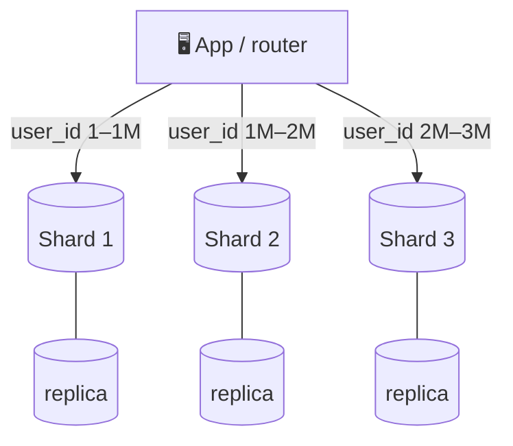

# 049 · Sharding (Partitioning)

> ⏱ 10 min · 📈 49% · 🅰️ Part A (core) · Phase 06: Scaling Data
>
> `█████████░░░░░░░░░░░` 49% of the whole guide

---

## 📖 Story

The orders table is 40 TB and growing by 2 TB every month. There's no bigger machine left to buy. Maya must split the data across many machines, each holding a slice. It's one of the most powerful moves in system design, and one of the most painful.

## 🎯 One-sentence idea

**Sharding splits one big dataset into pieces (shards), each stored on a different machine, so that storage and write load scale horizontally. The cost is that queries spanning shards, cross-shard transactions, and rebalancing all get harder.**

## 🧸 Analogy

A **library that outgrew its building**:

- Books A–F go to **Building 1**, G–M to **Building 2**, N–Z to **Building 3** (range sharding).
- Or: each book's ID is put through a formula that picks a building (hash sharding), so every building gets about the same number of books.
- A reader looking for "Moby Dick" goes **straight to the right building** (routing).
- But "**list all books published in 1851**" means visiting **every building** (a cross-shard query).

## 🖼️ Visual



Each shard is usually **also replicated** (lesson 046). Sharding scales capacity, and replication gives availability.

## 🔬 How it works

- **Why shard:** data too big for one node, **write throughput** beyond one leader, or hot working sets beyond one machine's RAM.
- **Strategies:**
  - **Range-based:** key ranges (A–F, dates, ID ranges). ✅ Efficient range scans. ❌ Hotspots (all new writes hit the "latest" range).
  - **Hash-based:** `hash(key) mod N` or consistent hashing (lesson 051). ✅ Even spread. ❌ Range queries must hit every shard.
  - **Directory/lookup-based:** a lookup table maps key → shard. ✅ Flexible (move individual tenants). ❌ The directory is a critical dependency (cache it).
  - **Geo-based:** by region or country. ✅ Data locality and compliance (GDPR). ❌ Uneven sizes.
- **Routing:** the app (a shard-aware library), a proxy (Vitess, ProxySQL, mongos), or the database itself (Cassandra, DynamoDB, CockroachDB) decides which shard gets each query.
- **Rebalancing:** when adding shards, data must move.
  - `hash mod N` → changing N moves **almost everything** ❌.
  - **Fixed number of logical partitions** (e.g., 1,024 virtual shards mapped onto 8 physical nodes) → move whole partitions ✅.
  - **Consistent hashing** → move only ~1/N ✅.
  - **Dynamic splitting** (split large ranges automatically: HBase, CockroachDB, MongoDB).
- **What gets harder:**
  - Cross-shard **joins** and **aggregations** (scatter-gather, or denormalize).
  - Cross-shard **transactions** (2PC or sagas, lesson 088).
  - **Unique constraints** across shards, and **global secondary indexes** (lesson 050).
  - **Operational complexity:** backups, schema migrations, and monitoring × N.

## 🧩 Worked example

**When to shard (numbers):**

```
Data: 40 TB, growing 2 TB/month. Comfortable per node: ~2–4 TB
Writes: 60k/s. One primary handles ~10k/s
→ Need ~16 shards now for storage (40 / 2.5), ~6+ for writes → plan 32 logical shards on 16 nodes
```

**Logical shards → physical nodes (makes rebalancing easy):**

```python
NUM_LOGICAL = 1024
shard_map = load_map()   # logical shard → physical node, e.g. {0: "db-01", 1: "db-01", ..., 1023: "db-16"}

def db_for(user_id):
    logical = hash(user_id) % NUM_LOGICAL
    return shard_map[logical]

# Adding db-17: move some logical shards (e.g., 60 of them) → update the map. No global reshuffle.
```

**Query shapes after sharding by `user_id`:**

| Query | Cost |
|---|---|
| Get user 42's orders | ✅ 1 shard |
| Update user 42's profile | ✅ 1 shard |
| Top 10 products by sales across all users | ❌ all shards (use a warehouse) |
| Find a user by email | ❌ all shards, unless there's a global index `email → user_id` |

## ⚖️ Trade-offs

| Strategy | Gain | Cost | Good for |
|---|---|---|---|
| Range | Range scans, ordered data | Hotspots on sequential keys | Time series (with care), alphabetical data |
| Hash | Even load | No efficient range queries | User IDs, random access |
| Directory | Per-tenant flexibility | Lookup service dependency | Multi-tenant SaaS with big and small tenants |
| Geo | Locality, compliance | Uneven load | Region-bound data |

## 🌍 Real world

- **Instagram** sharded Postgres into thousands of logical shards on fewer physical servers, with IDs embedding the shard number.
- **Vitess** (born at YouTube) shards MySQL. It's used by Slack, GitHub, and others.
- **Discord, Notion, Figma** all published stories of sharding Postgres or moving to sharded stores.
- **Cassandra, DynamoDB, MongoDB, CockroachDB** shard automatically.

## 📌 Cheat card

> - **Sharding = split the data across machines.** Scales **storage + writes**.
> - Strategies: **range · hash · directory · geo**.
> - **Use many logical shards → fewer physical nodes** so you can rebalance easily.
> - **Never `hash mod N` with a changing N.** Use logical shards or consistent hashing.
> - Hard parts: **cross-shard queries/joins, transactions, global uniqueness, ops × N**.
> - **Shard as late as you reasonably can.** Vertical scaling + replicas + caching come first.

## 🧪 Feynman check

Explain the library-buildings analogy, and why "find all books from 1851" is painful after splitting by title.

⚠️ **Common confusion:** "Sharding and replication are the same thing." **Replication = copies of the same data** (availability, read scaling). **Sharding = different data on different nodes** (capacity, write scaling). Real systems do both.

## ⚡ Quick recall

1. Range vs hash sharding: one advantage each?
<details><summary>Answer</summary>

Range: efficient range queries. Hash: even distribution of load.
</details>

2. Why use many logical shards mapped to fewer physical nodes?
<details><summary>Answer</summary>

Rebalancing just moves whole logical shards between nodes and updates the map. There's no need to rehash every key.
</details>

3. Name two things that get harder after sharding.
<details><summary>Answer</summary>

Cross-shard joins/queries, cross-shard transactions, global unique constraints/secondary indexes, operations (any two).
</details>

## 🎤 Interview practice

**Q1. "Your single Postgres primary can't keep up with writes. Walk through sharding it."**
<details><summary>Model answer</summary>

- Confirm first: optimize queries, batch writes, and scale vertically. Move non-critical writes async.
- **Choose a shard key** aligned with the access patterns (e.g., `tenant_id` or `user_id`, lesson 050).
- Use **logical shards** (e.g., 1,024) mapped to physical DB clusters (each with replicas).
- **Routing** via an app library or proxy (Vitess/Citus).
- **Migration:** dual-write or CDC to backfill the new shards → verify → switch reads → switch writes → retire the old DB.
- Handle global needs: a lookup table for email → user_id, IDs that are unique across shards (Snowflake, lesson 072), and analytics via a warehouse.
- **Likely follow-up:** "How do you do schema migrations across 32 shards?" → automated, backward-compatible migrations rolled out shard by shard.
</details>

**Q2. "Should we shard by customer or by order date for an e-commerce orders table?"**
<details><summary>Model answer</summary>

- **By date (range):** all of today's writes hit one shard (a hotspot), though archiving old data is easy.
- **By customer_id (hash):** writes spread evenly, and "my orders" is a single-shard query. Reports by date need scatter-gather or a warehouse.
- Usually **customer_id**. Serve date-based analytics from a warehouse.
- **Likely follow-up:** "What about huge enterprise customers?" → a hot tenant, so give them a dedicated shard (directory-based) or a compound key.
</details>

> 📖 *Next time: Maya chooses how to split the data, and one slice catches fire.*

---

⬅️ [048 · Multi-Leader & Leaderless](048-multi-leader-and-leaderless.md) · 🗺️ [Phase map](README.md) · ➡️ [050 · Shard Keys & Hotspots](050-shard-keys-and-hotspots.md)

✅ **Safe stopping point.** Tick lesson 049 in [PROGRESS.md](../../PROGRESS.md).
