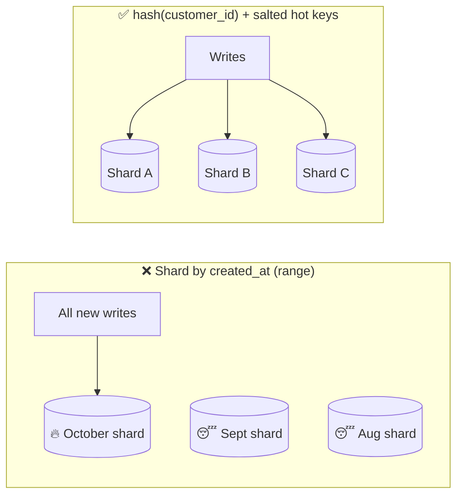

# 050 · Shard Keys, Hotspots & Cross-Shard Queries

> ⏱ 10 min · 📈 50% · 🅰️ Part A (core) · Phase 06: Scaling Data
>
> `██████████░░░░░░░░░░` 50% of the whole guide

---

## 📖 Story

Maya's first shard key for orders was `created_at`, a neat range per month. It felt tidy, like filing cabinets labelled by date.

On the first evening, **every new order landed on the October shard**. One machine screamed at **99% CPU** while fifteen others idled at **4%**, like a stadium where everyone crams through one gate while fourteen other gates stand open and unattended.

She re-sharded by `cook_id` hash. The load evened out beautifully, for three days.

Then a **celebrity chef** joined Pantry and announced a pop-up with **40% of all traffic** behind it. Every one of those orders hashed to the **same shard**. The machine melted again, with a different shape of fire.

I made the same choice once, so I didn't laugh. Choosing *how* to split turns out to matter more than splitting itself.

## 🎯 One-sentence idea

**The shard key decides where each row lives, and a good key both spreads load evenly AND keeps each common query on a single shard, while a bad key creates hotspots or forces every query to visit every shard.**

## 🧸 Analogy

Splitting a **school lunch line** into queues:

- By **surname letter**: "S" is enormous, "X" is empty.
- By **arrival time**: everyone arriving *now* piles into one queue.
- By **hashed student ID**: every queue is equal, but friends get split up, so group queries need every queue.
- By **class**: classmates stay together and it's fairly even, **unless one class has 300 students**.

## 🖼️ Visual

*Diagram brief:* on the left, every write arrow funnels into one red-hot shard while the others sleep. On the right, writes fan evenly across shards, and one oversized "celebrity" key is split into salted pieces.



## 🔬 How it works

- **A good shard key has** **high cardinality**, **even data *and* traffic**, **query locality** (the top queries include it), and **stability** (it rarely changes, because moving rows between shards hurts).
- **Sequential keys + range sharding = hotspot.** Hash the key, or prefix a bucket (`hash(id) % 16` + timestamp) to spread "now" across shards while keeping time order within each bucket.
- **Hot tenants and celebrities:** hashing balances *keys*, not *traffic*. Fix it with **salting** (`key#0…#N`, reads merge), a **dedicated shard** via a directory, **compound keys** (`tenant_id, sub_id`), and **caching** the hot reads.
- **Cross-shard reads:** **scatter-gather** (latency = the **slowest** shard, load × N), **global secondary indexes** (sharded by the other attribute, extra writes, often eventually consistent), **duplicate tables** by a second key, or push analytics to the **warehouse**.
- **Local vs global index:** a local (per-shard) index makes writes cheap but queries scatter. A global index makes queries hit one index shard, but every write updates a remote index.

## 🧩 Worked example

**Choosing a key for Pantry's `orders`:**

| Key | Load | "Customer's orders" | "Cook's orders tonight" | Verdict |
|---|---|---|---|---|
| `created_at` (range) | ❌ hotspot | ❌ scatter | ❌ scatter | Bad |
| `order_id` (hash) | ✅ even | ❌ scatter | ❌ scatter | Poor locality |
| `customer_id` (hash) | ✅ even | ✅ 1 shard | ❌ scatter | ✅ primary |
| + `orders_by_cook` table keyed by `(cook_id, bucket)` | ✅ | — | ✅ 1–8 shards | ✅ secondary copy |

**Salting the celebrity chef (cook 777):**

```python
N = 8
def write_cook_order(cook_id, order):
    bucket = hash(order.id) % N if cook_id in HOT_COOKS else 0
    db.insert(key=f"{cook_id}#{bucket}", value=order)        # 8 partitions absorb the flood

def cook_orders(cook_id):
    buckets = range(N) if cook_id in HOT_COOKS else [0]
    return merge_sorted(db.query(key=f"{cook_id}#{b}") for b in buckets)
```

**Global index for login by email:** `users` sharded by `user_id`, `users_by_email` sharded by `email` → **two single-shard hops**, not N.

## ⚖️ Trade-offs

| Technique | What Maya gains | What she pays |
|---|---|---|
| Hash key | Even spread | Group and range queries scatter |
| Tenant/entity key | Query locality | Hot tenants |
| Compound key | Locality + spread | More complex routing |
| Salting | A hot key is spread out | Reads merge N parts |
| Global secondary index | Fast lookups by another attribute | Extra writes, eventual consistency |
| Scatter-gather | No extra storage | Tail latency, load × N |

## 🌍 Real world

- **DynamoDB** docs hammer on "partition key design", because hot partitions get **throttled**.
- **Slack** sharded by workspace, then moved to Vitess with finer keys as giant customers emerged.
- **X/Twitter** treats celebrity accounts specially in timeline fan-out (lesson 076).

## 📌 Cheat card

> - Good key: **high cardinality · even load · query locality · stable**.
> - **Timestamp + range = hotspot** → hash or bucket it.
> - **Hot tenant → salt, dedicate a shard, or cache.**
> - Cross-shard: **scatter-gather · global index · duplicate tables · warehouse**.
> - **Pick the key from your top 3 queries.**

## 🧪 Feynman check

Explain the lunch lines, and why splitting by arrival time makes one queue enormous.

⚠️ **Common confusion:** "Hashing guarantees even load." It evens out the **number of keys**, not the **traffic per key**. A celebrity hashes to exactly one shard, every time.

## ⚡ Quick recall

1. Why is a timestamp a bad range shard key?
<details><summary>Reveal Answer</summary>

All new writes carry the latest timestamps, so they all hit the same shard.
</details>

2. What's the latency problem with scatter-gather?
<details><summary>Reveal Answer</summary>

The response waits for the slowest shard, so tail latency grows with the shard count.
</details>

3. What is key salting?
<details><summary>Reveal Answer</summary>

Appending a hashed or random suffix to a hot key so its writes spread across several partitions. Reads merge the parts.
</details>

## 🎤 Interview practice

**Q. "Pick a shard key for a ride-sharing trips table. Then one corporate customer generates 40% of traffic and its shard is melting. What now?"**
<details><summary>Model answer</summary>

- **Queries first:** rider history (app screen), driver earnings, active trip by ID, and city analytics.
- **The key:**
  - `trip_id` hash → even, but rider and driver history scatter.
  - **`rider_id` hash** for the primary table (rider history = 1 shard).
  - A **second table or global index keyed by `driver_id`** for earnings.
  - Embed the **shard bits in `trip_id`** (Snowflake-style, lesson 072), so "trip by ID" routes directly.
  - City analytics → CDC → warehouse.
- **The 40% tenant:**
  - **Now:** cache its hot reads, apply per-tenant **rate limits and quotas**, and shed non-critical load.
  - **Structurally:**
    - Give it a **dedicated shard or cluster** via a directory entry, or **sub-shard** it with a compound key (`tenant_id, rider_id`) so its traffic spans many partitions.
    - **Salt** any single hot keys inside it.
  - **Moving it live:** snapshot + **CDC catch-up**, a brief write pause (or dual-write), **flip the directory entry**, then verify with checksums.
- **Prevention:** per-tenant traffic dashboards and automatic alerts when any key or tenant exceeds X% of a shard's capacity.
- **Likely follow-up:** "How does DynamoDB handle this?" → adaptive capacity and split-for-heat partition splitting, but a single key's throughput is still capped per partition, so salting remains your job.
</details>

## 📖 Teaser

> 📖 *The keys are balanced, but the cache cluster needs two more servers, and last time adding just one reshuffled 80% of every key in Pantry.*

---

⬅️ [049 · Sharding](049-sharding.md) · 🗺️ [Phase map](README.md) · ➡️ [✅ Checkpoint 50%](checkpoint-50.md)

✅ **Safe stopping point.** Tick lesson 050 in [PROGRESS.md](../../PROGRESS.md), then do the **HALFWAY** checkpoint!
