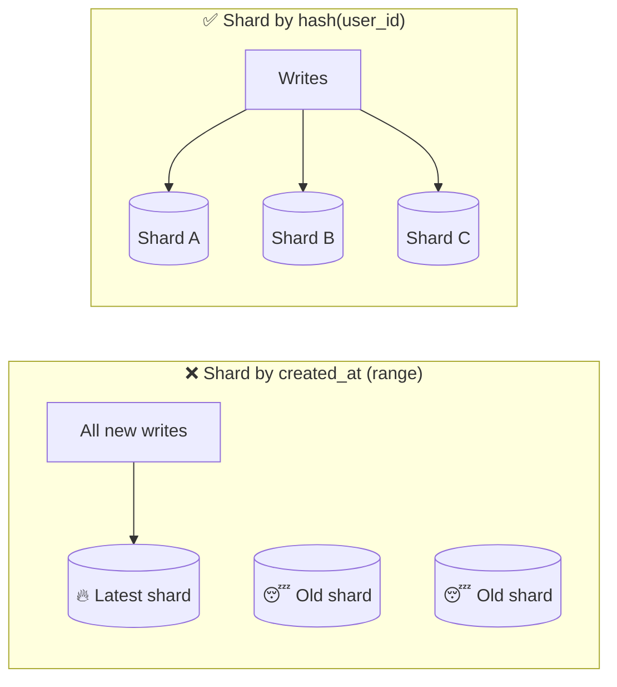

# 050 · Shard Keys, Hotspots & Cross-Shard Queries

> ⏱ 10 min · 📈 50% · 🅰️ Part A (core) · Phase 06: Scaling Data
>
> `██████████░░░░░░░░░░` 50% of the whole guide

---

## 🎯 One-sentence idea

**The shard key decides which shard each row lives on. A good key spreads load evenly AND keeps each common query on a single shard. A bad key creates hotspots or forces every query to visit every shard.**

## 🧸 Analogy

Splitting a **school's lunch line** into queues:

- By **first letter of surname**: "S" is huge, "X" is empty → **uneven** (hotspot).
- By **arrival time** ("everyone arriving now → queue 1"): **all current students** pile into one queue → **hotspot on the newest**.
- By **student ID hashed**: every queue is about equal → **even**. But friends who want to sit together get split up → "group" queries need every queue.
- By **class** (class 7B → queue 3): classmates stay together (queries by class are local), and it's fairly even, **unless one class has 300 students** (a hot tenant).

## 🖼️ Visual



## 🔬 How it works

**A good shard key has:**

1. **High cardinality:** many distinct values (not `country`, and definitely not `is_active`).
2. **Even distribution** of data **and traffic**.
3. **Query locality:** the most common queries include the key, so they hit **one** shard.
4. **Stability:** the key's value rarely changes (moving rows between shards is painful).

**Hotspots and their fixes:**

- **Sequential keys** (timestamps, auto-increment IDs) with range sharding → all inserts hit one shard. Fix: hash the key, or prefix a hash bucket (`bucket = hash(id) % 16` + `timestamp`).
- **Celebrity / hot tenant** (one user or customer with huge traffic): even hashing puts them on one shard. Fixes:
  - **Key salting:** split the hot key into `key#0 … key#N` and spread writes (reads must merge).
  - **Dedicated shard** for big tenants (directory-based).
  - **Caching** the hot reads.
- **Compound keys:** `(tenant_id, user_id)` → locality per tenant plus spread within big tenants.

**Cross-shard queries:**

- **Scatter-gather:** send the query to all shards, then merge (sort, top-K, sum). Latency = the **slowest shard**, and load × N.
- **Global secondary index:** a separate index sharded by the *other* attribute (e.g., `email → user_id`). It's updated asynchronously or transactionally.
  - **Local index** (per shard): cheap writes, but queries scatter to every shard.
  - **Global index**: queries hit one index shard, but writes must update a remote index (often eventually consistent, as in DynamoDB GSIs).
- **Denormalize/duplicate** the data under a second key (`orders_by_user`, `orders_by_merchant`).
- **Push analytics to a warehouse** instead of scanning shards live.

## 🧩 Worked example

**A multi-tenant SaaS (like Slack): shard key choices for `messages`.**

| Key | Distribution | "Messages in channel X" | "Search workspace W" | Verdict |
|---|---|---|---|---|
| `message_id` (hash) | ✅ even | ❌ all shards | ❌ all shards | Poor locality |
| `created_at` (range) | ❌ hotspot | ❌ | ❌ | Bad |
| `workspace_id` | ⚠️ big workspaces are hot | ✅ one shard | ✅ one shard | Good, but handle huge tenants |
| `(workspace_id, channel_id)` | ✅ better spread | ✅ one shard | ⚠️ scatter within the workspace | Good for big tenants |

**Salting a hot key:**

```python
N = 8
def write_like(post_id, user_id):
    bucket = hash(user_id) % N
    db.insert(key=f"{post_id}#{bucket}", value=user_id)   # spreads writes over 8 partitions

def count_likes(post_id):
    return sum(db.count(key=f"{post_id}#{b}") for b in range(N))  # read merges 8
```

**Global index for "find user by email":**

```
users table sharded by user_id
users_by_email table sharded by email:  email → user_id
Login: look up users_by_email (1 shard) → get user_id → fetch user (1 shard). Two single-shard hops, not N.
```

## ⚖️ Trade-offs

| Technique | Gain | Cost |
|---|---|---|
| Hash key | Even spread | Range and group queries scatter |
| Tenant/entity key | Query locality | Hot tenants |
| Compound key | Balance of locality and spread | More complex routing |
| Salting | Spreads a hot key | Reads must merge N parts |
| Global secondary index | Fast lookups by another attribute | Extra writes, often eventual consistency |
| Scatter-gather | No extra storage | Tail latency + load × N |

## 🌍 Real world

- **DynamoDB** docs stress "partition key design", and warn that hot partitions throttle.
- **Slack** sharded by workspace, then moved to Vitess with finer-grained keys as big customers grew.
- **Twitter/X** handled celebrity accounts specially in timeline fan-out (lesson 076).

## 📌 Cheat card

> - Good shard key: **high cardinality · even load · query locality · stable**.
> - **Timestamps/auto-increment + range sharding = hotspot.** Hash or bucket them.
> - **Hot tenant/celebrity → salting, a dedicated shard, or caching.**
> - Cross-shard: **scatter-gather** (slow tail), **global index** (extra writes), **denormalize**, or **warehouse**.
> - **Choose the key from the top 3 queries.**

## 🧪 Feynman check

Explain the lunch-line analogy, and why splitting by arrival time makes one line enormous.

⚠️ **Common confusion:** "Hashing guarantees even load." It evens out the **number of keys**, but not the **traffic per key**. One hot key still lands on one shard.

## ⚡ Quick recall

1. Why is a timestamp a bad range shard key?
<details><summary>Answer</summary>

All new writes have the latest timestamps, so they all hit the same shard (a hotspot).
</details>

2. What's the latency problem with scatter-gather?
<details><summary>Answer</summary>

The overall response waits for the slowest shard, so tail latency grows with the number of shards.
</details>

3. What is key salting?
<details><summary>Answer</summary>

Appending a random or hashed suffix to a hot key so its writes spread across several partitions. Reads merge the parts.
</details>

## 🎤 Interview practice

**Q1. "Choose a shard key for a ride-sharing trips table."**
<details><summary>Model answer</summary>

- Queries: "trips for rider X" (the app history), "trips for driver Y" (earnings), "active trip by ID", and city-level analytics.
- `trip_id` hash → even, but the rider/driver history scatters.
- **`rider_id` hash** for the primary table (rider history is local), plus a **second table or global index by `driver_id`** for driver history, and **trip_id → rider_id** lookups embedded in the ID (encode the shard in the trip ID).
- City analytics → stream to a warehouse.
- **Likely follow-up:** "How do you embed a shard in the ID?" → a Snowflake-style ID with shard bits (Instagram's approach, lesson 072).
</details>

**Q2. "One customer generates 40% of all traffic, and their shard is melting. What do you do?"**
<details><summary>Model answer</summary>

- Immediate: **cache** their hot reads, and **rate limit** abusive patterns.
- Structural: give that tenant a **dedicated shard or cluster** (a directory-based mapping), or **sub-shard** them with a compound key (`tenant_id, sub_key`).
- Longer term: rebalance tools that can move tenants live, and per-tenant quotas.
- **Likely follow-up:** "How do you move a tenant without downtime?" → copy the data (snapshot + CDC catch-up), briefly pause writes (or dual-write), flip the directory entry, and verify.
</details>

---

⬅️ [049 · Sharding](049-sharding.md) · 🗺️ [Phase map](README.md) · ➡️ [✅ Checkpoint 50%](checkpoint-50.md)

✅ **Safe stopping point.** Tick lesson 050 in [PROGRESS.md](../../PROGRESS.md), then do the **HALFWAY** checkpoint!
