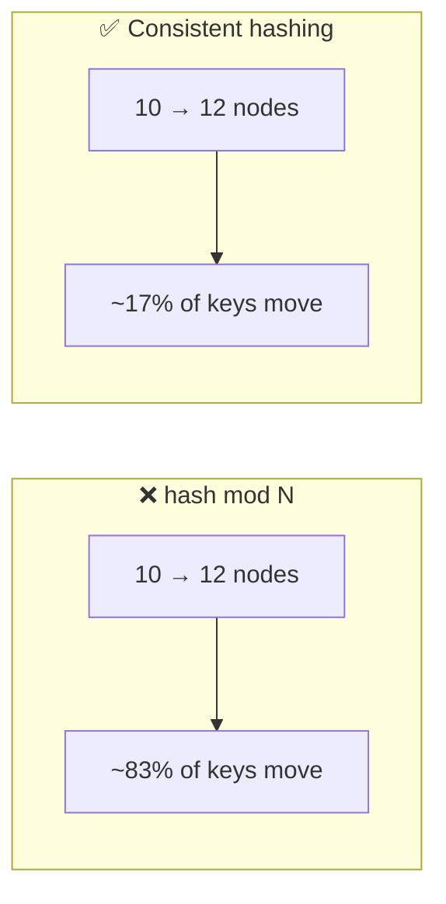

# 051 · Consistent Hashing

> ⏱ 9 min · 📈 51% · 🅰️ Part A (core) · Phase 06: Scaling Data
>
> `██████████░░░░░░░░░░` 51% of the whole guide

---

## 📖 Story

Pantry's cache cluster has 10 Redis nodes, and keys are routed with a line of code that looks completely innocent:

```python
node = hash(key) % 10
```

Dinner traffic is climbing, so Maya adds **two nodes**. The formula becomes `% 12`.

In the next sixty seconds, the cache hit ratio falls off a cliff: **96% → 18%**. Almost every key now maps to a *different* node, a node that has never seen it. Eighty-three percent of Pantry's cached universe is suddenly in the wrong place. Misses avalanche into Postgres, the database's CPU slams to 100%, and checkout times out across the country.

All she did was add capacity.

Then Maya learned the idea I think of as one of the most elegant in all of computing. Let me share it with you: **put everything on a circle.**

## 🎯 One-sentence idea

**Consistent hashing places servers and keys on a ring and assigns each key to the next server clockwise, so adding or removing a server moves only the keys next to it (about 1/N of them) instead of reshuffling everything.**

## 🧸 Analogy

A **round table** with seats numbered like a clock:

- Waiters (servers) stand at a few spots around the table.
- Each guest (key) sits at a seat set by their name and is served by **the next waiter clockwise**.
- A new waiter joins → they take over **only the guests between themselves and the previous waiter**.
- A waiter leaves → **only their guests** move on to the next waiter.

## 🖼️ Visual

*Diagram brief:* a glowing ring with four servers at fixed angles and keys as small diamonds. Arrows run clockwise from each key to its owner. A new server drops onto the ring, and only one small arc of keys changes colour.

```
                 0°
            ┌────●────┐  ● Server A @ 10°
         K1 ◆          ◆ K2
       ●                  ●  Server B @ 120°
   Server D @ 300°
       ◆ K4             ◆ K3
            └────●────┘
               Server C @ 200°

K1 @ 350° → next clockwise → A (10°)     K2 @ 60°  → B
K3 @ 150° → C                            K4 @ 250° → D
Add Server E @ 170° → only keys in (120°, 170°] move from C to E ✅
```



## 🔬 How it works

- **The ring:** hash servers and keys into the same space (e.g. 0 … 2³²−1). A key belongs to the **first server point clockwise**: a binary search over sorted positions, **O(log N)**.
- **Minimal movement:** a new server takes keys from **one arc**, so **~K/N** keys move. A departing server's keys go to its clockwise successor.
- **Virtual nodes (vnodes):** each physical server gets **100–256 points**. Without them, random positions create wildly uneven arcs. With them, load evens out, a failed server's load **spreads across many** survivors, and bigger machines can get **more vnodes** (weighting).
- **Replication on the ring:** store each key on the next **N distinct physical servers** clockwise, skipping same-rack/AZ duplicates (Dynamo/Cassandra).
- **Alternatives:** **rendezvous (HRW) hashing** (highest `hash(key, server)` wins, O(N) per lookup but no ring), **jump consistent hash** (tiny and fast for numbered buckets), and **Maglev** (lookup tables for L4 load balancers).

## 🧩 Worked example

**The modulo disaster:**

```
Keys stay put only if h % 10 == h % 12 → a small fraction.
Moving from N to M servers with mod: ~1 − 1/max(N,M) of keys move → 10→12 ≈ 83% move.
With a ring: new servers take ~2/12 ≈ 17%.
```

```python
import bisect, hashlib

def h(s): return int(hashlib.md5(s.encode()).hexdigest(), 16) % 2**32

class Ring:
    def __init__(self, nodes, vnodes=150):
        self.ring = sorted((h(f"{n}#{i}"), n) for n in nodes for i in range(vnodes))
        self.points = [p for p, _ in self.ring]

    def node_for(self, key):
        i = bisect.bisect(self.points, h(key)) % len(self.ring)   # first point clockwise
        return self.ring[i][1]

ring = Ring([f"cache-{i}" for i in range(12)])
ring.node_for("dish:42")    # → e.g. "cache-7"
```

**Maya's redo:** 10 → 12 nodes with a ring + 150 vnodes → hit ratio dips **96% → ~80%** for a few minutes while the new nodes warm, instead of collapsing to 18%. The database never notices.

## ⚖️ Trade-offs

| Approach | Keys moved on resize | Balance | Complexity |
|---|---|---|---|
| `hash mod N` | ~all | Good | Trivial |
| Ring, no vnodes | ~1/N | ❌ Uneven | Low |
| Ring + vnodes | ~1/N | ✅ Good | Medium |
| Rendezvous hashing | ~1/N | ✅ Good | Low (O(N) lookup) |
| Fixed logical partitions + map | Whole partitions | ✅ Good | A map service |

## 🌍 Real world

- **Amazon Dynamo, Cassandra, and Riak** use rings with vnodes. Memcached's **ketama** client popularized the technique.
- The **1997 Karger et al.** paper behind consistent hashing grew into **Akamai**.
- **Envoy and Nginx** offer ring-hash balancing. **Google Maglev** uses its own consistent-hashing tables.

## 📌 Cheat card

> - **Ring + walk clockwise to the next server.**
> - Resize moves **~1/N** of keys (vs ~all with `mod N`).
> - **Vnodes** → even load, and recovery that's spread across many servers.
> - **Replicate to the next N distinct servers** (rack/AZ-aware).
> - Use it for **caches, sharded KV stores, sticky load balancing**.

## 🧪 Feynman check

Explain the round table, why a new waiter takes guests from only one neighbour, and why a waiter standing at *many* spots (vnodes) makes everything fairer.

⚠️ **Common confusion:** "Consistent hashing fixes hot keys." It balances **ranges of keys** across servers, but one blazing-hot key still lands on exactly one server. That needs L1 caches, salting, or replicas (lesson 032).

## ⚡ Quick recall

1. With consistent hashing, roughly what fraction of keys move when you add one server to N?
<details><summary>Reveal Answer</summary>

About 1/(N+1), roughly 1/N.
</details>

2. What problem do virtual nodes solve?
<details><summary>Reveal Answer</summary>

Uneven arcs from random server positions, and a failed server's entire load dumping onto one neighbour.
</details>

3. How do Dynamo-style systems replicate using the ring?
<details><summary>Reveal Answer</summary>

Each key is stored on the next N distinct physical servers clockwise from its position.
</details>

## 🎤 Interview practice

**Q. "Design data placement for a distributed key-value store that must survive node failures and scale out without downtime."**
<details><summary>Model answer</summary>

- **Placement:** a consistent-hash ring with **~150–256 vnodes per node**, and the **replication factor N = 3** on the next 3 **distinct** nodes clockwise. **Rack/AZ-aware**: skip a node if one of the key's replicas is already in its zone.
- **Membership:** **gossip** (lesson 087) spreads the ring view, so any node can coordinate any request.
- **Consistency:** quorum reads and writes with **R + W > N** (e.g. N=3, W=2, R=2) for tunable consistency (lesson 054).
- **Failures:** a dead node's vnodes are scattered, so its load spreads over many survivors. **Hinted handoff** buffers writes for it, and **read repair + Merkle-tree anti-entropy** heal the replicas afterwards.
- **Scale out:**
  - A new node claims vnodes and **streams** those ranges from the current owners.
  - Throttle the streaming to protect the live traffic.
  - Reads keep flowing during the move, and ownership flips when the copy is complete.
- **Heterogeneous hardware:** more vnodes for bigger nodes.
- **Likely follow-up:** "Why not `hash % N` with a migration script?" → changing N remaps ~all keys at once, causing a cluster-wide miss storm (caches) or a giant data move (stores). The ring keeps every change local and incremental.
</details>

## 📖 Teaser

> 📖 *Then a construction crew digs through the fibre between Pantry's two data centres, and Maya has to choose, live, between being correct and being online.*

---

⬅️ [✅ Checkpoint 50%](checkpoint-50.md) · 🗺️ [Phase map](README.md) · ➡️ [052 · CAP Theorem](052-cap-theorem.md)

✅ **Safe stopping point.** Tick lesson 051 in [PROGRESS.md](../../PROGRESS.md).
